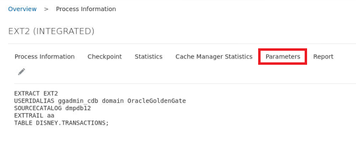
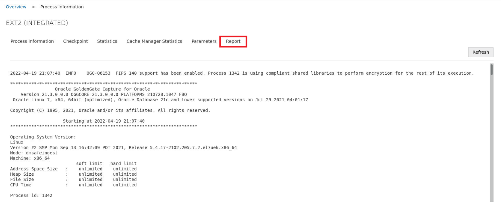
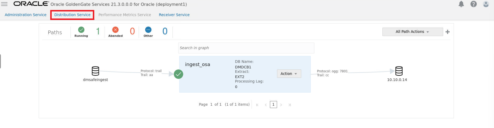
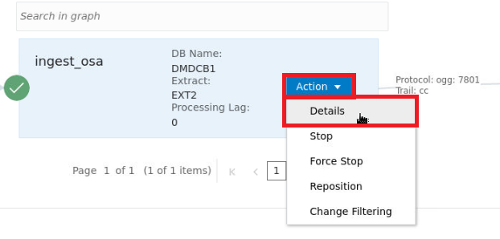
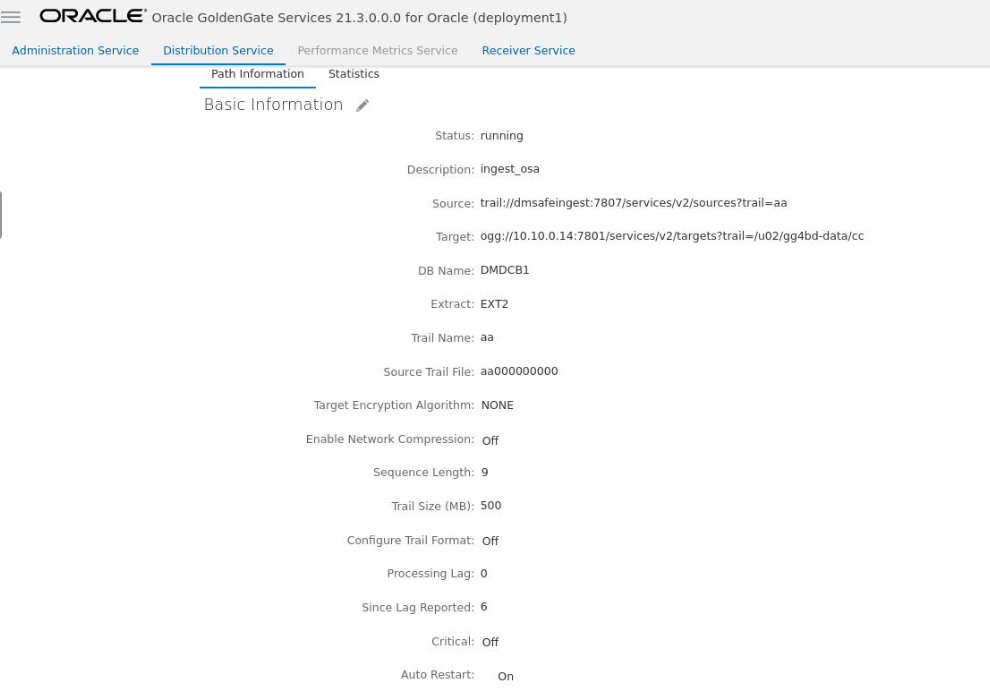

# Review Microservices

## Introduction
In this lab, we will review the Microservices architecture.

Estimated Time: 15 minutes

**Microserivces Architecture**

 

### Objectives

In this lab, you will complete the following tasks:

- Log in to Service Manager
- Explore Administration Service
- View Extract details
- Explore Distribution Service
  
### Prerequisites

This lab assumes you have:
- An Oracle Always Free/Free Tier, Paid or LiveLabs Cloud Account

## Task 1: Log in to Service Manager

1. Log in to the OGG service manage using the following information:
- username: **oggadmin**
- password: **welcome1**

 

## Task 2: Explore Administration Service

1. After logging in, the Service Manager portal will show four running services. 
- Administration Service
- Distribution Service
- Performance Metrics Service
- Receiver Service

 

2. Select the port, **7806**, for the Administration service as shown above.

3. This will open a new window with a new login page, in which you will use the same credentials as before:
- username: **oggadmin**
- password: **welcome1**

 

4. After logging in, you will directed to the Admisitration Service page. This will show the Extract running with a log of Critical Events. Notice the severity and messages displayed. OGG Microservices gives a quick status check of all the components and allows for the user to start and stop the processes. Extracts and Replicats can be manually created here by clicking the plus signs. 

 

## Task 3: View Extract details

1. Click the **Action** button, which show options to view details and start/stop the instance depending on its current status. Select **Details** to view the configuration properties.
   
 

2. Notice the two main details on this page. The Credential Alias **ggadmin_cdb** and the Trail Name **aa**. 

 

3. Click on the **Checkpoint** tab at the top. Notice the checkpoint information, which matches the trail file. The checkpoint log name, path, timestamp, sequence, and offset value. You can monitor the input details, such as when starting, at recovery, and the current state. The checkpoint output values display the current checkpoint details.

 

1. Click on the **Statistics** tab at the top. Notice the generated data. Inserts are the only DML, as the function of the demo only generates new streaming transactions. The table **Disney Transactions** is the source of these statistics.

 

5. Skipping to the **Parameters** tab, notice the Extract matches the name from the Administration page. The Credential Alias is familiar from previous steps along with Source Catalog, trail file name, and Source Table. These parameters are configured when the process was added and can be edited by selecting the pencil icon.
   
    

6. Select the **Report** tab to view a generated report.

 

## Task 4: Explore Distribution Service

1. Select the **Distribution Service** tab at the top. Notice the Distribution Path that utilizes the Trail File that was featured before.

 

2. Select **Actions** and then **Details** to view path information.

 

3. Notice the information displayed about the Distribution Service Path. Here you can view the path information, such as source and target. You can also edit the description of the path. Statistical data is also displayed including LCR Read from Trails, LCR Sent, LCR Filtered, DDL, Procedure, DML inserts, updates, and deletes, and so on. You can also update the App Options and TCP Options.
   
 

You may now **proceed to the next lab.**

## Acknowledgements

- **Author**- Nicholas Cusato, Santa Monica Specialists Hub, July 14, 2022
- **Contributers**- Hadi Javaherian, Hannah Nguyen, Gia Villanueva, Akash Dahramshi
- **Last Updated By/Date** - Nicholas Cusato, Santa Monica Specialists Hub, July 14, 2022