# Provision AIDP Workbench Instance and Populate the Catalog

## Introduction

This lab guides you through the process of provisioning an Oracle AI Data Platform (AIDP) Workbench instance, creating an Autonomous Data Warehouse, creating catalogs, and managing data within those catalogs. You'll learn how to set up access to your data and organize it for future use in notebooks and jobs.

Estimated Time: 45 minutes

### Objectives

In this lab, you will:

- Provision an AIDP Workbench instance.
- Provision a 26ai Autonomous Data Warehouse.
- Access the master catalog.
- Create internal and external catalogs.
- Manage data by creating schemas, tables, and volumes.

### Prerequisites

This lab assumes you have:

- An Oracle Cloud account.
- The necessary permissions to create and manage AIDP Workbench instances.

## Task 1: Provision an AIDP Workbench Instance

1. Log in to your Oracle Cloud Infrastructure (OCI) account and access the OCI Console.

2. From the OCI Console homepage, select the Navigation Menu, navigate to **Analytics and AI**, and select **AI Data Platform Workbench**.

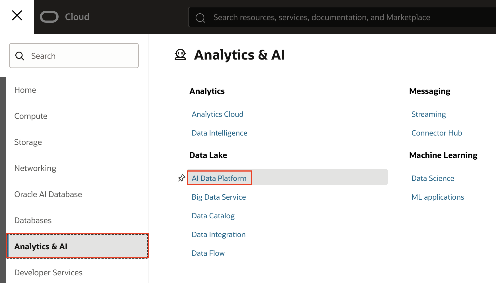

3. Select **Create AI Data Platform Workbench**. There are permissions required to be able to provision an AIDP Workbench instance, learn more about them [here](https://docs.oracle.com/en/cloud/paas/ai-data-platform/aidug/iam-policies-oracle-ai-data-platform.html#GUID-C534FDF6-B678-4025-B65A-7217D9D9B3DA).


4. Provide an AI Data Platform name and Workspace name. In the **Add Policies** section for **Choose access level**, select **Standard - Recommended access settings at tenancy level**.


5. If a dialog appears indicating that further policies are required to create the AIDP Workbench instance, review the policies and choose **Add**.


6. Under **Optional Policies** view other suggested policies related to your AIDP Workbench instance. Add any you would like and select **Create**. It may take a few minutes for the instance to provision.


## Task 2: Provision an Autonomous Data Warehouse

1. While waiting for the AIDP Workbench to provision, select **Oracle AI Database** and then **Autonomous AI Database** from the Navigation Menu.

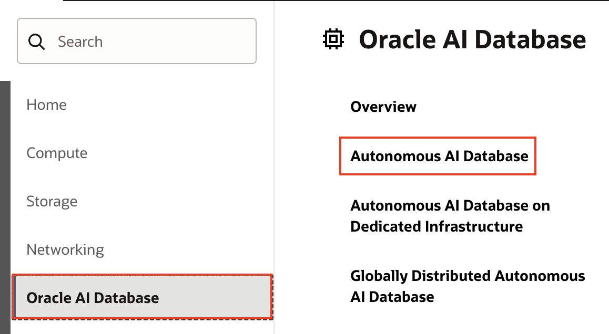

2. Select **Create Autonomous AI Database**.


3. Provide a Display name and Database name. Leave the **Workload type** as **Lakehouse**.

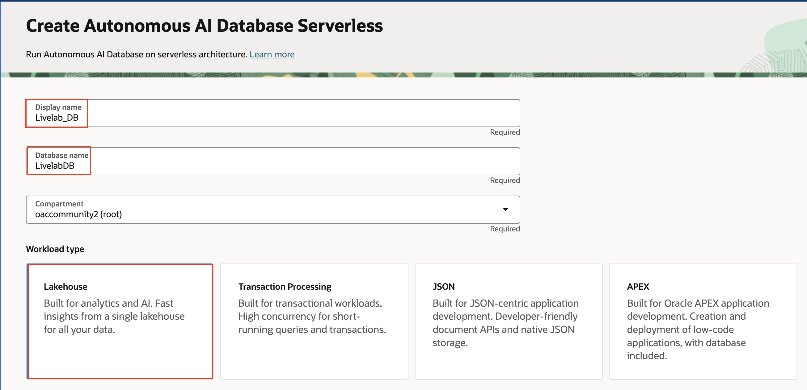

4. Under **Database version** select **26ai**. Deselect **Compute auto scaling**.


5. Enter a strong password for the admin credentials, leave all other fields as is, and then select **Create**.


6. When the database is finished provisioning, select **Database connection**.

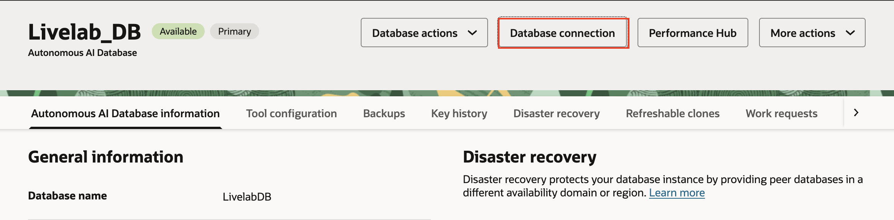

7. Select **Download Wallet**. Provide a password for the wallet, then select **Download**.


8. The final step of this task is to configure table access for the **ADMIN** user. Under **Database actions** select **SQL**.

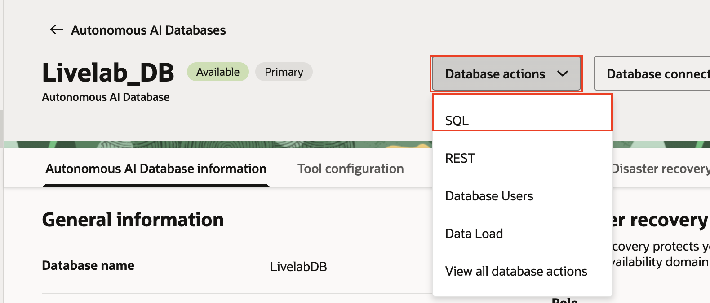

9. In the SQL worksheet, add in the following command and run the statement. This statement allows the **ADMIN** user to select from any table in the DB.

```
  <copy>
  GRANT SELECT ANY TABLE TO ADMIN;
  </copy>
  ```

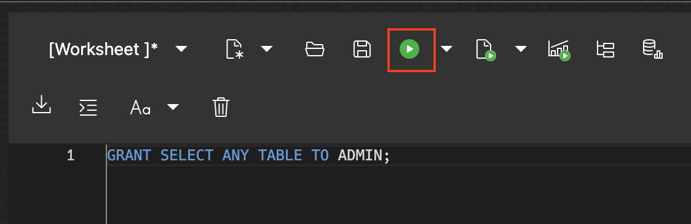

10. Replace the previous statement with the following one and run it as well. This statement defines a database table that we will write gold tier data to as part of the medallion architecture.

```
  <copy>
  CREATE TABLE gold_supplier_feedback (
      supplier_name VARCHAR(100),
      continent VARCHAR(100),
      country VARCHAR(100),
      city VARCHAR(100),
      summary_review VARCHAR(1000),
      rating VARCHAR(10)
  );
  </copy>
  ```


## Task 3: Create an External Catalog in AIDP Workbench

Now you'll navigate back to your AIDP Workbench instance to create an external catalog.

1. Select the Navigation Menu then **Analytics and AI** and **AI Data Platform Workbench**


2. Select the AIDP Workbench instance you created earlier. Sign in with the same credentials you use to login to OCI.

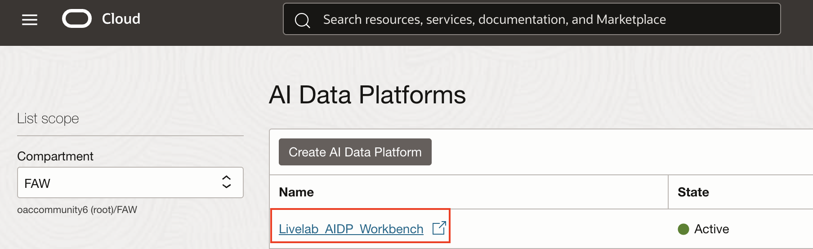

3. Your first step in the AIDP Workbench will be to connect to your data. From the AIDP Workbench homepage, select the **Master catalog** tab from the left-hand menu. Notice that the default catalog is already present here. Expand the default catalog and the **oci\_ai\_models** folder to see LLMs that are available for use in AIDP Workbench.

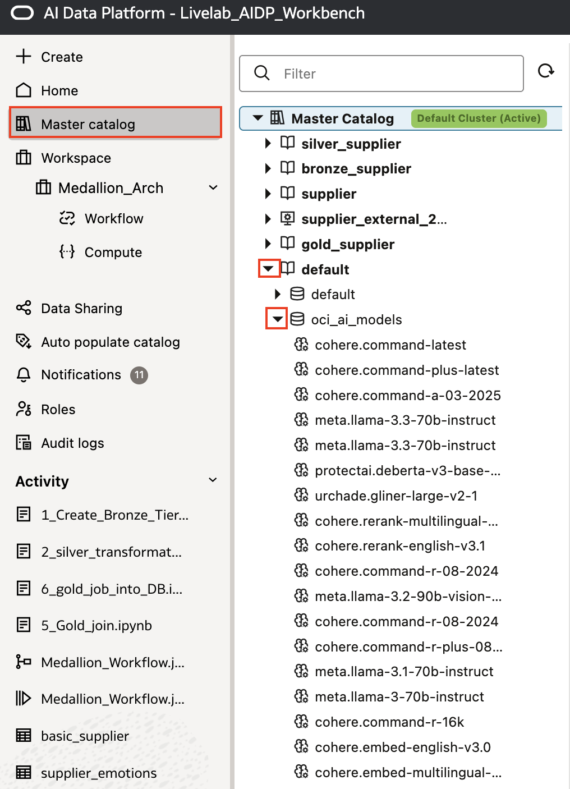


4. Create your first catalog by choosing **Create Catalog**.


5. Enter the Catalog Name **supplier\_external\_23ai** and select **External Catalog** for **Catalog type**.

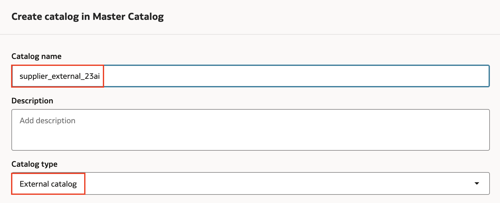

6. Select **Oracle Autonomous Data Warehouse** as the source type. Upload the wallet file you downloaded in the previous task. Select the low option for **Service Level**, enter **ADMIN** for **Username**, and then enter the password you created under **Password**. Leave all other sections as is. Select **Test connection** then **Create**.

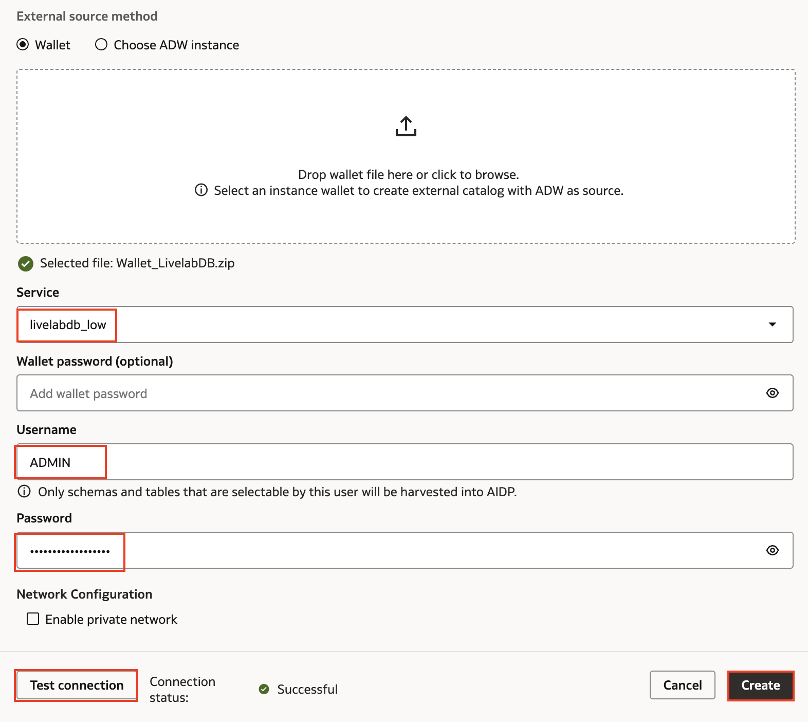

7. When creation of the catalog is complete, expand the **admin** database to see the available tables. You will use this connection to save your gold tier data to this database.

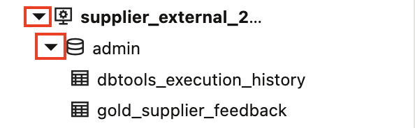

## Task 4: Create and Populate a Standard Catalog in AIDP Workbench

Next you will create a standard catalog

1. Use the breadcrumb menu to return to the master catalog if you are not already there. Select **Create catalog**.


2. Enter the catalog name **Supplier**. Leave the **Catalog type** as **Standard catalog**. Select the same compartment your other lab assets are in and select **Create**.


3. When the creation of the catalog is complete, select its name to access it.


4. Select **Create schema**.


5. Enter the Schema Name **supplier\_schema** and select **Create**.


6. Select the **supplier_schema**.

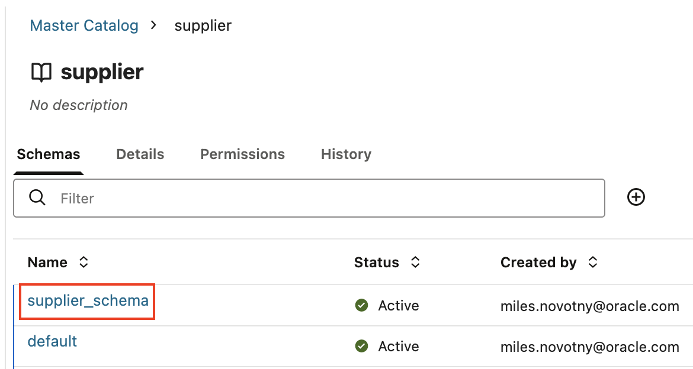

7. Select **Add to schema** and then **Table**.


8. Keep the **Table type** as **Managed**. Upload the **basic\_supplier.csv** file. Select **Preview data** and then **Create**. You can download the **basic\_supplier.csv** file and all other lab files at [this link](https://objectstorage.us-ashburn-1.oraclecloud.com/n/idmqvvdwzckf/b/LiveLab-Files_Bucket/o/aidp-workbench-ll-files.zip).


9. Create another managed table, using the **supplier\_emotions.csv** file.

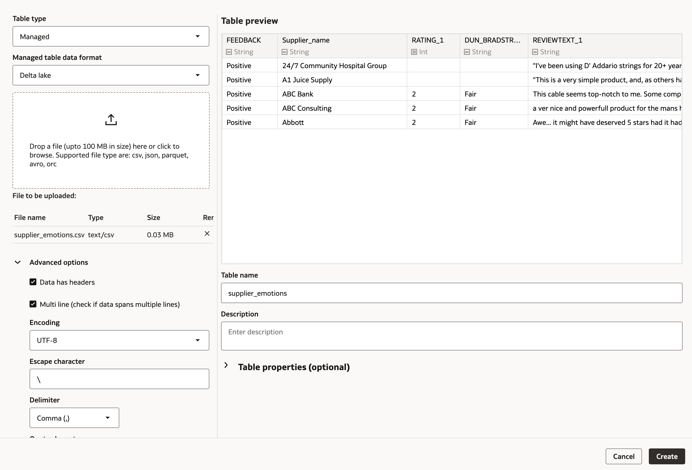

10. Now you'll create a volume. Select **Add to schema**, and then **Volume**.

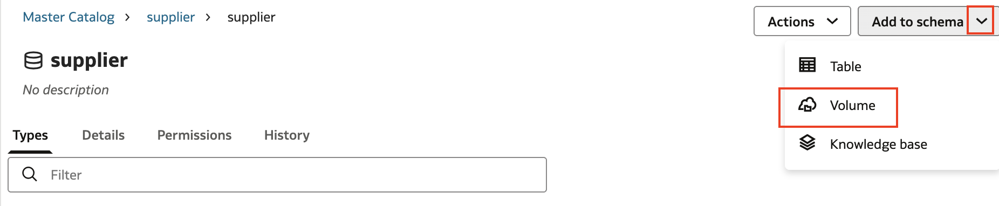

11. Enter the Volume Name **supplier\_volume** and select **Managed** as the Volume type.


12. Select the **Volumes** tab and then the **Supplier\_Volume** volume you just created.

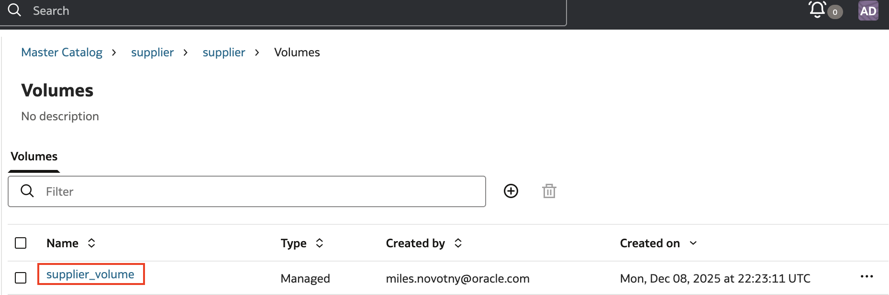

13. Select the plus icon and then **Upload file**. Select the **supplier\_info.txt** file from your computer then choose **Upload**.

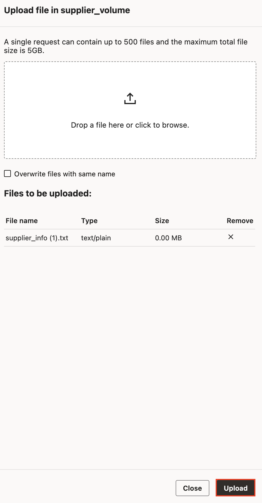

You have now created your structured and unstructured data assets in AIDP Workbench that are ready to be processed into the bronze, silver, and gold tiers of a medallion architecture.

## Learn More

- [Oracle AI Data Platform Community Site](https://community.oracle.com/products/oracleaidp/)
- [Oracle AI Data Platform Documentation](https://docs.oracle.com/en/cloud/paas/ai-data-platform/)
- [Oracle Analytics Training Form](https://community.oracle.com/products/oracleanalytics/discussion/27343/oracle-ai-data-platform-webinar-series)
- [AIDP Workbench Creation Documentation](https://docs.oracle.com/en/cloud/paas/ai-data-platform/aidug/get-started-oracle-ai-data-platform.html#GUID-487671D1-7ACB-4A56-B3CB-272B723E573C)
- [AIDP Workbench Master Catalog Documentation](https://docs.oracle.com/en/cloud/paas/ai-data-platform/aidug/manage-master-catalog.html)
- [Permissions for AIDP Workbench Creation](https://docs.oracle.com/en/cloud/paas/ai-data-platform/aidug/iam-policies-oracle-ai-data-platform.html#GUID-C534FDF6-B678-4025-B65A-7217D9D9B3DA)

## Acknowledgements
* **Author** - Miles Novotny, Senior Product Manager, Oracle Analytics Service Excellence
* **Contributors** -  Farzin Barazandeh, Senior Principal Product Manager, Oracle Analytics Service Excellence
* **Last Updated By/Date** - Miles Novotny, December 2025
