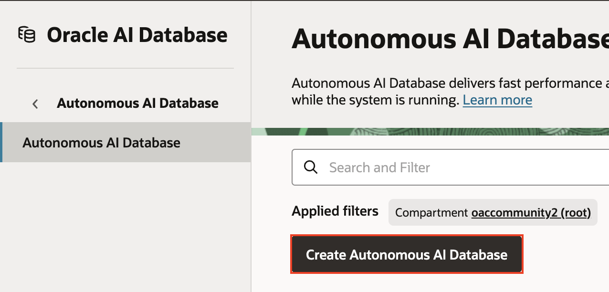
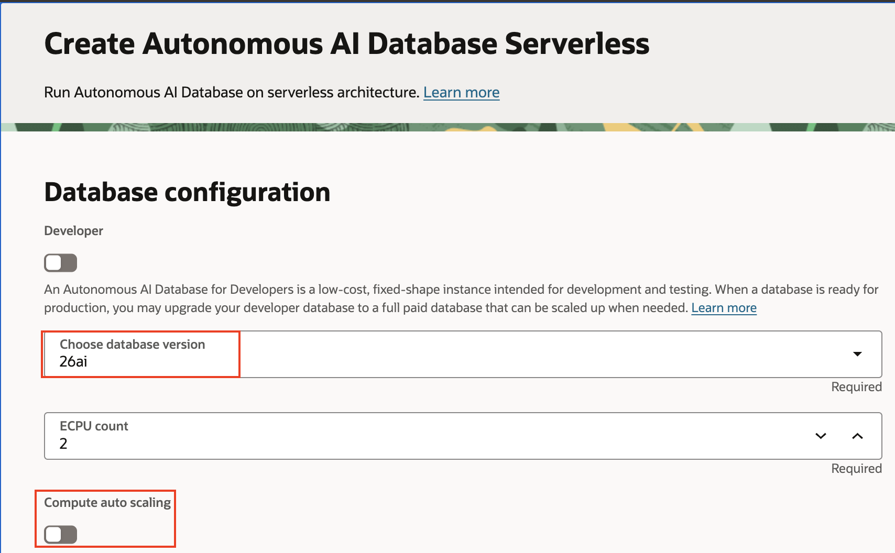
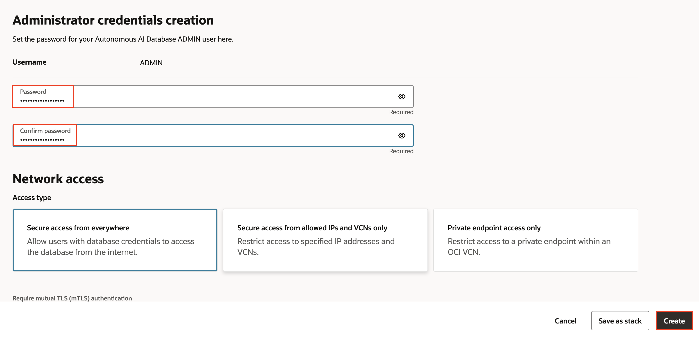
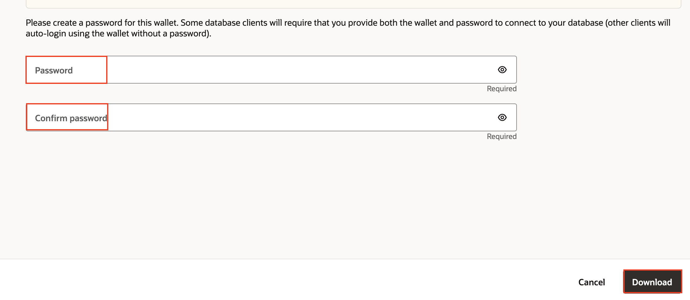

# Oracle AI Data Platform Essentials: Creating the Catalog and Collecting Data

## Introduction

This lab guides you through the process of provisioning an Oracle AI Data Platform (AIDP) Workbench instance, creating catalogs, and managing data within those catalogs. You'll learn how to set up access to your data and organize your catalogs for future reference in notebooks and jobs.

Estimated Time: 45 minutes

### Objectives

In this lab, you will:

- Provision an AIDP Workbench instance.
- Access the master catalog.
- Create internal and external catalogs.
- Manage data by creating schemas, tables, and volumes.

## Prerequisites

This lab assumes you have:

- An Oracle Cloud account.
- Necessary permissions to create and manage AIDP Workbench instances.

## Task 1: Provision an AIDP Workbench Instance

1. Log in to your Oracle Cloud Infrastructure (OCI) account and access the OCI Console.

2. From the OCI Console homepage, click on the hamburger menu, navigate to **Analytics and AI**, and select **AI Data Platform Workbench**.

3. Click on **Create AI Data Platform Workbench**.

4. Provide an instance name and workspace name. In the **Add Policies** section for **Choose access level** select **Standard - Reccomended access settings at tenancy level**.

5. A dialog may appear telling you that further policies are required to create the AIDP Workbench instance. If this happens review the policies and choose **Add**.

6. Under **Optional Policies** view other suggested policies related to you AIDP Workbench instance. Add any you would like then select **Create**. It may take a few minutes for the instance to provision

## Task 2: Provision an Autonomous Data Warehouse

1. While waiting for the AIDP Workbench to provision, navigate to the OCI menu. Select **Oracle AI Database** then **Autonomous AI Database**.

2. Select **Create Autonomous AI Database**.

3. Give it a display name and database name. Leave the **Workload type** as **Lakehouse**.

4. Under **Database Version** select **26ai**. Unselect **Compute auto scaling**.

5. Enter a strong password for the admin credentials, leave all other fields as is, then select **Create**.

6. When the database is finished provisioning, select **Database Connection**

7. Select **Download Wallet**. You will be asked to provide a password for the wallet, do so then select **Download**.

8. the final step of this task is to configure table access for the **ADMIN** user. Under **Database actions** select **SQL**.

9. In the SQL worksheet paste in the following command and run the statement. This allows the **ADMIN** user to select from any table in the DB.

'''GRANT SELECT ANY TABLE TO ADMIN;''' (need to reformat this)

## Task 3: Create an External Catalog in AIDP Workbench

1. Navigate back to your AIDP Workbench instance by again using the OCI menu and choosing **Analytics and AI** then **AI Data Platform Workbench**

2. Select the AIDP Workbench instance you created earlier. You will be asked to sign in again with the same credenails you use to login to OCI.

3. Your first step in AIDP will be to connect to your data. From the AIDP Workbench homepage, select the **Master catalog** tab from the left-hand menu.

4. Notice the default catalog already present here. Expand it and the **oci_ai_models** folder to see LLMs that are available for use in AIDP Workbench.

5. Create your first catalog by choosing**Create Catalog**.

6. Name it **supplier_external_23ai** and choose **External Catalog** for **Catalog type**

7. Select **Oracle Autonomous Data Warehouse** as the source type. Upload the wallet file you downloaded in the previous task. Select the low option for **Service Level**, input **ADMIN** for **Username**, then the password you created under **Password**. Leave all other sections as is. Select **Test connection** then **Create**.

8. When the catalog finishes creation select the arrow next to it, then the arrow next to the **admin** to see tables that are now accessible. You will use this connection to save your gold tier data to this database for further use.

## Task 3: Create and Populate a Standard Catalog in AIDP Workbench

9. Next you will create a standard catalog. Select the breadrumb menu to return to the master catalog if you are not already there. Select **Create catalog**.

10. Name it **Supplier**. Leave the **Catalog Type** as **Standard catalog**. Select the same compartment your other lab assets are in, then choose **Create**

11. When the catalog finishes creation select its name to access it.

12. Select **Create schema**.

13. Name the schema **supplier_schema** and choose **Create**.

14. Select the **supplier_schema**.

15. Choose **Add to schema** then select **Table**.

16. Keep the **Table type** as **Managed**. drop in the **basic_supplier.csv** file. Select **Preview data** then **Create**.

16. Create another managed table, this time use the **supplier_emotions.csv** file.

17. Now create a volume. Again select **Add to schema**, this time choose **Volume**.

18. Name it **Supplier_Volume** and choose **Managed** as the volume type.

19. Select the **Volumes** tab then select the **Supplier_Volume** you just created.

20. Select the plus icon then **Upload file**. Select the ____ files from your computer then choose **Upload**. 

5. **Create a Managed Volume**:  
   - In "supplier_schema", navigate to the **Volumes** tab and create a volume named "supplier_vol_managed".
   - Select **Managed** for the volume type and create it.

6. **Add Files to the Managed Volume**:  
   - Select the "supplier_vol_managed" volume.
   - Click the plus icon to add files and upload the `supplier_info.txt` file.

7. **Create an External Volume**:  
   - In "supplier_schema", create a volume named "supplier_vol_external".
   - Choose **External** for the volume type and specify the location in Object Storage:
     - Compartment: FAW
     - Bucket: supplier
     - Folder: test
   - Create the volume.

8. **View Files in the External Volume**:  
   - Select the "supplier_vol_external" volume to view the files accessible in it.

## Learn More

For further information and advanced topics, refer to the Oracle AI Data Platform documentation and tutorials.

## Acknowledgements
* **Author** - Miles Novotny, Senior Product Manager, Oracle Analytics Service Excellence
* **Contributors** -  Farzin Barazandeh, Senior Principal Product Manager, Oracle Analytics Service Excellence
* **Last Updated By/Date** - Miles Novotny, December 2025
