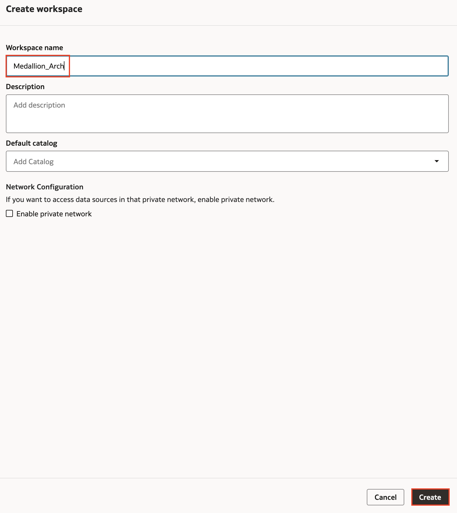
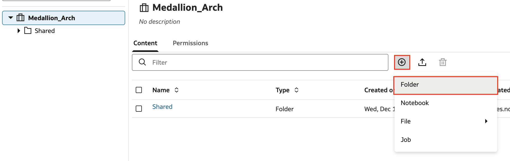
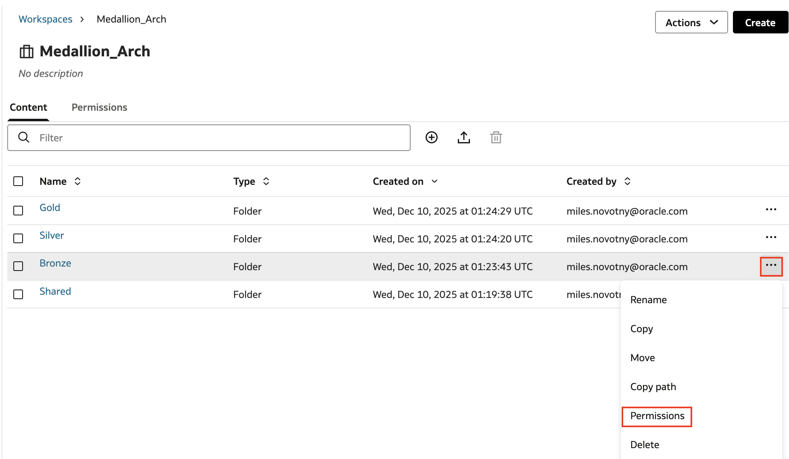
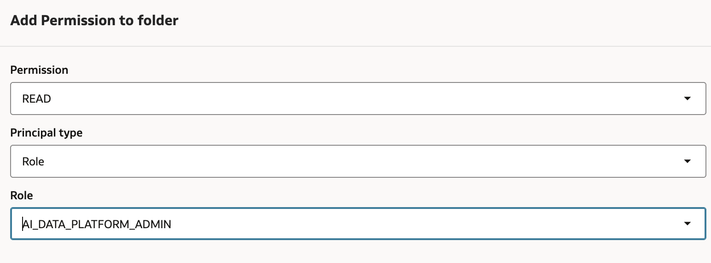
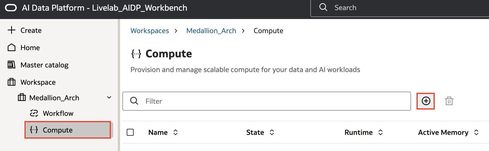
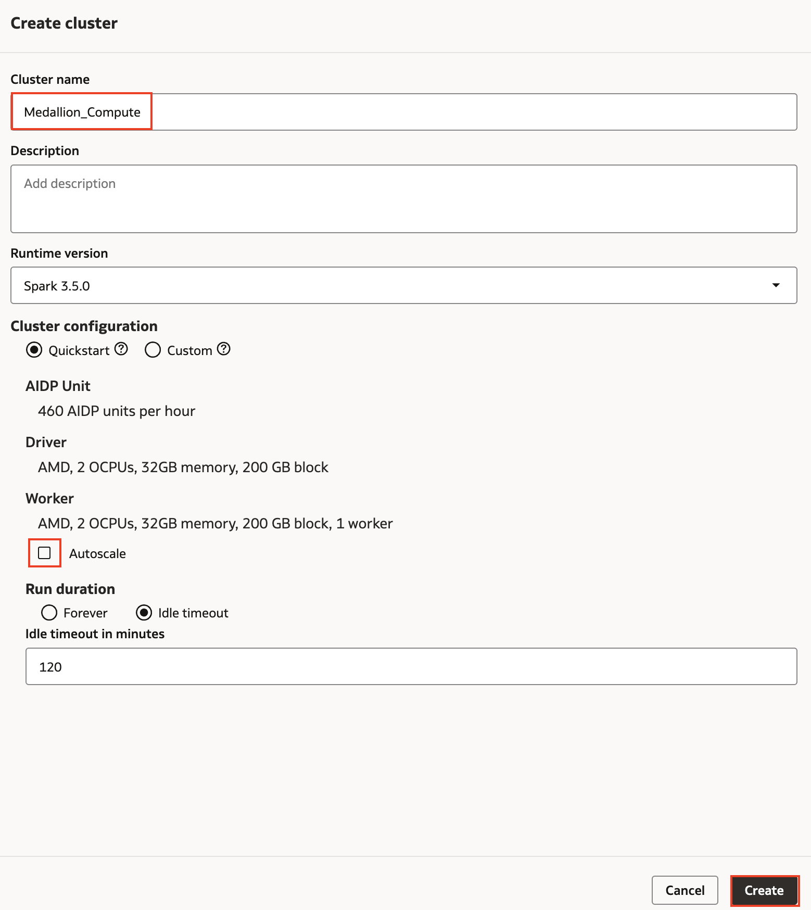
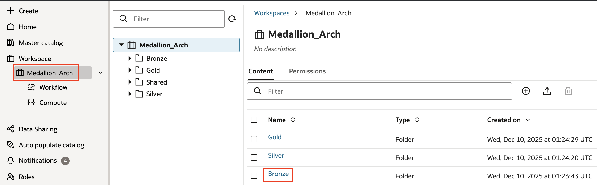
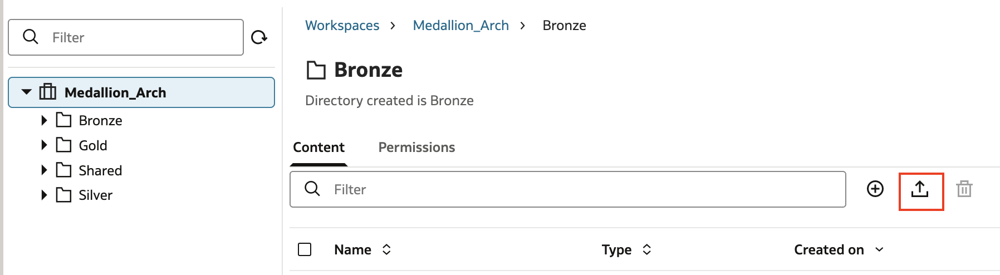
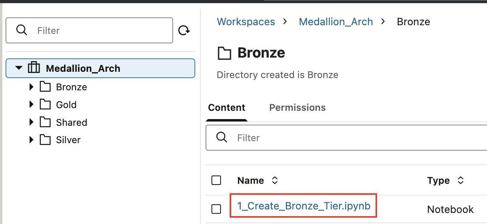
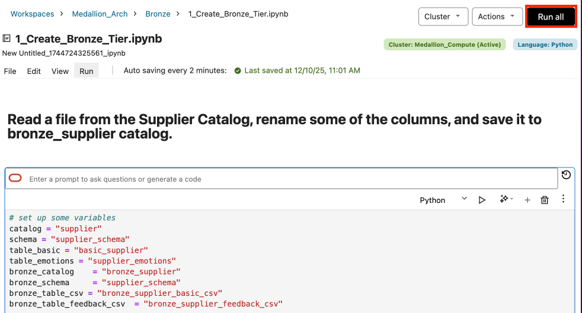

# Oracle AI Data Platform: Medallion Architecture Demo

## Introduction

This lab guides you through creating a medallion architecture using the Oracle AI Data Platform (AIDP). You'll learn how to set up workspaces, configure compute resources, and implement a multi-tier data processing pipeline.

Estimated Time: 45 minutes

### Objectives

In this lab, you will:

- Create and configure a workspace in AIDP Workbench.
- Create a compute cluster in the workspace.
- Use the AIDP Workbench notebook interface to implement a medallion architecture.
- Utilize AI functionalities to enhance data processing.

### Prerequisites

This lab assumes you have:

- Basic understanding of data science.

## Task 1: Create Workspace and Compute Cluster

1. In your AIDP Workbench, select the **Workspace** tab and choose **Create**.

2. Name the workspace **Medallion\_Arch** then select **Create**. While it provisions notice that there is a default workspace already populated in the instance whose name we specified when creating the AIDP Workbench instance.

3. Select the workspace name to enter it. We would like to create folders for the notebooks we create associated with the bronze, silver, and gold medallion tiers. Select the plus icon then **Folder**

4. Name the folder **Bronze** then select **Create**. Repeat this two more times to make folders named **Silver** and **Gold**.

5. Review the permissions associated with the **Bronze** folder by selecting the actions menu for the folder then choosing **Permissions**.

6. Select the plus icon and review how permissions on a folder can be given to roles or individual users. These role-based access controls allow fine grain control over security and collaboration in AIDP Workbench.

7. Next create a compute cluster in the workspace. Select **Compute** from the menu then the plus icon.

8. Name the compute cluster **Medallion\__Compute**. Cluster creation defaults to a **Quickstart** setting which creates a small cluster that spins up very quickly. Deselect **Autoscale** and leave all other selections as is. Feel free browse and look at other compute shape options under the **Custom** section.

9. The cluster will become available after a few moments. Select its name to view its details. Here you can learn more about a cluster, including which notebooks it is used by. Additionally in the **Library** section you can install libraries from a **requirements.txt** file.

## Task 2: Import and Run Notebooks

1. Now you will import the notebooks used to run the Python code that processes your data into the 3 tiers of the medallion architecture. The notebooks and all other lab files can be downloaded at Select the **Medallion_Arch** workspace name from the menu then navigate to the **Bronze** folder.

2. Now to import the notebook used to create the bronze tier, which can be downloaded at [this link](https://objectstorage.us-ashburn-1.oraclecloud.com/n/idmqvvdwzckf/b/LiveLab-Files_Bucket/o/aidp-workbench-ll-files.zip). Select the upload file icon.

3. Choose the **1\_create\_bronze\_tier** file and select **Upload**.

4. Repeat the same process for the **Silver** and **Gold** folders. Upload **2\_silver\_transformation**, **3\_silver\_transformation\_continent**, and **4\_silver\_transformation\_summary** into the **Silver** folder. Upload **5\_gold\_join** and **6\_gold\_job\_into\_DB** into the **Gold** folder.

5. Return to the **Bronze** folder and select the **create\_bronze\_tier** file to open it in the notebook interface.

6. Once in the notebook interface you need to attach a compute cluster on which to run the code. Select **Cluster** then **Attach existing cluster**. Choose the **Medallion\_Compute** you created earlier.

7. Scroll through the notebook and review the code you are about to run. The main operation that happens in this notebook is that a **bronze\_supplier** catalog and a schema for it are created, then the **basic\_supplier** and **supplier\_emotions** datasets are written to the catalog as tables.

8. Once you have reviewed the code, select **Run all**.

10. When finished, continue on to the notebooks in the **Silver** folder. Go through them in numerical order, reviewing then running them. These notebooks clean and organize the bronze tier data to create the silver tier. Along the way LLMs from the OCI Gen AI Service are used to augment the data.

11. Finally run the two notebooks in the **Gold** folder. These consolidate tables from the silver tier into a finalized gold table. This table is then loaded into the 26ai database using the external catalog created earlier. Saving the gold tier data to this datastore allows it to be effectively leveraged for analytics workloads.

9. Navigate to the master catalog to view the catalogs created by the code in the notebooks. Notice how the bronze, silver, and gold tier catalogs are created and populated in the master catalog.

You have now run the code to create a basic medallion architecture based on the supplier data you placed in the AIDP Workbench Master Catalog.

## Learn More

- [Oracle AI Data Platform Community Site](https://community.oracle.com/products/oracleaidp/)
- [Oracle AI Data Platform Documentation](https://docs.oracle.com/en/cloud/paas/ai-data-platform/)
- [Oracle Anlaytics Training Form](https://community.oracle.com/products/oracleanalytics/discussion/27343/oracle-ai-data-platform-webinar-series)
- [ADIP Workbench Notebooks Documentation](https://docs.oracle.com/en/cloud/paas/ai-data-platform/aidug/notebooks.html)

## Acknowledgements
* **Author** - Miles Novotny, Senior Product Manager, Oracle Analytics Service Excellence
* **Contributors** -  Farzin Barazandeh, Senior Principal Product Manager, Oracle Analytics Service Excellence
* **Last Updated By/Date** - Miles Novotny, December 2025
