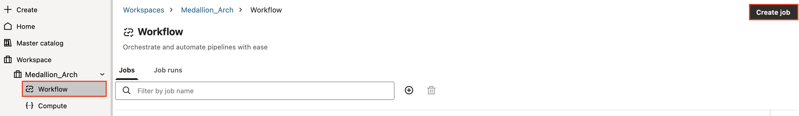
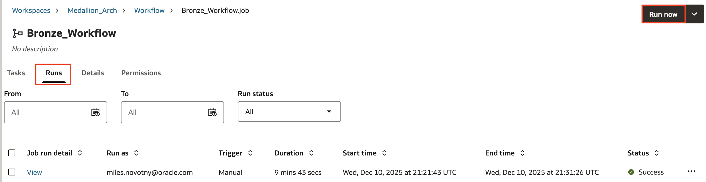
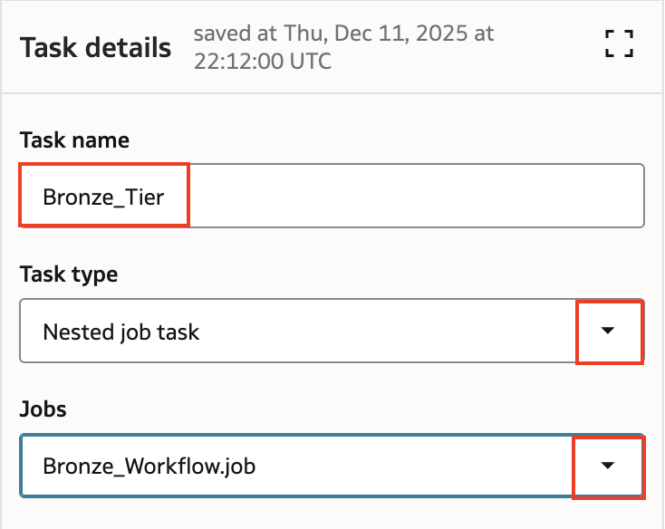
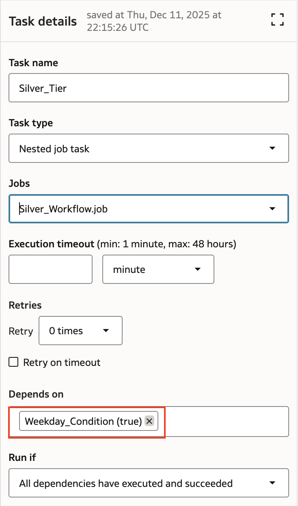
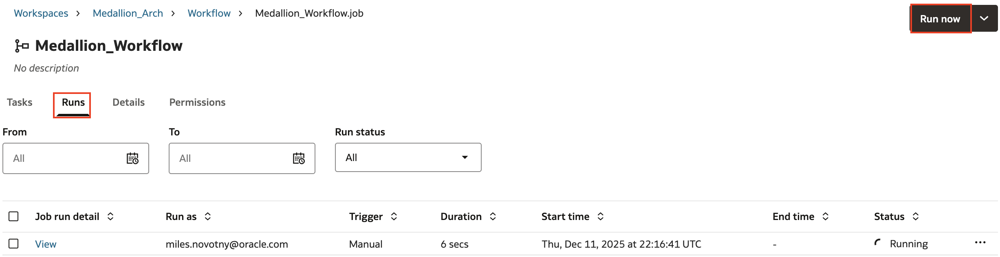
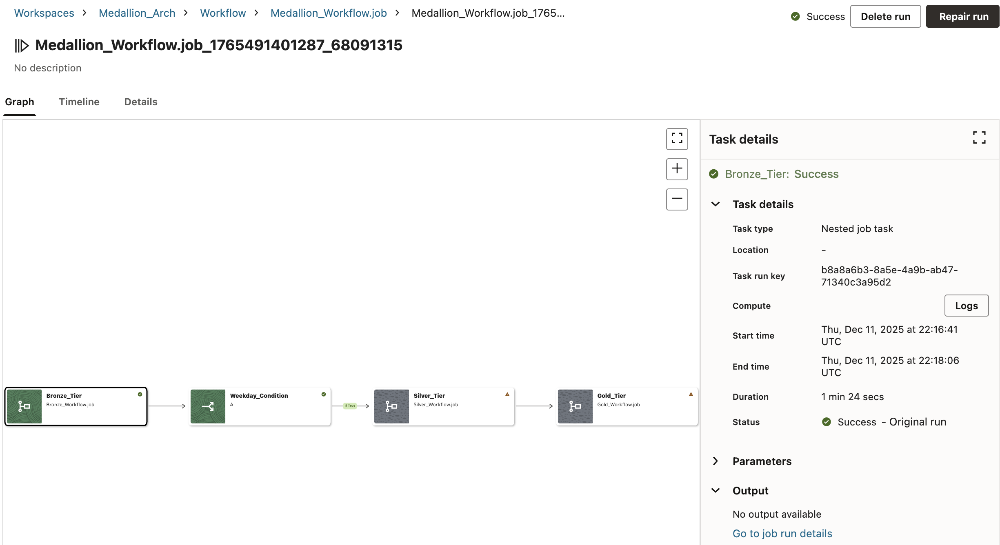
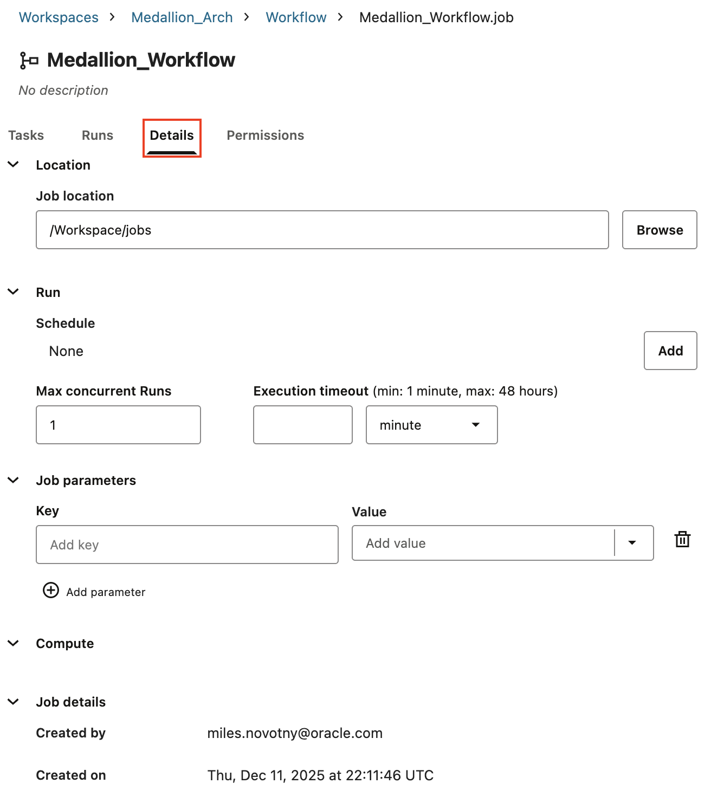
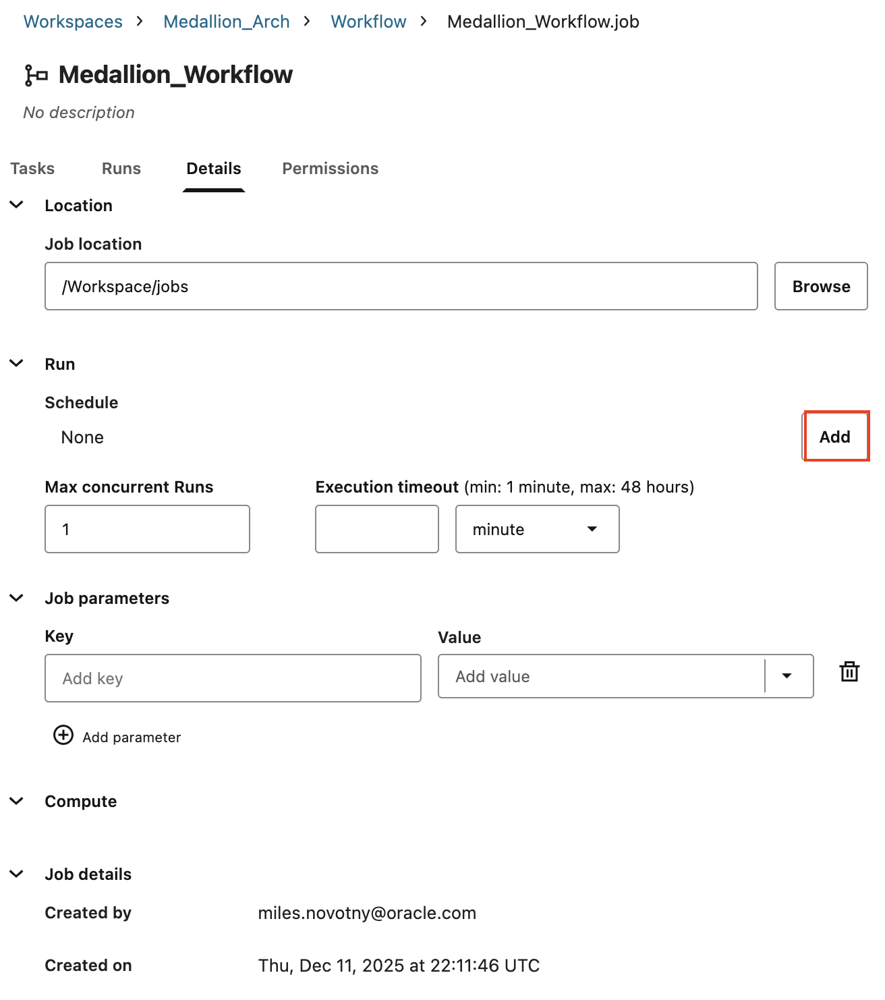

# Create Workflows to Operationalize a Medallion Architecture with AIDP Workbench

## Introduction

This lab guides you through the process of creating and managing jobs from the Workflows tab in Oracle AI Data Platform Workbench to automate data processing tasks. You will configure jobs to process your medallion architecture data on a regular basis.

Estimated Time: 45 minutes

### Objectives

In this lab, you will:
* Learn the core concepts of workflow creation in Oracle AI Data Platform.
* Create and configure jobs and tasks within a workflow.
* Implement conditional logic to customize job execution.
* Monitor and manage job runs.

### Prerequisites

This lab assumes you have:

* A basic understanding of data pipelines concepts.

## Task 1: Create a Workflows for each Tier of the Medallion Architecture

You would like your medallion notebooks to run on a schedule so that new data added to your data sources is processed regularly. 

1. Begin by selecting **Workflow** and then **Create job**



2. Enter the Job Name **Bronze\_Workflow** and leave all other fields as they are. Select **Create**


3. You are brought to the job editor where you can define the jobs that make up your task. The first task is already open. Enter the task name **Bronze\_1**. For **Task type** select **Notebook task**. Select **Browse** and navigate to the **Bronze** folder to select the **create\_bronze\_tier** file. For **Cluster** select **Medallion\_Compute**.


4. This is the only bronze notebook, so this is the only task you will create. Select **Run now** and navigate to the **Runs** tab to test if the job runs successfully. A green check will appear when it does.



6. Return to the workflows page using the breadcrumb menu. Create a second workflow called **Silver\_Workflow**.


7. Create a first task called **Silver\_1** in the same way you did for the bronze job, this time using the **2\_silver\_transformation** notebook.


8. Create a second task by selecting **Add task**. Name this one **Silver\_2** and make it in the same way using the **3\_silver\_transformation\_continent** notebook.


5. Notice that the section **Depends on** has **Silver\_1** selected. This means that currently this task depends on the first task. The **Run if** selection tells us that this second task will only run if the first task executes and succeeds. Leave these selections as is, but note that different **Run if** conditions can allow you to create branching tasks depending on the results of previous ones.


8. Create a 3rd and final task for this workflow. Make it a notebook task to run the **4\_silver\_transformation\_summery** notebook. Make sure that it is dependent on the 2nd task.


9. Test this workflow by choosing **Run now** and navigating to the **Runs** tab.


10. Create a third workflow called **Gold\_Workflow**. Add tasks to run the notebooks from the **Gold** folder to it in numerical order. Run the job to test it as you did the previous ones.


## Task 2: Create Unified Job to Run Medallion Architecture

Now you will make a final workflow that ties together the 3 you just created.

1. Create a workflow and call it **Medallion\_Workflow**.


2. Name the first task **Bronze_Tier** and select **Nested task** for the **Task type**. Browse the available jobs and select the **Bronze\_Workflow** job. This means that the entire workflow will run as a single task within the **Medallion\_Workflow**.



3. We would like to configure this workflow so that the bronze tier tasks run every day, but the silver and gold ones only run on weekdays. To achieve this, create a second task called **Weekday\_Condition** and for **Task type** choose **If/else condition**.


4. Under **Condition** next to **A**, paste in the below text. This text references a parameter that returns true on weekdays and false on the weekend. Select **==** as the operator and type **true** into the other side of the condition expression. Leave all other options set to the defaults. Optionally you could add additional conditions to the if/else logic, but you only need the one.

```
  <copy>
  {{job.start_time.is_weekday}}
  </copy>
  ```


5. Create a third task and name it **Silver\_Tier**. Make it a **Nested task** and choose the **Silver\_Workflow** job. Under the **Depends on** section make sure that **Weekday\_Condition (true)** is selected. This means that this task will only run when the condition in the if/else condition evaluates to true. Here you could create an alternate branching task to run if the condition returned false instead.



6. Create a fourth task and name it **Gold\_Tier**. Make sure that it is dependent on the **Silver\_Tier** task.


7. Now your workflow is complete. It combines all of the data processing for the bronze, silver, and gold tiers. Select **Run now** to test the workflow. Navigate to the **Runs** tab and select **View** to see its details.



8. The **Graph** section displays the tasks that make up the job run. Select a task to view details for that task.



9. Select the **Timeline** tab. This tab displays tasks executed. If you are running this workflow on the weekend, the silver and gold tasks will not have run because of the if/else task you added.


10. Select **Medallion\_Job** in the breadcrumb menu and then select **Details** to view job details.



11. On this page you can view and modify settings for the job, but we are interested in the **Schedule** section. Select **Add** to create a new schedule.



12. Set the **Frequency** to daily, leave all other options as is and select **Create**.


You have now created and scheduled a job to process your data into the 3 tiers of the medallion architecture, ensuring that high quality data is created and regularly updated for regular use.

## Learn More

- [Oracle AI Data Platform Community Site](https://community.oracle.com/products/oracleaidp/)
- [Oracle AI Data Platform Documentation](https://docs.oracle.com/en/cloud/paas/ai-data-platform/)
- [Oracle Analytics Training Form](https://community.oracle.com/products/oracleanalytics/discussion/27343/oracle-ai-data-platform-webinar-series)
- [AIDP Workflows Documentation](https://docs.oracle.com/en/cloud/paas/ai-data-platform/aidug/workflows.html)

## Acknowledgements
* **Author** - Miles Novotny, Senior Product Manager, Oracle Analytics Service Excellence
* **Contributors** -  Farzin Barazandeh, Senior Principal Product Manager, Oracle Analytics Service Excellence
* **Last Updated By/Date** - Miles Novotny, December 2025
