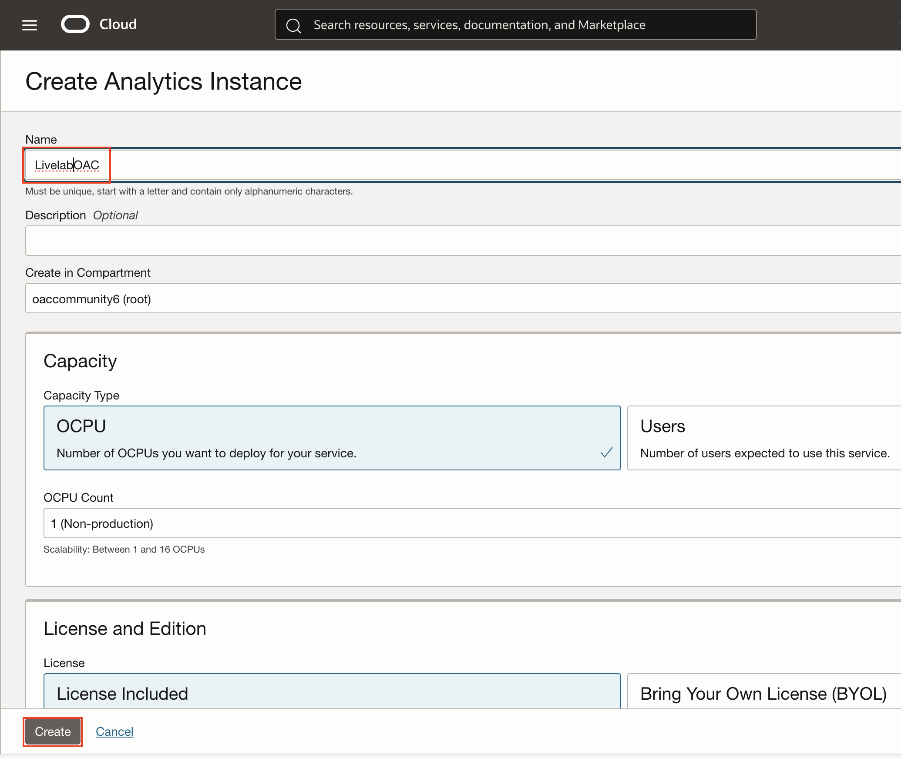
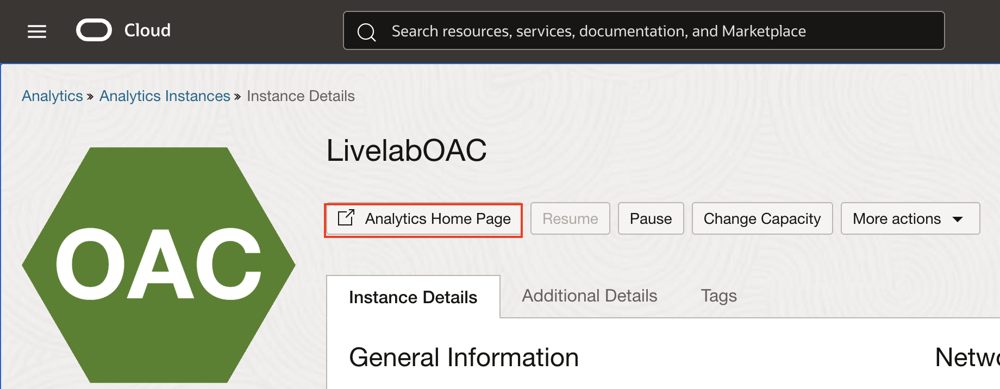
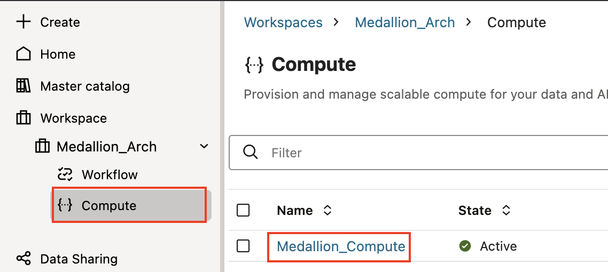
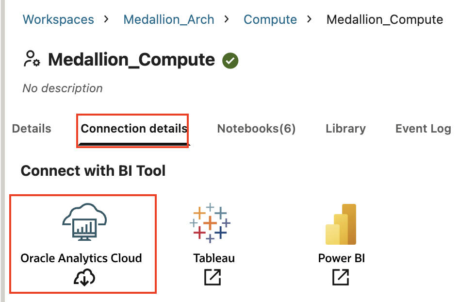
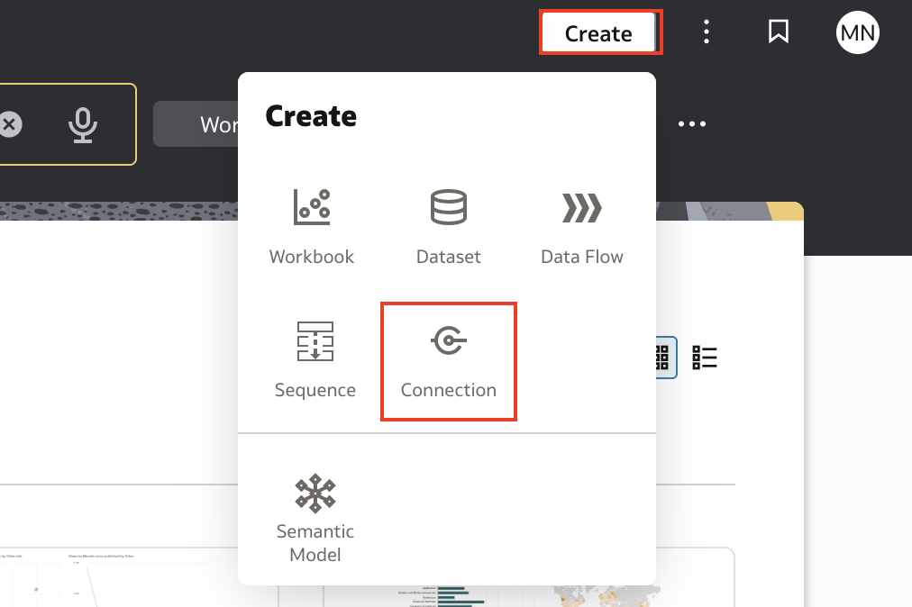
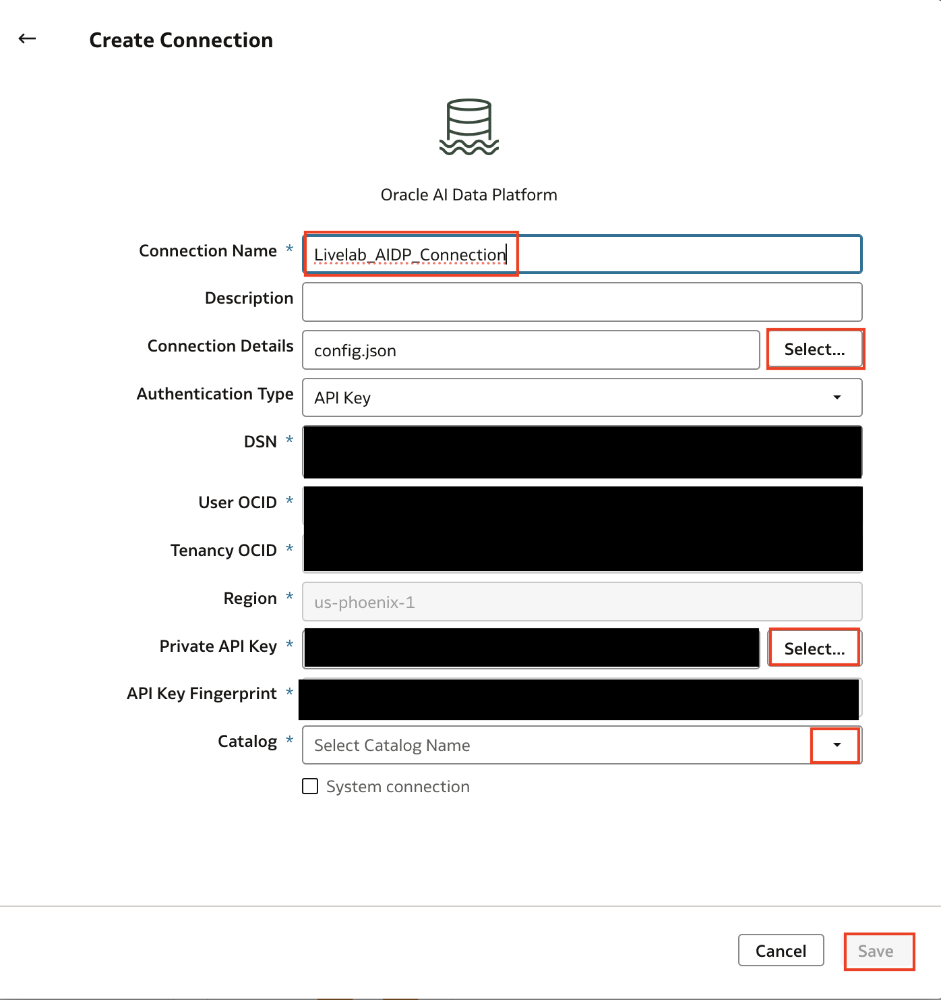

# Connecting Oracle AI Data Platform to Oracle Analytics Cloud (OAC)

## Introduction

In this lab you will learn how to establish a connection between Oracle AI Data Platform Workbench and Oracle Analytics Cloud (OAC) to visualize and analyze your AIDP data in OAC.

Estimated Time: 20 minutes

### Objectives

In this lab, you will:
* Generate and download the connection configuration file from Oracle AI Data Platform.
* Generate an API key pair to be used when defining the connection.
* Create a connection in OAC to AIDP Workbench using the config file and API key.

### Prerequisites

This lab assumes you have:
* An Oracle Cloud account with access to both Oracle AI Data Platform and Oracle Analytics Cloud.
* Familiarity with Oracle Analytics Cloud.

## Task 1: Create Oracle Analytics Cloud Instance (Optional)

1. If you already have an Oracle Analytics Cloud instance you would like to use, skip this task. Otherwise, from the oci console, select the hamburger menu then **Analytics** and **Oracle Analytics Cloud**

2. Select **Create Instance**

3. Name the instance **LivelabOAC**. Leave all other selections as is and select **Create**.

4. When the instance is finished provisioning, you can now access the OAC home page by selecting **Analytics Home Page**.

## Task 3: Generate an API Key pair

1. You will need an API key in order to create the connection between OAC and AIDP. From any page in the OCI Console, select the **Profile** icon then select your username.

2. Select the **Tokens and keys** tab then choose **Add API key**

3. Keep **Generate api key pair** selected. Select **Download private key** then choose **Add**.

## Task 3: Generate the Connection Configuration File

1. To create the connection between AIDP Workbench and OAC, you first need a config file from the compute cluster you will use for the connection. Return to the AIDP Workbench and select **Compute** from within your workspace. Select the **Medallion_Compute** cluster.

2. Select the **Connection Details** tab. Here, choose the **Oracle Analytics Cloud** icon. When you do so a **config.json** file will be downloaded to your local machine.

## Task 4: Create the Connection in Oracle Analytics Cloud

1. Open up the Oracle Analytics Cloud homepage. From here, choose **Create** then **Connection**.

2. Find the **Oracle AI Data Platform** icon. Use the search bar if you cannot locate it.

3. Name it **Livelab\_AIDP\_Connection**. Select **Select...** next to **Connection Details** and select the **config.json** file that you downloaded from the compute cluster. Choose **Select...** next to **Private API Key** and select the private key that you downloaded from the oci console. Note that fields will be populated using these files, which are blocked out in the image for privacy. Select **Supplier\_External\_23ai** for **Catalog** then Select **Save**.

> **Note:** Currently, the connection can only be made to a single catalog, not the master catalog.

Congrats, you have now created a connection between the **Supplier\_external\_23ai** catalog and your OAC instance! You can now use this connection to pull data from the catalog into OAC for visualization and analysis.

## Learn More

- [Oracle AI Data Platform Community Site](https://community.oracle.com/products/oracleaidp/)
- [Oracle AI Data Platform Documentation](https://docs.oracle.com/en/cloud/paas/ai-data-platform/)
- [Oracle Anlaytics Training Form](https://community.oracle.com/products/oracleanalytics/discussion/27343/oracle-ai-data-platform-webinar-series)
- [Connecting OAC to AIDP Workbench Documentation](https://docs.oracle.com/en/cloud/paas/analytics-cloud/acsds/connect-ai-data-platform.html)

## Acknowledgements
* **Author** - Miles Novotny, Senior Product Manager, Oracle Analytics Service Excellence
* **Contributors** -  Farzin Barazandeh, Senior Principal Product Manager, Oracle Analytics Service Excellence
* **Last Updated By/Date** - Miles Novotny, December 2025
