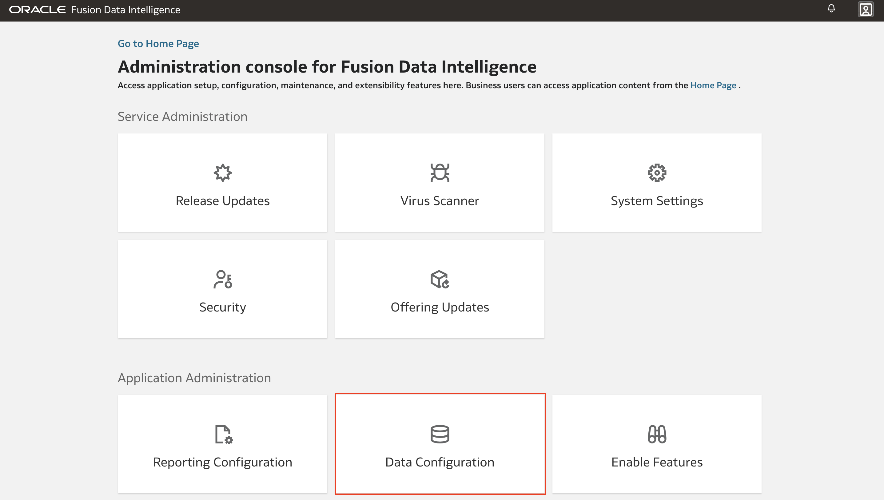

# Integrating Fusion AI Data Platform with Oracle AI Data Platform

## Introduction

This lab guides you through the process sharing data from Fusion AI Data Platform (FAIDP) with Oracle AI Data Platform. Creating shares from FAIDP to AIDP allows for seemless integration of the two systems for AI and data science tasks on your FAIDP data.

Estimated Time: 15 minutes

### Objectives

In this lab, you will:
* Enable the Oracle AI Data Platform feature within FAIDP.
* Configure a connection from FAIDP to Oracle AI Data Platform.
* Share data from FAIDP to Oracle AI Data Platform and view it in the master catalog.

## Prerequisites

This lab assumes you have:
* An Oracle Cloud account with access to both Fusion AI Data Platform and AI Data Platform Workbench.

## Task 1: Enabling Oracle AI Data Platform Feature in FDI

1. Begin at the admin console of your FAIDP instance. Select **Enable Features**

2. Scroll to find the **Oracle AI Data Platform** feature and select it to enable the feature. Return to the main admin console page.

   > **Note:** This step is essential to proceed with the integration.

## Task 2: Creating a Connection from FAIDP to Oracle AI Data Platform

1. From the admin console, select **Data Configuration**.

2. Next choose **Manage Connections**.

3. Here a connection to **Oracle AI Data Platform** should now appear (may appear as **Oracle Intelligent Data Lake**). To configure this connection choose the actions menu then **Edit Connection**.

4. In the popup window the top 3 fields are autofilled, complete the others. The OCIDS for various OCI resources can be found from the OCI console section for the given resource. Select **Update** when finished.

5. Back out to the **Data Configuration** page and select **Data Share**.

6. On this page you see a list of the data tables from your FAIDP instance that is available to share to external sources. Select a table that you would like to share with AIDP.

7. Select the data table again, this time select **Publish**.

8. Return to your AIDP Workbench instance. The tables shared with AIDP will appear in the master catalog, in a catalog with the name you specified when editing the connection in the FAIDP admin console. Here you can view the shared tables. It may take some time for the data to appear in AIDP Workbench after the share has been created.

## Learn More

* [Fusion Data in Oracle AI Data Platform with BICC](https://docs.oracle.com/en/cloud/paas/ai-data-platform/aidug/fusion-data-oracle-ai-data-platform.html)

## Acknowledgements
* **Author** - Miles Novotny, Senior Product Manager, Oracle Analytics Service Excellence
* **Contributors** -  Farzin Barazandeh, Senior Principal Product Manager, Oracle Analytics Service Excellence
* **Last Updated By/Date** - Miles Novotny, December 2025
