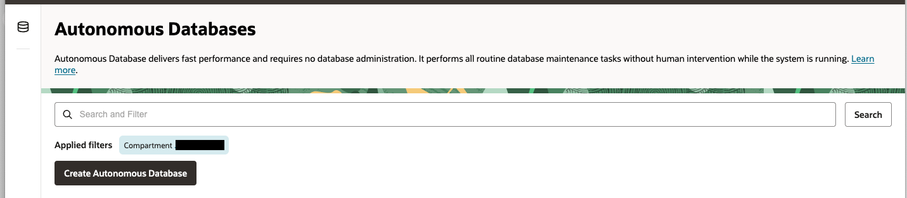
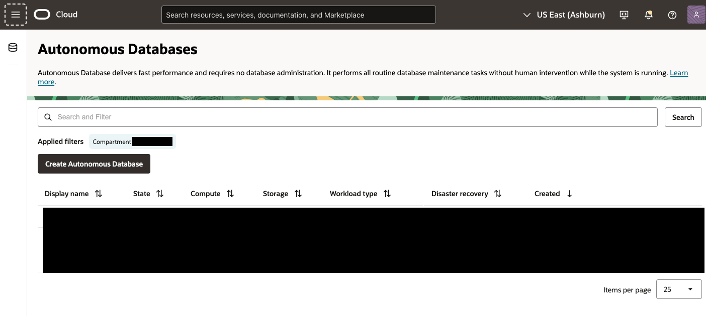

# Provision Resources

## Introduction

This lab will walk you thru provisioning an Autonomous Database, adding API keys in the Oracle Cloud Console and adding a database user for Graph studio. 

Estimated Time: 30 minutes

### Objectives


In this lab, you will:
* Provision an Autonomous Database
* Create IAM groups and policies
* Create Autonomous Database user/schema to hold sample autoclaims data

 

### Prerequisites

 
This lab assumes you have:
* An Oracle Cloud account with privileges to manage tenancy Identity Access Management and provision Autonomous Database
 

## Task 1: Create Autonomous Database

This task involves creating Autonomous Database 23ai.

1. Locate Autonomous Databases under Oracle Databases. Click on Create Autonomous Database.

    
    

2. Provide information for Compartment, Display name, Database name. Also, choose workload type as Data Warehouse or Transaction Processing one of these workload types are needed for Graph Studio.
    
    
    
3. Choose database version as 23ai and disable Compute auto scaling.

    

4. Make sure Network Access is Secure access from everywhere, provide password, valid email ID and click the Create button.

    
    

5. After deployment is complete, check to make sure your autonomous database is available on the autonomous databases page with the specified compartment selected.

    

## Task 2: Create Dynamic Group for Autonomous AI Database

This task involves creating a dynamic group for autonomous database resources, it will be used later to allow for Object Storage access from the autonomous database

1. Navigate to your current domain console view (or domain of your choice) via Identity and Security

    

2. Select Dynamic Groups tab

3. Click the Create dynamic group button

    

4. Type in a Name and Description

5. Select Match Any rules defined below and use the example to create a dynamic group for autonomous ai database resources in a specific compartment. Make sure to fill in value for compartment ID, use id of compartment where autonomous ai database was created
    Paste the following:

    ```text
        <copy>
            all {resource.type = 'autonomousdatabase', resource.compartment.id = '<COMPARTMENT ID HERE>'}
        </copy>
    ```

    

6. Click the Create button.


## Task 3: Create Identity and Access Management Policy for Dynamic Group

This task involves creating an IAM policy to allow autonomous database resources to use resource principal authentication for interacting with Object Storage resources of specified compartment.

1. Navigate to policies via Identity and Security, select the root compartment.

    

2. Click the Create policy button.

    

3. Type in a Name and Description.

    Make sure to fill in values for Domain, Dynamic Group and compartment name
    Paste the following:

        ```text
            <copy>
                Allow dynamic-group '<DOMAIN HERE>'/'<>' to manage buckets in compartment <>
                Allow dynamic-group '<DOMAIN HERE>'/'<>' to manage objects in compartment <>
            </copy>
        ```

    

4. Click the Create button.


## Acknowledgements

* **Author**
    * **Jadd Jennings**, Principal Cloud Architect, Oracle North America

* **Contributors**
    * **Kaan Burduroglu**, Distinguished Cloud Architect, Oracle North America

* **Last Updated By/Date**
    * **Jadd Jennings**, Principal Cloud Architect, Oracle North America, Nov 2025