# Provision Resources

## Introduction

This lab will walk you thru provisioning an Autonomous AI Database, creating an object storage bucket and creating the necessary Identity Access Management groups/policies.

Estimated Time: 25 minutes

### Objectives


In this lab, you will:
* Provision an Autonomous AI Database
* Create Object Storage bucket
* Create IAM groups and policies

 

### Prerequisites

 
This lab assumes you have:
* An Oracle Cloud account with privileges to manage tenancy Identity Access Management, create object storage buckets and provision an Autonomous AI Database
 

## Task 1: Create Autonomous AI Database

This task involves creating Autonomous AI Database.

1. Locate Autonomous AI Databases under Oracle Databases. Click on Create Autonomous AI Database.

    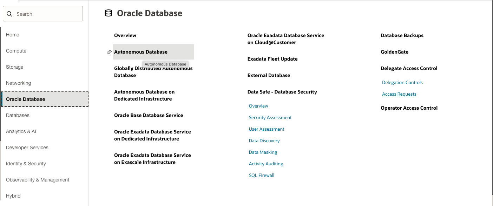
    

2. Provide information for Compartment, Display name, Database name. Also, choose workload type as Data Warehouse or Transaction Processing one of these workload types are needed for Graph Studio.
    
    
    
3. Choose database version as 26ai and disable Compute auto scaling.

    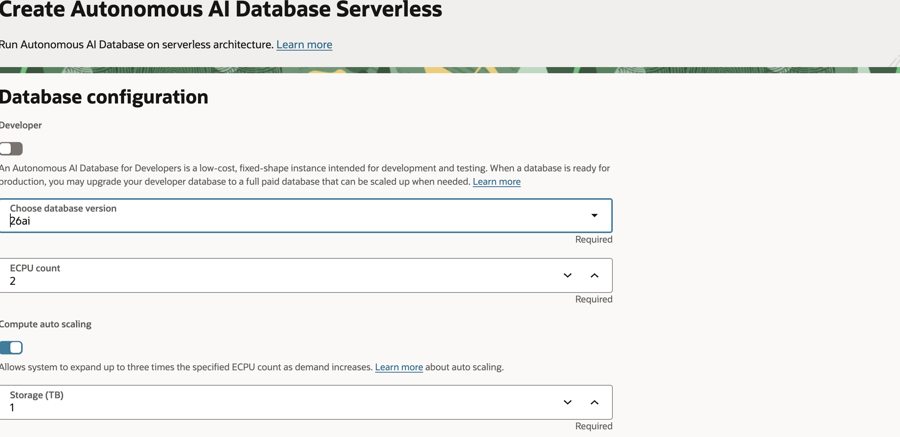

4. Make sure Network Access is Secure access from everywhere, provide password, valid email ID and click the Create button.

    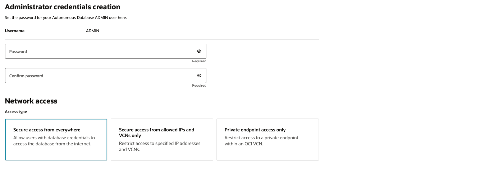
    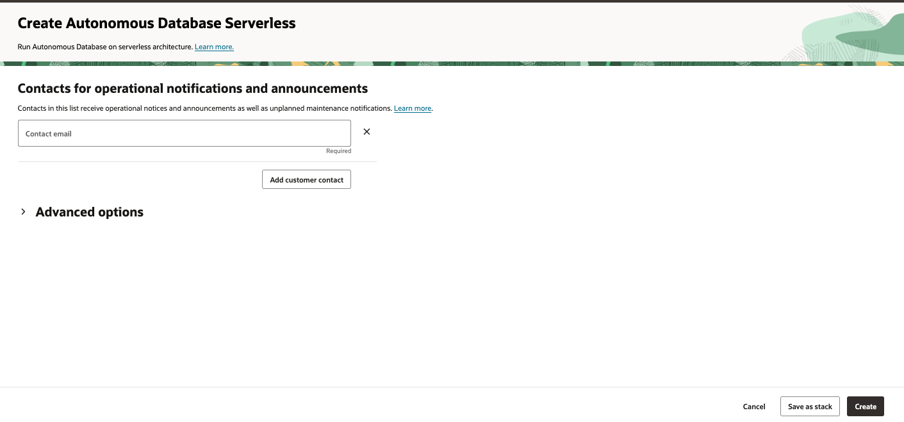

5. After deployment is complete, check to make sure your Autonomous AI Database is available on the Autonomous AI Databases page with the specified compartment selected.

    

6. Before going to next lab, download and store a copy of the database wallet for later use. Start by opening the Autonomous AI Database by drilling through the name link.

7. Click the Database connection button.
  
    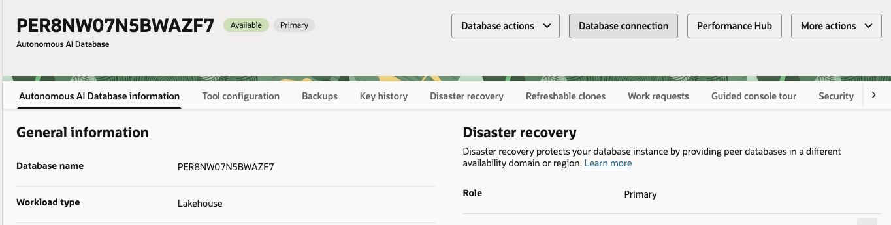

8. Make sure Instant wallet is selected and click the Download wallet button.

    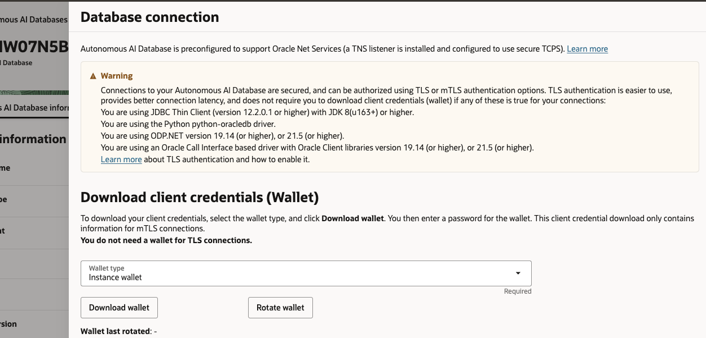

9. Type in a wallet password and click the download button.

    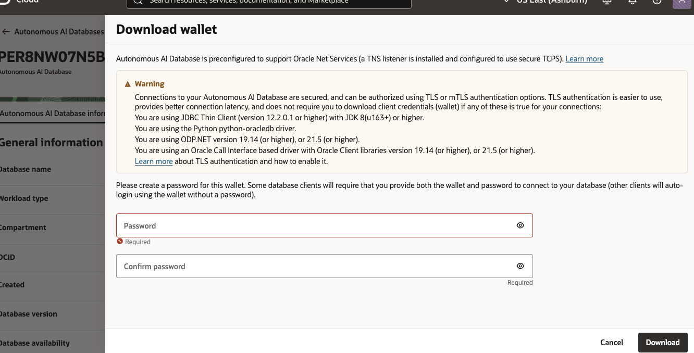

## Task 2: Create Object Storage Bucket and upload data for staging

1. Download the following zip and DVA files. Unzip zip files to separate local folders and store DVA files for later use.

    a. [CSV Files](https://idb6enfdcxbl.objectstorage.us-chicago-1.oci.customer-oci.com/n/idb6enfdcxbl/b/accelerate-auto-claims-processing/o/data%2Fdata.zip)

    b. [Telematics Files](https://idb6enfdcxbl.objectstorage.us-chicago-1.oci.customer-oci.com/n/idb6enfdcxbl/b/accelerate-auto-claims-processing/o/telematics%2Ftelematics.zip)

    c. [FSI Auto Claims Gail](https://idb6enfdcxbl.objectstorage.us-chicago-1.oci.customer-oci.com/n/idb6enfdcxbl/b/accelerate-auto-claims-processing/o/dva%2FFSI%20Auto%20Claims%20Gale.dva)

    d. [FSI Auto Claims Justin Report](https://idb6enfdcxbl.objectstorage.us-chicago-1.oci.customer-oci.com/n/idb6enfdcxbl/b/accelerate-auto-claims-processing/o/dva%2FFSI%20Auto%20Claims%20Justin%20Report.dva)
2. Navigate to Object Buckets via Storage.

    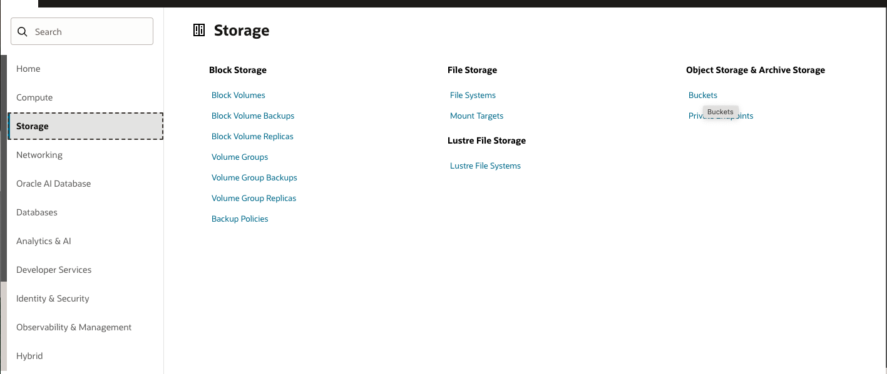

3. Select appropriate compartment click Create bucket button.

    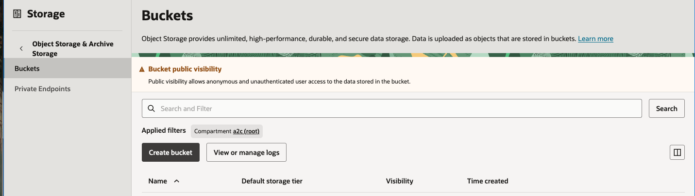

4. Provide bucket name (or use default) and click Create bucket button.

    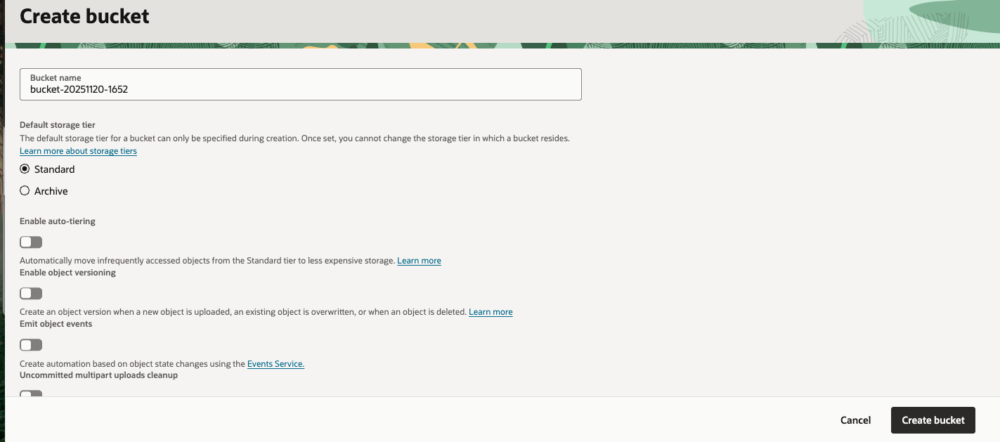

5. Open the bucket, select the Objects tab, select the actions drop down and create new folder.

    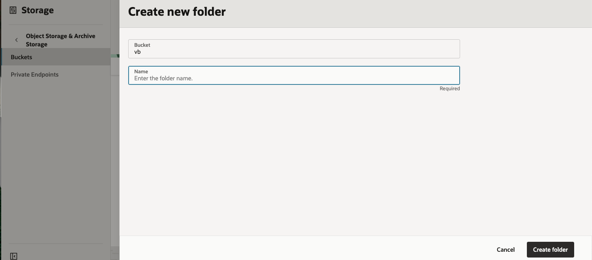

6. Name the folder telematics and click the create folder button.

7. Repeat step 5 and name the folder data.

8. Open the telematics folder, click the upload objects button and select all the .parquet files from the telematics.zip file. Click the next button and then the Upload.

    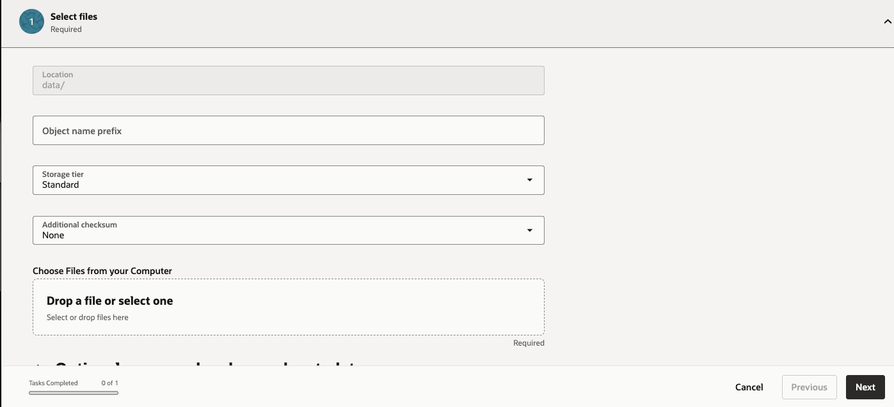

    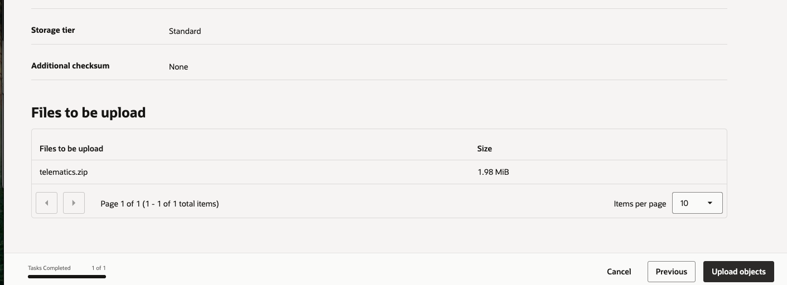

9. Repeat step 8 but use the data folder and select all the .csv files from the data.zip file.
 


## Task 3: Create Dynamic Group for Autonomous AI Database

This task involves creating a dynamic group for Autonomous AI Database resources, it will be used later to allow for Object Storage access from the Autonomous AI Database

1. Navigate to your current domain console view (or domain of your choice) via Identity and Security.

    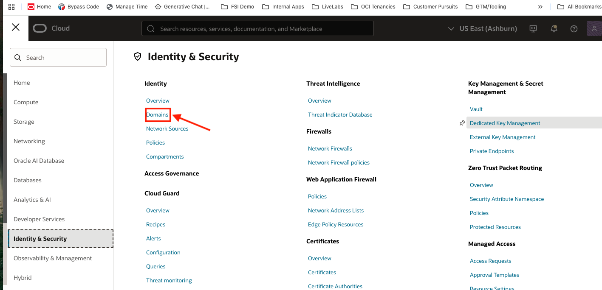

2. Select Dynamic Groups tab and click the Create dynamic group button.

    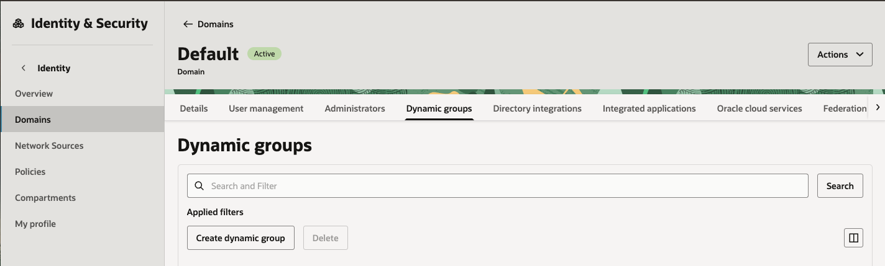

3. Type in a Name and Description.

4. Select Match Any rules defined below and use the example to create a dynamic group for autonomous ai database resources in a specific compartment. Make sure to fill in value for compartment ID, use id of compartment where autonomous ai database was created
    Paste the following:

    ```text
        <copy>
            all {resource.type = 'autonomousdatabase', resource.compartment.id = '<COMPARTMENT ID HERE>'}
        </copy>
    ```

    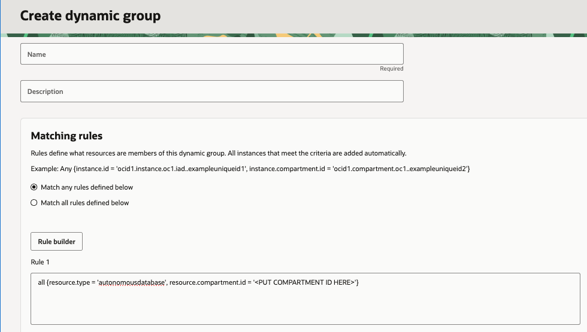

6. Click the Create button.


## Task 4: Create Identity and Access Management Policy for Dynamic Group

This task involves creating an IAM policy to allow Autonomous AI Database resources to use resource principal authentication for interacting with Object Storage resources of specified compartment.

1. Navigate to policies via Identity and Security, select the root compartment and click the Create policy button.


    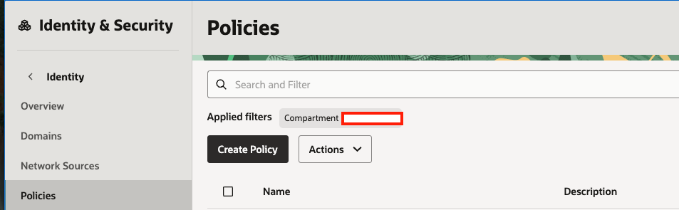

2. Type in a Name, Description, click the Show manual editor button and look below to create a policy for Autonomous AI Database resources

    Make sure to fill in values for Domain, Dynamic Group and compartment name
    Paste the following:

    ```text
        <copy>
            Allow dynamic-group '<DOMAIN HERE>'/'<DYNAMIC GROUP HERE>' to manage buckets in compartment <COMPARTMENT NAME HERE>
            Allow dynamic-group '<DOMAIN HERE>'/'<DYNAMIC GROUP HERE>' to manage objects in compartment <COMPARTMENT NAME HERE>
        </copy>
    ```

    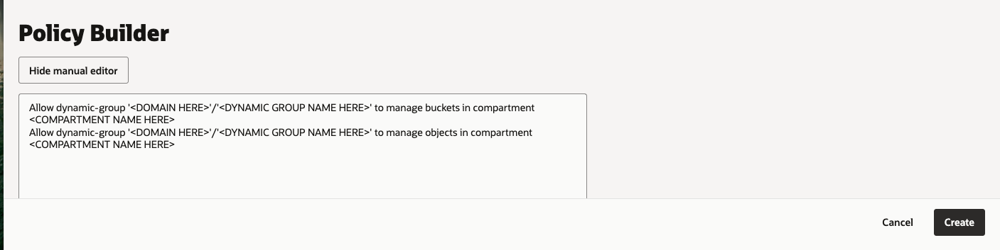

3. Click the Create button.


## Acknowledgements

* **Author**
    * **Jadd Jennings**, Principal Cloud Architect, Oracle North America

* **Contributors**
    * **Kaan Burduroglu**, Distinguished Cloud Architect, Oracle North America

* **Last Updated By/Date**
    * **Jadd Jennings**, Principal Cloud Architect, Oracle North America, Nov 2025