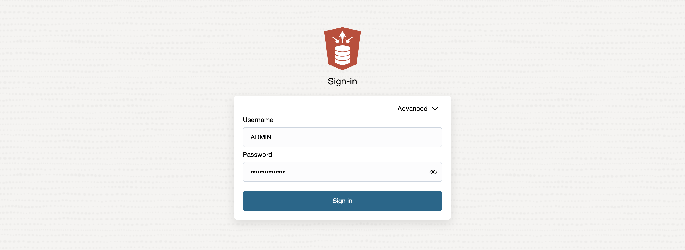

# apply database operations

## Introduction

This lab will walk you thru staging and loading of autoclaims data into the Autonomous Database created in previous steps. You will stage data in an object storage bucket, use the api key to create a cloud store for the object storage bucket, load data from the bucket into the autonomous database and create an auto table using parquet files in object storage bucket.

Estimated Time: 30 minutes

### Objectives

In this lab, you will:
* Create an Object Storage Bucket
* Create Cloud Storage location for Object Storage Bucket
* Load data from Object Storage bucket into Autonomous database
* Create an external table for telemetry in parquet format

### Prerequisites

 
This lab assumes you have:
* An Oracle Cloud account with privileges to access Generative AI services, provision Autonomous Database and add API keys
 

## Task 1: Create new Cloud Store Location

## Task 2: Load Object Storage data into Autonomous Database via Cloud Store
 
## Task 3: Apply PL/SQL to prep data for visualization  

1. Open the service detail page for your Autonomous Database instance in the OCI console.  

   Then click on **Database Actions** and select **View all database actions**. 

   

2. Login as the ADMIN user for your Autonomous Database instance.

    

3. Click the **DATABASE USERS** tile under **Administration**.

   

4. Click the **+ Create User** icon.

    

5. Enter the required details, i.e. user name and password. Turn on the **Graph Enable** and **Web Access** radio buttons. And select a quota, e.g. **UNLIMITED**,  to allocate on the `DATA` tablespace.   

    >**Note:** The password should meet the following requirements:

    - The password must be between 12 and 30 characters long and must include at least one uppercase letter, one lowercase letter, and one numeric character.
    - The password cannot contain the username.
    - The password cannot contain the double quote (“) character.
    - The password must be different from the last 4 passwords used for this user.
    - The password must not be the same password that is set less than 24 hours ago.

    

    >**Note:** Please do not Graph Enable the ADMIN user and do not login to Graph Studio as the ADMIN user. The ADMIN user has additional privileges by default. 

    Click the **Create User** button at the bottom of the panel to create the user with the specified credentials.

    The newly created user will now be listed.

       
