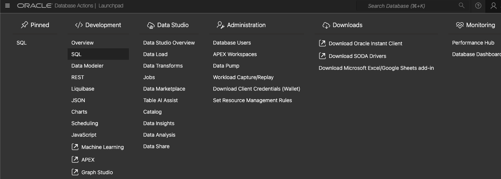

# apply database operations

## Introduction

This lab will walk you thru staging and loading of autoclaims data into the Autonomous Database created in previous steps. You will stage data in an object storage bucket, use the api key to create a cloud store for the object storage bucket, load data from the bucket into the autonomous database and create an auto table using parquet files in object storage bucket.

Estimated Time: 30 minutes

### Objectives


In this lab, you will:
* Create an Object Storage Bucket
* Create Cloud Storage location for Object Storage Bucket
* Load data from Object Storage bucket into Autonomous database
* Create an external table for telemetry in parquet format

### Prerequisites

 
This lab assumes you have:
* An Oracle Cloud account with privileges to access Generative AI services, provision Autonomous Database and add API keys
 

## Task 1: Apply PL/SQL to prepare for data load

1. Open the service detail page for your Autonomous Database instance in the OCI console.  

   Then click on **Database Actions** and select **View all database actions**. 

   

2. Login as the ADMIN user for your Autonomous Database instance.

    

3. Open SQL Developer

    

4. Apply PL/SQL to enable Resource Principal, Create FSIDEMO schema and grant necessary roles. Change default password if needed.

copy below

    ```text
        <copy>
        BEGIN
        DBMS_CLOUD_ADMIN.ENABLE_RESOURCE_PRINCIPAL(); 
        END;
        /

        CREATE USER FSIDEMO IDENTIFIED BY "FInance##54321";

        -- ADD ROLES
        GRANT AUDIT_ADMIN TO FSIDEMO;
        GRANT AQ_ADMINISTRATOR_ROLE TO FSIDEMO;
        GRANT DV_OWNER TO FSIDEMO;
        GRANT RESOURCE TO FSIDEMO;
        GRANT DGPDB_ROLE TO FSIDEMO;
        GRANT DB_DEVELOPER_ROLE TO FSIDEMO;
        GRANT CONSOLE_MONITOR TO FSIDEMO;
        GRANT CONSOLE_ADMIN TO FSIDEMO;
        GRANT CAPTURE_ADMIN TO FSIDEMO;
        GRANT ACCHK_READ TO FSIDEMO;
        GRANT GATHER_SYSTEM_STATISTICS TO FSIDEMO;
        GRANT CONSOLE_DEVELOPER TO FSIDEMO;
        GRANT DWROLE TO FSIDEMO;
        GRANT CONSOLE_OPERATOR TO FSIDEMO;
        GRANT ADPADMIN TO FSIDEMO;
        GRANT OML_DEVELOPER TO FSIDEMO;
        GRANT GRAPH_DEVELOPER TO FSIDEMO;
        GRANT AQ_USER_ROLE TO FSIDEMO;
        GRANT DATAPUMP_CLOUD_EXP TO FSIDEMO;
        GRANT DATAPUMP_CLOUD_IMP TO FSIDEMO;
        GRANT ADM_PARALLEL_EXECUTE_TASK TO FSIDEMO;
        GRANT APEX_ADMINISTRATOR_READ_ROLE TO FSIDEMO;
        GRANT DV_ACCTMGR TO FSIDEMO;
        GRANT CONNECT TO FSIDEMO;
        GRANT CTXAPP TO FSIDEMO;
        GRANT AUDIT_VIEWER TO FSIDEMO;
        GRANT ADB_MONITOR TO FSIDEMO;
        GRANT APEX_ADMINISTRATOR_ROLE TO FSIDEMO;
        GRANT GRAPH_ADMINISTRATOR TO FSIDEMO;
        GRANT EXECUTE on DBMS_CLOUD to FSIDEMO;
        GRANT EXECUTE on DBMS_CLOUD_AI to FSIDEMO;
        GRANT EXECUTE on DBMS_CLOUD_PIPELINE to FSIDEMO;
        ALTER USER FSIDEMO DEFAULT ROLE CONSOLE_DEVELOPER,DWROLE,OML_DEVELOPER;

        -- REST ENABLE
        BEGIN
            ORDS_ADMIN.ENABLE_SCHEMA(
        p_enabled => TRUE,
        p_schema => 'FSIDEMO',
        p_url_mapping_type => 'BASE_PATH',
        p_url_mapping_pattern => 'fsidemo',
        p_auto_rest_auth=> TRUE
            );
            -- ENABLE DATA SHARING
            C##ADP$SERVICE.DBMS_SHARE.ENABLE_SCHEMA(
            SCHEMA_NAME => 'FSIDEMO',
            ENABLED => TRUE
            );

        DBMS_CLOUD_ADMIN.ENABLE_RESOURCE_PRINCIPAL('FSIDEMO'); 
            commit;
        END;
        /

        -- ENABLE OML
        ALTER USER FSIDEMO GRANT CONNECT THROUGH OML$PROXY;

        -- QUOTA
        ALTER USER FSIDEMO QUOTA UNLIMITED ON DATA;
        </copy>
    ```  

## Task 2: Create new Cloud Store Location

## Task 3: Load Object Storage data into Autonomous Database via Cloud Store
 
## Task 4: Apply PL/SQL to prep data for visualization  

