# apply database operations

## Introduction

This lab will guide you through the staging and loading of autoclaims data. The data will be loaded into the Autonomous AI Database created in previous steps. You will stage data in an object storage bucket, use the resource principal to create a cloud store for the object storage bucket, load data from the bucket into the Autonomous AI Database, and create an external table using Parquet files staged in the object storage bucket.

Estimated Time: 25 minutes

### Objectives


In this lab, you will:
* Create Cloud Storage location for Object Storage Bucket
* Load data from Object Storage bucket into Autonomous AI Database
* Create an external table for telemetry in Parquet format

### Prerequisites

 
This lab assumes you have:
* Completed previous labs successfully 
 

## Task 1: Apply PL/SQL to prepare for data load

1. Open the service detail page for your Autonomous AI Database instance in the OCI console.  

   Then click on **Database Actions** and select **View all database actions**. 

   

2. Login as the ADMIN user for your Autonomous AI Database instance.

    

3. Open SQL Developer

    

4. Apply PL/SQL to enable the resource principal, create the FSIDEMO schema and grant necessary roles. Change default password if needed, this can be done by replacing the string after IDENTIFIED BY (ex. CREATE USER FSIDEMO IDENTIFIED BY "My Password";).

copy below

```text
<copy>
BEGIN
DBMS_CLOUD_ADMIN.ENABLE_RESOURCE_PRINCIPAL(); 
END;
/

CREATE USER FSIDEMO IDENTIFIED BY "FInance##54321";

-- ADD ROLES
GRANT AUDIT_ADMIN TO FSIDEMO;
GRANT AQ_ADMINISTRATOR_ROLE TO FSIDEMO;
GRANT DV_OWNER TO FSIDEMO;
GRANT RESOURCE TO FSIDEMO;
GRANT DGPDB_ROLE TO FSIDEMO;
GRANT DB_DEVELOPER_ROLE TO FSIDEMO;
GRANT CONSOLE_MONITOR TO FSIDEMO;
GRANT CONSOLE_ADMIN TO FSIDEMO;
GRANT CAPTURE_ADMIN TO FSIDEMO;
GRANT ACCHK_READ TO FSIDEMO;
GRANT GATHER_SYSTEM_STATISTICS TO FSIDEMO;
GRANT CONSOLE_DEVELOPER TO FSIDEMO;
GRANT DWROLE TO FSIDEMO;
GRANT CONSOLE_OPERATOR TO FSIDEMO;
GRANT ADPADMIN TO FSIDEMO;
GRANT OML_DEVELOPER TO FSIDEMO;
GRANT GRAPH_DEVELOPER TO FSIDEMO;
GRANT AQ_USER_ROLE TO FSIDEMO;
GRANT DATAPUMP_CLOUD_EXP TO FSIDEMO;
GRANT DATAPUMP_CLOUD_IMP TO FSIDEMO;
GRANT ADM_PARALLEL_EXECUTE_TASK TO FSIDEMO;
GRANT APEX_ADMINISTRATOR_READ_ROLE TO FSIDEMO;
GRANT DV_ACCTMGR TO FSIDEMO;
GRANT CONNECT TO FSIDEMO;
GRANT CTXAPP TO FSIDEMO;
GRANT AUDIT_VIEWER TO FSIDEMO;
GRANT ADB_MONITOR TO FSIDEMO;
GRANT APEX_ADMINISTRATOR_ROLE TO FSIDEMO;
GRANT GRAPH_ADMINISTRATOR TO FSIDEMO;
GRANT EXECUTE on DBMS_CLOUD to FSIDEMO;
GRANT EXECUTE on DBMS_CLOUD_AI to FSIDEMO;
GRANT EXECUTE on DBMS_CLOUD_PIPELINE to FSIDEMO;
ALTER USER FSIDEMO DEFAULT ROLE CONSOLE_DEVELOPER,DWROLE,OML_DEVELOPER;

-- REST ENABLE
BEGIN
    ORDS_ADMIN.ENABLE_SCHEMA(
p_enabled => TRUE,
p_schema => 'FSIDEMO',
p_url_mapping_type => 'BASE_PATH',
p_url_mapping_pattern => 'fsidemo',
p_auto_rest_auth=> TRUE
    );
    -- ENABLE DATA SHARING
    C##ADP$SERVICE.DBMS_SHARE.ENABLE_SCHEMA(
    SCHEMA_NAME => 'FSIDEMO',
    ENABLED => TRUE
    );

DBMS_CLOUD_ADMIN.ENABLE_RESOURCE_PRINCIPAL('FSIDEMO'); 
    commit;
END;
/

-- ENABLE OML
ALTER USER FSIDEMO GRANT CONNECT THROUGH OML$PROXY;

-- QUOTA
ALTER USER FSIDEMO QUOTA UNLIMITED ON DATA;
</copy>            
```  

## Task 2: Create new Cloud Store Location

1. Open the service detail page for your Autonomous AI Database instance in the OCI console.  

   Then click on **Database Actions** and select **View all database actions**. 

   

2. Login as the FSIDEMO user for your Autonomous AI Database instance.

    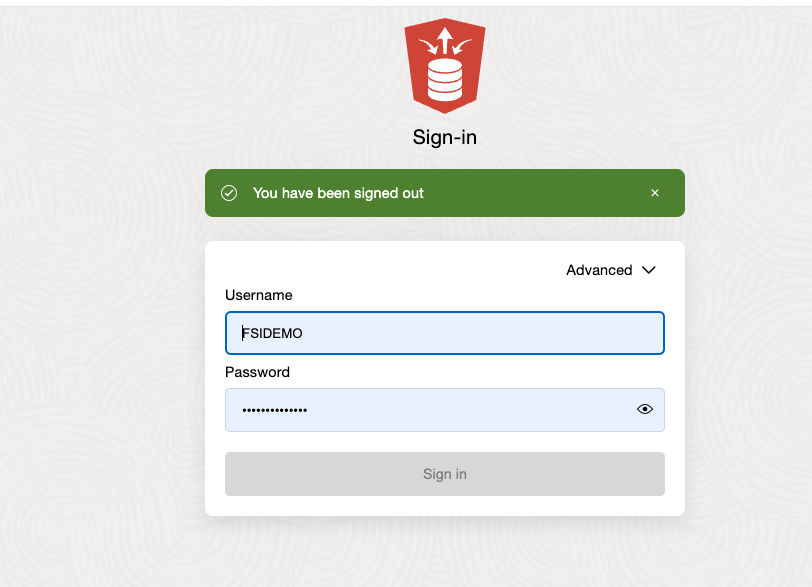

3. Open Data Load 

    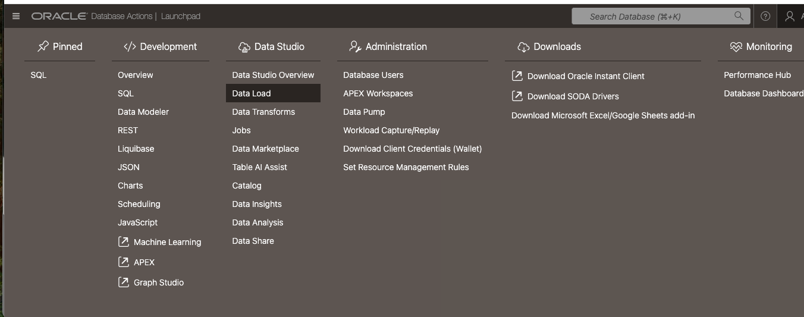 

4. Expand Data Load, select Connections, click the Create drop down and select New Cloud Store Location

    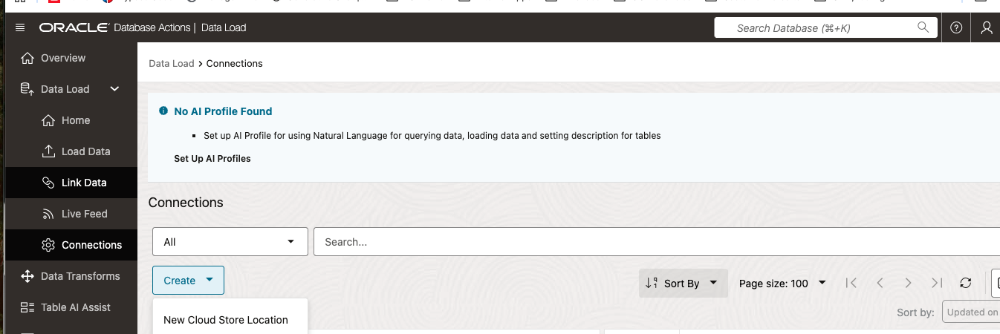 

5. Fill in a name, description, select the OCI$RESOURCE_PRINCIPAL as credential and type in the bucket URI from the bucket created in previous labs (follow tooltip and example).

    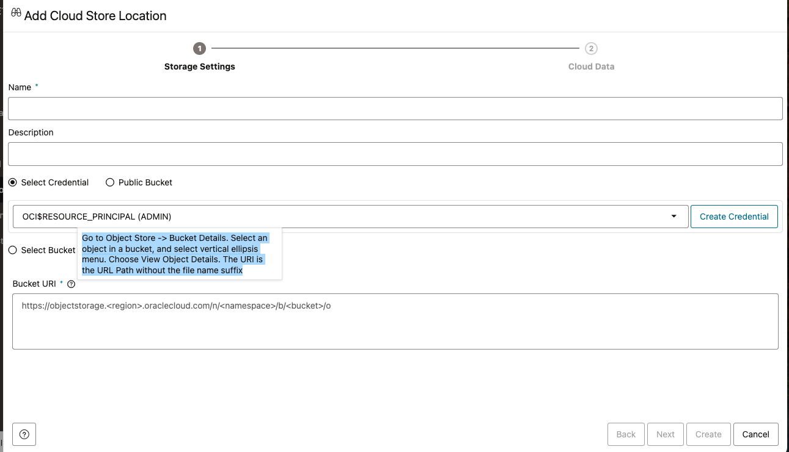 

6. Click Next to make sure bucket contents are correct and/or Create to finish creating cloud store location

## Task 3: Load Object Storage data into Autonomous AI Database via Cloud Store
 
1. Select Load Data under the Data Load expansion, then select Cloud Store   

 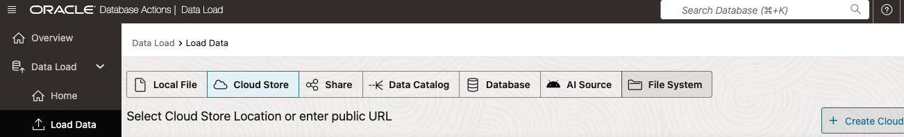 

2. Select the cloud store created in the previous task as Cloud Store Location

3. Expand the data folder in the bottom left panel. It should contain all the CSV files uploaded in the previous lab.

4. Select each CSV file and drag all into the data load

 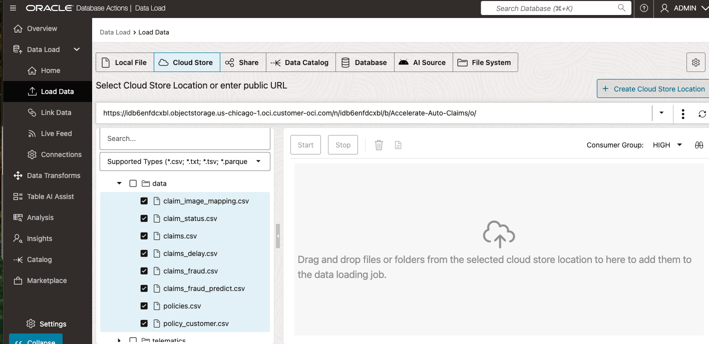 

 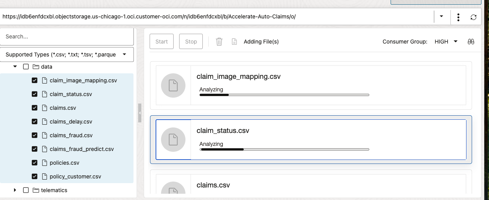 

5. If necessary, review settings for each table, settings should be correct automatically

 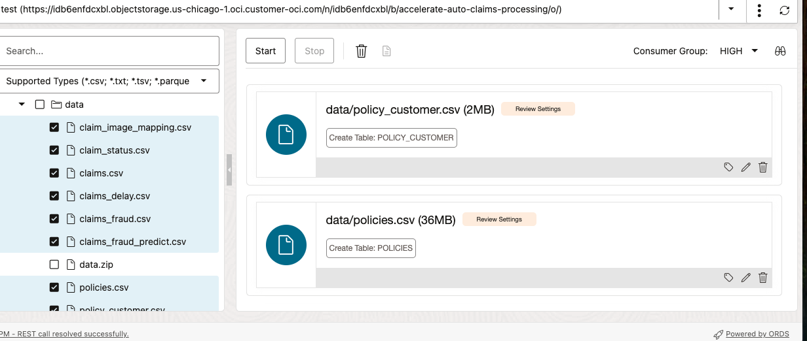 

 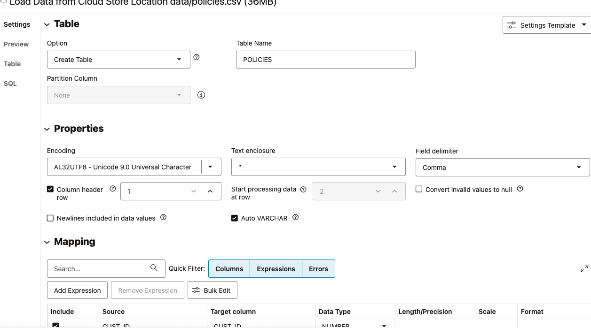 

6. Click the start button to run the Data Load. Wait for each of the eight jobs to complete (should be about 2 minutes).


## Task 4: Apply final PL/SQL to prep data for visualization  

1. Open the service detail page for your Autonomous AI Database instance in the OCI console.  

   Then click on **Database Actions** and select **View all database actions**. 

   

2. Login as the FSIDEMO user for your Autonomous AI Database instance.

    

3. Open SQL Developer

     

4. Apply PL/SQL to add Parquet files for datasets. Make sure to update the file_uri_list to use the object storage URL with the telematics folder (e.g., https://xxx.objectstorage.us-chicago-1.oci.customer-oci.com/n/xxx/b/xxx/o/telematics). After pasting and updating the PL/SQL, make sure to run the script with no errors.

copy below

```text
<copy>
  
    BEGIN
        
    DBMS_CLOUD.CREATE_EXTERNAL_TABLE(
        table_name =>'auto_telematics',
        credential_name =>'OCI$RESOURCE_PRINCIPAL',
        file_uri_list => '<OBJECT STORAGE URL WITH TELEMATICS FOLDER HERE>%2F*.*',
        format => '{"type":"parquet", "schema": "first"}'
    );
    END;
    /
</copy>
```  

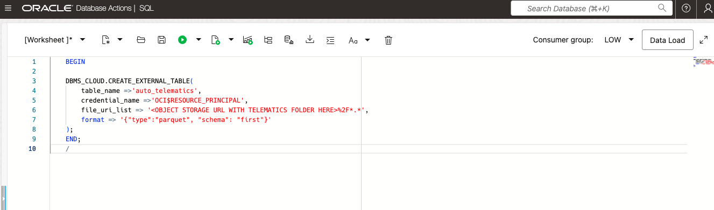 

5. Clear the worksheet and apply the following PL/SQL to create the claims_mv view

copy below

```text
<copy>
    
CREATE VIEW FSIDEMO.CLAIMS_MV ( CLAIM_NO, MONTHS_AS_CUSTOMER, NUMBER_OF_WITNESSES, POLICY_NO, SUSPICIOUS_ACTIVITY, CLAIM_DATE, INJURY_CLAIM_AMOUNT, PROPERTY_CLAIM_AMOUNT, TOTAL_CLAIM_AMOUNT, VEHICLE_CLAIM_AMOUNT, COLLISION_VEHICLES_INVOLVED, COLLISION_TYPE, INCIDENT_DATE, INCIDENT_HOUR, INCIDENT_SEVERITY, INCIDENT_TYPE, DRIVER_AGE, DRIVER_INSURED_RELATIONSHIP, DRIVER_LICENSE_ISSUE_DATE, CLAIM_STATUS, CLAIM_CLOSE_DATE, CLAIM_ADJUSTER, CLAIM_DAYS, DELAY_REASON ) AS

SELECT clm.CLAIM_NO,
        clm.MONTHS_AS_CUSTOMER, 
        clm.NUMBER_OF_WITNESSES, 
        clm.POLICY_NO, 
        cast(clm.SUSPICIOUS_ACTIVITY as varchar(5)) as SUSPICIOUS_ACTIVITY,
        clm.CLAIM_DATE,
        json_value(clm.CLAIM_AMOUNT, '$.injury') as injury_claim_amount,
        json_value(clm.CLAIM_AMOUNT, '$.property') as property_claim_amount,
        json_value(clm.CLAIM_AMOUNT, '$.total') as total_claim_amount,
        json_value(clm.CLAIM_AMOUNT, '$.vehicle') as vehicle_claim_amount,
        json_value(clm.COLLISION, '$.number_of_vehicles_involved') as collision_vehicles_involved,
        json_value(clm.COLLISION, '$.type') as collision_type,
        json_value(clm.INCIDENT, '$.date') as incident_date, 
        json_value(clm.INCIDENT, '$.hour') as incident_hour, 
        json_value(clm.INCIDENT, '$.severity') as incident_severity, 
        json_value(clm.INCIDENT, '$.type') as incident_type,
        json_value(clm.DRIVER, '$.age') as driver_age, 
        json_value(clm.DRIVER, '$.insured_relationship') as driver_insured_relationship, 
        json_value(clm.DRIVER, '$.license_issue_date') as driver_license_issue_date,
    Cs.claim_status,
    Cs.claim_close_date,
    Cs.claim_adjuster,
    CASE WHEN cs.claim_close_date is NULL THEN (CURRENT_DATE - clm.CLAIM_DATE) 
    WHEN cs.claim_close_date is NOT NULL THEN (cs.CLAIM_CLOSE_DATE - clm.CLAIM_DATE) 
    ELSE (CURRENT_DATE - CURRENT_DATE)
    END
    AS claim_days,
    dly.DELAY_REASON
    FROM claims clm, claim_status cs, CLAIMS_DELAY dly
    WHERE clm.claim_no = cs.claim_no AND
    clm.CLAIM_NO = dly.CLAIM_NO 
    ;
/
</copy>
```  

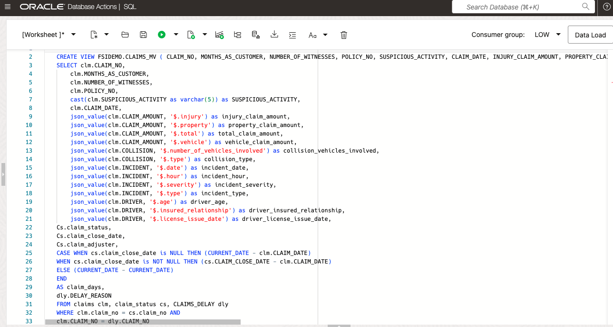
