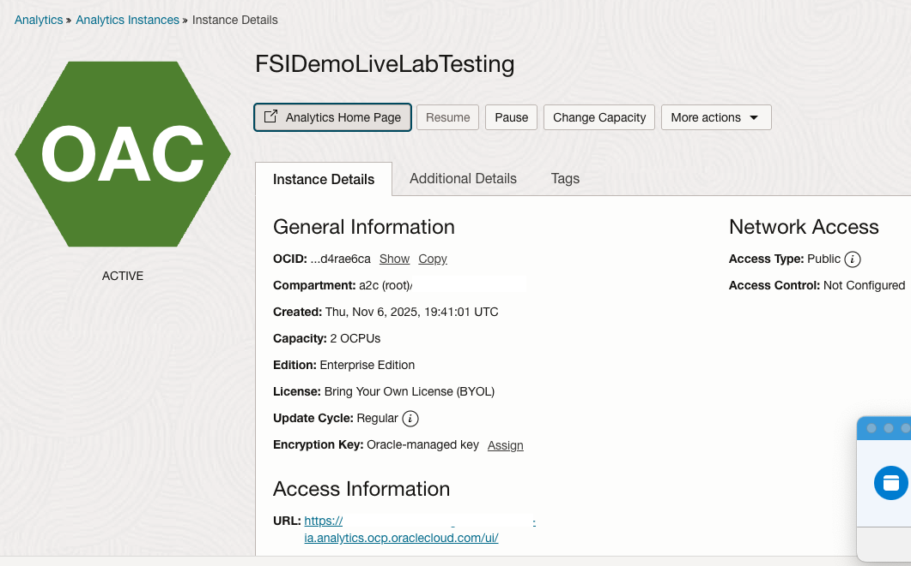
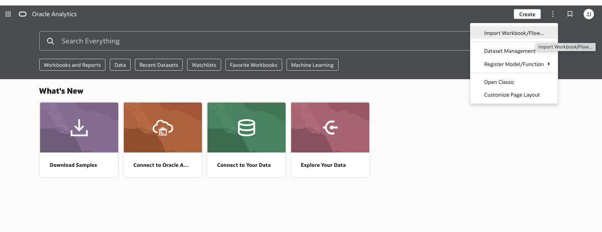
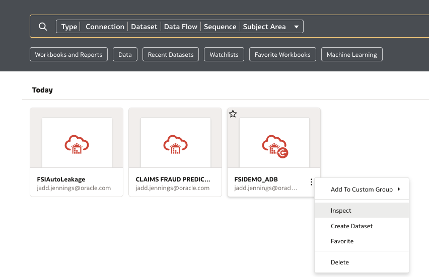
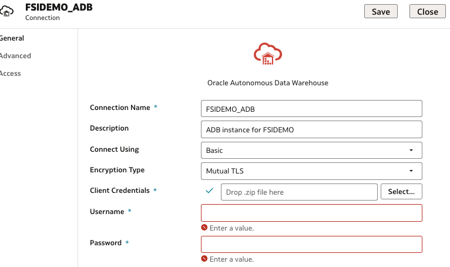
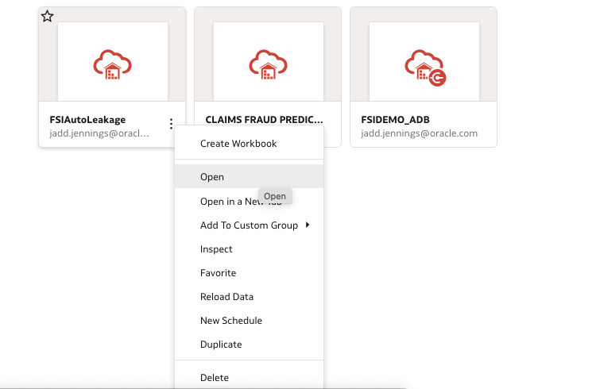
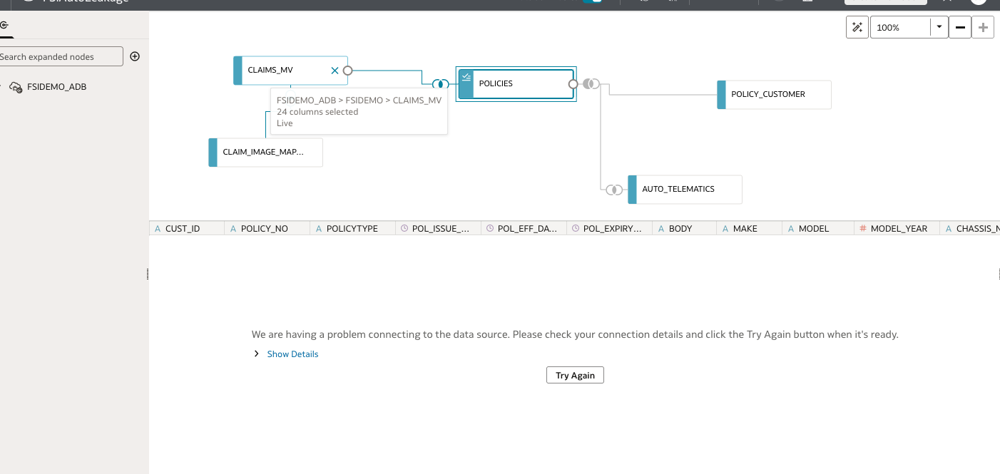
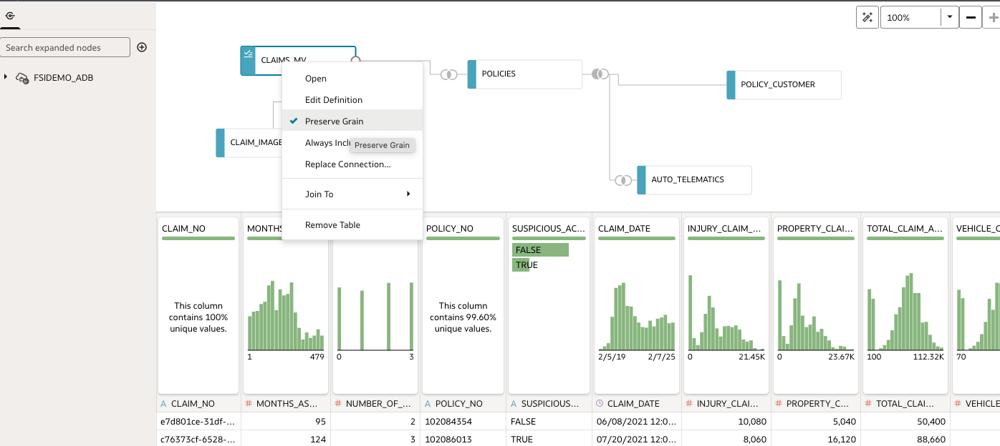

# Implement OAC Instance

## Introduction

This lab will guide you through setting up the Oracle Analytics Cloud instance with prebuilt workbooks and updating the data connections and datasets.

Estimated Time: 10 minutes

### Objectives

In this lab, you will:
* Import OAC workbooks
* Update connections and datasets

### Prerequisites

This lab assumes you have:
* Completed previous labs successfully
 

## Task 1: Import OAC Workbooks

1. Open the OAC Instance Console.

    

2. Select Import Workbook/Flow and open the FSI Auto Claims Justin Report.dva file.

    

3. Make sure Import Permissions (if available) is disabled and click the Import button.

    

4. Repeat steps 2 and 3 with the FSI Auto Claims Gail.dva file

## Task 2: Update Data Connection

1. Find the FSIDEMO_ADB data connection via Data.

    

2. Click the three-dot menu on the connection and select Inspect.

    

3. Click the Select... button on the Client Credentials row.

    

4. Open the wallet file for the Autonomous AI Database created in Lab 1.

5. Enter FSIDEMO as the Username, the password from Lab 2, and click the Save button.
 

## Task 3: Refresh Datasets

1. Open the FSIAutoLeakage dataset.

    

2. Select each table and refresh the data connection by clicking the Try Again button.

    

3. Ensure that Claims MV has Preserve Grain enabled, and save the changes.

    

4. Repeat steps 1 and 2 for the Claims Fraud Predict Apply dataset.
