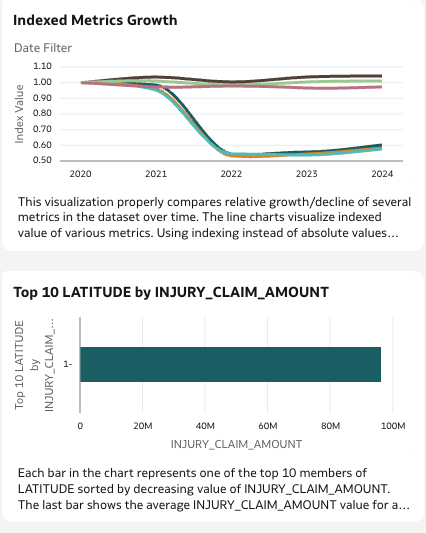

# implement OAC Instance

## Introduction

This lab will walk you thru staging and loading of autoclaims data into the Autonomous Database created in previous steps. You will stage data in an object storage bucket, use the api key to create a cloud store for the object storage bucket, load data from the bucket into the autonomous database and create an auto table using parquet files in object storage bucket.

Estimated Time: 15 minutes

### Objectives

In this lab, you will:

### Prerequisites

 
This lab assumes you have:
* An Oracle Cloud account with privileges to access Generative AI services, provision Autonomous Database and add API keys
 

## Task 1: View FSI Auto Claims Report

## Task 2: View Insights 

1. demo  
    

2. pie
    
     
3. index 
 

4. butterfly 
    

## Task 3: Use Assistant to as questions about Report
