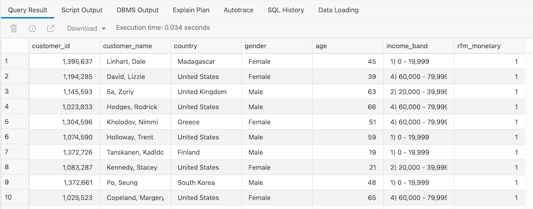
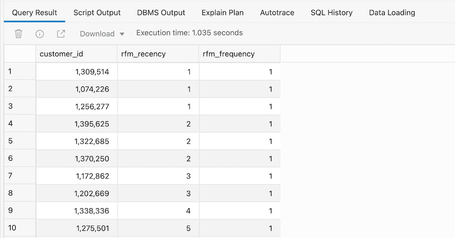
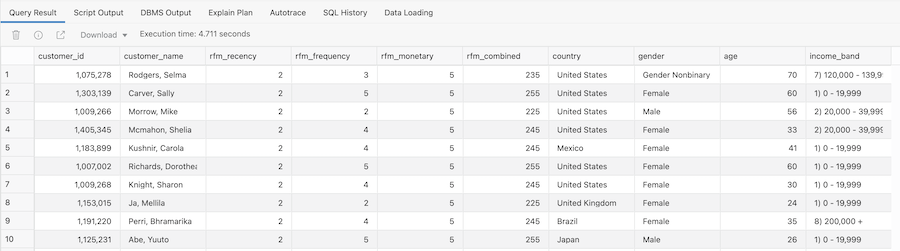

# Finding Our Most Important Customers

## Introduction

In this lab we are going to create a Recency Frequency Monetary (RFM) query to analyze our sales data. This commonly used customer metric will combine some of the SQL analytic functions used in previous queries to create a more complex query using the **`WITH`** clause. 

**NOTE:** For more information about RFM, see **[this page](https://en.wikipedia.org/wiki/RFM_(market_research))** on Wikipedia: 

Estimated time: 10 minutes

### Objectives

- Understand the importance of Recency Frequency Monetary queries

- Learn how to combine queries using **`WITH`** clause

- Learn about binning as an analytical technique

### Overview Of Business Problem

This next example will enrich our existing understanding of customer behavior by utilizing an RFM analysis. RFM is a very commonly used method for analyzing customer value. It is commonly used in general customer marketing, direct marketing, and retail sectors.

In the following steps, the scripts will build a SQL query that will identify:

- Recency: when was the last time the customer accessed the site?

- Frequency: what is the level of activity for that customer on the site?

- Monetary: how much money has the customer spent?

Customers will be categorized into 5 buckets measured (using the NTILE function) in increasing importance. For example, an RFM combined score of 551 indicates that the customer is in the highest tier of customers in terms of recent visits (R=5) and activity on the site (F=5), however the customer is in the lowest tier in terms of spend (M=1). Perhaps this is a customer that performs research on the site, but then decides to buy movies elsewhere! 

## Task 1:  Binning Customers Sales By Value

1. Use the following query to segment customers into 5 distinct bins based on the value of their purchases:

    ```
    <copy>SELECT customer_id,
    customer_name,
    country,
    gender,
    age,
    income_band,
    NTILE (5) over (order by sum(actual_price)) AS rfm_monetary
    FROM movie_sales_fact
    GROUP BY customer_id,
    customer_name,
    country,
    gender,
    age,
    income_band;</copy>
    ```

2. This should take approximately 3-4 seconds to run.

    

    The last column in the report shows the "Bin" value. A value of 1 in this column indicates that a customer is a low spending customer and a value of 5 indicates that a customer is a high spending customer. To see more information about using the `NTILE` function in the SQL documentation, click [here](https://docs.oracle.com/en/database/oracle/oracle-database/19/sqlrf/NTILE.html#GUID-FAD7A986-AEBD-4A03-B0D2-F7F2148BA5E9).


## Task 2:  Binning Customer Sales By Frequency

1. The next step is to determine how frequently customers are watching movies on our platform. To do this, we simply calculate the number of movies watched by each customer and then bin that calculation across 5 buckets.

    ```
    <copy>SELECT customer_id,
    NTILE (5) over (order by max(day)) AS rfm_recency,
    NTILE (5) over (order by count(1)) AS rfm_frequency
    FROM movie_sales_fact
    GROUP BY customer_id;</copy>
    ```

2. This should take around 1-2 seconds to complete.

    

    Now we can identify those customers, based on when they last watched a movie, that watch the fewest number of movies, where the rfm\_frequency is 1, versus those customers that watch the most number of movies, where the rfm\_frequency is 5.

## Task 3:  Creating an RFM Query

1. Now we use the **`WITH`** clause to combine these two queries to create an RFM query:

    ```
    <copy> WITH customer_sales2 AS (
    -- Sales and customer attributes
    SELECT m.customer_id,
    m.customer_name,
    m.country,
    m.gender,
    m.age,
    m.income_band,
    NTILE (5) over (order by sum(actual_price)) AS rfm_monetary
    FROM movie_sales_fact m
    GROUP BY m.customer_id,
    m.customer_name,
    m.country,
    m.gender,
    m.age,
    m.income_band
    ),
    click_data2 AS (
    -- clicks from application log
    SELECT customer_id,
    NTILE (5) over (order by max(day)) AS rfm_recency,
    NTILE (5) over (order by count(1)) AS rfm_frequency
    FROM movie_sales_fact
    GROUP BY customer_id
    )
    SELECT c.customer_id,
    c.customer_name,
    cd.rfm_recency,
    cd.rfm_frequency,
    c.rfm_monetary,
    cd.rfm_recency*100 + cd.rfm_frequency*10 + c.rfm_monetary AS rfm_combined,
    c.country,
    c.gender,
    c.age,
    c.income_band
    FROM customer_sales2 c, click_data2 cd
    WHERE c.customer_id = cd.customer_id
    AND c.rfm_monetary >= 4
    AND cd.rfm_recency <= 2
    ORDER BY c.rfm_monetary desc, cd.rfm_recency desc;</copy>
    ```

2. The result only shows customers who have significant spend (>= 4) but have not visited the site recently (<= 2).

    

## Recap

Let's quickly recap what has been covered in this lab:

- How to use `NTILE` function to "bin" your sales data

- How to use the `WITH` clause to combine SQL queries 

- How to create a Recency Frequency Monetary query

Please *proceed to the next lab*.

## **Acknowledgements**

- **Author** - Keith Laker, ADB Product Management
- **Adapted for Cloud by** - Richard Green, Principal Developer, Database User Assistance
- **Last Updated By/Date** - Kevin Lazarz, November 2021
