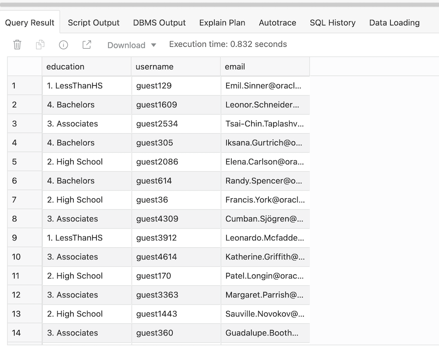
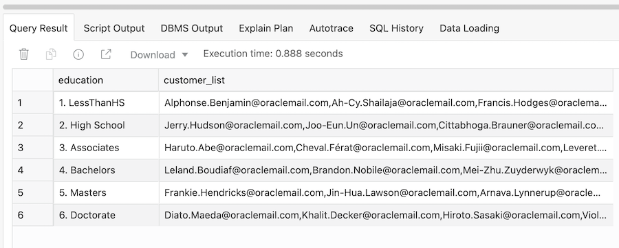
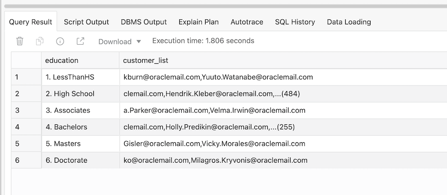

# Managing Text Lists Using SQL

## Introduction

The direct marketing team at MovieStream wants us to generate a report that groups customer email addresses by their level of education. The list needs to be in comma-separated format so they can load the information into their schema.

**This lab is optional**. This lab is aimed at people who are working with application developers and report builders where there is a need to provide long text strings.

Estimated time: 10 minutes

### Objectives

-  Lean how to efficiently manage very, very long text strings

- Learn how to use the LISTAGG function to concatenate string values into a single row

## Task 1: Creating Lists of Customers 

1. Creating this type of list as part of a query is actually very easy to do with Autonomous Data Warehouse because we can use the SQL **`LISTAGG`** function. To get started with this query, we first we need a unique list of customers by education:

    ```
    <copy>
    SELECT
    DISTINCT education,
    username,
    email
    FROM movie_sales_fact;</copy>
    ```
2. This query should return relatively quickly, as shown below.

    

Next, we need to group the email addresses by each attribute value of our Education column. The `LISTAGG` function will do this for us. It will take the email address in each row and concatenate it into a string in a similar way to the PIVOT function we used in the previous section. Now as it builds the string of email addresses, we might end up with too many values for a specific level of education.

3. Try running the following query:

    ```
    <copy>
    SELECT
    education,
    LISTAGG(email, ',') WITHIN GROUP (ORDER BY username) AS customer_list
    FROM
    (SELECT
    DISTINCT education,
    username,
    email
    FROM movie_sales_fact)
    GROUP BY education
    ORDER BY 1;</copy>
    ```

4. Unfortunately, this query will not run! You will see an error message : **result of string concatenation is too long**

This is a situation with almost every other cloud data warehouse. It returns an error message and there is no way around the problem.


## Task 2: Efficiently Managing Very Long Strings 

Fortunately, Autonomous Data Warehouse has a unique capability in that it can trap this error directly within the `LISTAGG` function.

Our `LISTAGG` function looks like this:

<pre>LISTAGG(email, ',' ON OVERFLOW TRUNCATE '...' WITH COUNT) WITHIN GROUP (ORDER BY username) AS customer_list</pre>

1. If we wrap this around our original query, we can use the following syntax to create the report we need:

    ```
    <copy>
    SELECT
    education,
    LISTAGG(email, ',' ON OVERFLOW TRUNCATE '...' WITH COUNT) WITHIN GROUP (ORDER BY username) AS customer_list
    FROM
    (SELECT
    DISTINCT education,
    username,
    email
    FROM movie_sales_fact)
    GROUP BY education
    ORDER BY 1;</copy>
    ```

2. The results should look similar to the following:

    

## Task 3: Finding Rows That Are Too Long 

1. That's it! It looks simple, but only Autonomous Data Warehouse can run this query without generating an error and aborting. To understand why, let's tweak the query to show the rows where our string concatenation gets too long. Run the following modified query:

    ```
    <copy>
    SELECT
    education,
    SUBSTR(LISTAGG(email, ',' ON OVERFLOW TRUNCATE '...' WITH COUNT) WITHIN GROUP (ORDER BY username), -50) AS customer_list
    FROM
    (SELECT
    DISTINCT education,
    username,
    email
    FROM movie_sales_fact)
    GROUP BY education
    ORDER BY 1;</copy>
    ```

2. Notice that there is now a `SUBSTR()` function wrapped around our `LISTAGG` function. This additional function returns the last 50 characters of each row, which allows us to see that we have a lot of customers who achieved **High School** or **Bachelor** levels of education. For **High School** customers, our list could contain a possible 484 additional email addresses; and where the education level is **Bachelor**, then our list could contain an additional 255 email addresses. 

    

We can send this initial report to the marketing team and see if they want us to extract the additional email addresses for them. Fortunately, Autonomous Data Warehouse has the tools to do this and we will explore one of those tools (MATCH_RECOGNIZE) later in this workshop.

### Recap

Let's quickly recap what has been covered in this lab:


- How to use the LISTAGG function to concatenate string values into a single row

- How to manage very, very long text strings so that applications/reports do not break


Please *proceed to the next lab*.

## **Acknowledgements**

- **Author** - Keith Laker, ADB Product Management
- **Adapted for Cloud by** - Richard Green, Principal Developer, Database User Assistance
- **Last Updated By/Date** - Keith Laker, July 2021
