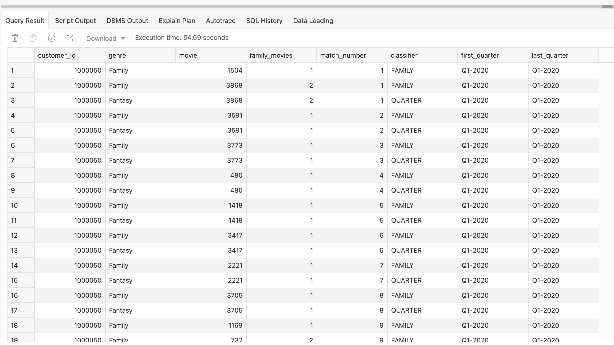

# Targeting Customers Based On Viewing Patterns

## Introduction

Patterns are everywhere in business but what is a pattern? They are usually defined as a repetitive series or sequence of specific events or actions and they occur everywhere in business. The ability to find, analyze and quantify individual or groups of patterns within a data set is now a key business requirement. It can help you gain a better understanding of your customers’ behavior and associated operational activities, seek out new opportunities to drive additional revenue streams and even help identify malicious activities that could lead to your business incurring significant costs.

Autonomous Data Warehouse comes complete with native pattern matching capabilities. This brings the simplicity and efficiency of the most common data analysis language (SQL) to the process of identifying patterns within a data set. It offers significant gains in term of performance, maintainability and scalability compared to the legacy ways of solving pattern matching-like problems. 

Estimated time: 15 minutes

### Objectives

- Understand that many data sets have patterns

- Learn how to write simple `MATCH_RECOGNIZE` queries

- Learn how to use built-in pattern matching measures

- Learn how to define frequency criteria for patterns

- Learn how to define search criteria for patterns


### Overview Of Business Problem

The marketing team at MovieStream are planning their next campaign which is to promote a new package of carefully selected comedy-family-sci-fi movies to specific customers.

The campaign will be driven by an email blast containing a limited-time discount code. The team has a specific customer profile they want to target, which is customers that watch a lot of family movies each quarter and the occasional sci-fi movie within the same quarter. They have asked you to find the list of customers who meet this very precise profile. How will you find those customers? 

The business requirement breaks down as follows:

1. Search for customers who have watched at least one family genre movie within a quarter during 2020. 

2. Filter the customers by those who have watched at least some additional family-related genre movies within a quarter during 2020.

3. Create a report for the marketing team that shows how many of each type of movie each customer watched within each quarter during 2020.

This all sounds very complicated, but using SQL pattern matching, it is very easy to find these customers!


## Task 1:  Identifying The Customers Who Watch Family Movies

We can find the customers who watched at least 1 family genre movie during a quarter by using the SQL pattern matching function **`MATCH_RECOGNIZE`**. To map this pattern within our query, we use the following to outline what we are looking for:

```
PATTERN (family+)
```
The plus sign (+) after family means that at least one row must be found. The pattern defines a regular expression, which is a highly expressive way to search for patterns.

And then the pattern ID defined as follows:

```
DEFINE family as genre = 'Family',
AND first(family.quarter_num_of_year) = last(family.quarter_num_of_year)
```

1. The first step is to create a view over the `movie_sales_fact` table to filter the results to only show customer data for 2020. Copy and paste the following code:

    ```
    <copy>CREATE VIEW movie_sales_fact_2020 AS
    SELECT * FROM movie_sales_fact
    WHERE year = 2020;</copy>
    ```

2. The format of our SQL query needs to include some additional keywords as shown below, which counts the number of customers that have watched at least two family movies within a quarter. We can now copy and paste the following code into our SQL Worksheet and run the code:

    ```
    <copy>SELECT count(*)
    FROM movie_sales_fact_2020
    MATCH_RECOGNIZE
    (PARTITION BY customer_id ORDER BY day, genre
    ONE ROW PER MATCH
    PATTERN (family+ quarter)
    DEFINE
    family AS genre = 'Family',
    quarter AS first(family.quarter_num_of_year) = last(family.quarter_num_of_year)
    );</copy>
    ```

3. The result should be similar to that shown below:

    

    This shows that we have over 1,013,572 customers that match this pattern. Before we refine our pattern, let's try and get a little bit more information about these customers by extending our query.

## Task 2:  Returning More Information About The Pattern

The pattern matching process can return information about the pattern it has discovered. Defining the information needed is done within the keyword  **`MEASURES`**.  In this case, we want to know the movie_id, the number of family movies that were watched by each customer and just to confirm our pattern matching process is working as expected, we return the quarter name of the first matched row and the quarter name for the pattern (*and those two columns should have identical values since that is the requirement from our business definition*):

```
MEASURES
FIRST(family.quarter_name) AS first_quarter,
LAST(family.quarter_name) AS last_quarter,
count(family.movie_id) AS family_movies,
family.movie_id AS movie,
```

1. Copy and paste the following code into your worksheet:

    ```
    <copy>SELECT
    customer_id,
    genre,
    movie,
    family_movies,
    match_number,
    classifier,
    first_quarter,
    last_quarter
    FROM movie_sales_fact_2020
    MATCH_RECOGNIZE
    (PARTITION BY customer_id ORDER BY day, genre
    MEASURES
    match_number() as match_number,
    classifier() as classifier,
    first(family.quarter_name) AS first_quarter,
    last(family.quarter_name) AS last_quarter,
    family.movie_id AS movie,
    count(family.movie_id) AS family_movies
    ALL ROWS PER MATCH
    PATTERN (family+ quarter)
    DEFINE
    family AS genre = 'Family',
    quarter AS first(family.quarter_num_of_year) = last(family.quarter_num_of_year)
    ) mr
    order by mr.customer_id, match_number;</copy>
    ```

2. This time we get a lot more information returned by our query. This expanded query shows a row for each occurrence of a customer watching a family movie and it shows the movie. As you scroll through the list of customers, you can see that in some cases each customer watches more than one family movie per month (see the column headed `FAMILY_MOVIES`):

    

## Task 3: Searching For Family And Family-Related Movies

Now that we understand how our pattern matching query is working, we can extend the pattern search criteria to include additional family-related genres by simply expanding the definition of our pattern as follows:

```
PATTERN (comedy+ crime drama family+  quarter)
DEFINE
comedy as genre = 'Comedy',
crime as genre = 'Crime',
drama as genre = 'Drama',
family as genre = 'Family',
quarter as scifi.quarter_num_of_year = comedy.quarter_num_of_year
```

**Note:** We are defining "family-related" genres as comedy, crime and drama as you can see in the above definition. The above means we are now looking for rows with at least one comedy movie, one crime movie, one drama movie and at least one family movie within a given quarter. Essentially we are looking for a specific pattern of movie streaming.

1. If we insert the above into our first pattern matching query, we can then paste the following code into our SQL Worksheet:

    ```
    <copy>SELECT COUNT(*)
    FROM movie_sales_fact_2020
    MATCH_RECOGNIZE
    (PARTITION BY customer_id ORDER BY day, genre
    MEASURES
    match_number() as match_number,
    classifier() as classifier,
    first(comedy.quarter_name) AS first_quarter,
    last(family.quarter_name) AS last_quarter,
    count(movie_id) AS count_movies
    ALL ROWS PER MATCH
    PATTERN (comedy+ crime drama family+ quarter)
    DEFINE
    comedy as genre = 'Comedy',
    crime as genre = 'Crime',
    drama as genre = 'Drama',
    family as genre = 'Family',
    quarter AS first(family.quarter_num_of_year) = last(family.quarter_num_of_year)
    ) mr
    order by mr.customer_id, match_number;</copy>
    ```

2. This returns around 180,631 customers:

    

    Before we do any more work on this query, we should check-in with our marketing team to see if this number is within the range they were expecting.

## Task 4: Changing Requirements

A quick Zoom call with the marketing team reveals that they are really pleased to have the list of customers so quickly! However, they think the list contains too many customers. Ideally, they want to target a much smaller list of customers with the first round of this campaign! So we need to identify only those customers that have more than a *specific* interest in watching family-related movies, but also like to watch sci-fi movies and very occasionally might watch a horror movie! 

How can you adapt the previous query to pick out those customers that really enjoy family and sci-fi movies?  All we need to do is tweak our pattern statement! This means our pattern definition will now look like this:

```
PATTERN (comedy+ crime drama family+ horror scifi+ quarter)
DEFINE
comedy as genre = 'Comedy',
crime as genre = 'Crime',
drama as genre = 'Drama',
family as genre = 'Family',
horror as genre = 'Horror',
scifi as genre = 'Sci-Fi',
quarter as LAST(scifi.quarter_num_of_year) = FIRST(comedy.quarter_num_of_year)
```


1. We can run the following query to see how many customers match this new pattern:

    ```
    <copy>SELECT count(*)
    FROM movie_sales_fact_2020
    MATCH_RECOGNIZE
    (PARTITION BY customer_id ORDER BY day, genre
    ONE ROW PER MATCH
    PATTERN (comedy+ crime drama family+ horror scifi+ quarter)
    DEFINE
    comedy AS genre = 'Comedy',
    crime AS genre = 'Crime',
    drama AS genre = 'Drama',
    family AS genre = 'Family',
    horror AS genre = 'Horror',
    scifi AS genre = 'Sci-Fi',
    quarter AS last(scifi.quarter_num_of_year) = FIRST(comedy.quarter_num_of_year)
    );</copy>
    ```

2. The answer is 278. This should be more in line with what the marketing team is expecting so they can run some test campaigns.

    

3. To help them validate this smaller list of customers, we will add some additional information into our results by showing whether a movie was matched by our pattern as a family or sci-fi movie (this is shown in the **`classifier`** column.)

    ```
    <copy>SELECT
    customer_id,
    comedy_movies,
    crime_movies,
    drama_movies,
    family_movies,
    horror_movies,
    sf_movies,
    first_quarter,
    last_quarter
    FROM movie_sales_fact_2020
    MATCH_RECOGNIZE
    (PARTITION BY customer_id ORDER BY day, genre
    MEASURES
    first(family.quarter_name) AS first_quarter,
    last(scifi.quarter_name) AS last_quarter,
    count(comedy.movie_id) AS comedy_movies,
    count(crime.movie_id) AS crime_movies,
    count(drama.movie_id) AS drama_movies,
    count(family.movie_id) AS family_movies,
    count(horror.movie_id) AS horror_movies,
    count(scifi.movie_id) AS sf_movies
    ONE ROW PER MATCH
    PATTERN (comedy+ crime drama family+ horror scifi+ quarter)
    DEFINE
    comedy as genre = 'Comedy',
    crime as genre = 'Crime',
    drama as genre = 'Drama',
    family as genre = 'Family',
    horror as genre = 'Horror',
    scifi as genre = 'Sci-Fi',
    quarter as scifi.quarter_num_of_year = comedy.quarter_num_of_year
    ) mr
    order by mr.customer_id, first_quarter, family_movies, sf_movies;</copy>
    ```

4. Now we have a much smaller list of customers for our marketing team to review, which should allow them to test out their new campaign.

    

## Task 5: Job Done

1. The marketing team is happy with this smaller list of customers, which means the last step is to share the results with our marketing team. We can simply send them a file by using the  **Download**  feature on the  **Query Result**  panel.

    

## Recap

Let's quickly recap what has been covered in this lab:

- Using `MATCH_RECOGNIZE` to find patterns in your data

- Defining search rules for a pattern

- Quickly changing a pattern to meet new business requirements

- Calculating useful information from data inside your pattern

- Sharing results with other data warehouse users

Please *proceed to the next lab*.

## **Acknowledgements**

- **Author** - Keith Laker, ADB Product Management
- **Adapted for Cloud by** - Richard Green, Principal Developer, Database User Assistance
- **Last Updated By/Date** - Kevin Lazarz, November 2021
