# Working with Semi-Structured Movie Data

## Introduction

Up to this point in our workshop, all the data we have been using has been **structured**. Structured data comes with a pre-determined definition. In our movie sales data, each record in our sales data files has a reference ID, a timestamp, a customer ID, associated customer demographic information, movie purchases, payment information, and so on. Each field in our data set has a clearly defined purpose, which makes it very quick and easy to query. In most real-world situations, you will have to deal with other types of data such as **semi-structured**.

Estimated time: 15 minutes

### Objectives

- Learn how our Autonomous Data Warehouse makes it very easy to query unstructured data sets such as JSON data

- Understand how Oracle's JSON helper functions can convert JSON data into a normal table of rows and columns making it easier to join with our movie sales data

- Learn How SQL's analytic functions can be used in queries that also contain JSON data


## What Is Semi-Structured Data?

Semi-structured data does not have predefined fields that have a clearly defined purpose. Typically most semi-structured data looks similar to a text-based document but most types of semi-structured data lack a precise structural definition and come in all shapes and sizes. This can make it very challenging to work with this type of data.

There are many different types of semi-structured and unstructured data, so most cloud vendors offer separate database services to manage each type of data: document store databases, graph store databases, spatial store databases, XML databases, NoSQL databases, and so on. These separate database engines create data silos by locking data inside each type of database, making it almost impossible to do joined-up analysis across all your data. (If you want to learn more about the differences between structured, semi-structured and unstructured data then read the following blog post on [blogs.oracle.com](http://blogs.oracle.com) by Michael Chen: [Structured vs. Unstructured Data](https://blogs.oracle.com/bigdata/structured-vs-unstructured-data)).

Oracle takes a very different approach to managing these different types of data.

### A Converged Database Model For Managing All Your Data

The Autonomous Data Warehouse is based on  a converged database model that has native support for all modern data types and the latest development paradigms built into one product.  It supports spatial data for location awareness, JSON and XML for document store type content streams for IoT device integration, in-memory technologies for real-time analytics, and of course, traditional relational data. By providing support for all of these data types, the converged Autonomous Data Warehouse can run all sorts of workloads from analysis of event streams to discovery of relationships across domains to blockchain processing to time series analysis and machine learning. 

In this section of the workshop, you are going to work with some semi-structured data which is in a common format called **JSON**.

### What is JSON?

This format is probably the most commonly used way to manage data sets that are typically semi-structured in terms of the way they are organized. This format is an open standard file format which is typically used to simplify the way information can be moved around the web. It resembles human-readable text where data points consist of attribute–value pairs and/or arrays. It is a very common data format and it has a wide range of applications.

JSON is a language-independent data format. It was derived from JavaScript, but many modern programming languages include code to generate and parse JSON-format data. For more information see here: [https://en.wikipedia.org/wiki/JSON](https://en.wikipedia.org/wiki/JSON).

Oracle's SQL language contains specific keywords that help you process JSON data. In this lab, you will learn how to process and query JSON data formats.

### Overview Of Business Problem

The marketing team would like to create themed bundles of movies based on the scriptwriters. Our movie data set contains a series of columns that contain more detailed information. Each movie has a **crew** associated with it and that crew is comprised of jobs, such as "producer", "director", "writer", along with the names of the individuals. An example of how this information is organized is shown below:


This is in a format known as JSON and you can see that it is organized very differently from some of the other data that you have loaded into your new data warehouse. There is a single entry for "producer" but the corresponding key "names" actually has multiple values. This is referred to as an **array** - specifically a JSON array. Fortunately, the Autonomous Data Warehouse allows you to query this type of data (JSON arrays) using normal SQL as you will see below.

Let's build a query for the marketing team that ranks each writer based on the amount of revenue for each film where they were involved, and look for writers who have suddenly had big hits in 2020 compared to other years. This would allow us to create promotion campaigns to bring attention to their earlier movies.


## Task 1:  - Loading JSON Movie Data

In the previous labs of this workshop, we have loaded the data we want to use into our data warehouse. Autonomous Data Warehouse also allows you to leave your data in the Object Store and query it directly without having to load it first. This uses a feature called an External Table. There is a whole chapter on this topic in the documentation, [see here](https://docs.oracle.com/en/cloud/paas/autonomous-database/adbsa/query-external.html#GUID-ABF95242-3E04-42FF-9361-52707D14E833), which explains all the different types of file formats (including JSON) that are supported. 

Although queries on external data will not be as fast as queries on database tables, you can use this approach to quickly start running queries on your external source files and external data. In the public Object Storage buckets, there is a file called **movies.json** which contains information about each movie, as outlined above.

1. The JSON file for this lab is a series of regional buckets. Use one of the following **URI strings** in the next step based on the closest location to the region where you have created your ADW.

    *For example, if your ADW is located in our UK-London data center then you would select the first regional URI string for "Europe, Middle East, Africa" which is for a public bucket located in the London data center: 'https://objectstorage.uk-london-1.oraclecloud.com/n/dwcsprod/b/moviestream_data_load_workshop_20210709/o/'*:

<div style="margin-left: 80px;">
<br>
<table class="wrapped relative-table confluenceTable" style="width: 100.0%;">
	<colgroup>
		<col style="width: 12.019421%;"/>
        <col style="width: 12.019421%;"/>
		<col style="width: 45.07344%;"/>
	</colgroup>
	<tbody>
		<tr>
			<th colspan="1" class="confluenceTh">Geographical Region</th>
            <th colspan="1" class="confluenceTh">Location</th>
			<th colspan="1" class="confluenceTh">Regional URI String</th>
		</tr>
		<tr>
			<td colspan="1" class="confluenceTd">Europe, Middle East, Africa</td>
            <td colspan="1" class="confluenceTd">London</td>
			<td class="confluenceTd">
                https://objectstorage.uk-london-1.oraclecloud.com/n/dwcsprod/b/moviestream_data_load_workshop_20210709/o<br>
            </td>
		</tr>
		<tr>
			<td colspan="1" class="confluenceTd"></td>
            <td colspan="1" class="confluenceTd">Frankfurt</td>
			<td class="confluenceTd">
                https://objectstorage.eu-frankfurt-1.oraclecloud.com/n/dwcsprod/b/moviestream_data_load_workshop_20210709/o
            </td>
		</tr>
		<tr>
			<td colspan="1" class="confluenceTd">Americas</td>
            <td colspan="1" class="confluenceTd">Phoenix</td>
			<td colspan="1" class="confluenceTd">
                https://objectstorage.us-phoenix-1.oraclecloud.com/n/dwcsprod/b/moviestream_data_load_workshop_20210709/o<br>
            </td>
		</tr>
		<tr>
			<td colspan="1" class="confluenceTd"></td>
            <td colspan="1" class="confluenceTd">Ashburn</td>
			<td colspan="1" class="confluenceTd">
                https://objectstorage.us-ashburn-1.oraclecloud.com/n/dwcsprod/b/moviestream_data_load_workshop_20210709/o
            </td>
		</tr>
		<tr>
			<td colspan="1" class="confluenceTd">Japan</td>
            <td colspan="1" class="confluenceTd">Tokyo</td>
			<td colspan="1" class="confluenceTd">https://objectstorage.ap-tokyo-1.oraclecloud.com/n/dwcsprod/b/moviestream_data_load_workshop_20210709/o</td>
		</tr>
		<tr>
			<td colspan="1" class="confluenceTd">Asia &amp; Oceania</td>
            <td colspan="1" class="confluenceTd">Mumbai</td>
			<td colspan="1" class="confluenceTd">https://objectstorage.ap-mumbai-1.oraclecloud.com/n/dwcsprod/b/moviestream_data_load_workshop_20210709/o</td>
		</tr>
	</tbody>
</table>
<br>
</div>

**Note** : In the step below, we will use a SQL feature that allows us to define some variables that we can incorporate into the data load statement. This makes the data loading statement very flexible and we will use this technique again when we explain how to update the sales data.

2. You will need to paste your regional URI string from the table above between the single quotes in the assignment that is part of the first define statement.

    ```
    <copy>define uri_ms_oss_bucket = 'paste_in_your_regional_uri_string_between_the_single_quotes';
    </copy>
    ```

3. The code to create an external table is very similar to the data loading code we used earlier. This time we will use a procedure called: **DBMS\_CLOUD.CREATE\_EXTERNAL\_TABLE**. Run the following block of code in your SQL Worksheet:

    ```
    <copy>
    BEGIN
    DBMS_CLOUD.CREATE_EXTERNAL_TABLE (
    table_name => 'json_movie_data_ext',
    file_uri_list => '&uri_ms_oss_bucket/movies2.json',
    column_list => 'doc varchar2(32000)',
    field_list => 'doc char(30000)',
    format => json_object('delimiter' value '\n')
    );
    END;
    /</copy>
    ```

4. You should see a message "PL/SQL procedure successfully completed" in the script output window, something similar to the following:

    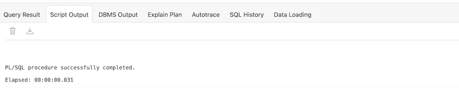

    **Note:** The procedure completed very quickly (milliseconds), because we did not move any data from the Object Store into the data warehouse. The data is still sitting in the Object Store.

5. This external table behaves just like an ordinary table so we can run a query to see how many rows are in the file. Run this query in your SQL Worksheet:

    ```
    <copy>SELECT COUNT(*)
    FROM json_movie_data_ext;</copy>
    ```

6. which should return a result something like this:

    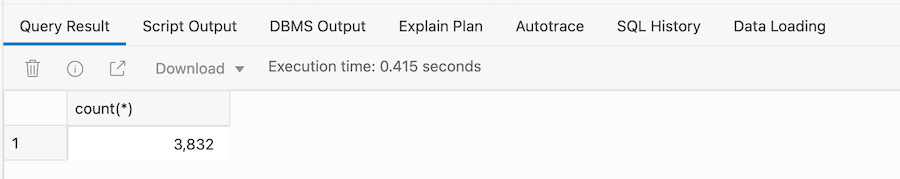

7. If we now refresh the Navigator panel again, we should see the new table in the tree (**note** your navigation tree may look slightly different to the one shown below in terms of the number of tables shown). Click the arrow to the left of the name, **JSON\_MOVIE\_DATA\_EXT**, to show the list of columns in our table:

    

8. You can see that our table contains only one column! Let's run a simple query to show the rows in the table:

    ```
    <copy>select * from json_movie_data_ext;</copy>
    ```

    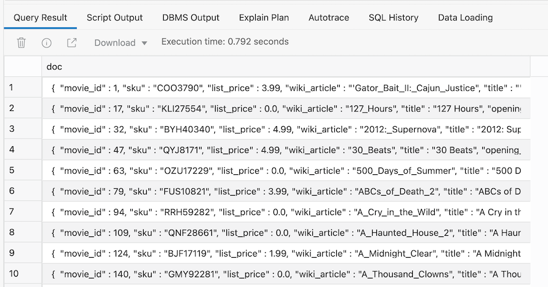

    As you can see, the data is shown in its native JSON format, i.e. there are no columns in the table for each identifier (movie_id, sku, list price, and so on). So how can we query this table if there is only one column? 

## Task 2: A Simple Query Over JSON Data

1. As a first step, let's show you how to query  JSON data using SQL. We can use special notation within our SQL query to convert the content above into a more normal looking table containing columns and rows. This approach is known as Simple Dot Notation and it looks very similar to the way we have constructed previous queries. Here is our first query which you can run in your SQL Worksheet:

    ```
    <copy>SELECT
    m.doc.movie_id,
    m.doc.title,
    m.doc.budget,
    m.doc.runtime
    FROM json_movie_data_ext m;</copy>
    ```

2. It should return a result set that looks similar to this:

    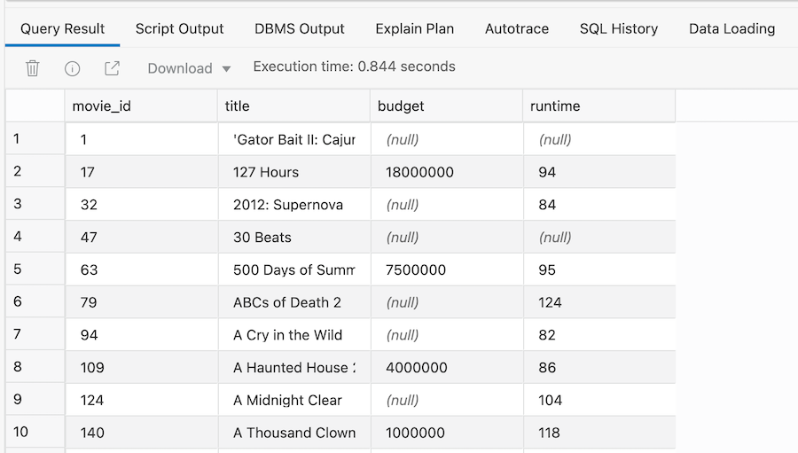

    **Note:** Each column has three components:

    - the name of the source table - **json\_movie\_data\_ext** which is referenced using the letter **m**

    - the column containing our json data - **doc**

    - the name of the json attribute - **movie_id**, **title**, **budget** and **runtime** 

3. Some of the attributes in our JSON data set contain multiple entries. For example, cast and crew contain lists of names. To include these attributes in our query, we simply tell the SQL engine to loop over and collect all the values. Here is an example of how to extract the list of cast members and the names of the crew that worked on each movie:

    ```
    <copy>SELECT
    m.doc.movie_id,
    m.doc.title,
    m.doc.budget,
    m.doc.runtime,
    m.doc.cast,
    m.doc.crew[*].names
    FROM json_movie_data_ext m;</copy>
    ```

4. It will return the following output:

    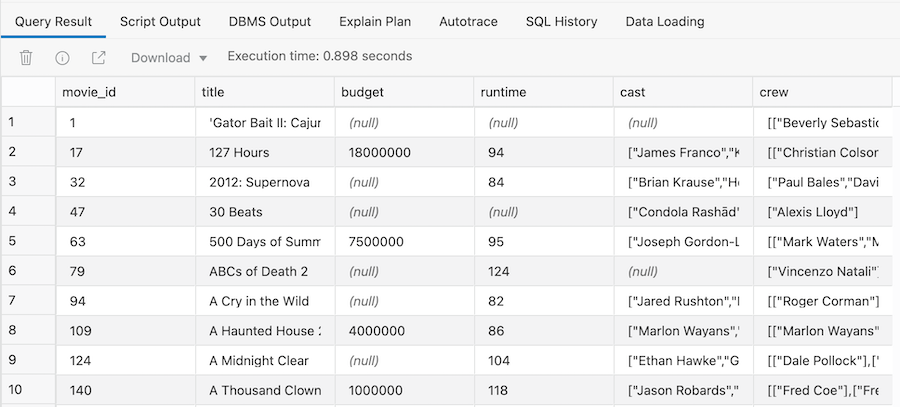

Now let's try using some more advanced features that will allow us to convert the list of cast members and crew members into rows and columns of data. These can then be joined with our movie sales data, allowing us to combine unstructured movie JSON data with our structured movie sales data.

## Task 3:  Simplifying JSON Queries

Your Autonomous Data Warehouse includes a number of helper packages that can simplify access to your JSON data. The **JSON_TABLE** function can be used to automatically translate JSON data into a row-column format so you can query the JSON data in exactly the same way as our movie sales data.

1. Let's use the JSON_TABLE function to create a view over our existing JSON table. Run the following command in your SQL Worksheet:

    ```
    <copy>CREATE OR REPLACE VIEW JSON_MOVIE_VIEW (sku, year, gross, title, views, budget, pageid, runtime, summary, movie_id, list_price, wiki_article, cast_names, job, crew, genre, studio) AS
    SELECT JT."sku", JT."year", JT."gross", JT."title", JT."views", JT."budget", JT.pageid, JT."runtime", JT."summary", JT."movie_id", JT."list_price", JT."wiki_article", JT."cast_names", JT."job", JT."crew", JT."genre", JT."studio"
    FROM JSON_MOVIE_DATA_EXT RT,
    JSON_TABLE("DOC", '$[*]' COLUMNS
    "sku" varchar2(8) path '$.sku',
    NESTED PATH '$.cast[*]' COLUMNS (
    "cast_names" varchar2(128) path '$[*]'),
    NESTED PATH '$.crew[*]' COLUMNS (
    "job" varchar2(16) path '$.job',
    NESTED PATH '$.names[*]' COLUMNS (
    "crew" varchar2(128) path '$[*]')),
    "year" varchar2(4) path '$.year',
    NESTED PATH '$.genre[*]' COLUMNS (
    "genre" varchar2(16) path '$[*]'),
    "gross" varchar2(16) path '$.gross',
    "title" varchar2(128) path '$.title',
    "views" number path '$.views',
    "budget" varchar2(16) path '$.budget',
    pageid number path '$.pageid',
    NESTED PATH '$.studio[*]' COLUMNS (
    "studio" varchar2(128) path '$[*]'),
    "runtime" varchar2(4) path '$.runtime',
    "summary" varchar2(4096) path '$.summary',
    "movie_id" number path '$.movie_id',
    "list_price" number path '$.list_price',
    "wiki_article" varchar2(128) path '$.wiki_article') JT;</copy>
    ```

2. Now run the following command in the worksheet:

    ```
    <copy>SELECT COUNT(*)
    FROM json_movie_view;</copy>
    ```

3. This should return the following:

    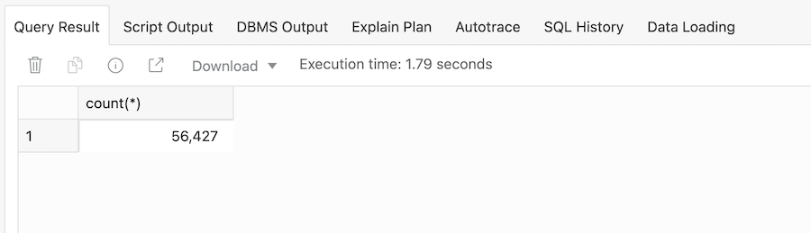

 **NOTE**: The number of records has increased compared with our source table (JSON\_MOVIE\_DATA\_EXT): 3,491 to 56,9427. The reason is that we have something called an "array" of data within the JSON document that contains the cast members and crew members associated with each movie. Essentially, this means that each movie has to be translated into multiple rows.

4. Run the following query, which will return the columns of data that contain the arrays, i.e. multiple values, in the original JSON document:

    ```
    <copy>SELECT
    title,
    genre,
    cast_names,
    job,
    crew,
    studio
    FROM json_movie_view
    WHERE title = 'Star Wars: Episode IV – A New Hope';</copy>
    ```

5. This should return 12 rows as follows, where you can see individual rows for each member of the cast, crew members and genre:

    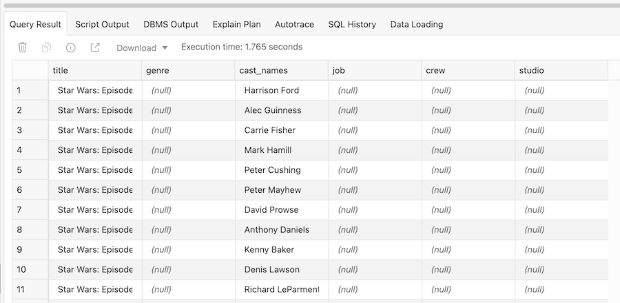

We can now use this view as the launch point for doing more analysis!

## Task 4:  Building A More Sophisticated JSON Query

In this query, we are using the **JSON_TABLE** function again, to convert our JSON data into a more natural row-column resultset.

1. If we just want to see the directors for each movie, then we simply add a filter to our query:

    ```
    <copy>SELECT
    movie_id,
    title,
    job,
    crew
    FROM json_movie_view
    WHERE job = 'director'
    ORDER BY 1,4;</copy>
    ```

2. This should return the following results:

    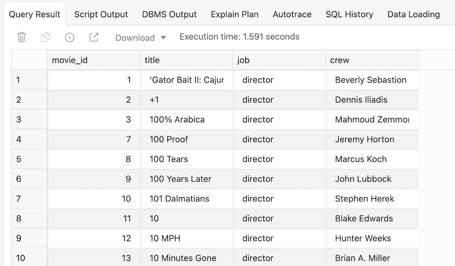

## Task 5: Combining JSON Data And Relational Data

1. Assuming we want to know how much revenue each movie made in each of the years when it was available, we can use a much simpler query, somthing like this:

    ```
    SELECT
    movie_id,
    year,
    sum(ACTUAL_PRICE) as revenue
    FROM movie_sales_fact
    GROUP BY movie_id, year;
    ```

2. If we combine this result set with the previous query against our JSON data, we can see the total revenue by year for each movie director and find the top 5 movie directors within each year. To do this, we can create a query that joins the JSON data set with our movie sales fact table via the `movie_id` column. Run this query in your SQL Worksheet:

    ```
    <copy>SELECT
    jt.movie_id,
    jt.title,
    jt.job,
    jt.crew,
    TO_CHAR(f.year) as year,
    sum(f.actual_price) as revenue
    FROM movie_sales_fact f, json_movie_view jt
    WHERE jt.job = 'director'
    AND f.year = 2020
    AND jt.movie_id = f.movie_id
    GROUP BY jt.movie_id, jt.title, jt.job, jt.crew, f.year
    ORDER BY 6 desc;</copy>
    ```

3. the output will be shown in the Query Result window:

    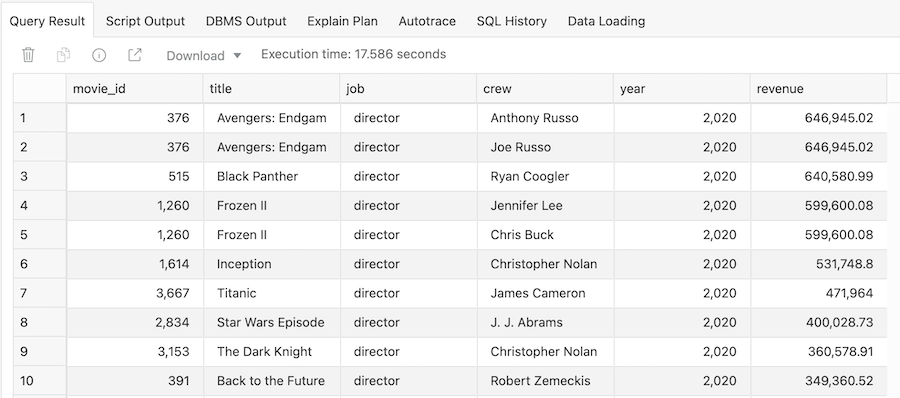

## Task 6: Ranking Directors Based On Quarterly Movie Revenue

1. We can extend the query by adding a ranking calculation, broken out by quarter within each year, to determine how much each director's films contributed to MovieStream's overall revenue. Note that we are reusing techniques from the previous lab, specifically SQL's window functions. The last column ranks each director based on the annual revenue of his or her movies.

    ```
    <copy>SELECT
    TO_CHAR(f.year) as year,
    f.quarter_name,
    jt.movie_id,
    jt.title,
    jt.job,
    jt.crew,
    sum(f.actual_price) as revenue,
    RANK() OVER (PARTITION BY f.quarter_name order by sum(f.actual_price) desc) as rank_rev
    FROM movie_sales_fact f, json_movie_view jt
    WHERE jt.job = 'director'
    AND f.year= 2020
    AND jt.movie_id = f.movie_id
    GROUP BY f.year, f.quarter_name, jt.movie_id, jt.title, jt.job, jt.crew
    ORDER BY 1,2,7 desc;</copy>
    ```

2. The results should show that our top grossing directors in Q1 were Jennifer Lee and Chris Buck with the film Frozen II:

    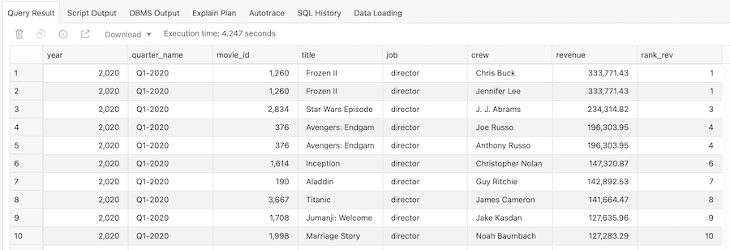

## Task 7: Finding The Top 5 Directors Based On Revenue

1. The final part of this query is to add a filter so it only returns the top 5 directors in each quarter:

    ```
    <copy>WITH movie_rev as (
    SELECT
    TO_CHAR(f.year) as year,
    f.quarter_name,
    jt.movie_id,
    jt.title,
    jt.job,
    jt.crew,
    sum(f.actual_price) as revenue,
    RANK() OVER (PARTITION BY f.quarter_name order by sum(f.actual_price) desc) as rank_rev
    FROM movie_sales_fact f, json_movie_view jt
    WHERE jt.job = 'director'
    AND f.year= 2020
    AND jt.movie_id = f.movie_id
    GROUP BY f.year, f.quarter_name, jt.movie_id, jt.title, jt.job, jt.crew
    ORDER BY 1,2,7 desc
    )
    SELECT *
    FROM movie_rev
    WHERE rank_rev <=5;</copy>
    ```

2. This should return the following results:

    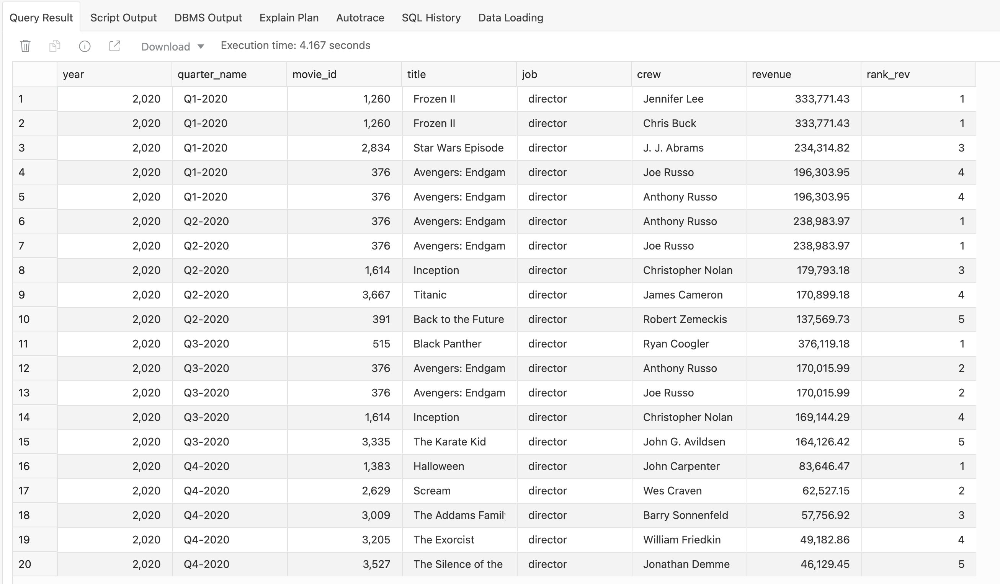

## Recap

In this lab, we have covered the following topics:

- How our Autonomous Data Warehouse makes it very easy to query unstructured data sets such as JSON data

- Using JSON helper functions to convert the JSON data into a normal table of rows and columns so that it can be easily joined with our movie sales data

- How SQL's analytic functions can be used in queries that also contain JSON data

Please *proceed to the next lab*.

## **Acknowledgements**

- **Author** - Keith Laker, ADB Product Management
- **Adapted for Cloud by** - Richard Green, Principal Developer, Database User Assistance
- **Last Updated By/Date** - Kevin Lazarz, November 2021
