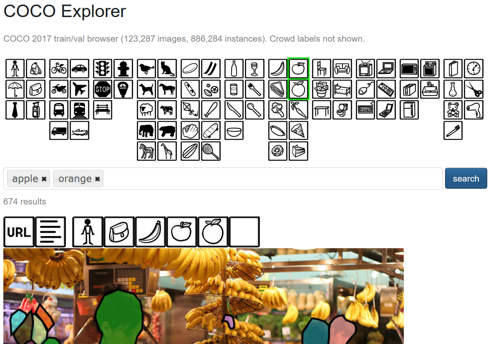
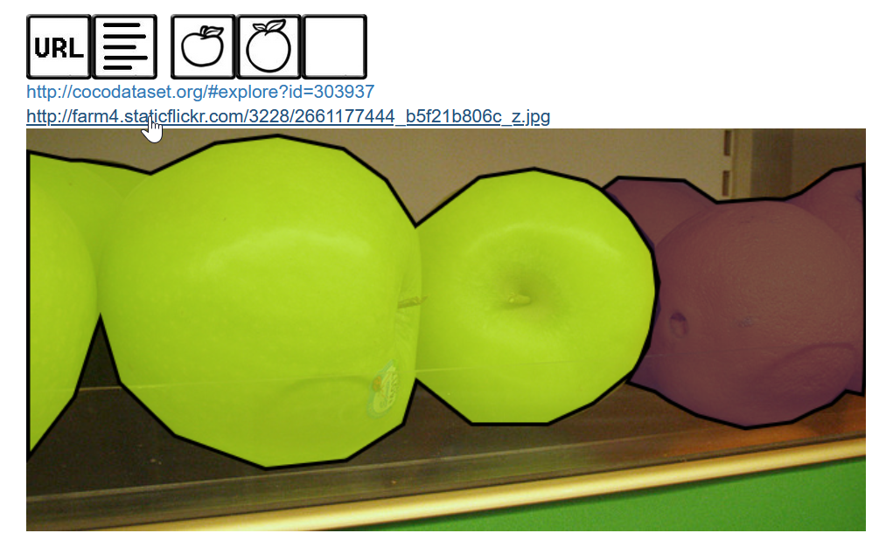
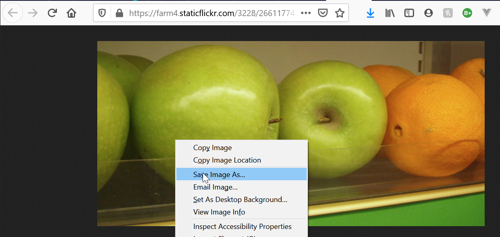
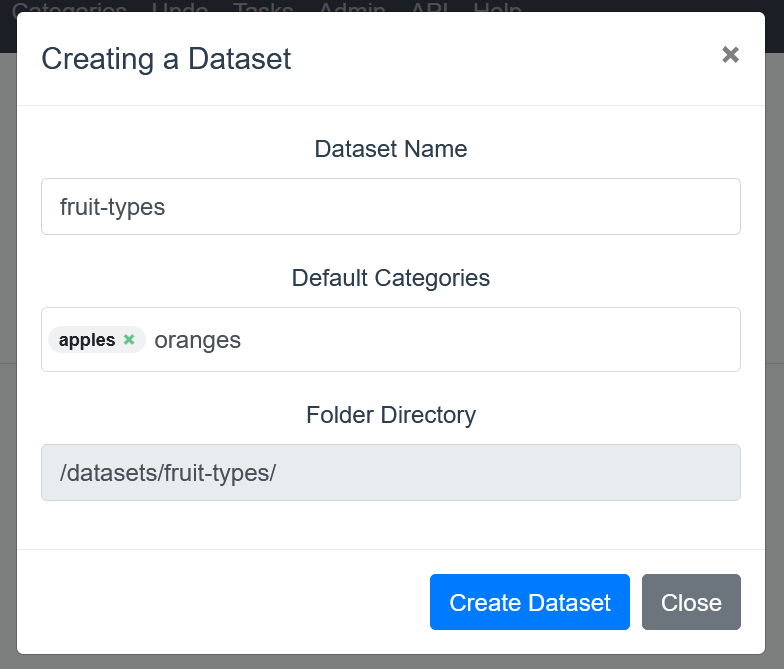

# Annotating images with COCO Annotator

## Introduction
Image annotation is a powerful process that enables object segmentation for artificial intelligence models in image or video data. The core of many computer vision techniques hinge on annotated images for training. COCO is a large dataset with already annotated images that can be downloaded and used as sample when developing new solutions for artificial intelligence use cases. In this lab we will explore how to create your own dataset around a hypothetical use case: segmenting and identifying `apples` and `oranges` in images. Since COCO already has a number of images we can use, we will pull our dataset from there in order to save time. One you are familiar with the workflow, the potential for extensibility is near infinite!

Estimated Lab Time:  2 hours

### Objectives
In this lab, you will learn about:
* Downloading data from COCO Explorer
* Transferring data
* Detectron2

### Prerequisites

This lab assumes you have:
- Completed the previous lab, Setting Up the Environment

## Task 1: Downloading Sample COCO Data

1. For this example, we will build a simple dataset of apples and oranges. Go to the [COCO dataset explorer](https://cocodataset.org/#explore) and select the filters for `apple` and `orange` and then click `search`. This will return a list of images that fit those categories. The results are not exclusive, so there will be other objects in the images as well. 

	

	To download an image, click on the `URL` icon above the image. This will drop down 1 or more links. Find **20 images** that clearly show both `apples` and `oranges`, click on their respective URLs, and then save the images in a folder. These images will be used for training. Additionally, download **3 images** for validation.

	***NOTE:*** Production models will require a larger dataset. 20 images is suggested to keep the lab in scope and to explain the process. The resulting model will not be strong enough for production. We will use a pre-trained model from detectron2's library during the testing stage.

	
	

2. Next, with the COCO annotator running, navigate to it on your browser (`http://localhost:5000` from *Setting Up the Environment* lab). Create a dataset by clicking on **Datasets** in the top navigation menu, and then the green **Create** button. In the resulting pop up window, enter a name for the dataset (ex: fruit-types) and define the categories in the dataset. Categories are the types of objects that will be identified via annotation for this dataset. In our case, we will only have `apple` and `orange`, but these values can represent any object. Click **Create Dataset** to finish. The folder that is created by this wizard will be located under the *coco-annotations* folder where the library was downloaded in the setup process.

	

## Task 2: Transferring Data to the Instance

1. The next step is to copy the images downloaded from COCO Explorer and put them into the newly created dataset folder. This can be accomplished by any means you wish, but this guide will demonstrate with secure copy (SCP).

	Open a terminal on your local machine. Execute the following command based on the path to where your image data is stored.

		scp -r /path/to/local-images/. <terminal-login>@<ip-address>:<path-to-annotator-dataset>

	***NOTE:*** The '.' after the forward-slash is important as it will copy the contents of the directory without the folder. Since the destination will have it's own folder name defined by COCO annotator and we want to preserve that structure. Make sure there are no other files in the image directory or they will be copied as well.

	If your orgin directory is `/home/user-name/coco-images/`, and *terminal-login* is `opc` and your *ip-address* is `123.456.78.90` and your destination directory is `/home/opc/coco-annotator/datasets/fruit-types/` the command would be

		scp -r /home/user-name/coco-images/. opc@123.456.78.90:/home/opc/coco-annotator/datasets/fruit-types/

2. Copy the validation dataset into a folder labelled `fruit-types-val`

## Task 3: Annotating Images

1. Return to the COCO annotator and refresh the page. Click on **Datasets** then **fruit-types**. With the **Images** tab selected, your images should be populated in the interface. Click on the first image. On the right you should see the two categories defined earlier `apple` and `orange`. Click the **+** icon next to the category for the outline you'd like to outline with a mask.

	On the left the toolbar contains various types of annotation tools. These tools will allow you to create polygons around your subject. If you have used an image editing software before, these tools operate in similar fashion.

	

	The hand icon is for navigation. If you need to zoom and pan, select this tool to not disturb your annotations.

	

	**BBox (Bounding Box)** tool draws rectangular boxes

	

	**Polygon** creates points in succession. To close the polygon when you are complete, either click next to the starting point, or move the mouse over to the right of the window and click **Close Polygon**. This will connect the last-placed point with the first-placed point, creating the final polygon.

	
	**Magic Wand** tool will create a polygon for you around similar colors. This is useful for clearly defined objects with mostly-uniform color.

	
	**Brush** tool allows you to 'paint' the mask onto the screen and automatically generates individual points for you. Note that this method will generate a lot of points.

	
	**Eraser** tool will erase points from a polygon

	It is best-practice to minimize the number of points used to define an object with a mask. Each annotation point has a small impact on performance, but can add up with large datasets. However, that must be balanced against the amount of time it takes to annotate an image. Use more automated tools like the Magic Wand and the Brush tools at your discretion.

2. Use this interface to define all of the target objects (apples and oranges) in the image. If you are confused about the best way to draw a mask for an object, browse the COCO Explorer for examples.

## Task 4: Exporting Image Annotations

1. You can quickly navigate to the next image in the list by clicking the arrow at the top right next to the image name. When all of the images are complete, return to the fruit-types folder view and click **Export COCO** on the left. Click **Export** on the dialog window that pops up. Leave the *Add a category* field blank to export all categories defined in the annotations. This will create a file to download under the **Exports** tab. Click the green **Download** button in order to get the annotations. 

	The annotation file contains information about the images, categories, and the points that define the annotation. One issue with COCO Annotator is that the interface doesn't allow you to set the base path for the files. This means that the annotation file looks for the dataset in `/datasets/fruit-types` by default. Our configuration has the dataset located in `~/coco-annotation/datasets/fruit-types`. In order to resolve this you can either open the file in a text editor and use it's find and replace feature to replace all instances of `/datasets` with `./datasets`, or if you are in linux you can perform the correction with the `sed` command.

		sed -i.bak 's/\/datasets/\.\/datasets/' fruit-types-1.json

	Using the `-i.bak` argument will do two things, apply the change to the file and create a backup file of the original should something go wrong. Open the JSON file and search for `./datasets` and verify the updated path for the first image entry. The script will now open the annotation file and look for the datasets folder in the same folder where the script resides.

2. Transfer the annotation file to the instance and move the annotation file into the same folder as the rest of the image data. If you are following our naming pattern, the first export should be `fruit-types-1.json` (and `fruit-types-val-1.json` for the validation dataset). The scripts in the next lab will look for this file, so remember to check that the filenames and path match.

	These annotations will be used by the training script to create a mask for the algorithm to read when learning objects. The annotations are saved as JSON files in the COCO annotation format. At a high level, the images are defined first with their locations, then the categories, and then all of the points that make up the masks corresponding to the defined categories. 

	This file will be compatible with any framework that reads COCO annotations. Detectron2 accepts this type of annotation. In the next step we will load the images and annotations and train a model with a script written in Python.

## Task 5: Create a validation dataset

1. Repeat steps 3-5 for a validation dataset consisting of the 3 test images that are not part of the training dataset.

## Acknowledgements
* **Author** - Justin Blau, Senior Solutions Architect, Big Compute
* **Last Updated By/Date** - Justin Blau, Big Compute, October 2020

