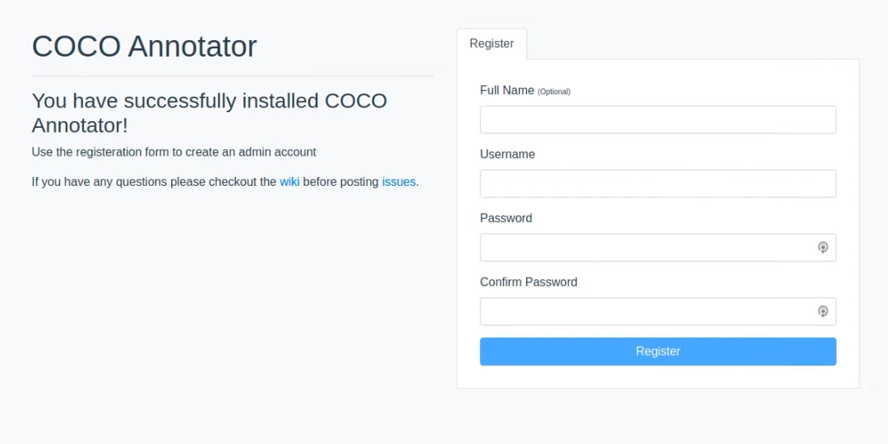
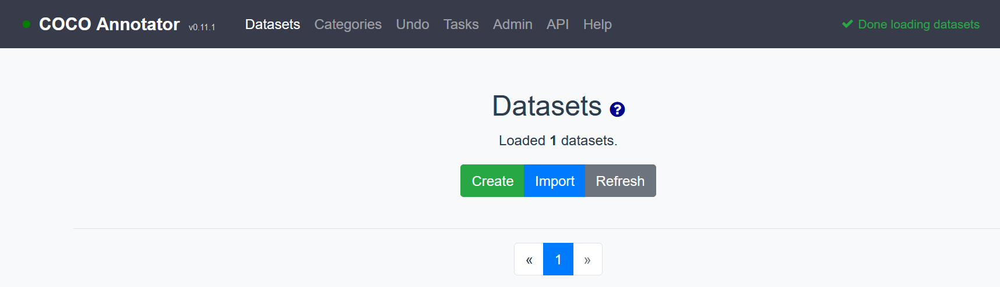

# Setting up the Environment

## Introduction
This workshop requires two essential components, COCO Annotator, an open-source tool for image annotation, and Detectron2, a framework that can fine-tune pre-trained models for novel annotated datasets.

Estimated Lab Time:  15 minutes

### Objectives
In this lab, you will learn about:
* COCO Annotator
* Detectron2

### Prerequisites

This lab assumes you have:
- An Oracle Free Tier or Paid Cloud account
- Access to either a CPU or GPU instance as covered in labs 1 and 2

## Task 1: COCO Annotator

1. [COCO Annotator](https://github.com/jsbroks/coco-annotator) is an open-source tool that manages datasets and allows users to create masks around objects within an image. It is built using web-based frameworks and must be run using docker. Install Docker based on the operating system for your system. The default for OCI is Oracle Linux, which is compatible with the [CentOS distribution of docker.](https://docs.docker.com/engine/install/centos/). After that setup process is complete, install [Docker Compose](https://docs.docker.com/compose/install/) by following the link and clicking on the **Linux** tab. Finally, follow the [Getting Started](https://github.com/jsbroks/coco-annotator/wiki/Getting-Started) installation instructions for COCO annotator. Running the `docker-compose up` command will start the application, which will run on `http://localhost:5000` on the system. To get access on your desktop environment, create an ssh tunnel by opening a new terminal window and entering the command 

		ssh -L 5000:localhost:5000 <terminal-login>@<ip-address>  

	If your *terminal-login* is `opc` and your *ip-address* is `123.456.78.90` the command would be

		ssh -L 5000:localhost:5000 opc@123.456.78.90

	This will open a tunnel between your local machine and the system running in the cloud. Test that it works by opening a browser and navigating to `http://localhost:5000`. First you will see a page asking you to create an account:

	

2. The information you type in here will remain local to your system and is not sent to a server elsewhere. COCO Annotator is intended as a platform that can be used with varying levels of access to data, where multiple people can navigate to and perform work developing datasets on a central server. For our purposes, any values here will work, such as `admin` for all fields.

	After that, you should see an application that looks like this:

	

	If that doesn't work, check that the application is running on the compute instance with `curl`. Go to the terminal that has an active session with the compute instance and type `curl http://localhost:5000`. If the application is running correctly, raw HTML should be returned.

## Task 2: Detectron2 

1. Installation for [Detectron2](https://github.com/facebookresearch/detectron2) is straightforward and can be completed by following [their instructions](https://detectron2.readthedocs.io/tutorials/install.html)

2. Also [Install cv2](https://pypi.org/project/opencv-python/), a python package for image manipulation.

## Acknowledgements
* **Author** - Justin Blau, Senior Solutions Architect, Big Compute
* **Last Updated By/Date** - Justin Blau, Big Compute, October 2020

