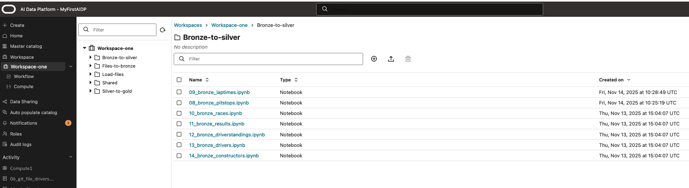
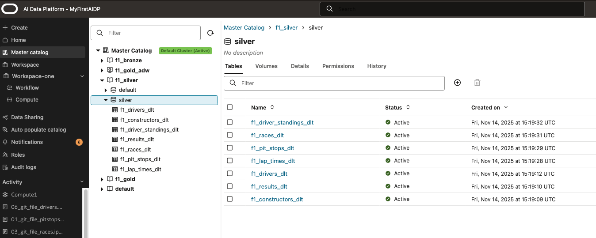

# Load and curate data from Bronze into Silver schema of AI Data Platform

## Introduction

In this lab we will promote the data that was loaded in the bronze catalog schema into the SIlver schema. If needed we can curate and run quality checks when processing the data.

Estimated Lab Time: 30 minutes

### Objectives

In this lab, you will:

* Use the notebook functionality of AI Data Platform to process data
* Use data that is loaded in Bronze schema and process into Silver layer

### Prerequisites

This lab assumes you have:

* An Oracle Cloud account
* All previous labs successfully completed

## Task 1: Process data with notebooks into Silver schema in AI Data Platform

1. Step 1: Run notebooks to process data

  Open the workspace you created and open the 'Bronze-to-silver' folder. In the main pane you open the file starting with name '08\_bronze\_pitstops.ipynb'.
  > "Note: Before  running this notebook, please check the parameter cell if the right catalog names and schema names are defined. Otherwise your notebook may error out.
  You also can run the notebook for the second time and change the target format to 'parquet'.

  When you have completed the first notebook in the 'Bronze-to-silver' folder, you can open and run the other notebooks from that folder to populate the tables.

  

  After the notebook runs have completed, the master catalog will look like this:

  

**proceed to the next lab**

## Acknowledgements

* **Author** - Wilbert Poeliejoe, AI Data Platform Black Belt
* **Contributors** -  Massimo Dalla Rovere, AI Data Platform Black Belt
