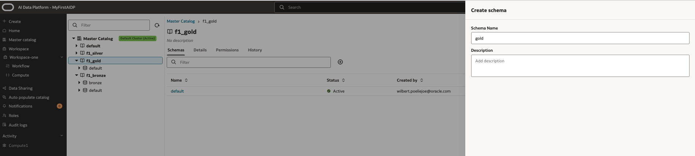
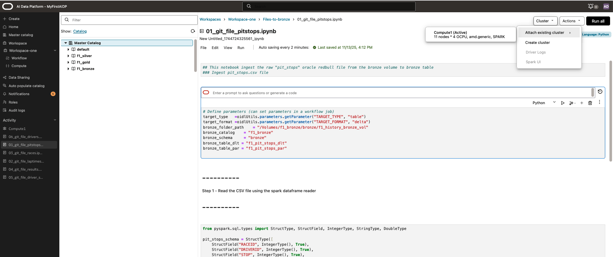
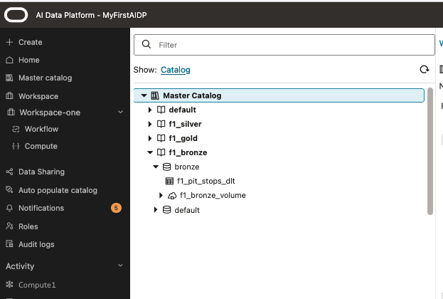

# Load the Formula 1 test data in your AI Data platform in Bronze layer

## Introduction

This lab is to prepare your environment, data and load it into your object storage bucket that you have prepared as prerequisite for this workshop. From Object storage the files get added to the volume in Bronze as external files.
Once that is done the files will be loaded in the Bronze catalog schema in Delta format. For this part we provide a setup sample notebooks that we load into the workspace and we run the first set to load the files into delta lake tables.

Estimated Time: 60 minutes

### Objectives

*List objectives for this lab using the format below*

In this lab, you will:
* Define a folder structure to load and structure various content elements like datasets, notebooks, files to use them in following labs
* Load the datasets needed for next labs into your object storage bucket
* Load notebook files in preparation of executing and building workflows

### Prerequisites (Optional)

*List the prerequisites for this lab using the format below. Fill in whatever knowledge, accounts, etc. is needed to complete the lab. Do NOT list each previous lab as a prerequisite.*

This lab assumes you have:
* All previous labs successfully completed
* The object storage bucket already created in the same compartment as the AI Data Platform and you have access to that bucket.

*Below, is the "fold"--where items are collapsed by default.*

## Task 1: Open your bucket in Oracle OCI and load datasets.

From the GitHub folder ai-data-platform-getting-started/data-load/files you can download the source files and upload them into your OCI Object storage bucket.
In the upload screen you can drag an drop the files in the bucket. No need to adjust any settings

1. Step 1

	After you have downloaded the files from Github, navigate to your OCI Object storage bucket, select the **Objects** tab and use the **Upload Objects** button to upload your files.

  

2. Step 2

	Go to your AI Data Platform and open your master catalog. There you need to define 3 catalogs for each layer of the medallion architecture. In the example screenprint they are called: f1_bronze, f1_silver, f1_gold

  

3. Step 3

	Open each catalog that you have created in step 2 and create schema inside each catalog. In the example screenprint they are called: bronze, silver, gold

  

4. Step 4

	In the **f1_bronze** catalog in the **bronze** schema you need to create a volume to store the data files as external catalog items. Select the **bronze** schema in the master catalog pane, and in the main pane you select **volume**. Once selected you click the **+** symbol to create a volume. In the example the volume name f1_bronze_volume is used. In the entry screen, create name, select **external** and select the comporatment, bucket, (and folder) where you stored you data files at steps 1. Make. sure you push the **upload** button.

  

## Task 3: Create a tables in Bronze from files that have been uploaded

As final step of loading data is the creation of tables in the bronze catalog of AI Data Platform based on data files we have uploaded as external data volume files.

1. Step 1

	Open the workspace you created and create following folder structure (You can create your own structure but that will require changes to the notebook content).
  - Load-files
  - Files-to-bronze
  - Bronze-to-silver
  - Silver-to-gold

  

2. Step 2

	Upload notebook files that you downloaded from Github into their respective workspace folder. The notebook filenames start with a number followed by a name.
  In the **Files-to-bronze** folder upload files starting with 01_... to 07_...
  In the **Bronze-to-silver** folder upload files starting with 08_... to 14_...
  In the **Silver-to-gold** folder upload files starting with 15_... to 18_...

  

3. Step 3

	Open the workspace you created and open the **Files-to-bronze** folder. In the main pane you open the file starting with name **01_git_file_pitstops.ipynb**. In the Notebook pane which looks like the picture you see the content of the notebook. The Notebook is structured in cells which contain code. For this example we mainly use **Python**.

  In between the code cells you also find descriptions. Cell can be run 1 by 1 as highlighted with the small arrow at the cell. The entire notebook also can be run with one click in top right corner. Before you are able to run a notebook you first need to attach the compute cluster as highlighted in the picture by clicking on **cluster** get the drop down and click **attach existing cluster** 
  If you get a message that **No CLusters area available** you need to start the cluster that you created previously by selecting **compute** in the left pane and start the compute cluster at the **...** at the right side of the line of your compute cluster. (This start will take a little while. The cluster being stopped related to the idle time set at creation of the cluster. This setting can be adjusted if needed). You can go back to your notebook and attach the cluster. A green message appears when the cluster is attached. AI Data Platform will remember the cluster that was attached previously, but it has to be active.

  Once the cluster is attached you can run the notebook by clicking **Run all**, Or cell by cell if you prefer to track any errors.

  The structure of the notebooks is, that in the first cell some parameters are defined related folder structure and file names. 

  When you have completed the first notebook in the **Files-to-bronze** folder, you can open and run the other notebooks from that folder to populate the tables.

  

4. Step 4

	This step is to verify the creation of the tables in the f1_bronze schema in the catalog.
  After the notebook runs have completed successfully you can expland the f1_bronze catalog item and expand the bronze schema to view the created tables. If they are not appearing you may need to refresh the catalog by using the refresh button at the top of the catalog pane.

  

## Acknowledgements
* **Author** - Wilbert Poeliejoe
* **Contributors** -  <Name, Group> -- optional
* **Last Updated By/Date** - <Name, Month Year>