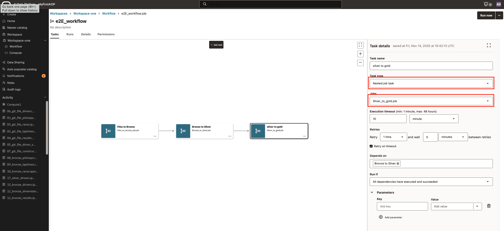

# Orchestration workflow of workflows

## Introduction

Finally the step to build a pipeline of workflows as workflow of workflows

Estimated Lab Time: 10 minutes

### Objectives

In this lab, you will:

* Build a pipeline of workflows

### Prerequisites (Optional)

This lab assumes you have:

* An Oracle Cloud account
* All previous labs successfully completed

## Task 1: Create Workflow of Workflows

1. Step 1 creation of and end to end workflow

    The creation of a workflow of workflows is straight forward and similar to the creation of a workflow, with one difference.
    The task type needs to be 'Nested Job task'
    The jobs that you can select will be different.
    It is possible to mix this with other task types

    

## Learn More

* [AI Data Platform documentation](https://docs.oracle.com/en/cloud/paas/ai-data-platform/index.html)

**proceed to the next lab**

## Acknowledgements

* **Author** - Wilbert Poeliejoe, AI Data Platform Black Belt
* **Contributors** -  Massimo Dalla Rovere, AI Data Platform Black Belt
* **Reviewed by** - Lucian Dinescu, Senior Principal Product Manager, Analytics
* **Last Updated By/Date** - Wilbert Poeliejoe, AI Data Platform Black Belt: December 11th, 2025