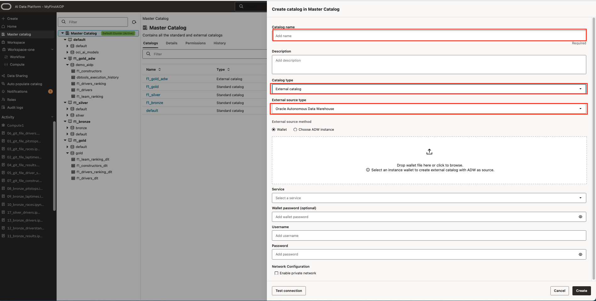
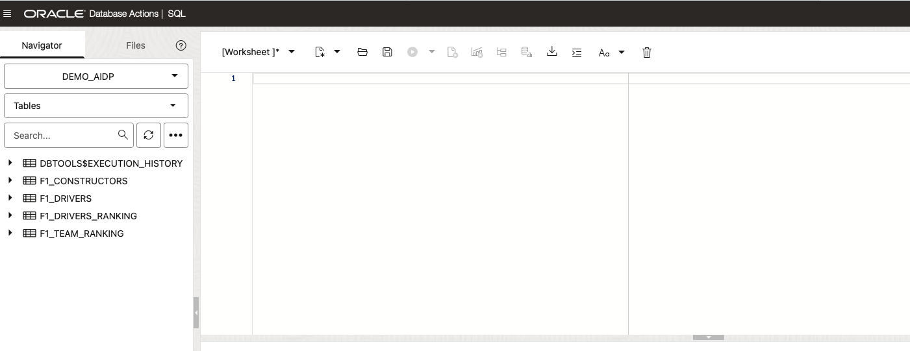
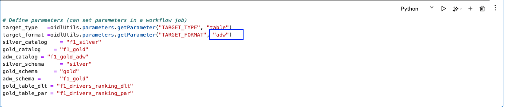
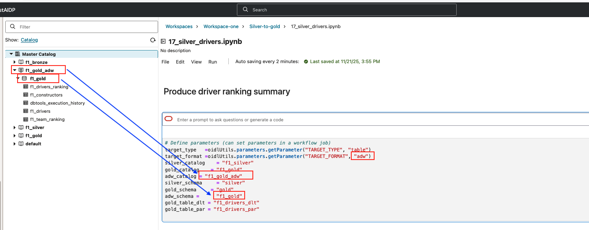
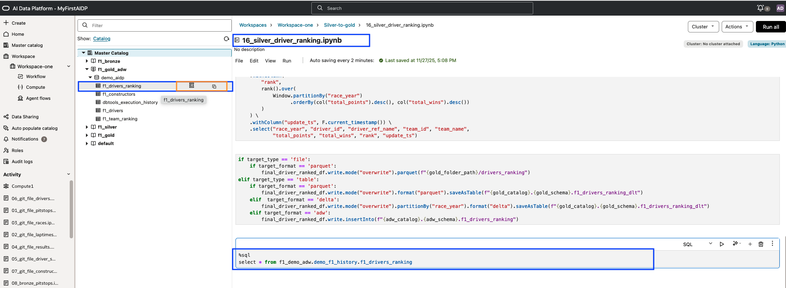
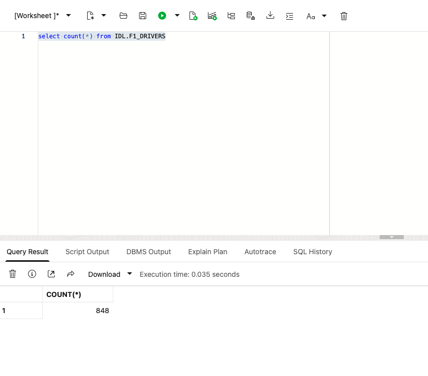

# Process data from Silver into Gold schema into an Autonomous AI Lakehouse

## Introduction

In this lab we will promote the data that was curated and processed in the 'Silver' catalog schema into the Gold schema to make it easily consumable for business users but we are not going to use the Delta format like in previous lab, but we are going to use an Autonomous AI Lakehouse as target.

Estimated Lab Time: 45 minutes

### Objectives

In this lab, you will:
* Use the notebook functionality of AI Data Platform to process data
* Use data that is loaded in Silver schema and process into Autonomous AI Lakehouse Gold layer

### Prerequisites

This lab assumes you have:
* An Oracle Cloud account
* The Autonomous AI Lakehouse provisioned already
  * Access to the Database tools to create tables
* All previous labs successfully completed

## Task 1: Create Gold Schema

1. Step 1: Create a f1\_gold Schema (User) in Autonomous Data Lakehouse. Replace "strong\_password" with your own password.

  The tables can be created using SQL Developer or Cloud SQL as part of the Autonomous Database toolkit.

  ```sql
  <copy>
  CREATE USER gold IDENTIFIED BY "strong_password";
  </copy>
  ```

2. Step 2: Grant Required Roles/Privileges to f1\_gold Schema

  ```sql
  <copy>
  -- Data privileges
  GRANT CONNECT, RESOURCE TO f_gold;

  -- Allow creation of tables, views, and other objects
  GRANT CREATE SESSION TO f1_gold;
  GRANT CREATE TABLE TO f1_gold;
  GRANT CREATE VIEW TO f1_gold;
  GRANT CREATE SEQUENCE TO f1_gold;
  GRANT CREATE PROCEDURE TO f1_gold;
  GRANT UNLIMITED TABLESPACE TO f1_gold;

  -- Enable DBMS_CLOUD 
  GRANT EXECUTE ON DBMS_CLOUD TO f1_gold;
  ```

3. Log out of admin schema once gold schema is created.

## Task 2: Create external Catalog to Autonomous AI Lakehouse

1. Step 1: Start External catalog creation

  Select the Master Catalog and use the '+' to create a new catalog entry. Provide all the details in the form. For 'catalog type' select 'External Catalog'. The form will change and at 'External Source Type' select 'Oracle Autonomous Data Warehouse'.
  Fill in all the details and use the wallet, test the connection and create the catalog entry.

  

## Task 3: Prepare and run Silver to Gold notebooks to load data in Autonomous AI Lakehouse.

1. Step 1: Create table structures in Autonomous AI Lakehouse


**show result picture  Create tables in Autonomous AI Lakehouse in the schema that is same as the connection user in task 1, using SQL , making use of prebuilt table definitions from file [f1\_DDL\_ADW\_Tables.txt](https://c4u04.objectstorage.us-ashburn-1.oci.customer-oci.com/p/EcTjWk2IuZPZeNnD_fYMcgUhdNDIDA6rt9gaFj_WZMiL7VvxPBNMY60837hu5hga/n/c4u04/b/livelabsfiles/o/labfiles%2Ff1_DDL_ADW_tables.txt) which is available in Github.
  The tables can be created using SQL Developer or Cloud SQL as part of the Autonomous Database toolkit. Make sure that you use the user/schema created in Task 1.

  

  You may need to refresh the catalog in AI Data Platform to make tables visible .

  Step 2: validate and adjust parameters

  The Notebook parameters cell require some adjustments for the notebooks that are part of the Silver-to-gold workspace folder

  The original content is e.g.:
  ```json
    target_type   =oidlUtils.parameters.getParameter("TARGET_TYPE", "table")
    target_format =oidlUtils.parameters.getParameter("TARGET_FORMAT", "delta")
    silver_catalog    = "f1_silver"
    gold_catalog    = "f1_gold"
    adw_catalog = "f1_gold_adw"
    silver_schema     = "silver"
    gold_schema     = "gold"
    adw_schema =      "f1_gold"
    gold_table_dlt = "f1_drivers_ranking_dlt"
    gold_table_par = "f1_drivers_ranking_par"
  ```
  To use the autonomous AI Lakehouse line 2 'delta' needs to be replaced with 'adw'

  The adw\_catalog (line 5) name needs to be replaced by the name of the external catalog created at task 1. It is visible in the master catalog.
  The adw\_schema  (line 8) needs to be replaced by the name of the schema you created the table definitions.

  

  The names in the parameter cell need to match the names as they are visible in the catalog

  

  Although autosave is enabled, make sure that changes are saved.

1. Step 3: Run notebooks in specified order

  Now you can run the notebooks again in following order:

  * 17\_silver\_drivers.ipynb
  * 18\_silver\_constructors.ipynb
  * 15\_silver\_team\_ranking.ipynb
  * 16\_silver\_driver\_ranking.ipynb

  When running notebook 16\_silver\_driver\_ranking.ipynb you will notice that the bottom cell will error out. The select statement is pointing to the wrong table.
  We will use the AI Data Platform functionality to adjust.
  In the screen print you see that if you expand the external catalog f1\_gold\_adw and hoover with your mouse over the right name name of the table you get 2 options to copy the table location. Make sure you highlighted the right cell and use the copy functionality to paste the right location in the cell.

  ```sql
  <copy>
  %sql
  select * from f1_gold_adw.demo_aidp.f1_drivers_ranking
  ```

  

  For validation you can also query the database tables to check if data has been inserted. In the tools section of the autonomous database open the cloud SQL to validate with a query like:

  

**proceed to the next lab**

## Acknowledgements

* **Author:** 
    * Wilbert Poeliejoe, AI Data Platform Black Belt
* **Contributors:** 
    * Massimo Dalla Rovere, AI Data Platform Black Belt
    * Lital Shnaiderman, AI Data Platform Black Belt
    * Khaled Mostafa, Analytics Data Platform Specialist Lead
* **Reviewed by:** 
    * Lucian Dinescu, Senior Principal Product Manager, Analytics
* **Last Updated By/Date:** 
    * Wilbert Poeliejoe, AI Data Platform Black Belt: December 16th, 2025