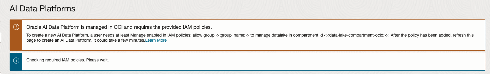

# Prerequisites before you start

## Introduction

This step gives you the necessary steps to make sure that you have have the right prerequisites in place to complete the entire workshop.

Estimated Time: 15 minutes

### About prerequisites for provisioning AI Data platform Workbench

The AI Data Platform Workbench ames use of various components of OCI like Object Storage and Autonomous AI Lakehouse. Next to that you may want to connect to various sources and targets that run in OCI or even outside. To be able to do so a set of policies needs to be in place. This can be done  in 2 basic forms. 1 is a more narrow scope while th other has a more OCI wide scope.
Next to that, to demonstrate the integration with Autonomous AI Lakehouse it is useful to it already deployed and the credentials and wallet at hand.
It is also very useful to have a compartment structure in place and that you have identified the compartment for AI Data Platform Workbench

### Objectives

In this lab, you will:
check if prerequisites are met and  if not, take the time to do the needful to meet those prerequisites.

### Prerequisites

When you start to deploy your AI Data Platform Workbench the OCI console will perform a check if policies are in place.

Similar message like this may show up and policy creation as per instructions in above link are required.
    

## Learn More

* [AI Data Platform documentation](https://docs.oracle.com/en/cloud/paas/ai-data-platform/index.html)

## Acknowledgements

* **Author** - Wilbert Poeliejoe
* **Reviewed by** - Lucian Dinescu, Senior Principal Product Manager, Analytics
* **Last Updated By/Date** - Wilbert Poeliejoe, AI Data Platform Black Belt: December 11th, 2025