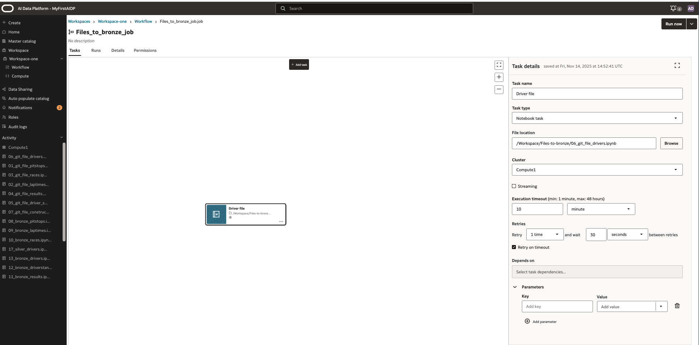
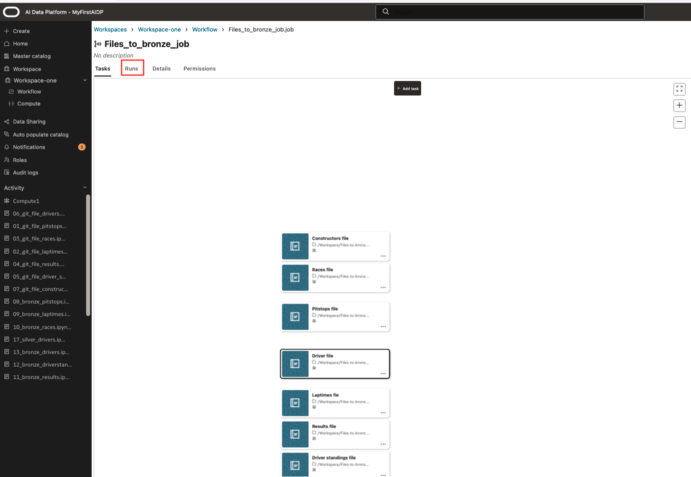
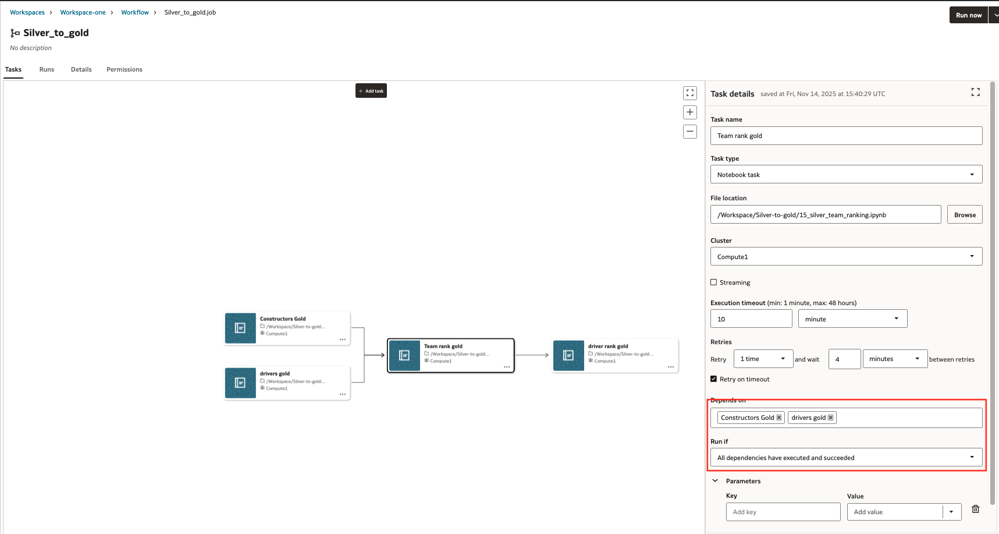

# Orchestrate data processing using workflows

## Introduction

In this lab we define the data processing orchestration using workflows. In workflows you can automate and schedule to execution of tasks. In this Lab w will use it to orchestrate the runs of Notebooks in subsequent phases (Bronze- Silver-Gold)

Estimated Lab Time: 30 minutes

### Objectives

In this lab, you will:

* Define workflows
* Run workflows
* Schedule Workflows

Workflow for Files to Bronze loading of data needs following tasks

|  Workflow name |  Taskname  | Notebook name  |  Dependency
| ---- | ---- | ---- | ---- |
| Files\_to\_bronze\_job	| Constructors\_file | 07\_git\_file\_constructors.ipynb | No |
| Files\_to\_bronze\_job | Races\_file  | 03\_git\_file\_races.ipynb | No  |
| Files\_to\_bronze\_job | Pitstops\_file     | 01\_git\_file\_pitstops.ipynb  | No  |
| Files\_to\_bronze\_job | Driver\_file  | 06\_git\_file\_drivers.ipynb | No  |
| Files\_to\_bronze\_job | Laptimes\_file | 02\_git\_file\_laptimes.ipynb | No |
| Files\_to\_bronze\_job | Results\_file  | 04\_git\_file\_results.ipynb  | No |
| Files\_to\_bronze\_job | Driver\_standings\_file  | 05\_git\_file\_driver\_standings.ipynb  | No  |

Workflow for Bronze to Silver loading of data needs following tasks

|  Workflow name |  Taskname  | Notebook name  |  Dependency
| ---- | ---- | ---- | ---- |
| Bronze\_to\_silver | constructors\_silver | 14\_bronze\_constructors.ipynb | No |
| Bronze\_to\_silver | races\_silver  | 10\_bronze\_races.ipynb | No  |
| Bronze\_to\_silver | pitstops\_silver  | 08\_bronze\_pitstops.ipynb  | No  |
| Bronze\_to\_silver | drivers\_silver  | 13\_bronze\_drivers.ipynb | Parallel  |
| Bronze\_to\_silver | laptimes\_silver | 09\_bronze\_laptimes.ipynb | No |
| Bronze\_to\_silver | results\_silver  | 11\_bronze\_results.ipynb  | No |
| Bronze\_to\_silver | driver\_standings\_silver  | 12\_bronze\_driverstandings.ipynb  | No  |

Workflow for Silver to Gold loading of data needs following tasks

|  Workflow name |  Taskname  | Notebook name  |  Dependency
| ---- | ---- | ---- | ---- |
| Silver\_to\_gold | constructors\_gold | 18\_silver\_constructors.ipynb | No |
| Silver\_to\_gold | drivers\_gold  | 17\_silver\_drivers.ipynb | No  |
| Silver\_to\_gold | team\_rank\_gold | 15\_silver\_team\_ranking.ipynb  | constructors\_gold, drivers\_gold  |
| Silver\_to\_gold | driver\_rank\_gold  | 16\_silver\_driver\_ranking.ipynb | team\_rank\_gold  |

### Prerequisites (Optional)

This lab assumes you have:

* An Oracle Cloud account
* All previous labs successfully completed

## Task 1: Creation of Workflows

1. Step 1: Start workflow creation

    Select the Workspace. In the main pane start the creation of a job.
    Enter the form with Name, Description and Max concurrent runs.
    For concurrent runs select '5'. Create.

    In the Job definition screen the first task is automatically created. The goal is to put all notebooks per phase in a workflow. All Bronze in one, All silver in one, and similar for Gold

    On the right side:

    | description | to enter |
    | --- | --- |
    | Name | Meaningful name |
    |Task Type | Notebook Task |
    | File location | Select the location of the notebook and notebook that you want to run |
    | Cluster | Select the compute cluster |
    | Execution timeout | 10 |
    | retries | number of retries |
    |retry on timeout | Enable |

    We will create a workflow for each layer so that per layer (Bronze, silver, gold) a workflow can be run.
    We start with bronze layer. There we add the notebooks that we have stored in the workspace folder for bronze. Those files start with 01\_git\_.... to 07\_git\_.... Each task has one notebook. It requires to have 1 tasks in the workflow.
    For the Bronze\_to\_Silver Workflow the files starting with 08\_bronze\_... to 14\_bronze\_... need to be part of the workflow.
    For Silver to gold workflow a specific order has to be taken in account. This is controlled by the **dependencies** field

    

    When filled the form for the first task in the middle click 'Add Task' to add next tasks.

    In the workflow pane the runs can be monitored

    

    Repeat same for all notebooks in this phase.
    For 'File to Bronze' and 'Bronze to Silver', all tasks can run in parallel.
    At 'Depends on' no dependency to be entered.

    For the Silver to Gold it is important to run the tasks sequentially in following order.

    * 17\_silver\_drivers.ipynb
    * 18\_silver\_constructors.ipynb
    * 15\_silver\_team\_ranking.ipynb
    * 16\_silver\_driver\_ranking.ipynb

    Dependencies need to be set at the task which is dependent on previous taks.
    A list of possible values is shown when adding a dependency.
    It is also possible to change the behavior of the dependencies.
    You can check the **run if** field for possible options. We will use the "all dependencies have executed and succeeded"
    
    

    In the workflow details you find the possibility to schedule the workflow

    

**proceed to the next lab**

## Acknowledgements

* **Author** - Wilbert Poeliejoe, AI Data Platform Black Belt
* **Contributors** -  Massimo Dalla Rovere, AI Data Platform Black Belt
* **Reviewed by** - Lucian Dinescu, Senior Principal Product Manager, Analytics
* **Last Updated By/Date** - Wilbert Poeliejoe, AI Data Platform Black Belt: December 11th, 2025