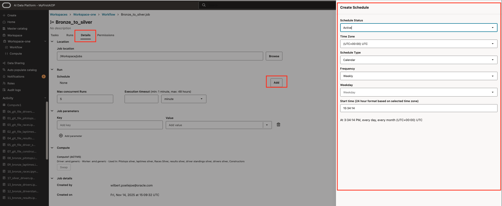

# Orchestrate data processing using workflows

## Introduction

In this lab we define the data processing orchestration using workflows. In workflows you can automate and schedule to execution of tasks. In this Lab w will use it to orchestrate the runs of Notebooks in subsequent phases (Bronze- Silver-Gold)

Estimated Lab Time: 30 minutes

### Objectives

In this lab, you will:

* Define workflows
* Run workflows
* Schedule Workflows

### Prerequisites (Optional)

This lab assumes you have:

* An Oracle Cloud account
* All previous labs successfully completed

## Task 1: Creation of Workflows

Step 1

Select the Workspace. In the main pane start the creation of a job.
Enter the form with Name, Description and Max concurrent runs.
For concurrent runs select **5**. Create.

In the Job definition screen the first task is automatically created. The goal is to put all notebooks per phase in a workflow. All Bronze in one, All silver in one, and similar for Gold

On the right side:

| Column 1 | Column 2 |
| --- | --- |
| Name | Meaningful name |
|Task Type | Notebook Task |
| File location | Select the location of the notebook and notebook that you want to run |
| Cluster | Select the compute cluster |
| Execution timeout | 10 |
| retries | number of retries |
|retry on timeout | Enable |

When filled the form for the first task in the middle click **Add Task** to add next tasks.

In the workflow pane the runs can be monitored

Repeat same for all notebooks in this phase.
For **File to Bronze** and **Bronze to Silver**, all tasks can run in parallel.
At **Depends on** no dependency to be entered.

For the Silver to Gold it is important to run the tasks sequentially in following order.

* 17_silver_drivers.ipynb
* 18-silver_constructors.ipynb
* 15_silver_team_ranking.ipynb
* 16_silver_driver_ranking.ipynb

In the workflow details you find the possibility to schedule the workflow

**proceed to the next lab**

## Acknowledgements

* **Author** - Wilbert Poeliejoe, AI Data Platform Black Belt
* **Contributors** -  Massimo Dalla Rovere, AI Data Platform Black Belt
