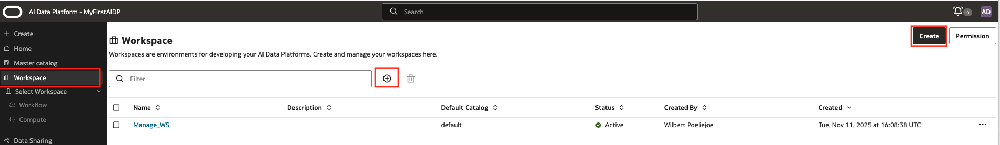

# Creation of a Workspace and a compute cluster

## Introduction

In this Lab we will create a workspace and a compute cluster within that workspace.
A Workspace is the highest level of grouping tasks and activities, and as such also separating work at high level. Also compute cluster resources a segregated at this level.

Estimated Lab Time: 15 minutes

### About <Product/Technology> (Optional)
After the AI Data platform is deployed a default workspace is created with a default compute cluster. These are mandatory to run AI Data Platform and the compute cluster needs to be always on.
It is a best practice to create a separate workspace(s) and compute cluster(s) for workloads. Later when applying Role Based Access Control this helps to segregate admininistrator tasks.

### Objectives

*List objectives for this lab using the format below*

In this lab, you will:
* Learn to create a workspace
* Learn to create a compute cluster inside a workspace

### Prerequisites (Optional)

*List the prerequisites for this lab using the format below. Fill in whatever knowledge, accounts, etc. is necessary to complete the lab. Do NOT list each previous lab as a prerequisite.*

This lab assumes you have:
* All previous labs successfully completed

*This is the "fold" - below items are collapsed by default*

## Task 1: Creation of a workspace

1. Step 1
   Create your workspace. The initial step is to give it a name and description. The default catalog is optional. The enable private network is not required for this workshop. You have 2 places where you can start the creation of the workspace. At the + symbol or in upper right corner. The creation will take just a little time 

	
  

## Task 2: Open your workspace and create a compute cluster

1. Step 1 - Open Workspace

  Select your workspace and you will notice that the name appears in the left menu.

  

2. Step 2 - Compute Cluster creation

  In the sub menu of the workspace you find the link to **Compute**.
  In the screen that opens you will find the **+** sign again to create a compute cluster
  A subscreen will open where several fields need to be entered.
  - Enter a Name, Description
  - Keep Runtine version at Spark (default)
  - Then you need to choose the Driver shape and Worker shape. We keep the shape sizes at default
  - Set the number of workers check box to Autoscale with a minimum worker of 1 and maximum worker of 10
  - Set the Run duration checkbox to Idle timeout and enter **60** for minutes. This will stop the cluster after 60 minutes sitting idle. It will limit costs. If it takes somewhat longer to continue with your labs, you will need to start the compute cluster manually
  -  Click **create**

  

## Learn More

*(optional - include links to docs, white papers, blogs, etc)*

* [URL text 1](http://docs.oracle.com)
* [URL text 2](http://docs.oracle.com)

## Acknowledgements
* **Author** - Wilbert Poeliejoe
* **Contributors** -  <Name, Group> -- optional
* **Last Updated By/Date** - <Name, Month Year>
