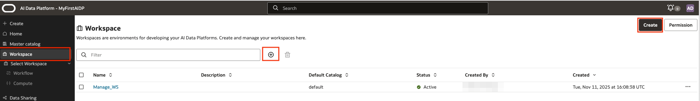
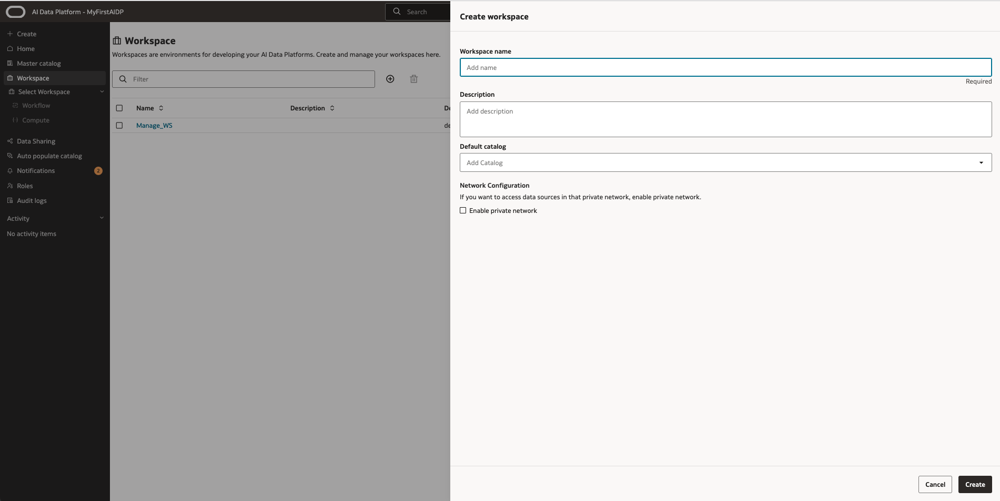
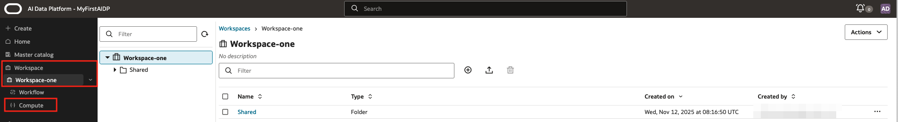
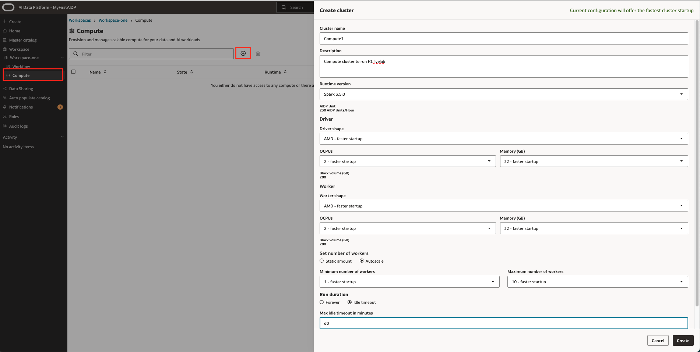

# Creation of a Workspace and a compute cluster

## Introduction

In this Lab we will create a workspace and a compute cluster within that workspace.
A workspace is the highest level of grouping tasks and activities, and as such also separating work at high level. Also compute cluster resources a segregated at this level.

> **Note:** After the AI Data platform is deployed a default workspace is created with a default compute cluster. These are mandatory to run AI Data Platform and the compute cluster needs to be always on.
It is a best practice to create a separate workspace(s) and compute cluster(s) for workloads. Later when applying Role Based Access Control this helps to segregate administrator tasks.

Estimated Lab Time: 15 minutes

### Objectives

In this lab, you will:

* Learn to create a workspace
* Learn to create a compute cluster inside a workspace

### Prerequisites

This lab assumes you have:

* All previous labs successfully completed

## Task 1: Creation of a workspace

1. Step 1: create workspace
    Create your workspace. The initial step is to give it a name and description. The default catalog is optional. The enable private network is not required for this workshop. You have 2 places where you can start the creation of the workspace. At the + symbol or in upper right corner. The creation will take just a little time

    

    

## Task 2: Open your workspace and create a compute cluster

1. Step 1: Open Workspace

    Select your workspace and you will notice that the name appears in the left menu.

    

2. Step 2: Compute Cluster creation

    In the sub menu of the workspace you find the link to 'Compute'.
    In the screen that opens you will find the '+' sign again to create a compute cluster
    A subscreen will open where several fields need to be entered.

    * Enter a Name, Description
    * Keep Runtine version at Spark (default)
    * Then you need to choose the Driver shape and Worker shape. We keep the shape sizes at default
    * Set the number of workers check box to Autoscale with a minimum worker of 1 and maximum worker of 10
    * Set the Run duration checkbox to Idle timeout and enter '60' for minutes. This will stop the cluster after 60 minutes sitting idle. It will limit costs. If it takes somewhat longer to continue with your labs, you will need to start the compute cluster manually
    * Click 'create'

    

**proceed to the next lab**

## Learn More

* [AI Data Platform documentation](https://docs.oracle.com/en/cloud/paas/ai-data-platform/index.html)

## Acknowledgements

* **Author** - Wilbert Poeliejoe, AI Data Platform Black Belt
* **Contributors** -  Massimo Dalla Rovere, AI Data Platform Black Belt
* **Reviewed by** - Lucian Dinescu, Senior Principal Product Manager, Analytics
* **Last Updated By/Date** - Wilbert Poeliejoe, AI Data Platform Black Belt: December 11th, 2025