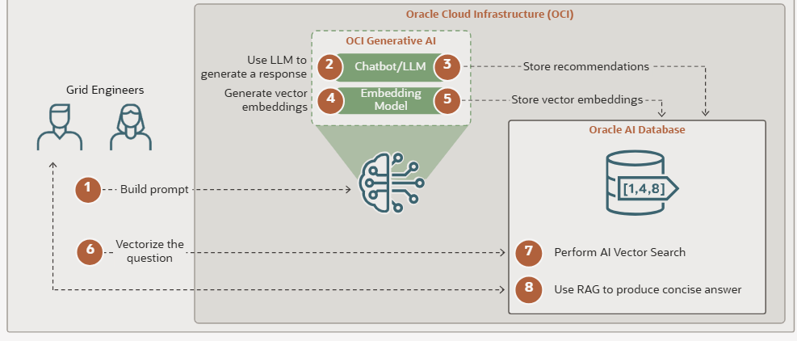

# Workshop Introduction and Overview

## Why We Need an AI Data Platform

Construction engineering teams make high-stakes decisions with information spread across project requirements, supplier qualification packets, inspection logs, certifications, nonconformance records, submittals, and procurement notes. A project manager may know the schedule pressure, quality may know the unresolved NCR history, procurement may know the capacity constraint, and engineering may know the required technical documentation. The decision only becomes reliable when those facts are evaluated together.

The typical response is to move between spreadsheets, document repositories, supplier portals, email threads, and database extracts. That slows decisions and creates inconsistent interpretations. One reviewer may focus on cost, another on certifications, and another on delivery risk. When construction schedules are compressed, delays or inconsistencies in supplier evaluations can significantly increase downstream cost, safety, and schedule risks.

Oracle AI Data Platform addresses this by unifying data lakehouse, AI/ML, analytics, generative AI, and governance into a single environment on Oracle Cloud Infrastructure. The platform gives teams governed access to structured data and unstructured documents, then lets them build AI agents that can retrieve policy guidance and query database facts in the same natural language flow.

In this workshop, you will build a construction procurement evaluation agent that combines RAG and SQL. The agent will retrieve internal procurement and compliance guidance, query supplier and project data, and produce grounded recommendations for supplier approval, request-info follow-up, denial, or RFP escalation.

### Reference Architecture

The diagram below shows the high-level flow this workshop implements. Users ask a natural language question in the agent interface. The agent uses Oracle AI Data Platform to decide whether the question needs policy context from the Knowledge Base, structured facts from Oracle AI Database, or both. OCI Generative AI provides the chat model and embedding model used for response generation and semantic search. Oracle AI Database stores the construction project and supplier tables, while the Knowledge Base indexes internal procurement, compliance, and technical addendum documents for RAG. The final response combines retrieved document context and SQL results into a grounded supplier evaluation recommendation.

### What You'll Build

Over the course of this workshop, you will design, configure, test, and deploy a **Construction Procurement Evaluation Agent**. The agent answers natural language questions about project requirements, supplier fit, compliance blockers, missing documentation, and recommended next actions by combining two capabilities:

- **RAG (Retrieval-Augmented Generation)** over internal supplier evaluation playbooks, compliance guidelines, and technical addendum procedures.
- **SQL tools** that execute parameterized queries against an Oracle AI Database containing construction projects, requirements, suppliers, certifications, performance history, recommendations, supporting documents, and decision records.

The agent is designed for project managers, procurement leads, construction quality teams, and executives who need fast, consistent, evidence-based supplier decisions.

### Workshop Flow

| Lab | Title | Focus | Est. Time |
|---|---|---|---|
| **Lab 1** | Data Environment Setup | Create compute, catalogs, a managed volume, and a Knowledge Base; verify construction engineering database tables | 15 min |
| **Lab 2** | Agent Flow Setup | Configure the agent, attach the RAG tool, and add SQL tools for project and supplier analysis | 25 min |
| **Lab 3** | Validate the Agent Flow | Test project recommendation, supplier profile, and policy guidance scenarios across SQL and RAG tools | 15 min |
| **Lab 4** | Deploy the Agent Flow | Deploy to a production endpoint and review REST API consumption | 5 min |
| **Workshop Recap** | Recap and Value Proposition | Review what you built and how the pattern applies to enterprise construction engineering decisions | 5 min |

### Key Concepts

| Term | Definition |
|---|---|
| **Oracle AI Data Platform (AIDP)** | A unified, governed environment on Oracle Cloud Infrastructure that brings together data lakehouse, AI/ML, analytics, and generative AI services. |
| **AIDP Workbench** | The development interface within AIDP for notebooks, catalog management, compute, workflows, and agent flows. |
| **Standard Catalog** | A catalog that stores data directly within AIDP, including volumes and knowledge bases. |
| **External Catalog** | A catalog connection to an external data source such as an Autonomous AI Lakehouse database. |
| **Volume** | A storage container for unstructured files. In this workshop, the volume holds construction procurement and compliance documents. |
| **Knowledge Base** | An AIDP asset that creates vector embeddings from documents so the agent can retrieve relevant passages by meaning. |
| **Agent Flow** | A visual, end-to-end agentic application composed of agent and tool nodes. |
| **RAG** | Retrieval-Augmented Generation. The agent retrieves authoritative document passages before generating an answer. |
| **SQL Tool** | A pre-defined, parameterized, read-only query that the agent can execute against governed database tables. |
| **Fit Score** | A supplier recommendation score used with compliance and risk guidance to support approve, request-info, deny, or RFP decisions. |
| **NCR** | Nonconformance report. Open NCRs can block supplier approval for quality-critical scopes. |

**Estimated Time:** 60 minutes

### Objectives

By the end of this workshop, you will be able to:

1. Explain how Oracle AI Data Platform supports governed RAG and SQL agent patterns.
2. Create a Knowledge Base from construction engineering procurement and compliance documents.
3. Build an agent flow with a foundation model, detailed agent instructions, one RAG tool, and SQL tools.
4. Test an AI agent that combines internal policy guidance with structured supplier and project data.
5. Deploy an agent flow to a production REST endpoint.
6. Articulate how this pattern improves construction procurement evaluation, risk triage, and documentation follow-up.

## Learn More

* [Oracle AI Data Platform - Product Page](https://www.oracle.com/ai-data-platform/)
* [Oracle AI Data Platform Workbench - Product Page](https://www.oracle.com/ai-data-platform/workbench/)
* [Oracle AI Data Platform - Documentation](https://docs.oracle.com/en/cloud/paas/ai-data-platform/)
* [Oracle AI Data Platform - Sample Notebooks and Agent Flows on GitHub](https://github.com/oracle-samples/oracle-aidp-samples)

## Acknowledgements

* **Author** - Eli Schilling, Cloud Architect || Evangelist
* **Contributors** - ONA Lab Engineering team
* **Last Updated By/Date** - Eli Schilling, July 2026
