# Lab 1: Data Environment Setup

## Introduction

Before building the AI agent, we need to ensure the data environment is in place. In this lab, you'll create the AI Compute instance, external catalog, standard catalog, managed volume, and Knowledge Base used by the construction engineering workshop. You'll also verify the Oracle AI Database tables that power the agent's SQL tools.

By the end of this lab, all the data assets - structured project and supplier tables plus unstructured knowledge base documents - will be ready for the agent flow you'll build in Lab 2.

**Estimated Time:** 15 Minutes

### Objectives

In this lab you will:

1. Create the AI Compute instance used by the agent.
2. Create a new external database catalog (`ce_ext_catalog`).
3. Create a new standard catalog (`ce_std_catalog`) and managed volume (`ce_volume`) where you'll upload construction procurement and compliance documents.
4. Create a Knowledge Base (`ce_kb`) and an associated data source that consumes the documents from the managed volume.
5. Verify the Oracle AI Database tables that contain construction projects, supplier records, certifications, recommendations, and decision data.
6. Understand how structured SQL data and unstructured RAG documents connect to the agent you'll build.

### Prerequisites

This lab assumes you have:

* Reviewed the Workshop Introduction and Overview.
* Access to the AIDP Workbench instance provisioned for this workshop.
* Enabled AI features in the AIDP Workbench. In the LiveLabs sandbox, this commonly takes 5-7 minutes and may require a hard browser refresh before the home page changes from **Enable AI features** to **Disable AI features**.

## Task 1: Create the AI Compute Instance

An AI Compute hosts your agent flows. You need an active AI Compute to test agent flows and deploy them.

1. Log into the OCI Console if you've not already done so.

    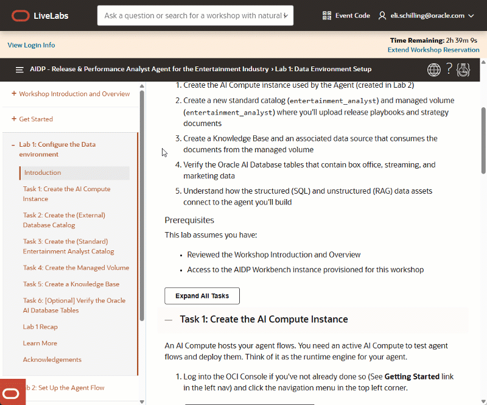

2. Click the navigation menu in the top left corner.

    

3. Navigate **Analytics & AI** -> **AI Data Platform Workbench**.

    

4. From the *List scope* menu, select the compartment assigned by the LiveLabs environment.

    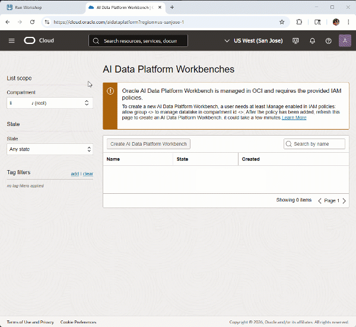

5. Click the name of the AIDP instance to open the Workbench. The workbench opens in a new tab.

6. From the AIDP Workbench Home Page, select your workspace from the workspace drop-down.

    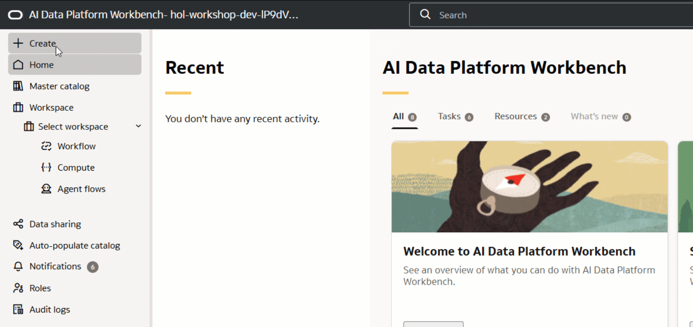

7. Click **Compute** under the selected workspace.

    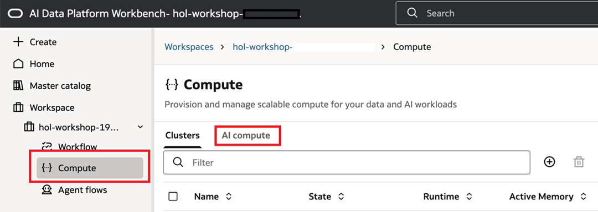

8. In the Compute page, click the **AI Compute** tab, then click the **+** button.

    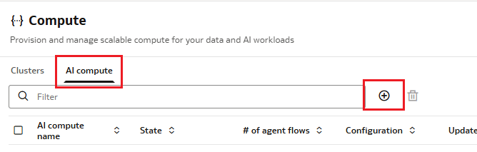

9. Enter a name and description:

    **Name**
    ```
    <copy>
    ce_compute
    </copy>
    ```

    **Description**
    ```
    <copy>
    AI Compute for the Construction Engineering Supplier Evaluation Agent
    </copy>
    ```

10. Use the default size of **1 OCPU** and **16 GB of RAM**.

11. Click **Create**.

    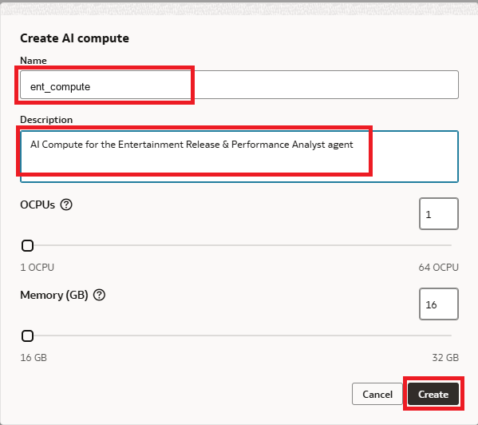

    > **Note**: It may take 3-5 minutes to provision this resource. You can continue to the next task while it provisions.

## Task 2: Create the External Database Catalog

An external catalog in AIDP enables you to connect to an Autonomous AI Lakehouse database. For this workshop, an ALH instance has been provisioned and loaded with construction engineering sample data.

1. From the AIDP Workbench Home Page, click **Master Catalog**.

    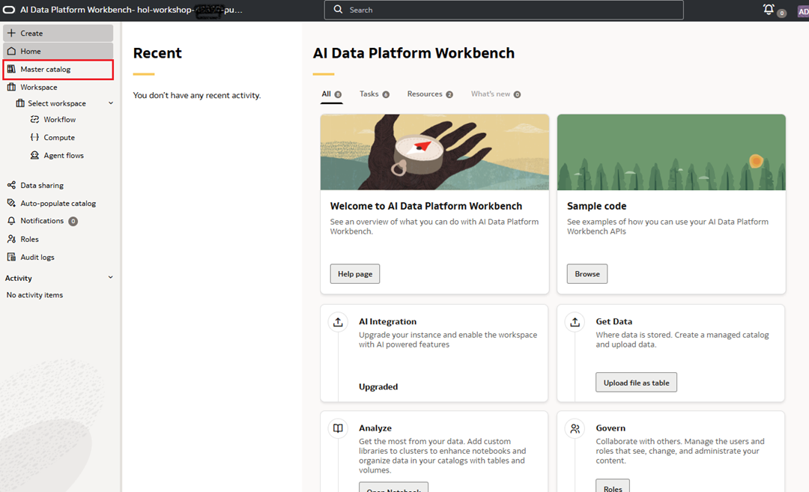

    > **Note:** You may see pre-provisioned catalogs such as **`default`** and a generated **`vector_db_...`** catalog. Do not delete these catalogs.

2. Click **Create catalog** in the upper right corner.

    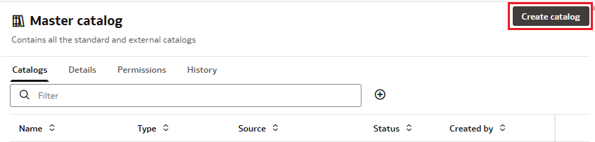

3. Enter the following details:

    **Catalog name**
    ```
    <copy>
    ce_ext_catalog
    </copy>
    ```

    **Description**
    ```
    <copy>
    A catalog that connects to the Autonomous AI Lakehouse database containing construction engineering project and supplier data.
    </copy>
    ```

4. Select **Catalog type** -> **External catalog**.

5. For **External source method**, select **Choose ALH instance**.

6. Leave the Tenant OCID and Region fields as-is. If the Compartment drop-down does not show your assigned workshop compartment, open the compartment tree and select your designated `LL<reservation>-COMPARTMENT` row.

7. Move to the **ALH instance** drop-down and locate the database instance that starts with **hol-consteng-**. Match this to the **ADB Name** value in the LiveLabs **View Login Info** panel.

8. From the **Service** dropdown, select the label that ends with **_high**.

9. Enter authentication details:

    - **Wallet password (optional)**: You may choose your own password, or leave this field blank and allow AIDP to manage it.
    - **Username**: `CONSTRUCTION_ENGINEERING`
    - **ADB Admin Password**: Retrieved from the LiveLabs instructions page -> View Login Info -> Terraform Outputs -> ADB Admin Password.

10. Click **Test connection** and confirm that the connection is successful.

11. Click **Create**.

    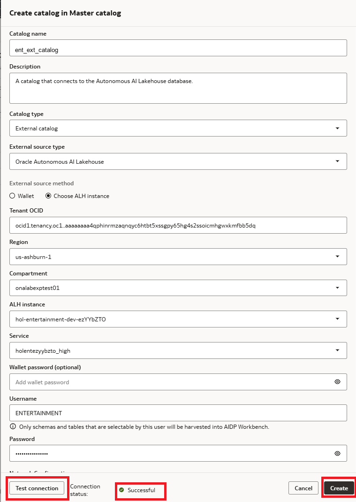

## Task 3: Create the Standard Construction Engineering Catalog

1. From the AIDP Workbench Home Page, click **Master Catalog**.

2. Click **Create catalog** and provide the following:

    **Catalog name**
    ```
    <copy>
    ce_std_catalog
    </copy>
    ```

    **Description**
    ```
    <copy>
    A catalog that stores assets needed by the construction engineering supplier evaluation agent.
    </copy>
    ```

3. Click **Create**.

    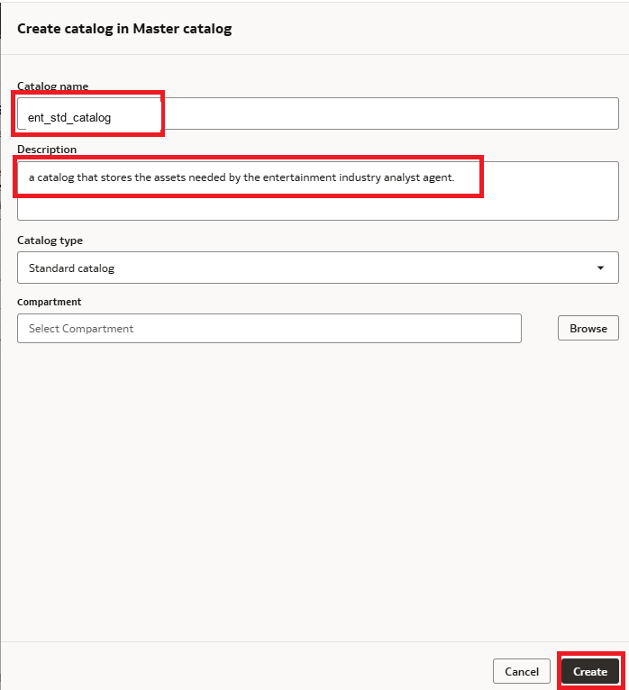

4. When ready, click **ce_std_catalog** to open the new catalog.

5. Click the **default** schema within the catalog.

    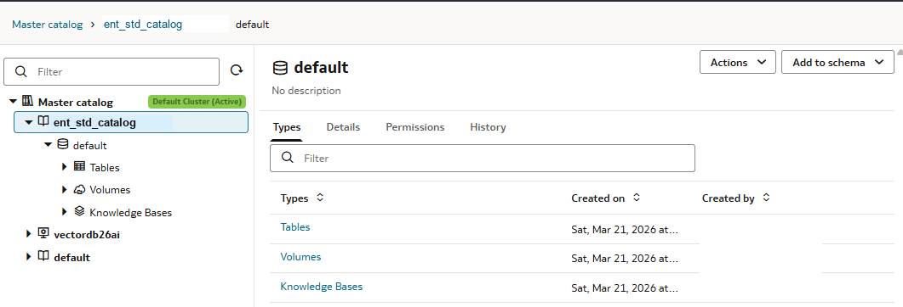

## Task 4: Create the Managed Volume

A volume stores unstructured files within a catalog. The volume for this workshop contains internal construction supplier evaluation, compliance, and technical addendum guidance.

1. [Click here](https://github.com/oracle-livelabs/analytics-ai/raw/refs/heads/main/ai-dataplatform-agent-flow-entertainment/files/consteng/kb_documents.zip) to download the zip file containing the sample knowledge base documents.

2. Unzip the file. You should have 3 `.docx` files:

    - **Construction Supplier Evaluation Playbook** - Defines approve, request-info, deny, and RFP-trigger decision criteria.
    - **Construction Compliance and Certification Guidelines** - Defines certification, NCR, safety, delivery, and capacity thresholds.
    - **Technical Addendum and Risk Triage Procedure** - Defines how to handle missing technical packages and re-analysis scenarios.

3. Back in AIDP Workbench, return to the **`ce_std_catalog`** catalog, locate the **default** schema, and click **Volumes**.

4. Click the **+** next to the filter field to create a new volume.

    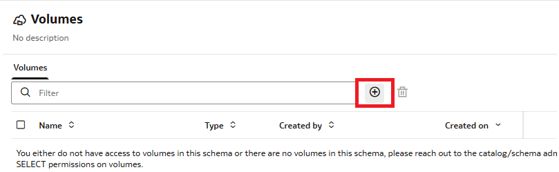

5. Provide a name and description:

    **Name**
    ```
    <copy>
    ce_volume
    </copy>
    ```

    **Description**
    ```
    <copy>
    This volume stores construction procurement, supplier compliance, and technical addendum documents.
    </copy>
    ```

6. Click the volume name **`ce_volume`**, click the **+** button, then click **Upload file**.

7. Upload the three `.docx` files from the zip archive.

    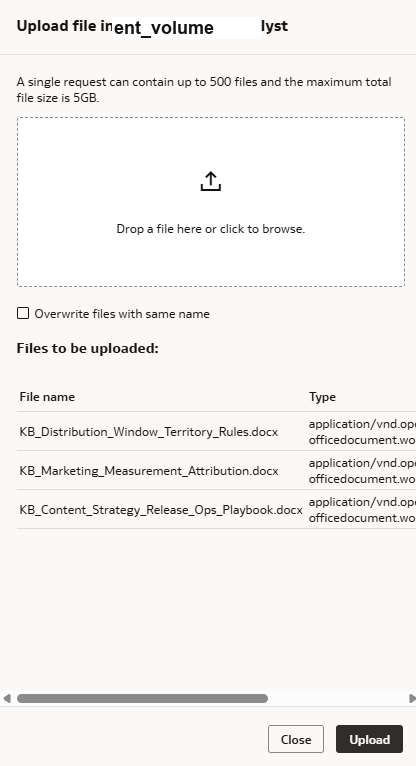

8. Click **Upload**, then confirm the files appear in the volume.

    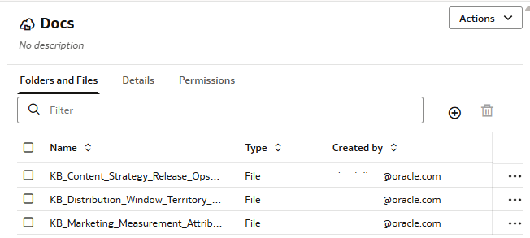

## Task 5: Create a Knowledge Base

Now create the asset that enables RAG. A Knowledge Base creates vector representations of the documents in the volume.

1. Navigate back to **`ce_std_catalog`** and click the **default** schema.

2. Click **Knowledge Bases**.

3. Click the **+** button to create a new Knowledge Base.

4. Enter the following values:

    **Name**
    ```
    <copy>
    ce_kb
    </copy>
    ```

    **Description**
    ```
    <copy>
    Contains internal construction supplier evaluation, compliance, and technical addendum guidance.
    </copy>
    ```

    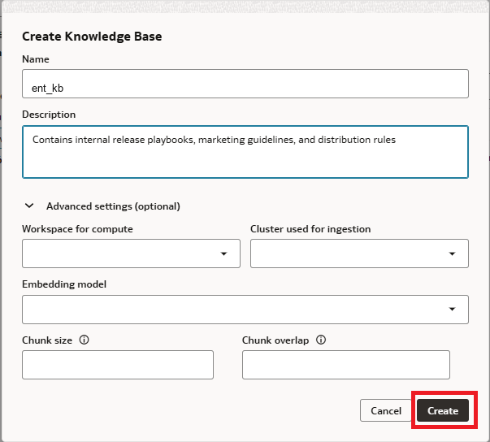

5. Leave the **Advanced Settings** as-is.

6. Click **Create** and wait for the Knowledge Base to become **Active**.

7. Open the Knowledge Base details, click the **Data Source** tab, and click the **+** button.

    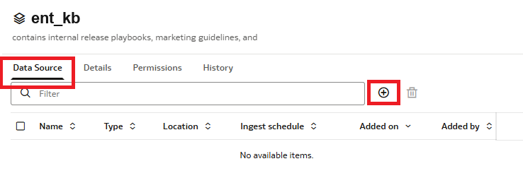

8. Select the **`ce_volume`** volume and leave advanced settings as-is.

9. Click **Add**.

10. Navigate to the **History** tab and wait for the operation to show **Succeeded**.

## Task 6: Optional - Verify the Oracle AI Database Tables

The agent's SQL tools query structured data from an Oracle AI Database. For this workshop, the following tables have been pre-ingested with construction engineering project and supplier data.

1. Return to the OCI Console browser tab.

2. Use the navigation menu to open the Autonomous AI Database Console.

    

3. Make sure the applied filters match your assigned compartment.

4. Click the database name that starts with **hol-consteng-**.

5. Click **Database actions** and select **SQL**.

6. In the Navigator, locate the **CONSTRUCTION_ENGINEERING** schema.

    | Table Name | Description | Key Columns |
    |---|---|---|
    | `CE_PROJECTS` | Construction projects under supplier evaluation | `PROJECT_ID`, `PROJECT_NAME`, `PROJECT_TYPE`, `EVALUATION_STATUS` |
    | `CE_PROJECT_REQUIREMENTS` | Trade, material, certification, delivery, budget, and risk requirements | `PROJECT_ID`, `TRADE_CATEGORY`, `REQUIRED_CERTIFICATION` |
    | `CE_SUPPLIERS` | Supplier master records | `SUPPLIER_ID`, `SUPPLIER_NAME`, `CATEGORY`, `CAPACITY_STATUS` |
    | `CE_SUPPLIER_CERTIFICATIONS` | Supplier certification evidence | `SUPPLIER_ID`, `CERTIFICATION_NAME`, `STATUS` |
    | `CE_SUPPLIER_PERFORMANCE` | Similar-project, delivery, cost, NCR, and safety history | `SUPPLIER_ID`, `ON_TIME_DELIVERY_RATE`, `UNRESOLVED_NCR_COUNT` |
    | `CE_SUPPLIER_RECOMMENDATION` | Fit score, risk, explanation, strengths, and missing information | `PROJECT_ID`, `SUPPLIER_ID`, `RECOMMENDATION`, `FIT_SCORE` |
    | `CE_SUPPORTING_DOCS` | Supporting document references and extracted text | `PROJECT_ID`, `SUPPLIER_ID`, `DOC_TYPE`, `DOC_TEXT` |
    | `CE_DECISION` | Generated decision text and decision type | `EVALUATION_ID`, `DECISION_TYPE`, `LETTER_TEXT` |

7. Run a simple query:

    ```sql
    <copy>
    select project_id, project_name, evaluation_status
    from CONSTRUCTION_ENGINEERING.ce_projects;
    </copy>
    ```

8. You should see projects such as **Downtown Mixed-Use Tower**, **Harbor Seismic Retrofit**, and **North Campus Lab Expansion**.

## Lab 1 Recap

In this lab, you set up the complete data environment for the Construction Engineering Supplier Evaluation Agent:

- You created an **AI Compute** to host and execute the agent flow.
- You created **`ce_ext_catalog`** to connect to the Autonomous AI Lakehouse database.
- You created **`ce_std_catalog`** and **`ce_volume`**, then uploaded internal construction guidance documents.
- You created **`ce_kb`** and ingested the documents for RAG.
- You verified the structured construction engineering database tables that power the SQL tools.

In the next lab, you'll create the agent flow itself.
