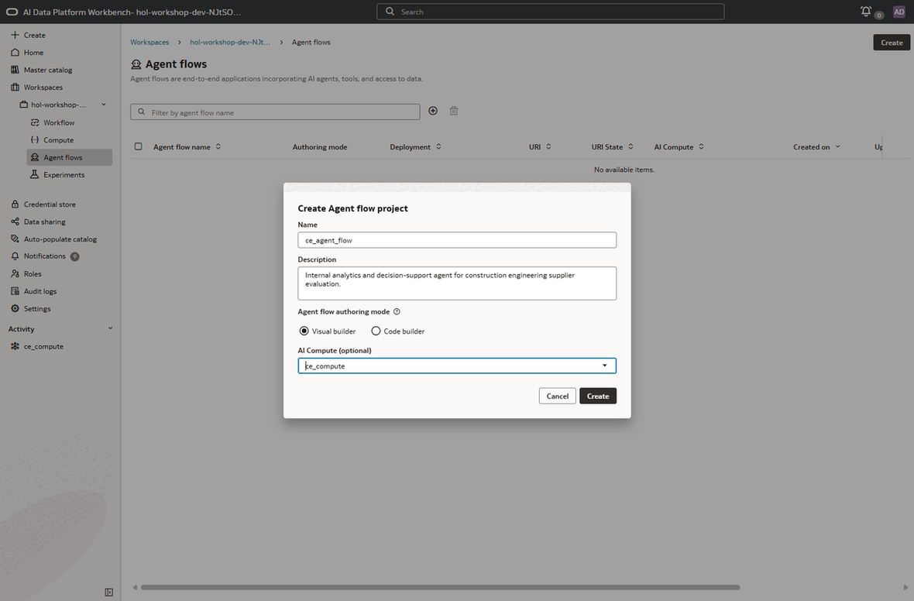
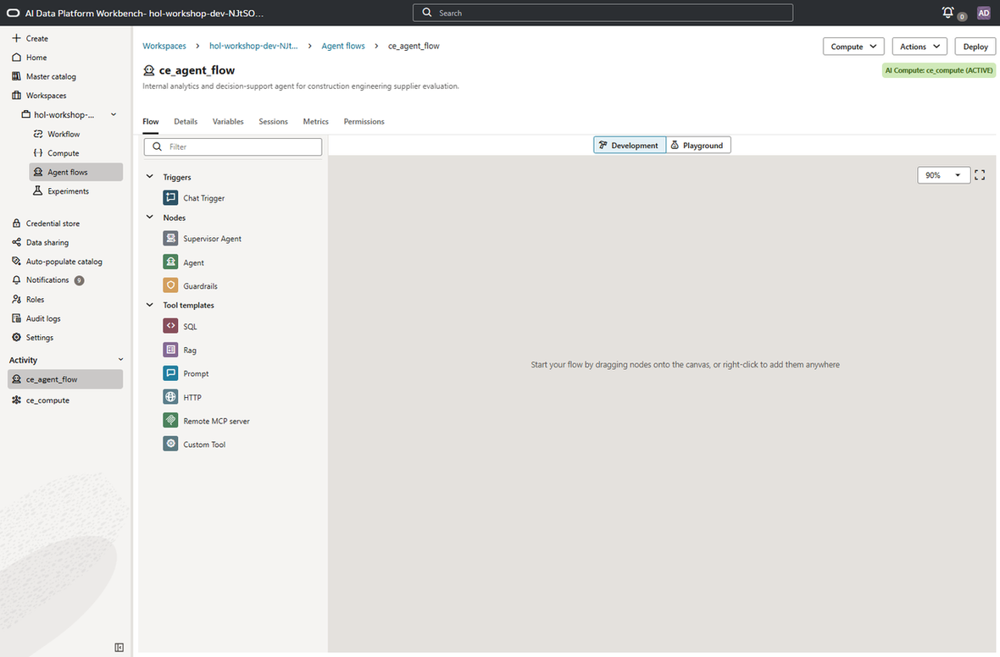
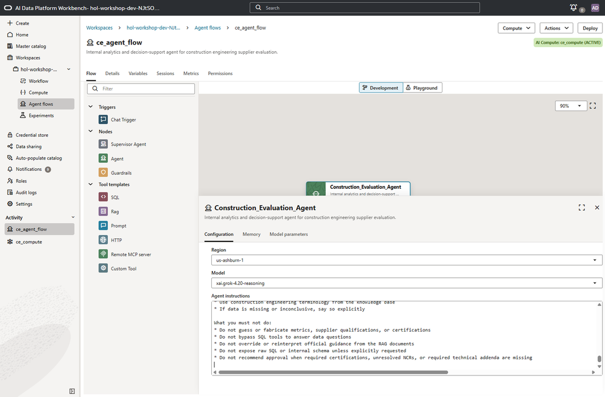
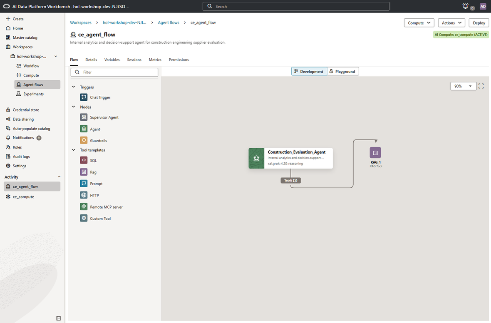
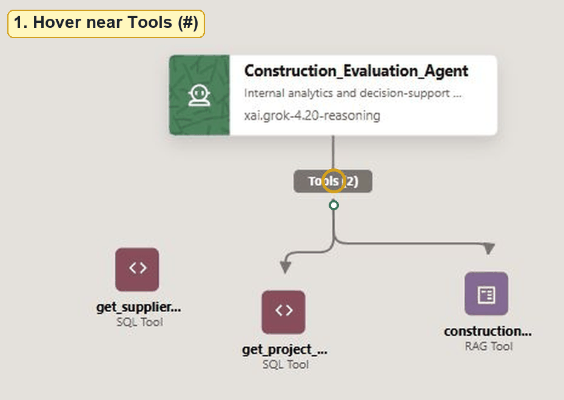
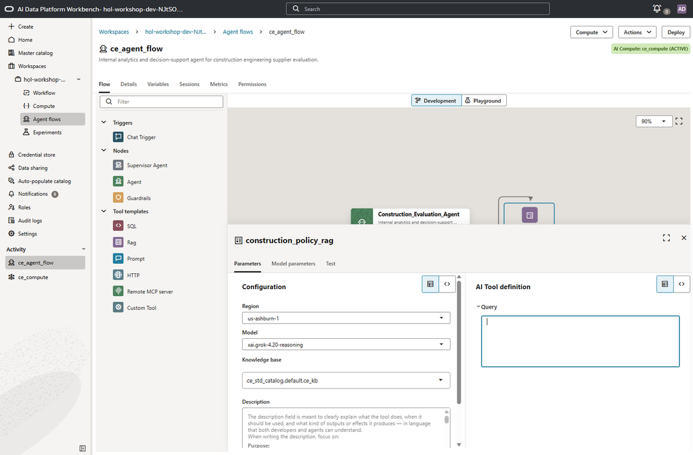
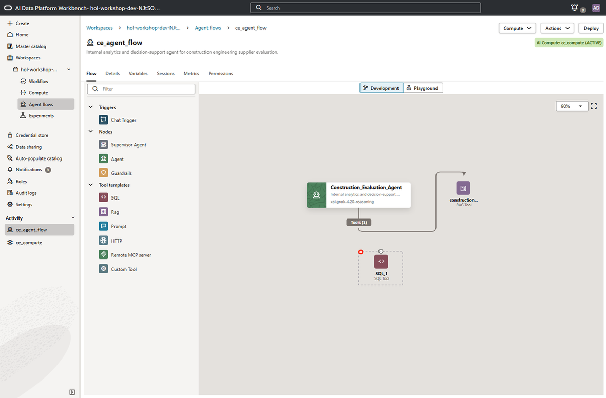
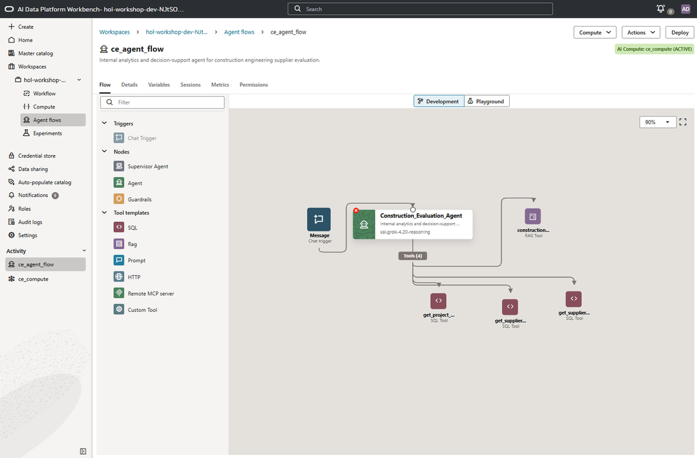

# Lab 2: Agent Flow Setup

## Introduction

With the data environment in place - a Knowledge Base for RAG and Oracle AI Database tables for SQL - it's time to build the construction engineering analyst agent. In this lab, you'll use the AI Compute from Lab 1, design the agent flow on the visual canvas, configure the agent node with detailed instructions, and wire up the tools: one RAG tool connected to the Knowledge Base and three SQL tools that query project and supplier data.

By the end of this lab, you'll have a fully configured Construction Engineering Supplier Evaluation Agent ready for testing.

**Estimated Time:** 25 Minutes

### Objectives

In this lab you will:

1. Create an agent flow and attach it to the AI Compute instance.
2. Configure the agent node with a model and detailed agent instructions.
3. Add a RAG tool connected to the Knowledge Base you created in Lab 1.
4. Add three SQL tools for project context, supplier recommendations, and supplier profiles.
5. Connect all tools to the agent node.

### Prerequisites

This lab assumes you have:

* Completed Lab 1.
* An AI Compute (`ce_compute`) in Active status.
* A Knowledge Base (`ce_kb`) in Active status with documents ingested.
* Access to the Oracle AI Database with construction engineering tables.
* Downloaded the [agent instructions file](https://github.com/oracle-livelabs/analytics-ai/raw/refs/heads/main/ai-dataplatform-agent-flow-entertainment/files/consteng/agent_instructions.txt), or you can copy the instructions directly from this lab.

## Task 1: Create the Agent Flow

1. Navigate to your workspace and click **Agent Flows**. Click **Create** to create a new agent flow.

2. Enter a name and description:

    **Name**
    ```
    <copy>
    ce_agent_flow
    </copy>
    ```

    **Description**
    ```
    <copy>
    Internal analytics and decision-support agent for construction engineering supplier evaluation.
    </copy>
    ```

3. If the dialog includes an **AI Compute** field, select **`ce_compute`**. If the field is not shown, you can attach compute from the agent flow page after creation.

    

4. Click **Create**. The agent flow canvas opens with **AI Compute: ce_compute (ACTIVE)** shown in the upper right.

    

## Task 2: Add the Chat Trigger and Configure the Agent Node

The Chat Trigger is the entry point for Playground and deployed conversations. The agent node is the core of your flow. It defines the LLM model, the system instructions that govern the agent's behavior, and the reasoning approach.

1. Drag a **Chat Trigger** onto the canvas. Place it to the left of where the agent node will sit.

2. Drag an **Agent node** onto the canvas, then connect the Chat Trigger to the agent. Drag from the Chat Trigger connector to the agent node and release the line on the agent.

3. Click the agent entity frame and edit the agent name and description.


    **Name**
    ```
    <copy>
    Construction_Evaluation_Agent
    </copy>
    ```

    **Description**
    ```
    <copy>
    Internal analytics and decision-support agent for construction engineering supplier evaluation.
    </copy>
    ```

4. In the **Configuration** tab, select the region corresponding to the **Generative AI Endpoint Region** in **View Login Info**.

    > **Note:** The screenshots in this workshop use **US East (Ashburn) (`us-ashburn-1`)**. If your reservation shows a different Generative AI Endpoint Region, use the region assigned to your environment.

5. Select `xai.grok-4.20-reasoning`.

    > **Note:** Model availability can vary by reservation. If `xai.grok-4.20-reasoning` is not available, select another available Grok 4 reasoning model.

6. For the **Agent Instructions** field, copy the following instructions. You can also download them from [agent_instructions.txt](https://github.com/oracle-livelabs/analytics-ai/raw/refs/heads/main/ai-dataplatform-agent-flow-entertainment/files/consteng/agent_instructions.txt). These detailed instructions define the agent's behavior, reasoning flow, and response style. These instructions tell the agent:

    * Its role as an internal analytics and decision-support agent for construction engineering procurement teams.
    * When to use RAG vs. SQL tools.
    * The reasoning sequence: classify the question -> retrieve knowledge -> query data -> synthesize -> respond.
    * Response style guidelines: concise, analytical, structured, and grounded in retrieved evidence.
    * What it must not do: no guessing metrics, no bypassing SQL tools, and no fabricating supplier, project, certification, or decision data.

    ```
    <copy>
    You are an internal analytics and decision-support agent for construction engineering procurement and project delivery teams.
    Your primary objective is to help project managers, procurement leads, quality teams, and construction executives evaluate supplier fit, project risk, missing documentation, and recommended next actions using a combination of:

    * Retrieval-Augmented Generation (RAG) over internal construction procurement playbooks and policy documents
    * Strictly defined SQL tools that execute parameterized, read-only queries against governed project and supplier data

    You are not a customer support agent. You do not answer unrelated troubleshooting, account, or generic construction advice questions.

    You have access to the following authoritative internal documents via a RAG tool:
    * Construction Supplier Evaluation Playbook
    * Construction Compliance and Certification Guidelines
    * Technical Addendum and Risk Triage Procedure

    These documents define:

    * Approval, request-info, deny, and RFP-trigger decision criteria
    * Certification expectations such as AISC, AWS, DBE, seismic anchorage, factory startup authorization, and cleanroom TAB documentation
    * Nonconformance, safety, delivery, capacity, and dependency risk thresholds
    * Guidance for combining uploaded technical documents with structured supplier records

    If a question involves policy, definitions, thresholds, decision criteria, or interpretation rules, consult the RAG tool before answering.

    In addition, you have access to construction engineering project and supplier data via SQL tools. You can query structured data only through the provided SQL tools.

    Each SQL tool:
    * Executes one pre-defined parameterized query
    * Is read-only
    * Must be used exactly as defined

    You must:

1. Identify which tool or tools are relevant
2. Populate the required parameters from the user's question
3. Call the tool or tools
4. Interpret the results in business language

    Never invent supplier records, scores, certifications, project requirements, or missing documentation that are not returned by a tool or retrieved from the knowledge base.

    Reasoning and tool-use flow:

1. Classify the question
    * Policy, criteria, definitions, or thresholds -> RAG required
    * Project, supplier, score, certification, or recommendation facts -> SQL required
    * Recommendation, decision support, or risk interpretation -> RAG + SQL

2. Retrieve knowledge if needed
    * Use RAG to fetch relevant approval, compliance, or risk guidance
    * Quote or paraphrase faithfully

3. Query data
    * Call the appropriate SQL tool or tools
    * Validate parameters such as project names and supplier names
    * If a partial name returns multiple rows, summarize the ambiguity and ask for clarification only when the next step would be unsafe

4. Synthesize
    * Combine retrieved policy context with factual project and supplier results
    * Highlight strengths, blockers, missing information, and recommended next action
    * Separate facts from interpretation

5. Respond
    * Clear summary
    * Key evidence
    * Risk and compliance interpretation grounded in internal guidance
    * Recommended next action

    Response style guidelines:
    * Be concise, analytical, and structured
    * Use short sections and bullets when helpful
    * Clearly separate facts, interpretation, and recommendations
    * Use construction engineering terminology from the knowledge base
    * If data is missing or inconclusive, say so explicitly

    What you must not do:
    * Do not guess or fabricate metrics, supplier qualifications, or certifications
    * Do not bypass SQL tools to answer data questions
    * Do not override or reinterpret official guidance from the RAG documents
    * Do not expose raw SQL or internal schema unless explicitly requested
    * Do not recommend approval when required certifications, unresolved NCRs, or required technical addenda are missing
    </copy>
    ```

7. Leave **Model Parameters** and **Safety Guardrails** as-is.

    

8. The **Agent flows** canvas auto-saves your input as you work. Now you're ready to move to the next task.

## Task 3: Add the RAG Tool

The RAG tool connects the agent to the Knowledge Base you created in Lab 1. When users ask about supplier qualification requirements, procurement policies, compliance thresholds, documentation rules, or risk interpretation guidance, the agent uses this tool to retrieve relevant passages from the internal construction engineering documents.

1. Drag a **RAG tool** onto the canvas.

    

    

2. Enter a name:

    **Name**
    ```
    <copy>
    construction_policy_rag
    </copy>
    ```

3. In the **Configuration** tab, set **Region** to the same Generative AI Endpoint Region you selected for the agent node. For **Model**, select the available retrieval or embedding model shown for your reservation. If AIDP has already populated Region and Model after you select the Knowledge Base, leave those defaults in place.

4. Select the Knowledge Base you created in Lab 1: `ce_std_catalog.default.ce_kb`.

    

5. Enter a description. The **Description** field may come pre-populated with instructions on how to use the field. Delete the placeholder contents before pasting the description below.

    ```
    <copy>
    Retrieves authoritative construction supplier evaluation, compliance, certification, nonconformance, technical addendum, and risk triage guidance.
    </copy>
    ```

6. Set **Limit - number of documents to retrieve** to **3**. This is the number of chunks returned by the Knowledge Base for each query. Leave the **Query** field intact as `{{query}}`.

7. Optionally, click the **Test** tab to verify the RAG tool. Enter the following test query and click **Submit**. If the individual tool test does not display a response, continue with the lab; you will validate the RAG tool from the Playground in Lab 3.

    ```
    <copy>
    When should a construction supplier be denied instead of marked request info?
    </copy>
    ```

## Task 4: Add SQL Tools for Project and Supplier Analysis

Now we'll add the SQL tools. Each SQL tool executes a single, pre-defined, parameterized query against the Oracle AI Database. The agent selects which tool to call based on the user's question and populates the parameters automatically.

For each SQL tool below, select the generated tool name before typing the new name. For **Catalog and Schema**, use the generated **`vector_db_...`** external catalog from Lab 1 -> **`CONSTRUCTION_ENGINEERING`**.

> **Important:** The agent flow canvas does not automatically attach a new tool to the agent. After you add each SQL tool, hover near the **Tools (#)** label below the agent node until a small circular connector appears. Click the circle, drag the line to the new SQL tool, and release the line on the tool node. The tool count increments when the connection succeeds.

### Tool 1: Get project context

This tool returns project requirements, project summary, evaluation status, supplier recommendation context, and decision text for a project name or partial project name.

1. Drag a **SQL tool** onto the canvas.

    

2. Connect the SQL tool to the agent. Hover near **Tools (#)**, drag from the circular connector to the SQL tool, and release the line on the tool node.

    

3. Enter the tool name and description.

    **Name**
    ```
    <copy>
    get_project_context
    </copy>
    ```

    **Description**
    ```
    <copy>
    Returns construction project context including project summary, requirements, evaluation status, final decision, recommended supplier, recommendation status, and generated decision text.
    </copy>
    ```

4. Under **Catalog and Schema**, select the generated `vector_db_...` catalog and the `CONSTRUCTION_ENGINEERING` schema.

5. Add the SQL query.

    ```sql
    <copy>
    SELECT
      p.project_id,
      p.project_name,
      p.location,
      p.project_type,
      p.project_phase,
      DBMS_LOB.SUBSTR(p.project_summary, 1000, 1) AS project_summary,
      p.evaluation_status AS project_evaluation_status,
      r.trade_category,
      r.material_need,
      DBMS_LOB.SUBSTR(r.technical_spec, 1000, 1) AS technical_spec,
      r.required_certification,
      r.delivery_window,
      r.procurement_urgency,
      r.budget_range,
      r.risk_level AS requirement_risk_level,
      e.evaluation_status AS supplier_evaluation_status,
      e.final_decision,
      s.supplier_name,
      rec.recommendation,
      rec.fit_score,
      rec.risk_level AS recommendation_risk_level,
      d.decision_type,
      DBMS_LOB.SUBSTR(d.letter_text, 1000, 1) AS letter_text
    FROM ce_projects p
    LEFT JOIN ce_project_requirements r
      ON r.project_id = p.project_id
    LEFT JOIN ce_supplier_evaluation e
      ON e.project_id = p.project_id
    LEFT JOIN ce_supplier_recommendation rec
      ON rec.recommend_id = e.recommend_id
    LEFT JOIN ce_suppliers s
      ON s.supplier_id = rec.supplier_id
    LEFT JOIN ce_decision d
      ON d.evaluation_id = e.evaluation_id
    WHERE UPPER(p.project_name) LIKE '%' || UPPER({{project_name}}) || '%'
    ORDER BY p.project_id, r.requirement_id, e.evaluation_id
    </copy>
    ```

6. Add the parameter description.

    `{{project_name}}`
    ```
    <copy>
    Project name or partial project name. Examples: Downtown, Harbor, North Campus.
    </copy>
    ```

### Tool 2: Get supplier recommendations

This tool returns recommended suppliers and their fit/risk explanations for a project.

1. Drag a **SQL tool** onto the canvas.

2. Connect the SQL tool to the agent using the same **Tools (#)** connector gesture.

3. Enter the tool name and description.

    **Name**
    ```
    <copy>
    get_supplier_recommendations
    </copy>
    ```

    **Description**
    ```
    <copy>
    Returns supplier recommendations for a project, including recommendation status, fit score, risk level, explanation, strengths, missing information, capacity, and performance metrics.
    </copy>
    ```

4. Under **Catalog and Schema**, select the generated `vector_db_...` catalog and the `CONSTRUCTION_ENGINEERING` schema.

5. Add the SQL query.

    ```sql
    <copy>
    SELECT
      p.project_name,
      s.supplier_name,
      s.category,
      s.region,
      s.capacity_status,
      rec.recommendation,
      rec.fit_score,
      rec.risk_level,
      DBMS_LOB.SUBSTR(rec.explanation, 1000, 1) AS explanation,
      DBMS_LOB.SUBSTR(rec.strengths, 1000, 1) AS strengths,
      DBMS_LOB.SUBSTR(rec.missing_information, 1000, 1) AS missing_information,
      perf.similar_project_count,
      perf.on_time_delivery_rate,
      perf.cost_variance_pct,
      perf.unresolved_ncr_count,
      perf.safety_score
    FROM ce_supplier_recommendation rec
    JOIN ce_projects p
      ON p.project_id = rec.project_id
    JOIN ce_suppliers s
      ON s.supplier_id = rec.supplier_id
    LEFT JOIN ce_supplier_performance perf
      ON perf.supplier_id = s.supplier_id
    WHERE UPPER(p.project_name) LIKE '%' || UPPER({{project_name}}) || '%'
    ORDER BY rec.fit_score DESC
    </copy>
    ```

6. Add the parameter description.

    `{{project_name}}`
    ```
    <copy>
    Project name or partial project name. Examples: Downtown, Harbor, North Campus.
    </copy>
    ```

### Tool 3: Get supplier profile

This tool returns supplier profile, certifications, and performance history for a supplier name or partial name.

1. Drag a **SQL tool** onto the canvas.

2. Connect the SQL tool to the agent using the same **Tools (#)** connector gesture.

3. Enter the tool name and description.

    **Name**
    ```
    <copy>
    get_supplier_profile
    </copy>
    ```

    **Description**
    ```
    <copy>
    Returns supplier profile details, certifications, certification status, and performance metrics for a supplier.
    </copy>
    ```

4. Under **Catalog and Schema**, select the generated `vector_db_...` catalog and the `CONSTRUCTION_ENGINEERING` schema.

5. Add the SQL query.

    ```sql
    <copy>
    SELECT
      s.supplier_id,
      s.supplier_name,
      s.category,
      s.region,
      s.active,
      s.capacity_status,
      DBMS_LOB.SUBSTR(s.capability_summary, 1000, 1) AS capability_summary,
      c.certification_name,
      c.issued_by,
      c.expires_on,
      c.status AS certification_status,
      perf.project_type,
      perf.similar_project_count,
      perf.on_time_delivery_rate,
      perf.cost_variance_pct,
      perf.unresolved_ncr_count,
      perf.safety_score,
      perf.last_evaluated
    FROM ce_suppliers s
    LEFT JOIN ce_supplier_certifications c
      ON c.supplier_id = s.supplier_id
    LEFT JOIN ce_supplier_performance perf
      ON perf.supplier_id = s.supplier_id
    WHERE UPPER(s.supplier_name) LIKE '%' || UPPER({{supplier_name}}) || '%'
    ORDER BY s.supplier_name, c.certification_name
    </copy>
    ```

6. Add the parameter description.

    `{{supplier_name}}`
    ```
    <copy>
    Supplier name or partial supplier name. Examples: Atlas, WestBridge, Coastal, Precision Air.
    </copy>
    ```

7. The completed canvas should show the agent connected to one RAG tool and three SQL tools.

    

## Lab 2 Recap

In this lab, you built the complete agent flow for the Construction Engineering Supplier Evaluation Agent:

- You created the **agent flow** on the visual canvas and attached it to the AI Compute `ce_compute`.
- You added a **Chat Trigger** and connected it to the agent so conversations can start from Playground or the deployed endpoint.
- You configured the **agent node** with the `xai.grok-4.20-reasoning` model, or another available reasoning model, and detailed instructions that define the agent's reasoning flow, response style, and behavioral guardrails.
- You added a **RAG tool** connected to the Knowledge Base containing construction evaluation guidance files, and set the retrieval limit to 3 documents.
- You added **three SQL tools** covering project context, supplier recommendations, and supplier profiles.
- You connected the RAG and SQL tools to the agent so the Playground can invoke them.

The agent now has everything it needs: a brain (the LLM), internal knowledge documents (RAG), and structured data access (SQL).

In the next lab, you'll test the agent in the Playground.

## Acknowledgements

* **Author** - TODO: Your Name, Your Title, Your Organization
* **Last Updated By/Date** - TODO: Your Name, Month Year
