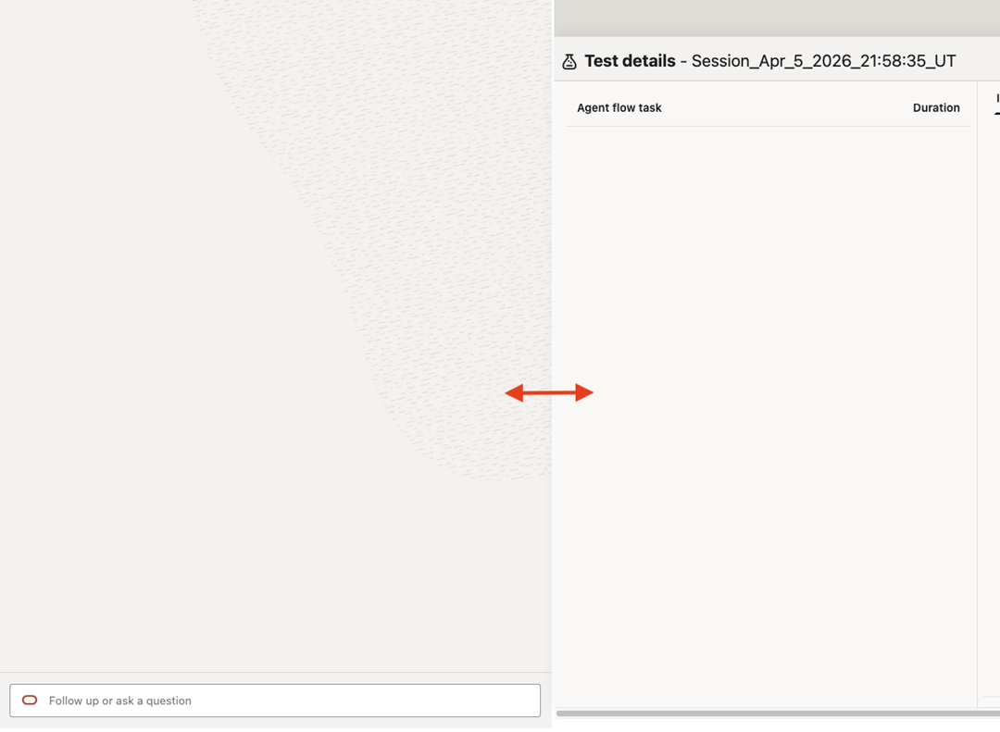
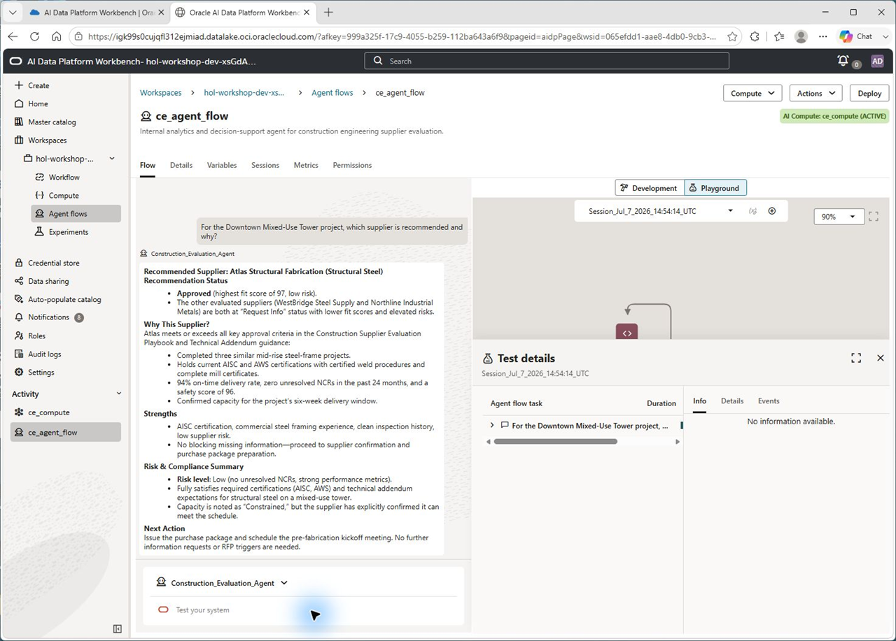
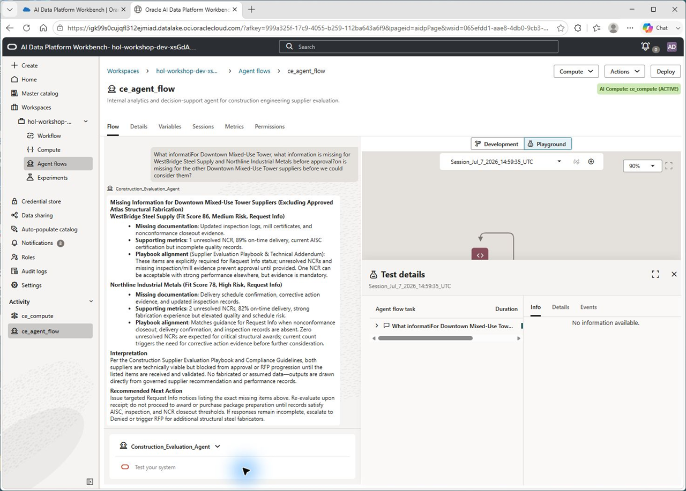
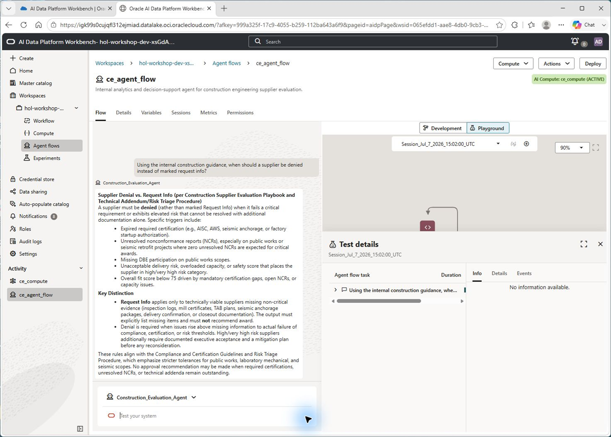
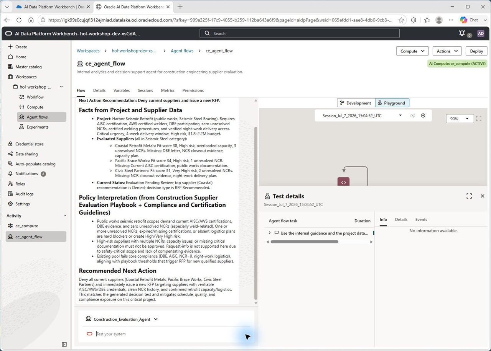
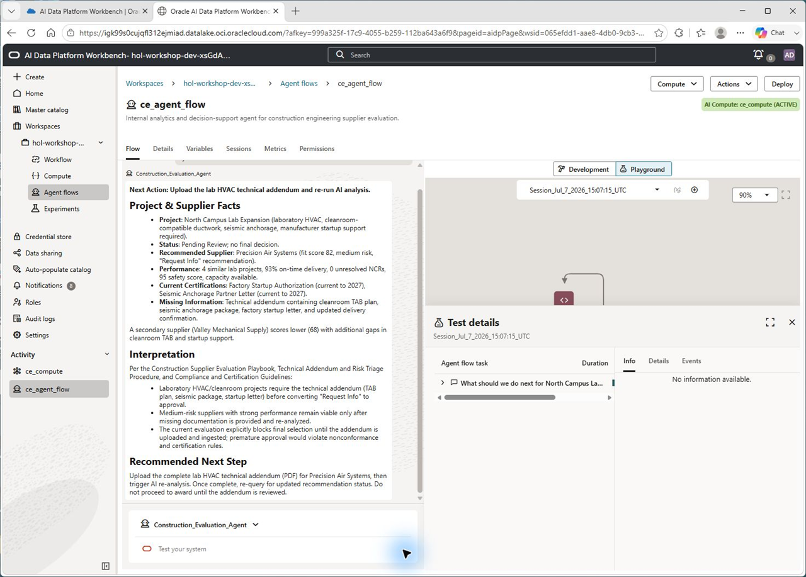
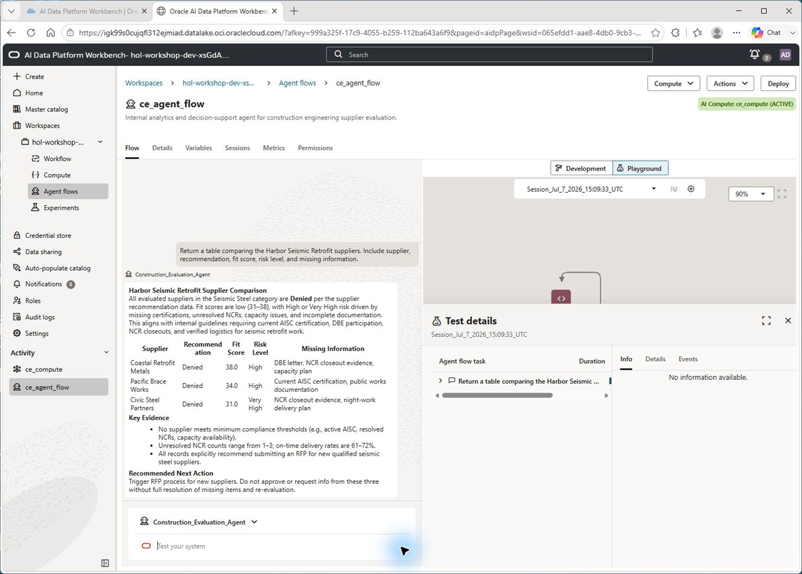

# Lab 3: Validate the Agent Flow

## Introduction

The agent is built. Now it's time to test it in the Agent Flow Playground. The tests in this lab exercise SQL-only lookup, missing information analysis, RAG-only policy guidance, hybrid RAG-plus-SQL decision support, and structured tabular output.

Pay close attention to how the agent decides which tools to call and how it separates facts from interpretation.

**Estimated Time:** 15 Minutes

### Objectives

In this lab you will:

1. Open the Agent Flow Playground.
2. Test an approval scenario for Downtown Mixed-Use Tower.
3. Test missing-information analysis for supplier follow-up.
4. Test a RAG-only compliance policy question.
5. Test a hybrid RAG-plus-SQL decision for Harbor Seismic Retrofit.
6. Test a technical addendum scenario for North Campus Lab Expansion.
7. Test structured table output.

### Prerequisites

This lab assumes you have:

* Completed Lab 2.
* The agent flow attached to an active AI Compute.
* One RAG tool and five SQL tools configured and connected to the agent node.

## Task 1: Open the Playground

1. From the agent flow canvas, click **Playground** above the canvas.

2. The session is now active. Type natural language questions in the **Test your system** input. Submit the prompt with **Shift+Enter** and watch the tool call indicators as the agent reasons, calls tools, and responds.

3. You can widen the chat session window by dragging the vertical divider.

    

## Task 2: Test Supplier Approval

Ask the agent to evaluate the recommended supplier for a project with a clean approval path.

```
<copy>
For the Downtown Mixed-Use Tower project, which supplier is recommended and why?
</copy>
```

The agent should:

- Call `get_supplier_recommendations` with `Downtown Mixed-Use Tower` or a similar project-name parameter.
- Identify **Atlas Structural Fabrication** as approved.
- Mention fit score **97**, low risk, current AISC/AWS documentation, strong delivery history, zero unresolved NCRs, and confirmed capacity.
- Avoid inventing any supplier evidence that is not returned by the SQL tool.

    

## Task 3: Test Missing Information Follow-Up

Now ask about candidates that are not ready for approval.

```
<copy>
What information is missing for the other Downtown Mixed-Use Tower suppliers before we could consider them?
</copy>
```

The agent should:

- Use project context from the previous question or call `get_missing_supplier_information`.
- Identify **WestBridge Steel Supply** and **Northline Industrial Metals** as request-info candidates.
- List missing inspection logs, mill certificates, nonconformance closeout evidence, delivery schedule confirmation, corrective action evidence, or updated inspection records as applicable.
- Keep the recommendation at request-info rather than approval.

    

## Task 4: Test RAG-Only Compliance Guidance

Ask a policy question that should be answered from the knowledge base rather than the database.

```
<copy>
Using the internal construction guidance, when should a supplier be denied instead of marked request info?
</copy>
```

The agent should:

- Call `construction_policy_rag`.
- Explain denial triggers such as expired required certification, missing DBE participation for public works, unresolved NCRs, overloaded capacity on a critical schedule, or unacceptable delivery risk.
- Avoid calling SQL unless it needs project-specific facts.

    

## Task 5: Test Hybrid RAG + SQL Decision Support

Now combine internal guidance with structured supplier data.

```
<copy>
Use the internal guidance and the project data to recommend the next action for Harbor Seismic Retrofit.
</copy>
```

The agent should:

- Call `construction_policy_rag` for decision criteria.
- Call `get_supplier_recommendations` and/or `get_project_decision_context` for Harbor Seismic Retrofit.
- Explain that current seismic steel suppliers should be denied and a new RFP should be submitted.
- Cite the specific blockers: missing DBE documentation, expired AISC certification, unresolved weld NCRs, no verified night-work plan, and high or very high risk.

    

## Task 6: Test Technical Addendum Scenario

Test whether the agent recognizes a pending document scenario.

```
<copy>
What should we do next for North Campus Lab Expansion and Precision Air Systems?
</copy>
```

The agent should:

- Call `get_supplier_recommendations` or `get_project_decision_context` for North Campus Lab Expansion.
- Recognize **Precision Air Systems** as the leading request-info candidate with fit score **82** and medium risk.
- Explain that the updated technical addendum is required before final approval.
- Mention expected addendum evidence such as TAB plan, seismic anchorage package, factory startup letter, and updated delivery confirmation.

    

## Task 7: Test Structured Output

Ask for a table so the agent must restructure SQL results.

```
<copy>
Return a table comparing the Harbor Seismic Retrofit suppliers. Include supplier, recommendation, fit score, risk level, and missing information.
</copy>
```

The agent should:

- Call `get_supplier_recommendations` for Harbor Seismic Retrofit.
- Return a clean table for **Coastal Retrofit Metals**, **Pacific Brace Works**, and **Civic Steel Partners**.
- Preserve the denial status and missing-information details.

    

## Task 8: Reflect on the Agent's Behavior

Consider what the agent demonstrated:

1. **Tool selection**: It used SQL for project and supplier facts, RAG for policy, and both for decision support.
2. **Grounding**: It tied recommendations to structured evidence and internal guidance.
3. **Missing-data discipline**: It did not approve suppliers when critical documents were missing.
4. **Output flexibility**: It adapted from narrative explanation to table format.

> **Discussion prompt**: "If this agent were available to your construction engineering team today, which supplier decision or project risk review would you automate first?"

## Lab 3 Recap

In this lab, you validated the Construction Engineering Supplier Evaluation Agent across realistic scenarios:

- Supplier approval with evidence.
- Missing information follow-up.
- RAG-only compliance guidance.
- Hybrid RAG-plus-SQL decision support.
- Technical addendum triage.
- Structured supplier comparison output.

In the next lab, you'll deploy the agent to a production endpoint.
