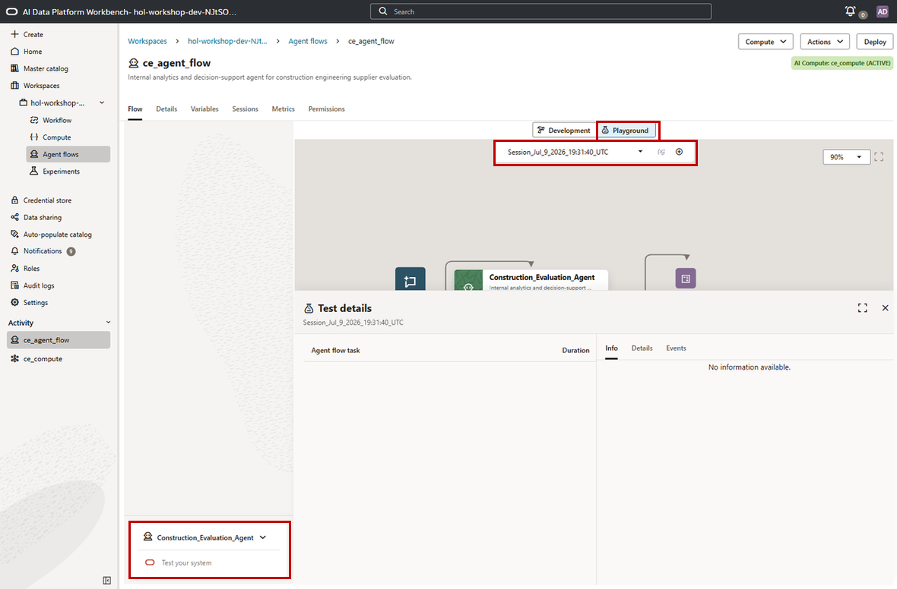
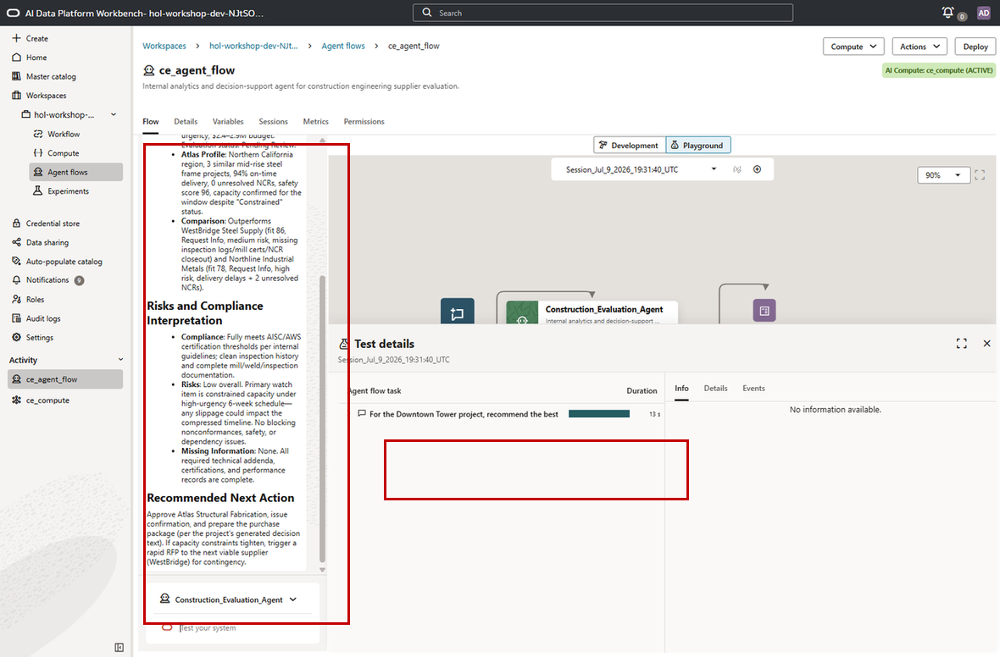
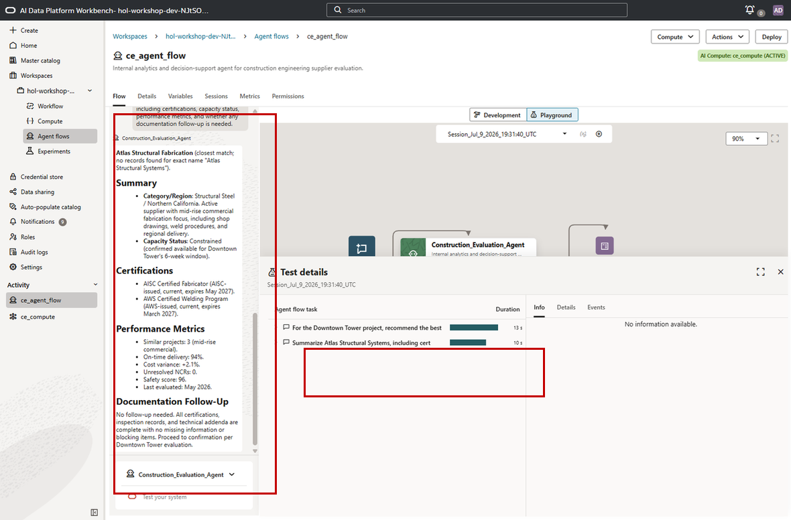
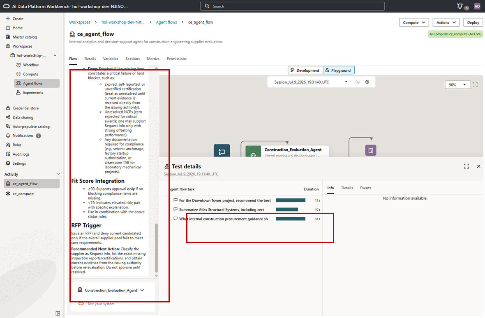

# Lab 3: Validate the Agent Flow

## Introduction

The agent is built - now it is time to see it in action. In this lab, you will use the Agent Flow Playground to test the Construction Engineering Supplier Evaluation Agent with realistic questions that span project context, supplier profile evidence, procurement guidance, compliance requirements, and supplier recommendation decisions.

Each test is designed to exercise a different combination of the agent's tools: SQL for governed project and supplier facts, RAG for internal policy guidance, and both together when the agent needs to turn evidence into a recommendation.

Pay close attention to how the agent decides which tools to call, how it identifies the right supplier and project records, and how it separates facts from interpretation before synthesizing results into clear, actionable construction engineering guidance.

**Estimated Time:** 15 Minutes

### Objectives

In this lab you will:

1. Open the Agent Flow Playground.
2. Test a project recommendation scenario using SQL-backed project and supplier data.
3. Test a supplier profile scenario using certification and performance data.
4. Test a policy guidance scenario using the construction knowledge base.
5. Reflect on the agent's tool selection, grounding, and decision discipline.

### Prerequisites

This lab assumes you have:

* Completed Lab 2.
* The agent flow attached to an active AI Compute.
* A Chat Trigger, one RAG tool, and three SQL tools configured and connected to the agent node.

## Task 1: Open the Playground

The Playground is a built-in testing environment where you can create sessions and have conversations with your agent flow before deploying it to production.

1. From the agent flow canvas, click **Playground** located just above the canvas. This reveals the Playground panel.

2. Confirm that a session is selected. You can use the generated session or click **Create New Session**.

    

3. Type natural language questions in the chat input. Press **Ctrl+Enter** to submit the prompt. The agent will reason, call tools, and respond just as it would after deployment.

    > **Tip:** As you test, watch the task details panel. The Playground shows which tools the agent invokes, what parameters it passes, and what data comes back. This transparency is invaluable for understanding and debugging the agent's reasoning.

## Task 2: Test Project Recommendation

Ask the agent to recommend the best supplier for a project and explain its reasoning.

```
<copy>
For the Downtown Tower project, recommend the best supplier and explain the key risks, missing information, and next action.
</copy>
```

The agent should:

- Use SQL tools for project context and supplier recommendations.
- Identify Atlas Structural Fabrication or the closest matching Atlas supplier as the best fit for the Downtown project.
- Mention evidence such as fit score, risk level, current certifications, delivery history, unresolved NCRs, capacity, and missing information.
- Separate factual evidence from its recommended next action.



> Observe the behavior: The agent uses structured SQL data to identify the recommended supplier, then explains the approval rationale with concrete evidence such as fit score, risk level, certifications, NCR history, and capacity. It does not invent supplier evidence that is not returned by the tools.

## Task 3: Test Supplier Profile Evidence

Now ask for a supplier profile. This test checks whether the agent can retrieve supplier-level certification and performance details without requiring a project recommendation question.

```
<copy>
Summarize Atlas Structural Systems, including certifications, capacity status, performance metrics, and whether any documentation follow-up is needed.
</copy>
```

The agent should:

- Call `get_supplier_profile` with an Atlas supplier-name parameter.
- Summarize the supplier category, region, capacity status, certifications, and performance metrics.
- Mention whether any documentation follow-up is needed.
- Clearly note if it uses a closest match when the exact supplier name does not appear in the data.



> Observe the behavior: The agent resolves a supplier-name question into structured supplier data, then explains profile evidence in business language. It preserves uncertainty when the exact user-entered name is not an exact database match.

## Task 4: Test Policy Guidance

Ask a policy question that should use the knowledge base rather than only project tables.

```
<copy>
What internal construction procurement guidance should I follow when a supplier is missing required inspection reports or certification documentation?
</copy>
```

The agent should:

- Call `construction_policy_rag` for internal guidance.
- Explain decision criteria for missing inspection reports, certifications, corrective action evidence, or other required documents.
- Discuss when request-info, denial, or RFP escalation may be appropriate.
- Avoid treating policy guidance as a specific supplier approval unless project or supplier facts are also provided.



> Observe the behavior: The agent answers from internal construction guidance because the question asks about procurement policy and decision criteria. It may connect the guidance to supplier evaluation concepts, but it should not fabricate project-specific facts.

## Task 5: Reflect on the Agent's Behavior

Before moving on, take a moment to consider what the agent demonstrated across the test session.

1. **Tool selection**: The agent automatically determined which tools to call based on each question - SQL for project and supplier facts, RAG for procurement and compliance guidance, and RAG-plus-SQL for decision-support questions.
2. **Context grounding**: The agent connected structured supplier and project data with internal construction engineering guidance to produce recommendations grounded in both database facts and authoritative documents.
3. **Missing-data discipline**: The agent identified gaps in required documentation and avoided approving suppliers when critical information was missing or unresolved.
4. **Output flexibility**: The agent adapted its response format from evidence summaries to policy guidance based on the user's question.
5. **Decision support**: The agent synthesized evidence into clear, actionable recommendations such as approve, request more information, deny, or escalate to RFP review.

> **Discussion prompt**: "If this agent were available to your team today, what would be the first question you would ask? What additional data sources or tools would make it more useful?"

## Lab 3 Recap

In this lab, you validated the Construction Engineering Supplier Evaluation Agent across realistic supplier and project scenarios:

* Supplier approval recommendations supported by structured evidence
* Supplier certification and performance profile lookup
* RAG-based procurement and compliance guidance from internal construction engineering documents
* Decision support that separates facts, interpretation, and recommended next action

The agent successfully combined RAG, using internal procurement and compliance documents, with SQL, using structured supplier and project data, to support the kinds of supplier evaluation, risk review, and documentation follow-up questions construction engineering teams handle every day. In the next lab, you will deploy the agent to a production endpoint.

## Acknowledgements

* **Author** - TODO: Your Name, Your Title, Your Organization
* **Last Updated By/Date** - TODO: Your Name, Month Year
