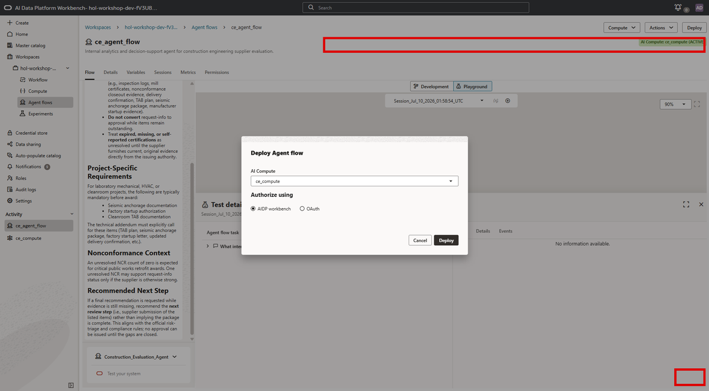
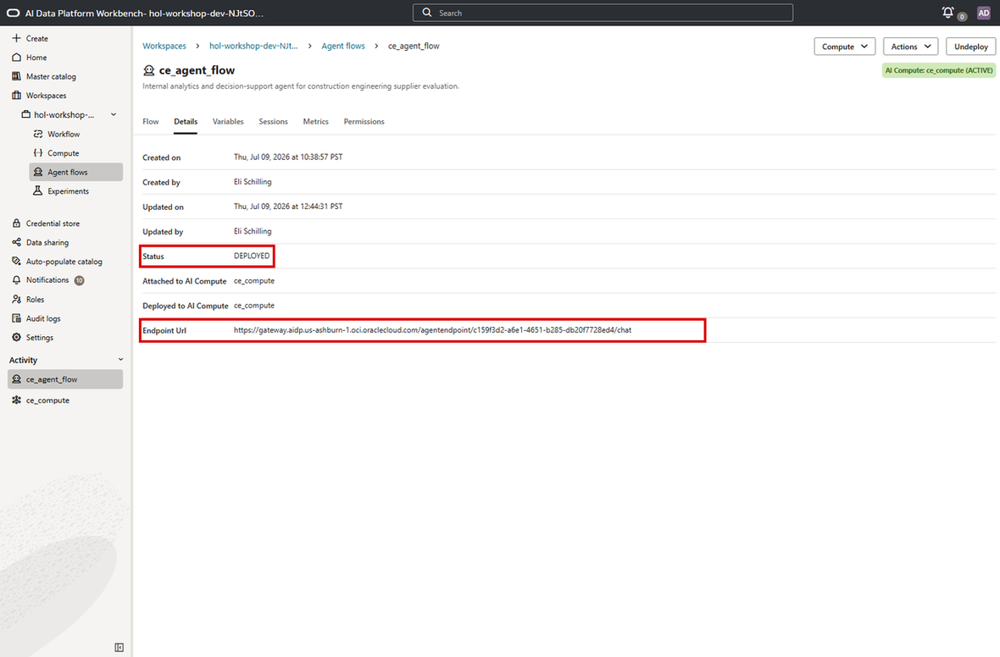

# Lab 4: Deploy the Agent Flow

## Introduction

You have built and validated the Construction Procurement Evaluation Agent. The final step is to deploy it to a production endpoint so it can be accessed by applications, integrations, and users beyond the Playground.

Deployment transforms the agent from a development artifact into a live service that project management, procurement, quality, and executive teams can access through internal tools, dashboards, or custom applications.

**Estimated Time:** 5 Minutes

### Objectives

In this lab you will:

1. Deploy the agent flow to an AI Compute.
2. Retrieve the production endpoint URL.
3. Understand how the deployed agent can be consumed via REST API.

### Prerequisites

This lab assumes you have:

* Completed Lab 3.
* An active AI Compute.
* A fully configured and tested agent flow.

## Task 1: Deploy the Agent Flow

1. From the agent flow page, click **Deploy** in the upper right corner.

2. In the deployment dialog, confirm **AI Compute** is set to **`ce_compute`**. Leave **AIDP workbench** selected under **Authorize using** unless your instructor provides a different authorization approach.

    

3. Click **Deploy** and wait for the deployment to complete. Deployment is asynchronous, but it usually completes quickly. When deployment succeeds, the upper-right button changes from **Deploy** to **Undeploy**.

## Task 2: Retrieve the Chat Endpoint URL

Once the deployment is successful, you need to retrieve the production URL that applications will use to communicate with the agent.

1. Navigate to the **Details** tab of your agent flow.

2. Confirm the **Status** is **DEPLOYED**. Then locate the **Chat endpoint URL**. This is the production URL of your deployed agent flow for chat-style requests. Copy this URL - it is the address that external applications, scripts, or integration tools will use to send messages to the agent.

    

3. Note that the deployed agent is now a live REST endpoint. It accepts messages and returns responses using the same reasoning, tools, and knowledge that you validated in the Playground.

## Task 3: Understand REST API Consumption

Once deployed, the agent flow endpoint can be called programmatically via `curl`, Python, or any HTTP client. While executing REST API calls is beyond the scope of this workshop, the integration model follows the same pattern used by other OCI-protected services.

1. **Authentication**: Callers authenticate with OCI request signing or an approved session mechanism. OCI IAM policies determine who can access the agent endpoint.

2. **Sending messages**: Callers send a POST request to the endpoint URL with a JSON body containing the user's message. For example:

    ```json
    {
      "message": "Which supplier is recommended for Downtown Tower and what evidence supports approval?"
    }
    ```

3. **Conversational context**: After the first message, the API can return a conversation or room identifier. Subsequent requests can include that identifier to maintain context across turns, similar to the multi-turn Playground session you tested in Lab 3.

4. **Integration options**: The endpoint can be integrated with internal dashboards, Slack bots, custom web apps, Oracle Digital Assistant, or any tool that can make HTTP requests. This means project management, procurement, quality, and executive teams can access the agent from the tools they already use.

> **Key takeaway**: Deployment turns your agent from a prototype into a production service. The REST endpoint makes it accessible to applications and integrations, while OCI IAM helps ensure that only authorized users and systems can access it. The same governed data, RAG knowledge base, and SQL tools you validated in the Workbench carry through to the deployed agent.

## Lab 4 Recap

In this lab, you completed the final step of the end-to-end agent development lifecycle:

- You **deployed** the agent flow to an AI Compute, creating a live production endpoint.
- You **retrieved the endpoint URL** that applications and integrations use to communicate with the agent.
- You **understand the REST API model** for consuming the agent, including authentication, message format, conversational context, and integration options.

The Construction Procurement Evaluation Agent is now a production-ready service that can support governed project and supplier decisions across your organization.

## Acknowledgements

* **Author** - Eli Schilling, Cloud Architect || Evangelist
* **Contributors** - ONA Lab Engineering team
* **Last Updated By/Date** - Eli Schilling, July 2026
