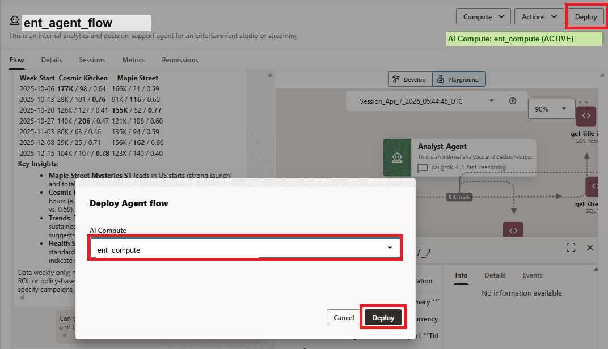
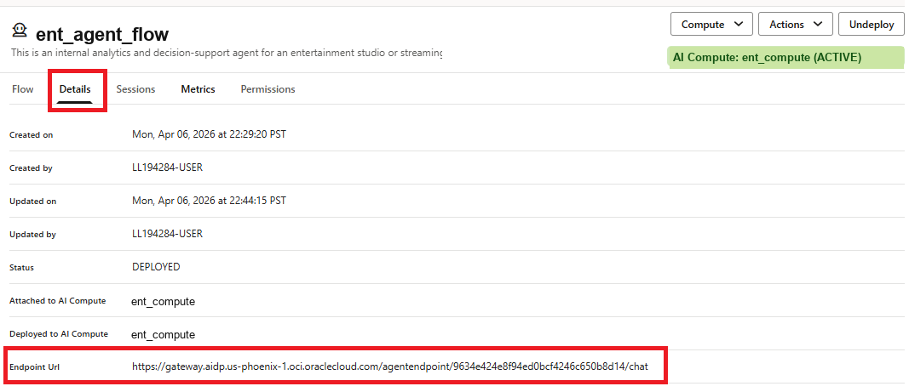

# Lab 4: Deploy the Agent Flow

## Introduction

You've built and validated the Construction Engineering Supplier Evaluation Agent. The final step is to deploy it to a production endpoint so it can be accessed by applications, integrations, and users beyond the Playground.

Deployment transforms the agent from a development artifact into a live service that project management, procurement, quality, and executive teams can access through internal tools, dashboards, or custom applications.

**Estimated Time:** 5 Minutes

### Objectives

In this lab you will:

1. Deploy the agent flow to an AI Compute.
2. Retrieve the production endpoint URL.
3. Understand how the deployed agent can be consumed via REST API.

### Prerequisites

This lab assumes you have:

* Completed Lab 3.
* An active AI Compute.
* A fully configured and tested agent flow.

## Task 1: Deploy the Agent Flow

1. From the agent flow canvas, click **Deploy** in the upper right corner.

2. In the deployment dialog, select the same AI Compute you created in Lab 1: **`ce_compute`**. If the dialog already defaults to **`ce_compute`** and **AIDP workbench** authorization, leave those values as-is.

3. Click **Deploy** and wait for the deployment to complete.

    

## Task 2: Retrieve the Endpoint URL

1. Navigate to the **Details** tab of your agent flow.

2. Locate the **Endpoint URL** and copy it.

    

3. Note that the deployed agent is now a live REST endpoint that uses the same tools and knowledge you validated in the Playground.

## Task 3: Understand REST API Consumption

Once deployed, the agent flow endpoint can be called programmatically via `curl`, Python, or any HTTP client.

1. **Authentication**: Callers authenticate via OCI request signing or session cookies. OCI IAM policies determine who can access the agent.

2. **Sending messages**: Callers send a POST request to the endpoint URL with a JSON body containing the user's message. For example:

    ```json
    {
      "message": "Which supplier is recommended for Downtown Mixed-Use Tower and what evidence supports approval?"
    }
    ```

3. **Conversational context**: After the first message, the API returns a `roomID`. Subsequent requests can include this `roomID` to maintain conversational context across turns.

4. **Integration options**: The endpoint can be integrated with internal dashboards, Slack bots, custom web apps, Oracle Digital Assistant, or any tool that can make HTTP requests.

    > **Key takeaway**: Deployment turns your agent from a prototype into a production service. The REST endpoint makes it accessible to applications and integrations while OCI IAM and AIDP governance protect access.

## Lab 4 Recap

In this lab, you completed the final step of the end-to-end agent development lifecycle:

- You deployed the agent flow to an AI Compute.
- You retrieved the endpoint URL.
- You reviewed the REST API model for consuming the agent.

The Construction Engineering Supplier Evaluation Agent is now a production-ready service that can support governed project and supplier decisions.
