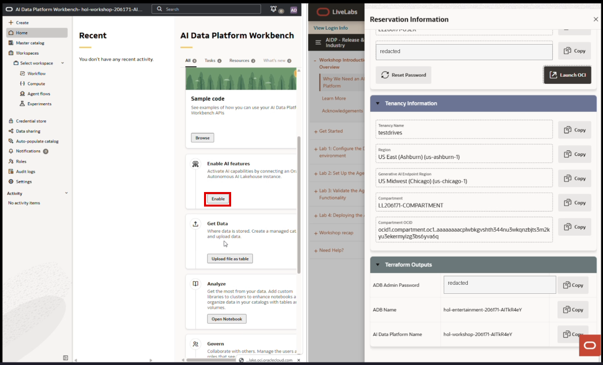
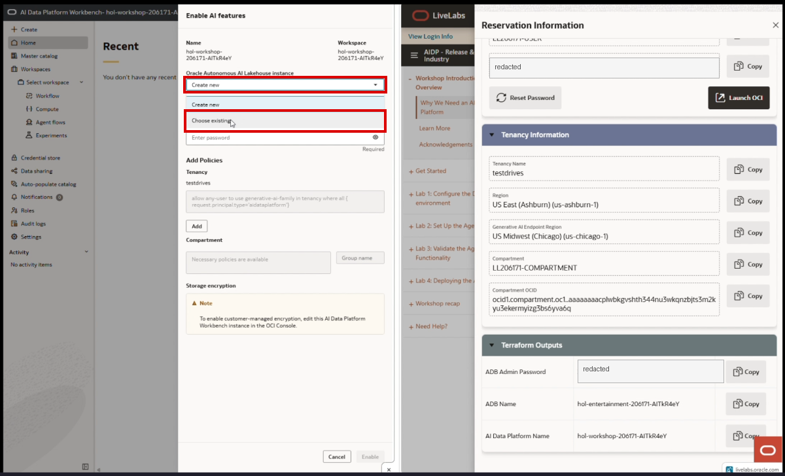
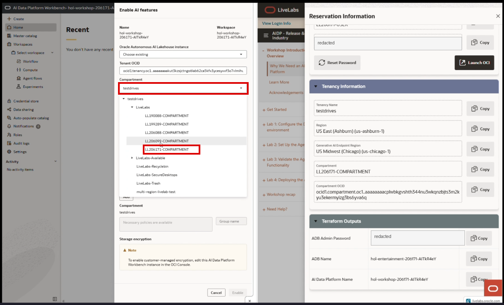
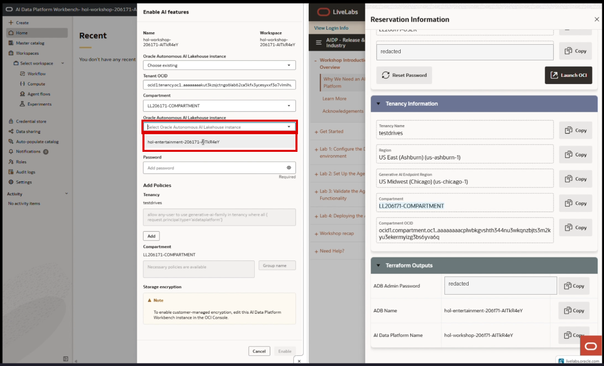
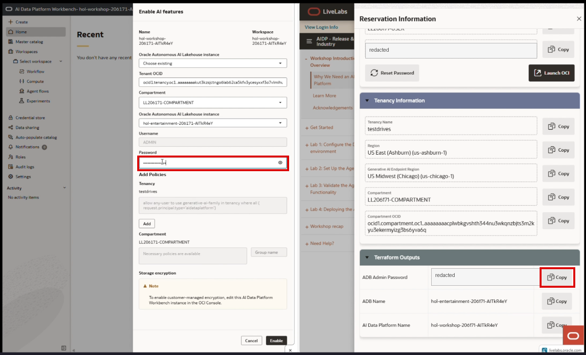
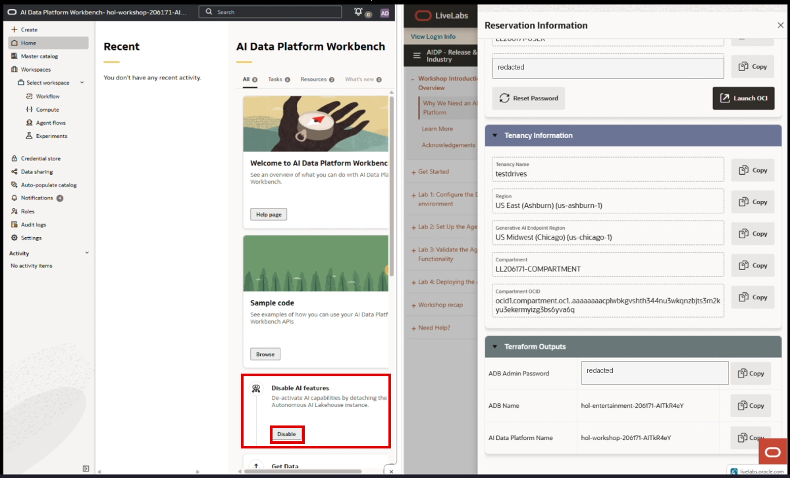
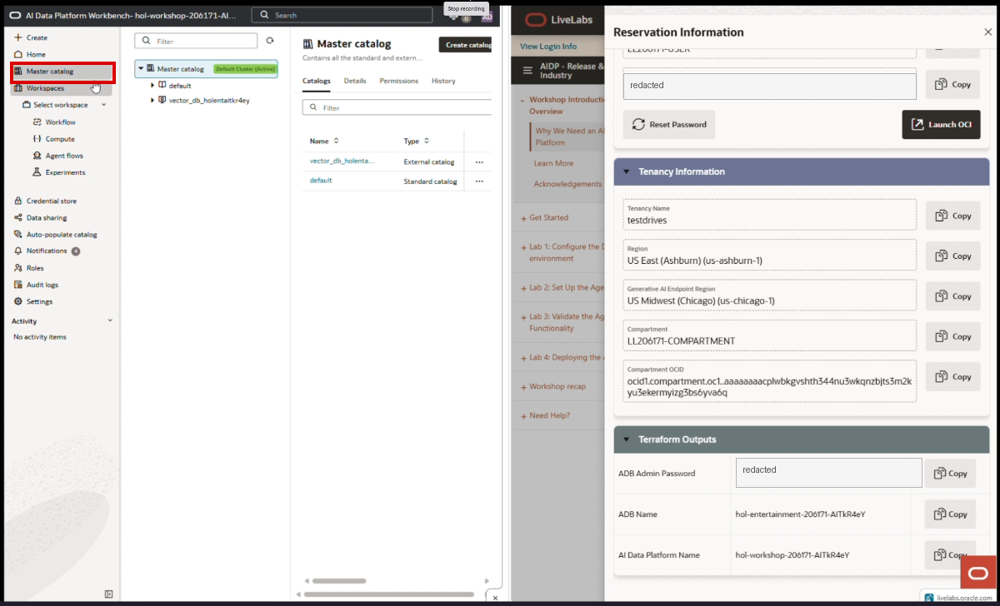
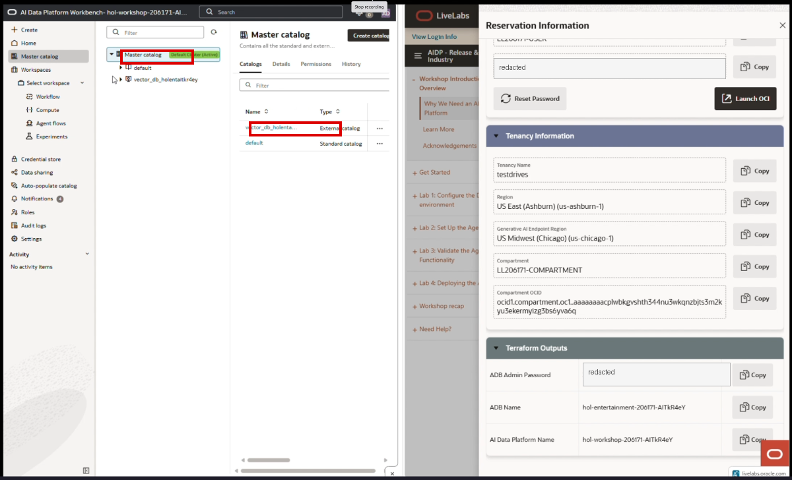

# Enable AI Features in AI Data Platform

These instructions were created from the supplied recording. Values shown in the UI vary by LiveLabs reservation; use the values from your own LiveLabs panel and Terraform outputs. Screenshot password values have been redacted.

## Prerequisites

- The AI Data Platform Workbench is open.
- The Autonomous AI Lakehouse database has already been created by Terraform.
- The LiveLabs panel is open to **Reservation Information** and shows the **Tenancy Information** and **Terraform Outputs** sections.
- You have the Terraform output named **ADB Admin Password** available.

## Steps

1. On the Workbench home page, find the **Enable AI features** card and click **Enable**.

   

2. In the **Enable AI features** panel, open the **Oracle Autonomous AI Lakehouse instance** dropdown and choose **Choose existing**.

   

3. Wait for the **Compartment** dropdown to load. Open it and select the workshop compartment shown in the LiveLabs panel, for example `LL<reservation>-COMPARTMENT`.

   

4. Open the second **Oracle Autonomous AI Lakehouse instance** dropdown and select the Autonomous Database created for the workshop. Match it to the **ADB Name** Terraform output.

   

5. Confirm **Username** is `ADMIN`. In the LiveLabs **Terraform Outputs** section, click **Copy** for **ADB Admin Password**, then paste it into the **Password** field in the Workbench panel.

   

6. In **Add Policies**, confirm the required tenancy and compartment policy status is satisfied. In the recording, no policy is added manually; the wizard already reports the necessary policies are available. Click **Enable**.

   

7. Wait for the Workbench to finish enabling the features. The home page returns to the card view and the card changes to **Disable AI features**, which confirms AI features are attached.

   

8. Click **Master catalog** in the left navigation.

   

9. Verify the master catalog shows the default cluster as active and an external catalog for the database, typically named with the pattern `vector_db_<adb-name>`.

   

## Notes

- If **Enable** remains disabled, re-check that a compartment, Autonomous AI Lakehouse instance, and password have all been supplied.
- If the compartment or database dropdown does not populate immediately, wait a few seconds and reopen the dropdown.
- The visible names in the screenshots are examples from the recording; workshop reservation IDs and database names will differ.
