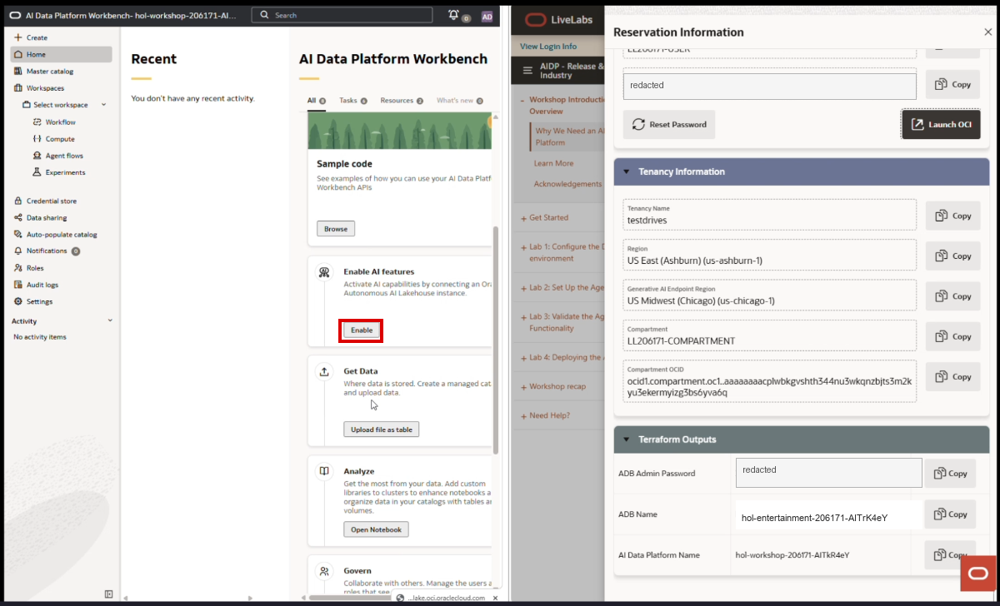
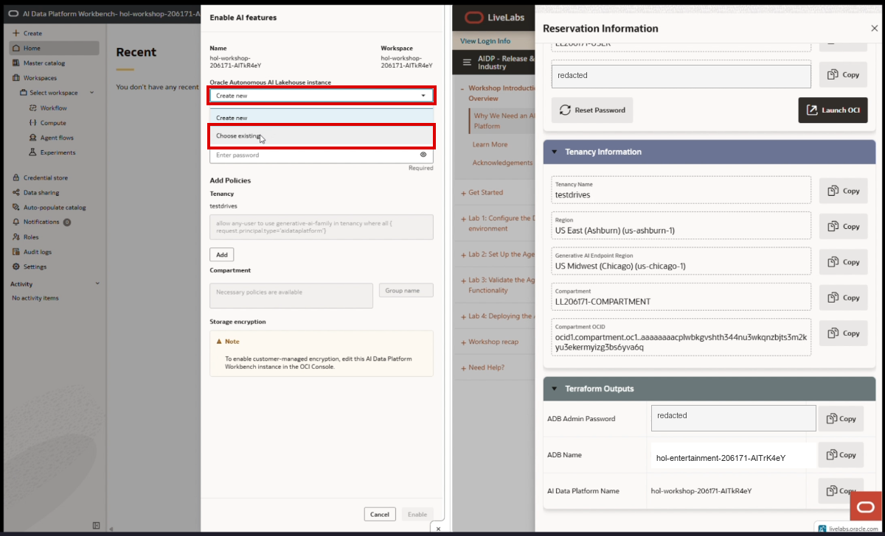
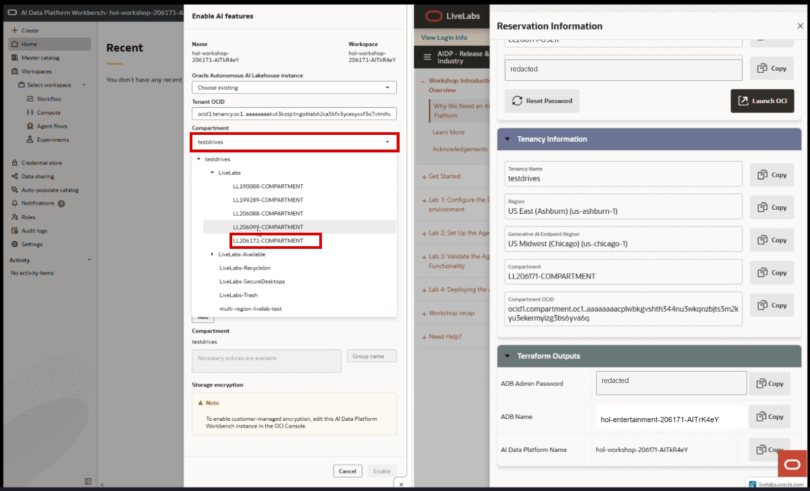
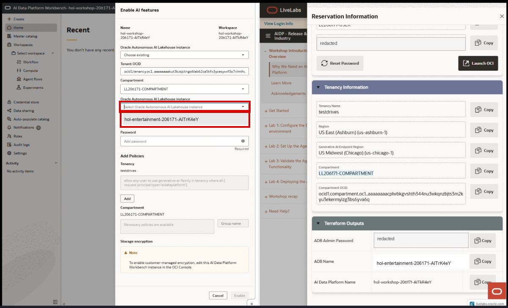
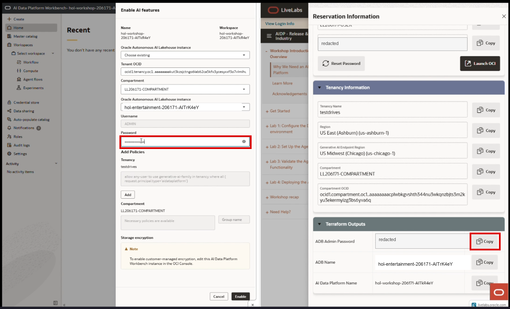
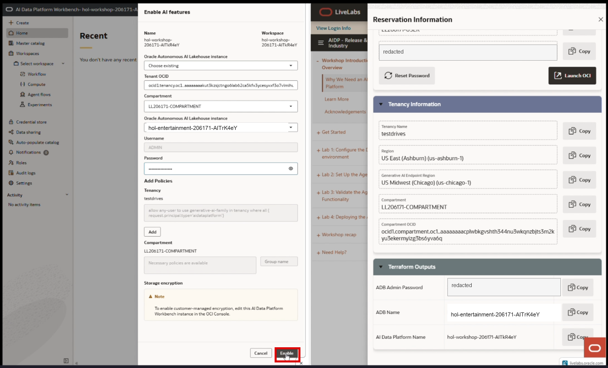
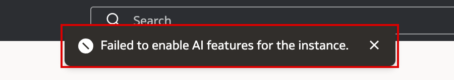
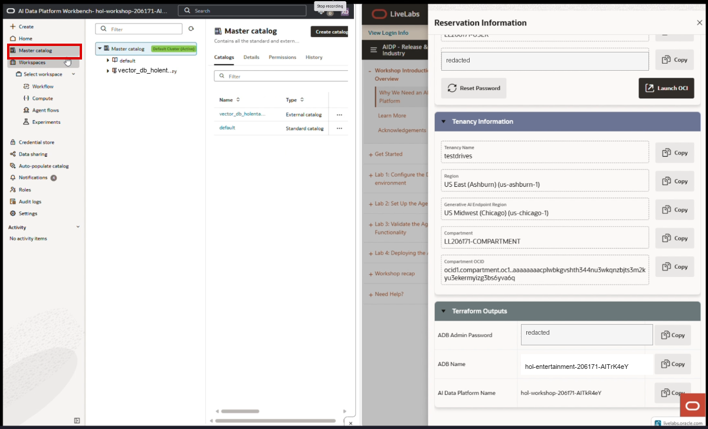

# Enable AI Features in AI Data Platform

## Introduction

First things first, let's flip the right switches in Oracle AI Data Platform (AIDP) so the Workbench can use the Autonomous AI Lakehouse behind the scenes. Once AI features are enabled, the Workbench can create the external catalog connection that powers the agentic functionality you will build later in the workshop.

Values shown in the UI vary by LiveLabs reservation; use the values from your own LiveLabs Credentials window and Terraform outputs. Screenshot password values have been redacted.

Estimated Time: 5 minutes

### Objectives

In this section, you will:

- Enable AI features in the AIDP Workbench.
- Connect the Workbench to the Autonomous AI Lakehouse created for your reservation.
- Verify the external catalog was created in the Master Catalog.

## Prerequisites

This section assumes you have:

- The LiveLabs Credentials window open with access to the **ADB Admin Password**.
- A browser tab open for the AIDP Workbench.

## Task 1: Enable AI Features

1. On the Workbench home page, find the **Enable AI features** card and click **Enable**.

    

2. In the **Enable AI features** panel, open the **Oracle Autonomous AI Lakehouse instance** dropdown and choose **Choose existing**.

    

    Leave the auto-populated **Tenant OCID** and **Region** fields as-is.

3. Wait for the **Compartment** dropdown to load. Open it and select the workshop compartment shown in the LiveLabs panel, for example `LL<reservation>-COMPARTMENT`. Expand the compartment tree and click the exact compartment row. If you type the compartment name into the field, confirm the dropdown actually selects the row; typed text alone may not commit the selection.

    

4. Open the second **Oracle Autonomous AI Lakehouse instance** dropdown and select the Autonomous Database created for the workshop. Match it to the **ADB Name** Terraform output.

    

5. Confirm **Username** is `ADMIN`. In the LiveLabs **Terraform Outputs** section, click **Copy** for **ADB Admin Password**, then paste it into the **Password** field in the Workbench panel.

    

6. In **Add Policies**, confirm the required tenancy and compartment policy status is satisfied. In the recording, no policy is added manually; the wizard already reports the necessary policies are available. Click **Enable**.

    

    > **Note:** You may briefly see a message that says **Failed to enable AI features for the instance**. In this LiveLabs sandbox flow, this is an erroneous error message and should be ignored. Continue waiting for the enablement process to finish.

    

7. Wait for the Workbench to finish enabling the features. The home page returns to the card view and the card changes to **Disable AI features**, which confirms AI features are attached.

    

    > **Note:** Enabling AI features usually takes **5-7 minutes** in the LiveLabs sandbox. The async operations may show success before the home page refreshes its status. If the card still says **Enabling...** after the operations complete, perform a hard browser refresh and confirm the card now says **Disable AI features** before continuing.

8. Click **Master catalog** in the left navigation.

    

9. Verify the master catalog shows the default cluster as active and an external catalog for the database, typically named with the pattern `vector_db_<adb-name>`.

   

## Troubleshooting

- If **Enable** remains disabled, re-check that a compartment, Autonomous AI Lakehouse instance, and password have all been supplied.
- If the compartment or database dropdown does not populate immediately, wait a few seconds and reopen the dropdown.
- The visible names in the screenshots are examples from the recording; workshop reservation IDs and database names will differ.

## Acknowledgements

* **Author** - TODO: Your Name, Your Title, Your Organization
* **Last Updated By/Date** - TODO: Your Name, Month Year
