# Enable AI Features and Populate the Catalog

## Introduction

This lab guides you through enabling AI features in an Oracle AI Data Platform (AIDP) Workbench, connecting the Workbench to the Autonomous AI Lakehouse (ALH) provisioned for this workshop, and using the Master Catalog to organize data for later notebooks, jobs, and agent flows. You will verify the external catalog created from the connected ALH, then create a standard catalog and populate it with structured and unstructured supplier data.

Estimated Time: 45 minutes

### Objectives

In this lab, you will:

- Enable AI features in an AIDP Workbench.
- Connect AIDP to the existing Autonomous AI Lakehouse provisioned for this workshop.
- Verify the Master Catalog and the external catalog created for the connected ALH.
- Review the available foundation models in the Master Catalog.
- Create a standard catalog.
- Manage data by creating schemas, tables, and volumes.

### Prerequisites

This lab assumes you have:

- Access to your LiveLabs reservation and the assigned OCI tenancy.
- An AIDP Workbench and Autonomous AI Lakehouse provisioned for the workshop.
- The **ADB Admin Password** and **ADB Name** values from the LiveLabs **Terraform Outputs** section.

## Task 1: Enable AI Features in AIDP Workbench

AI features activate additional Workbench capabilities by attaching an Oracle Autonomous AI Lakehouse instance. In this workshop, the Autonomous AI Lakehouse was provisioned automatically, so you will connect the Workbench to that existing database.

1. On the Workbench home page, find the **Enable AI features** card and click **Enable**.

    

2. In the **Enable AI features** panel, open the **Oracle Autonomous AI Lakehouse instance** dropdown and choose **Choose existing**.

    

3. Wait for the **Compartment** dropdown to load. Open it and select the workshop compartment shown in the LiveLabs panel, for example `LL<reservation>-COMPARTMENT`.

    

4. Open the second **Oracle Autonomous AI Lakehouse instance** dropdown and select the Autonomous Database created for the workshop. Match it to the **ADB Name** Terraform output.

    

5. Confirm **Username** is `ADMIN`. In the LiveLabs **Terraform Outputs** section, click **Copy** for **ADB Admin Password**, then paste it into the **Password** field in the Workbench panel.

    

6. In **Add Policies**, confirm the required tenancy and compartment policy status is satisfied. In this workshop, the necessary policies are already available. Click **Enable**.

    

7. Wait for the Workbench to finish enabling the features. The home page returns to the card view and the card changes to **Disable AI features**, which confirms AI features are attached.

    

8. Click **Master catalog** in the left navigation.

    

9. Verify the Master Catalog shows the default cluster as active and an external catalog for the database, typically named with the pattern `vector_db_<adb-name>`.

    

## Task 2: Access Autonomous AI Lakehouse Through an External Catalog

1. AI features in AIDP can connect the Workbench to an existing Autonomous AI Lakehouse instance or create a new one. For this workshop, the ALH was provisioned automatically, and in Task 1 you connected the Workbench to that existing resource. To access it, navigate to the **Master Catalog**.
    > **Note:** This database is also accessible from the OCI console. From the navigator select **Oracle AI Database** then **Autonomous AI Database**.

    

2. On the Master Catalog tab, select the external catalog for the connected ALH. Its name typically follows the pattern `vector_db_<adb-name>`.

    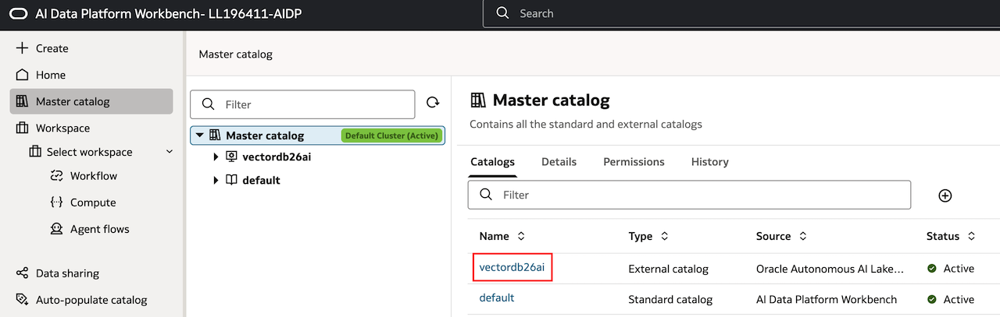

3. Select the **Details** tab. This catalog connects to the Autonomous AI Lakehouse attached when you enabled AI features, which you can confirm by looking at the details. Any data stored in this catalog will be stored in the underlying ALH.

    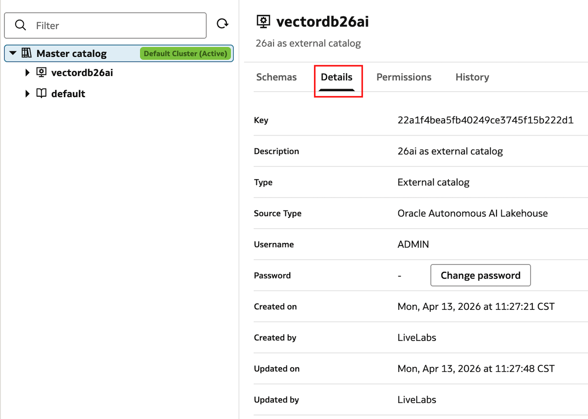

4. Select the **Actions** menu then **Rename Catalog**. Change its name to **supplier\_external\_26ai**.

    

5. Select the Master Catalog breadcrumb to return to it.

    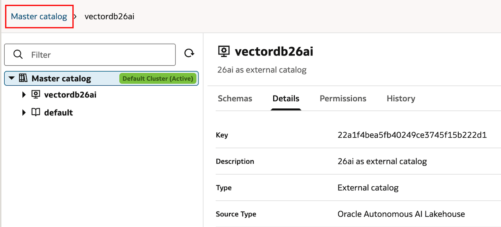

    

    
Reference: connect another external database later

    If you need to connect another existing database later, select **Create catalog**, then select **External** for **Catalog type**. This opens the dialog to define the connection to the external database. Select **Cancel** to close the dialog.

    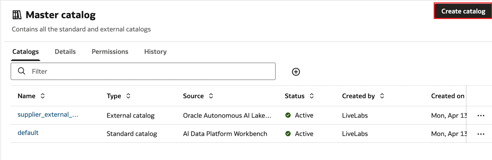

    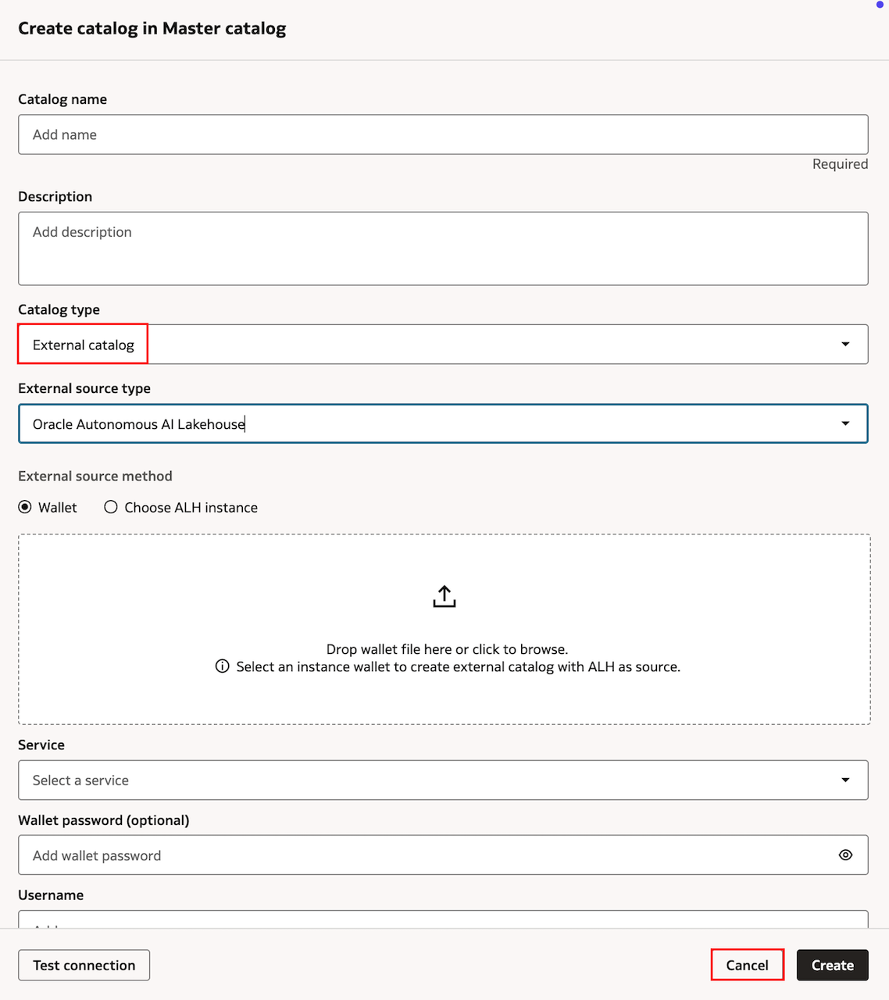
    

6. Large Language Models that you will use later are also accessible through the Master Catalog. You can view the available foundational models by expanding the **default** catalog and the **oci\_ai\_models** schema.

    

## Task 3: Create and Populate a Standard Catalog in AIDP Workbench

Next you will create a standard catalog. Data in a standard catalog is stored with the AIDP Workbench in OCI, as opposed to an external database.

1. Use the breadcrumb menu to return to the master catalog if you are not already there. Select **Create catalog**.

    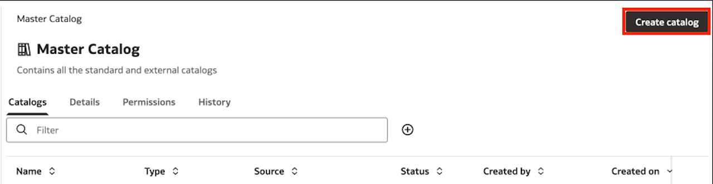

2. Enter the catalog name **Supplier**. Leave the **Catalog type** as **Standard catalog**. Select the same compartment your other lab assets are in and select **Create**.

    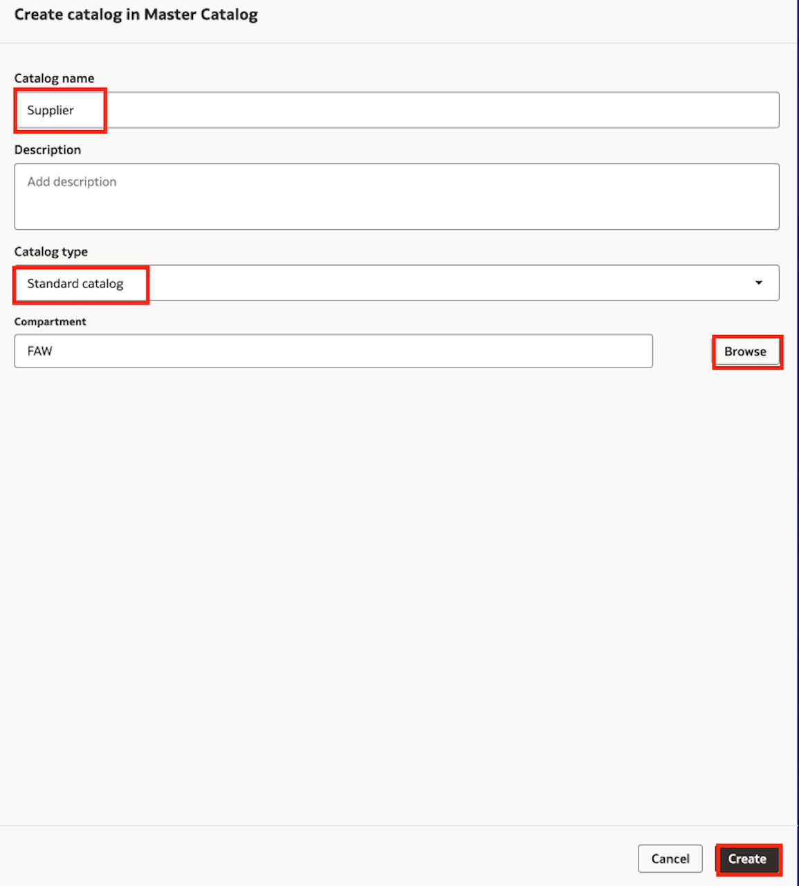

3. When the creation of the catalog is complete, select its name to access it.

    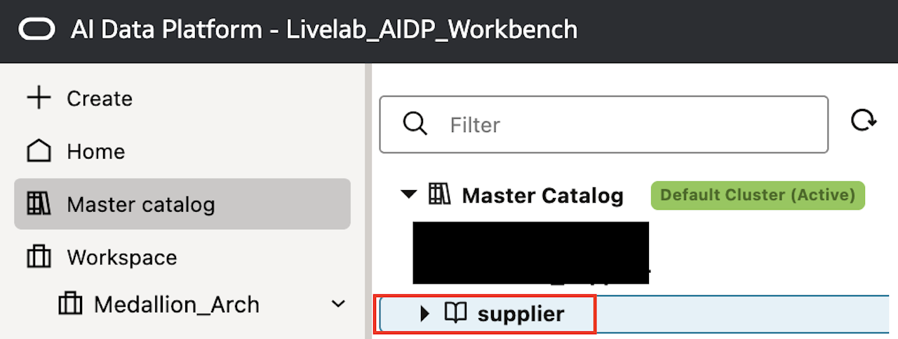

4. Select **Create schema**.

    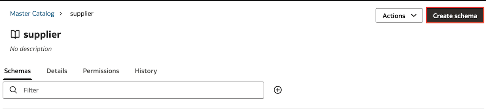

5. Enter the Schema Name **supplier\_schema** and select **Create**.

    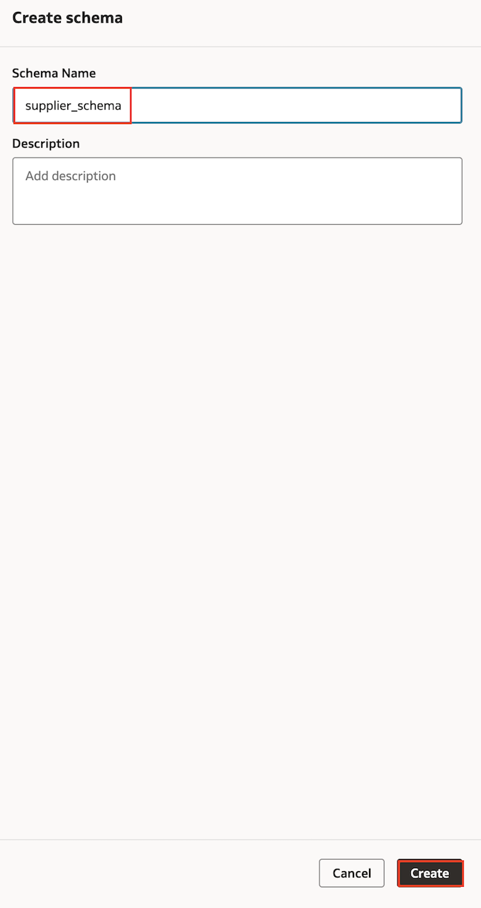

6. Select the **supplier_schema**.

    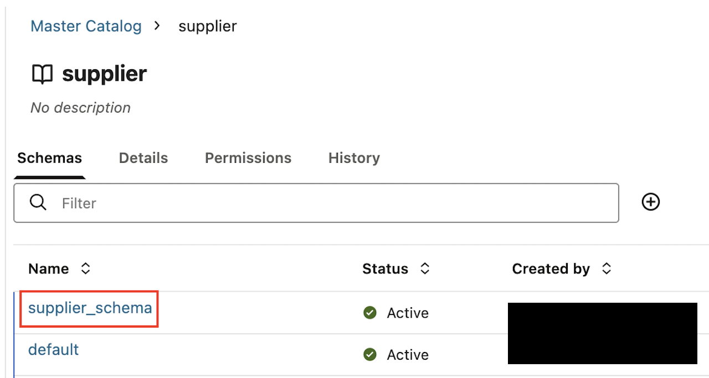

7. Select **Add to schema** and then **Table**.

    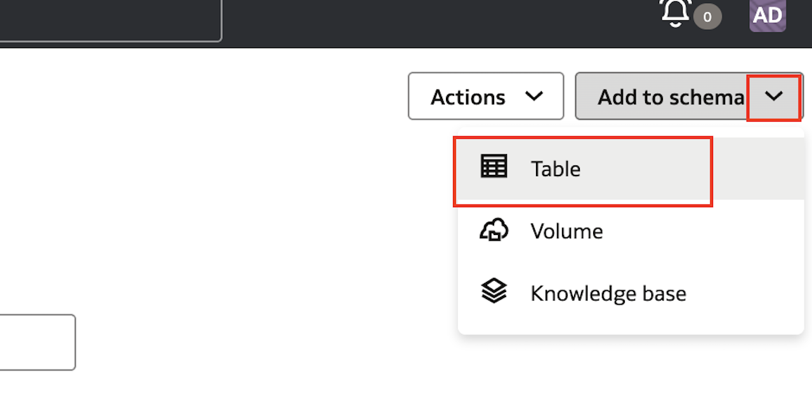

8. Keep the **Table type** as **Managed**. Upload the **basic\_supplier.csv** file. Select **Preview data** and then **Create**. You can download the **basic\_supplier.csv** file and all other lab files at [this link](https://objectstorage.us-ashburn-1.oraclecloud.com/n/idmqvvdwzckf/b/LiveLab-Files_Bucket/o/aidp-workbench-ll-files.zip). This table is now viewable by selecting **Tables**.

    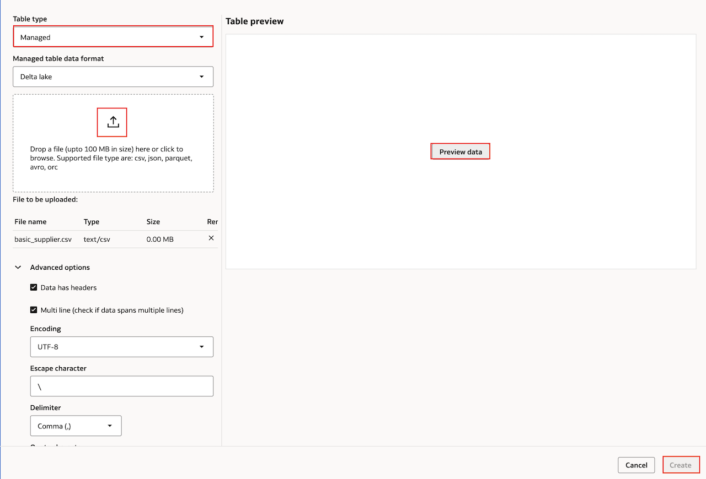

9. Create another managed table, using the **supplier\_emotions.csv** file. Be sure to select **Preview** before creating the table.

    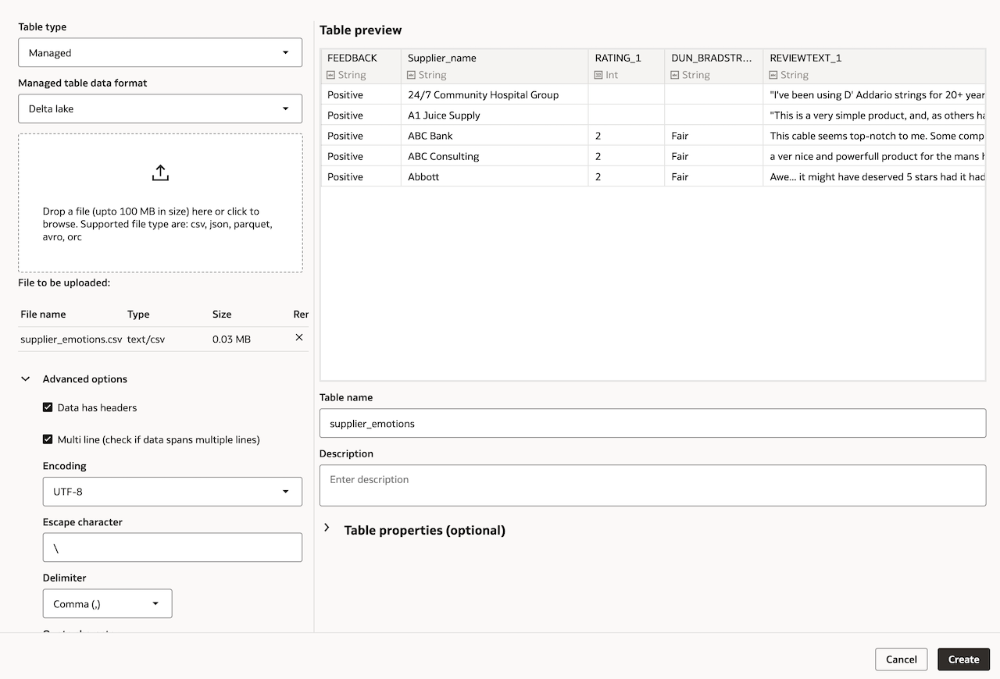

10. Now you'll create a volume. Select **Add to schema**, and then **Volume**.

    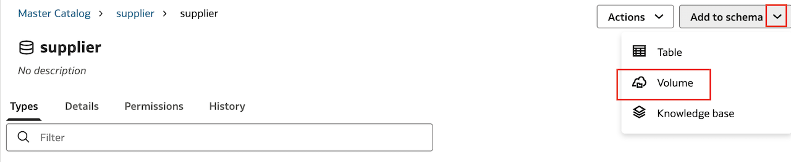

11. Enter the Volume Name **supplier\_volume** and select **Managed** as the Volume type.

    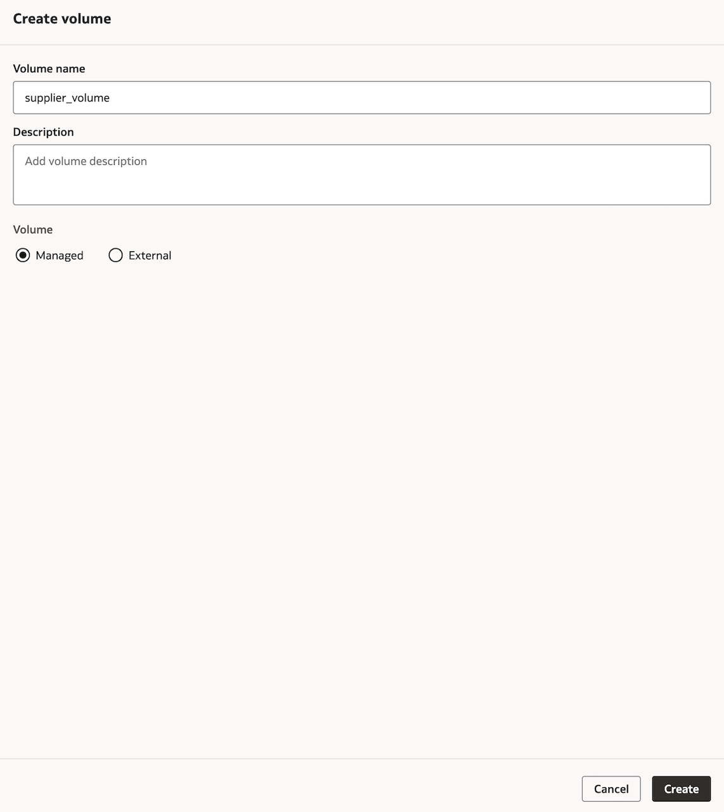

12. Select the **Volumes** tab and then the **supplier\_volume** volume you just created.

    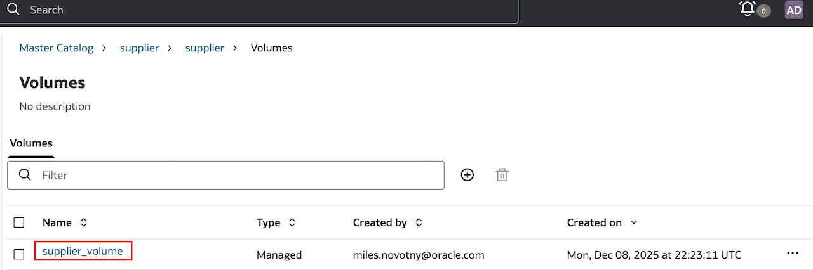

13. Select the plus icon and then **Upload file**. Select the **supplier\_info.txt** file from your computer then choose **Upload**.

    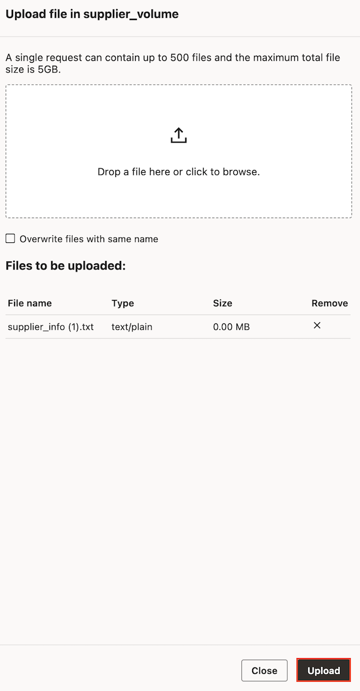

You have now created your structured and unstructured data assets in AIDP Workbench that are ready to be processed into the bronze, silver, and gold tiers of a medallion architecture.

## Learn More

- [Oracle AI Data Platform Community Site](https://community.oracle.com/products/oracleaidp/)
- [Oracle AI Data Platform Documentation](https://docs.oracle.com/en/cloud/paas/ai-data-platform/)
- [Oracle Analytics Training Form](https://community.oracle.com/products/oracleanalytics/discussion/27343/oracle-ai-data-platform-webinar-series)
- [AIDP Workbench Creation Documentation](https://docs.oracle.com/en/cloud/paas/ai-data-platform/aidug/get-started-oracle-ai-data-platform.html#GUID-487671D1-7ACB-4A56-B3CB-272B723E573C)
- [AIDP Workbench Master Catalog Documentation](https://docs.oracle.com/en/cloud/paas/ai-data-platform/aidug/manage-master-catalog.html)
- [Permissions for AIDP Workbench Creation](https://docs.oracle.com/en/cloud/paas/ai-data-platform/aidug/iam-policies-oracle-ai-data-platform.html#GUID-C534FDF6-B678-4025-B65A-7217D9D9B3DA)

## Acknowledgements
* **Author** - Miles Novotny, Senior Product Manager, Oracle Analytics Service Excellence
* **Contributors** -  Farzin Barazandeh, Senior Principal Product Manager, Oracle Analytics Service Excellence
* **Last Updated By/Date** - Miles Novotny, March 2026
