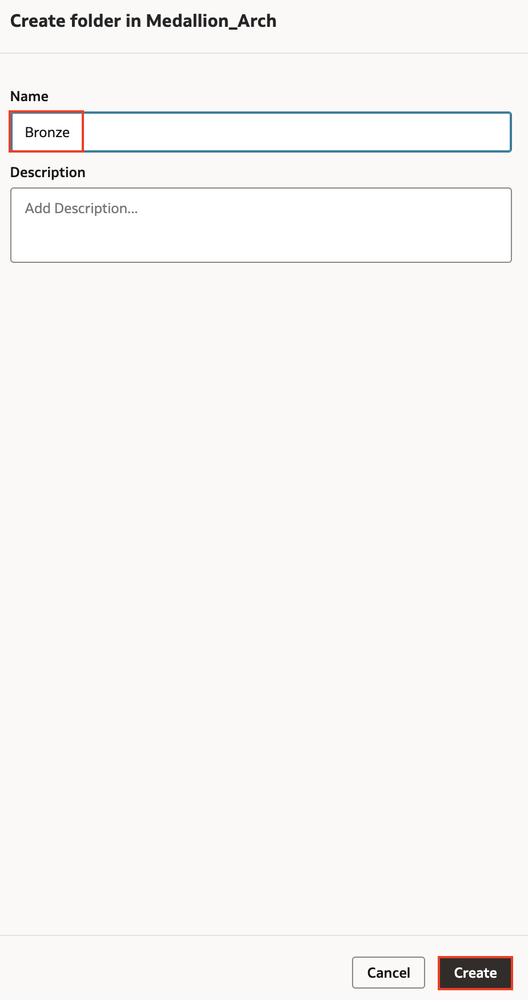
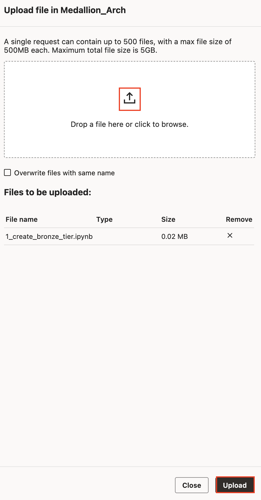
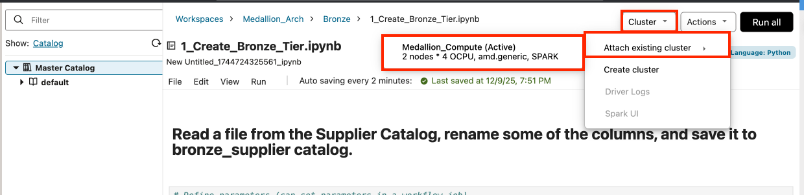
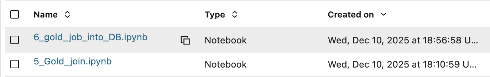
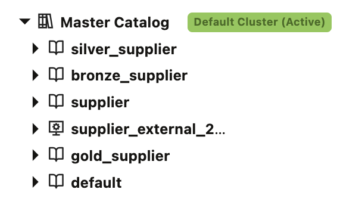

# Create Medallion Architecture using AIDP Workbench

## Introduction

This lab guides you through creating a medallion architecture using the Oracle AI Data Platform (AIDP). You'll learn how to set up workspaces, configure compute resources, and implement a multi-tier data processing pipeline.

A medallion architecture is a data engineering design that organizes data into 3 tiers: bronze, silver, and gold. The bronze tier holds unprocessed and mostly raw data, the silver holds cleaned and organized data, while the gold tier holds processed, transformed, clean data that is ready for its final use. This final use could be analytics, ingestion into an application, or an AI use case. This architecture provides clear data lineage and allows the data pipeline to be easily edited.

Estimated Time: 45 minutes

### Objectives

In this lab, you will:

- Create and configure a workspace in AIDP Workbench.
- Create a compute cluster in the workspace.
- Use the AIDP Workbench notebook interface to implement a medallion architecture.
- Utilize AI functionalities to enhance data processing.

### Prerequisites

This lab assumes you have:

- A basic understanding of data science.

## Task 1: Create Workspace and Compute Cluster

1. In AIDP Workbench, open the **Workspace** tab and select **Create**.

2. Enter the Workspace name **Medallion\_Arch** and then select **Create**. While your workspace is provisioning, you'll see the default workspace that was created when you set up the AIDP Workbench instance.

3. Select **Medallion\_Arch** to enter the workspace. To create folders for the notebooks associated with the bronze, silver, and gold medallion tiers, select the plus icon and choose **Folder**

4. Name the folder **Bronze** and select **Create**. Repeat these steps to make two additional folders named **Silver** and **Gold**.

5. To review the permissions for the **Bronze** folder, select the actions menu then choose **Permissions**.

6. Select the plus icon and view how to grant permissions to roles or individual users. These role-based access controls allow fine grain control over security and collaboration in AIDP Workbench.

7. Next, to create a compute cluster in the workspace, open the **Compute** tab from the menu then select the plus icon.

8. Enter the Compute Cluster name **Medallion\_Compute**. Cluster creation defaults to a **Quickstart** setting which creates a small cluster that spins up very quickly. Deselect **Autoscale** and leave all other selections as is. Feel free to browse and view other compute shape options under the **Custom** section. Select **Create**. 

9. Wait for the cluster to become active. Select **Medallion\_Compute** to view its details. Here you can learn more about a cluster, including which notebooks use the cluster. Additionally, in the **Library** section you can install libraries from a **requirements.txt** file.

## Task 2: Import and Run Notebooks

Now you'll import the notebooks used to implement the three tiers of the medallion architecture. 

1. Open the **Medallion_Arch** workspace and select the **Bronze** folder.

2. To import the notebook used to create the bronze tier, which can be downloaded at [this link](https://objectstorage.us-ashburn-1.oraclecloud.com/n/idmqvvdwzckf/b/LiveLab-Files_Bucket/o/aidp-workbench-ll-files.zip), select the upload file icon.

3. Choose the **1\_create\_bronze\_tier** file and select **Upload**.

4. Repeat the same process for the **Silver** and **Gold** folders. Upload **2\_silver\_transformation**, **3\_silver\_transformation\_continent**, and **4\_silver\_transformation\_summary** into the **Silver** folder. Upload **5\_gold\_join** and **6\_gold\_job\_into\_DB** into the **Gold** folder.

5. Open the **Bronze** folder. Select the **create\_bronze\_tier** file to open it in the notebook interface.

6. Once in the notebook interface you need to attach a compute cluster on which to run the code. Select **Cluster** then **Attach existing cluster**. Choose the **Medallion\_Compute** you created earlier.

7. Scroll through the notebook and review the code you are about to run. The main actions in this notebook are the creation of a **bronze\_supplier** catalog and a schema. Then the **basic\_supplier** and **supplier\_emotions** datasets are written to the catalog as tables.

8. Once you have reviewed the code, select **Run all**.

10. When this process is complete, continue to the notebooks in the **Silver** folder. Review and run them in numerical order. These notebooks clean and organize the bronze tier data to create the silver tier. The code leverages LLMs from the OCI Gen AI Service to augment the data.

11. Finally run the two notebooks in the **Gold** folder. These noteboooks consolidate tables from the silver tier into a finalized gold table. This table is then loaded into the 26ai database using the external catalog you created earlier. Saving the gold tier data to this datastore allows it to be effectively leveraged for analytics workloads.

9. Navigate to the master catalog to view the catalogs created by the notebook code. Notice that the bronze, silver, and gold tier catalogs are created and populated in the master catalog.

You have now imported notebooks and run the code to create a basic medallion architecture based on the supplier data you stored in the AIDP Workbench Master Catalog.

## Learn More

- [Oracle AI Data Platform Community Site](https://community.oracle.com/products/oracleaidp/)
- [Oracle AI Data Platform Documentation](https://docs.oracle.com/en/cloud/paas/ai-data-platform/)
- [Oracle Analytics Training Form](https://community.oracle.com/products/oracleanalytics/discussion/27343/oracle-ai-data-platform-webinar-series)
- [AIDP Workbench Notebooks Documentation](https://docs.oracle.com/en/cloud/paas/ai-data-platform/aidug/notebooks.html)

## Acknowledgements
* **Author** - Miles Novotny, Senior Product Manager, Oracle Analytics Service Excellence
* **Contributors** -  Farzin Barazandeh, Senior Principal Product Manager, Oracle Analytics Service Excellence
* **Last Updated By/Date** - Miles Novotny, December 2025
