# Create Connector from FDI to AIDP Workbench

## Introduction

In this lab you will share data from Fusion Data Intelligence (FDI) with Oracle AI Data Platform. Creating shares from FDI to AIDP allows for seamless integration of the two systems for AI and data science tasks using your FDI data. This optional lab requires that you have access to a the admin console of an existing FDI instance.

Estimated Time: 15 minutes

### Objectives

In this lab, you will:
* Enable the Oracle AI Data Platform feature within FDI.
* Configure a connection from FDI to Oracle AI Data Platform.
* Share data from FDI to Oracle AI Data Platform and view it in the master catalog.

### Prerequisites

This lab assumes you have:

* Access to the admin console of a FDI instance (you cannot create an FDI instance in the lab tenancy).
* Familiarity with the FDI admin console.

## Task 1: Enabling Oracle AI Data Platform Feature in FDI

1. Begin at the admin console of your FDI instance. Select **Enable Features**

    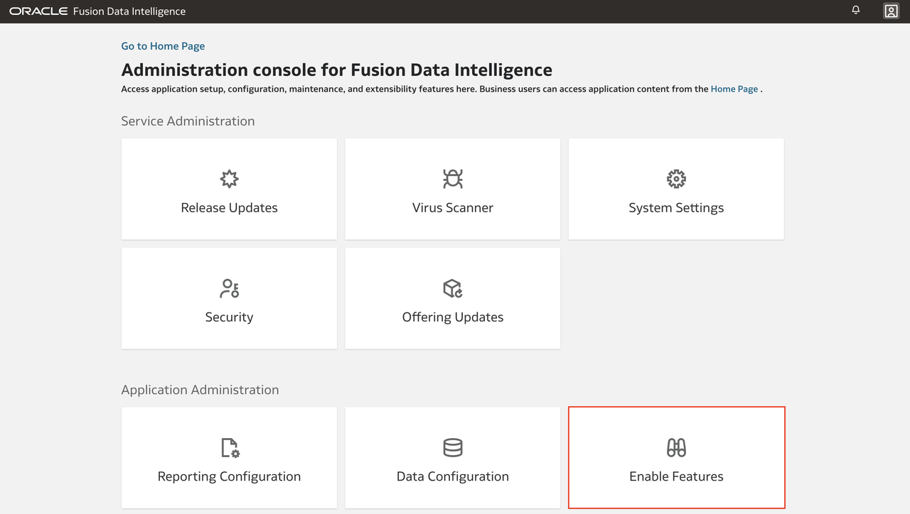

2. Select **Oracle AI Data Platform** and return to the main admin console page.

    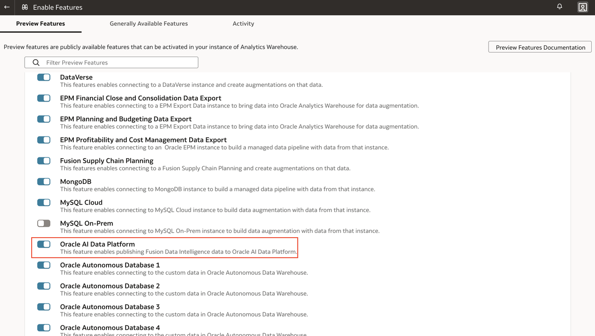

## Task 2: Creating a Connection from FDI to Oracle AI Data Platform

1. From the admin console, under the heading **Application Administration** select **Data Configuration**.

    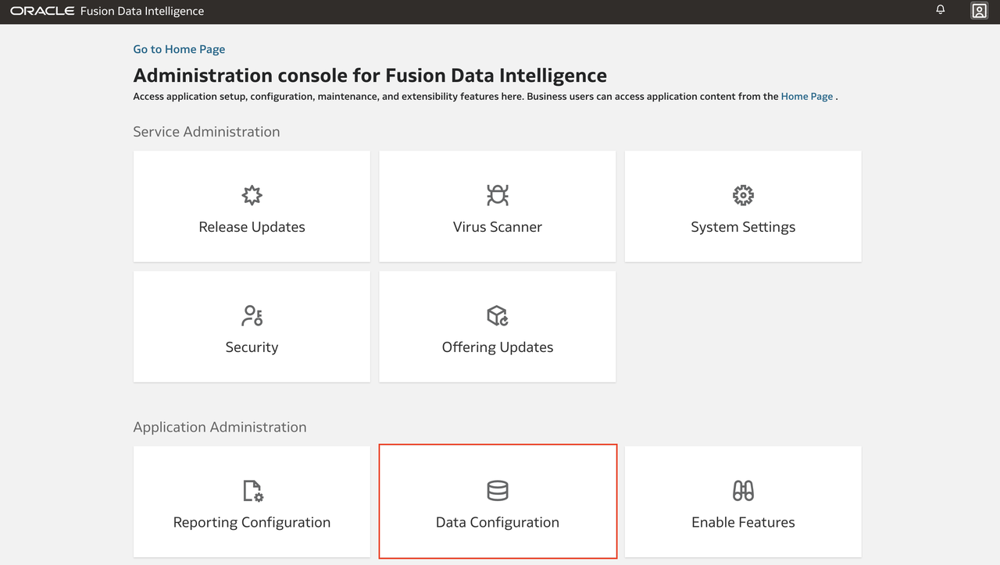

2. Under the heading **Configurations**, select **Manage Connections**.

    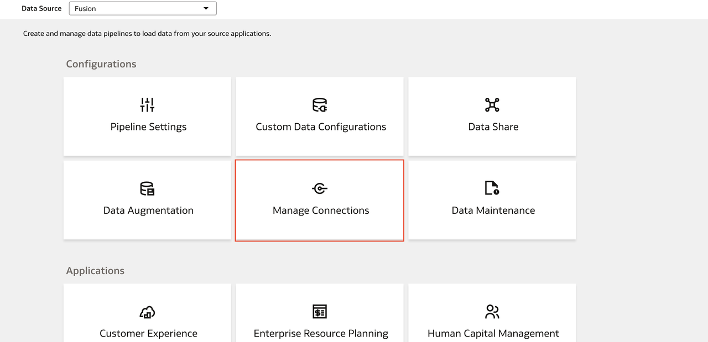

3. A connection to **Oracle AI Data Platform** displays since you enabled the feature (it may appear as **Oracle Intelligent Data Lake**). To configure this connection, select the actions menu and then **Edit Connection**.

    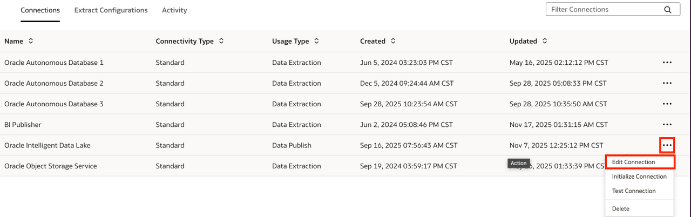

4. In the**Edit Connection** window the top 3 fields are automatically populated. Complete the other fields. The OCIDs for various OCI resources can be found in the OCI console section for the given resource. Select **Update** when finished.

    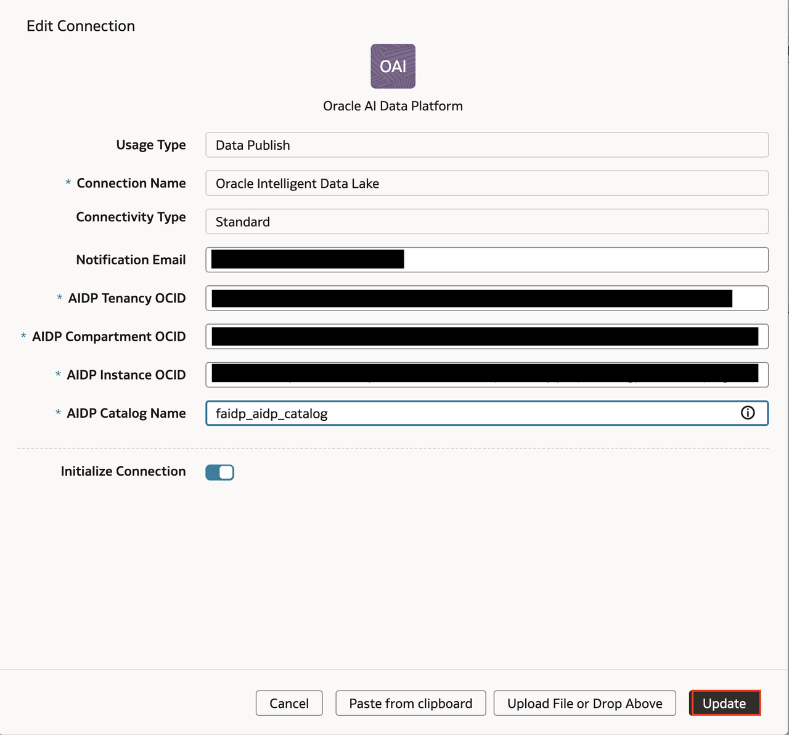

5. Return to the **Data Configuration** page and select **Data Share**.

    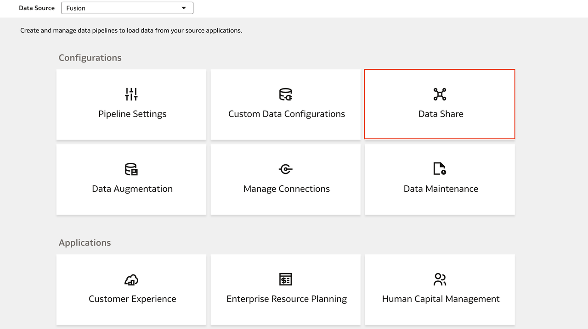

6. On this page is a list of the data tables from your FDI instance that are available to share to external sources. Locate a table you would like to share with the AIDP Workbench. Select the actions menu and then **Edit**.

    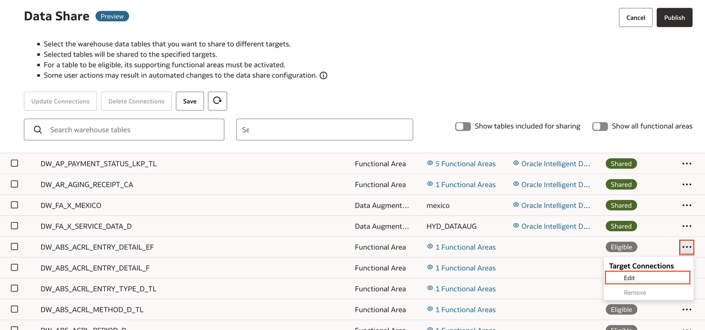

7. In the **Update Target Connections** window, select **Oracle AI Data Platform** (it may appear as **Oracle Intelligent Data Lake**) in the **Target Connections** section. Select **Update**.

    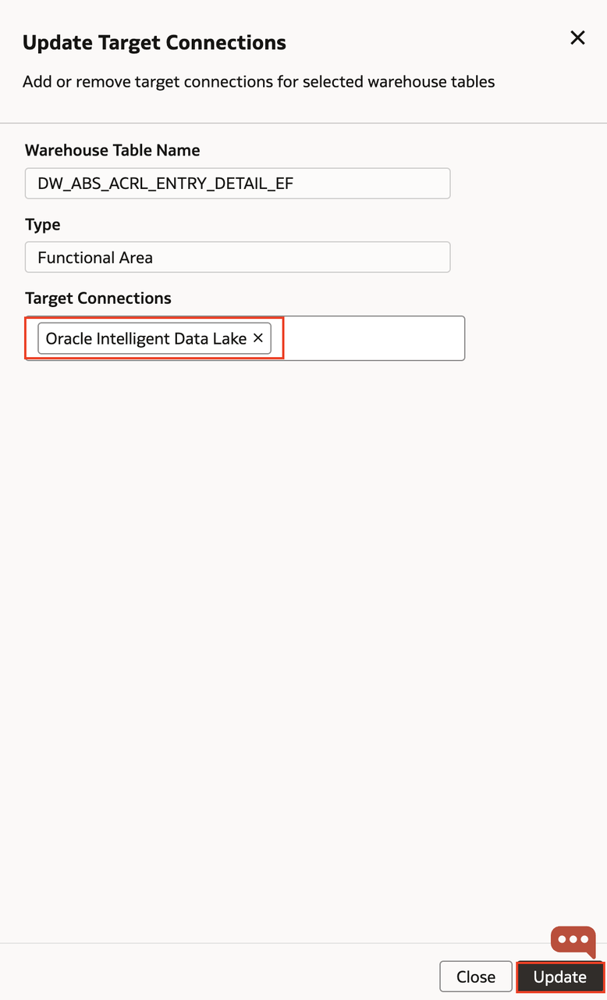

8. Select the data table whose target you just updated. Select **Publish** and then choose **Publish** again to publish the table to the AIDP Workbench.

    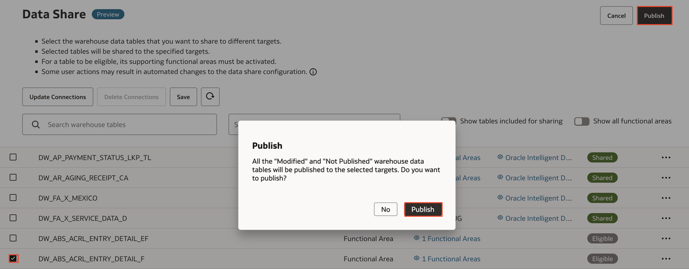

9. Return to your AIDP Workbench instance. The tables shared with AIDP will appear in the master catalog, in a catalog with the name you specified when editing the connection in the FDI admin console. Here you can view the shared tables. After creating a share, it may take some time for the data to appear in AIDP Workbench after the share has been created.

    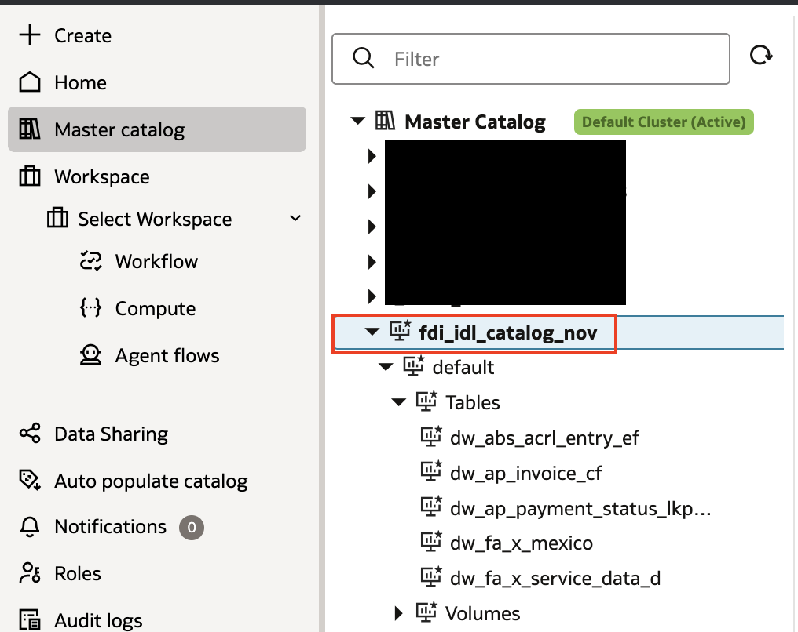

## Learn More

- [Oracle AI Data Platform Community Site](https://community.oracle.com/products/oracleaidp/)
- [Oracle AI Data Platform Documentation](https://docs.oracle.com/en/cloud/paas/ai-data-platform/)
- [Oracle Analytics Training Form](https://community.oracle.com/products/oracleanalytics/discussion/27343/oracle-ai-data-platform-webinar-series)
* [Fusion Data in Oracle AI Data Platform with BICC](https://docs.oracle.com/en/cloud/paas/ai-data-platform/aidug/fusion-data-oracle-ai-data-platform.html)

## Acknowledgements
* **Author** - Miles Novotny, Senior Product Manager, Oracle Analytics Service Excellence
* **Contributors** -  Farzin Barazandeh, Senior Principal Product Manager, Oracle Analytics Service Excellence
* **Last Updated By/Date** - Miles Novotny, March 2026
