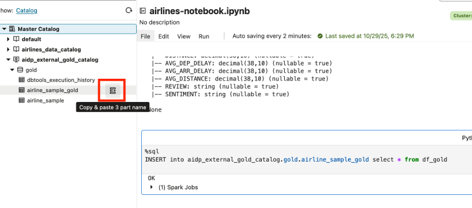

# Refine and Prepare Data with AI Data Platform

## Introduction

This lab will guide you through refining and preparing your airline sample data using **Oracle AI Data Platform** (AIDP). Building on your lakehouse foundation from Lab 1, you’ll use Spark and Delta Lake to clean, transform, and enrich your data—producing analytics-ready “gold” tables.

> **Estimated Time:** 1 hour

---

### About Oracle AI Data Platform (AIDP)

Oracle AIDP enables scalable data engineering and analytics in the cloud. With built-in support for Spark and Delta Lake, you can efficiently cleanse, enhance, and prepare large volumes of data—all within a unified platform, and directly connect results to downstream analytics.

---

### Objectives

In this lab, you will:
- Load your sample Delta table into Spark
- Clean and transform the data (handle invalid values, engineer features)
- Cast columns to correct types for analytics
- Write a refined “gold” Delta table for visualization and BI

---

### Prerequisites

This lab assumes you have:
- Completed **Lab 1: Create a Data Lakehouse with AI Data Platform**, with airline sample data loaded 
- Access to an AIDP workspace and a running Spark notebook
- Basic comfort navigating Oracle Cloud notebooks

---

## Task 1: Navigate to Workspace

1. Navigate to the workspace created in the previous lab. Select the workspace and navigate to the notebook just created (e.g. **airline-workspace**).


## Task 2: Load Airline Sample Data as Delta Table

1. Test to see if you can connect to the gold "**AIRLINE\_SAMPLE**" table. The table is in the format **external-catalog-name.schema.table**. If using a different name for the external catalog, make sure to replace the name below. 

* **Quick Tip**: The catalog, schema, and table names can be copied by clicking the icon shown below - 



```python
<copy>
airlines_sample_table = "aidp_external_gold_catalog.gold.AIRLINE_SAMPLE"

# Confirm AIRLINE_SAMPLE table is reflected in spark
spark.sql("SHOW TABLES IN aidp_external_gold_catalog.gold").show(truncate=False)

df = spark.table(airlines_sample_table)

df.show()
</copy>
```

**NOTE** for each iteration of code blocks it's recommended to run that section individually to validate the scripts. Once all the code blocks are validated, you can run this entire notebook as a job in a workflow.

## Task 3: Write to Object Storage Bucket

1. Write the new data frame to your Object Storage bucket. Replace '**oci-bucket**' with your oci bucket name and '**os-namespace**' with object storage namespace - 

```python
<copy>
delta_path = "oci://oci-bucket@os-namespace/delta/airline_sample"
df.write.format("delta").mode("overwrite").save(delta_path)
</copy>
```

**NOTE** **oci-bucket** refers to the bucket name in OCI, and **os-namespace** is the namespace found in the bucket - 


**NOTE** Only one table can be associated with a given delta path. If a table is created on a path that already is associated with another table, it will throw an error. The associated table will have to be deleted then re-write the dataframe to the path. 


## Task 4: Create Bronze Medallian Schema

1. Create bronze table for first stage of medallian architecture. Here we will create a new (standard) catalog, called "**airlines\_data\_catalog**". This is distinct from the external catalog to the AI Lakehouse created earlier. "**airlines\_data\_catalog**" will be used to store the bronze, silver, and gold layers of the medallian architecture.

```python
<copy>
bronze_table = "airlines_data_catalog.bronze.airline_sample_delta"

# Create New Internal Catalog & Schema to store data
spark.sql("CREATE CATALOG IF NOT EXISTS airlines_data_catalog")
spark.sql("CREATE SCHEMA IF NOT EXISTS airlines_data_catalog.bronze")

# Drop the table if it exists, to avoid conflicts
spark.sql(f"DROP TABLE IF EXISTS {bronze_table}")

# Create new bronze table
spark.sql(f"""
  CREATE TABLE IF NOT EXISTS {bronze_table}
  USING DELTA
  LOCATION '{delta_path}'
""")
</copy>
```


2. Clean the data 

```python
<copy>
spark.sql(f"""
    DELETE FROM {bronze_table}
    WHERE DISTANCE IS NULL OR DISTANCE < 0
""")
</copy>
```

3. Test versioning capabilities of delta tables. With delta lake capabilities the user can now show older versions of tables before they were modified.

```python 
<copy>
df_v0 = spark.read.format("delta").option("versionAsOf", 0).load(delta_path)
df_v0.show()
</copy>
```

## Task 5: Create Silver Medallian Schema & Enrich Data with Generative AI 

1. Write to Silver schema of medallian architecture 

```python
<copy>
df_clean = spark.table(bronze_table)

silver_path = "oci://os-bucket@os-namespace/delta/silver/airline_sample"
silver_table = "airlines_data_catalog.silver.airline_sample_delta"

# Create Silver Schema to store data
spark.sql("CREATE SCHEMA IF NOT EXISTS airlines_data_catalog.silver")

# Write cleaned DataFrame to object storage as Delta
df_clean.write.format("delta").mode("overwrite").save(silver_path)

# Remove table registration if it already exists
spark.sql(f"DROP TABLE IF EXISTS {silver_table}")

# Register cleaned data as new Silver table
spark.sql(f"""
  CREATE TABLE {silver_table}
  USING DELTA
  LOCATION '{silver_path}'
""")

# Check table to make sure it's cleaned 
spark.sql(f"SELECT * FROM {silver_table}").show()
</copy>
```

2. Enrich the data 

```python
<copy>
# Enrich data by adding aggregates/average delays and distance 
from pyspark.sql import functions as F

df = spark.table("airlines_data_catalog.silver.airline_sample_delta")

# Calculate averages by airline
avg_df = df.groupBy("AIRLINE").agg(
    F.avg("DEP_DELAY").alias("AVG_DEP_DELAY"),
    F.avg("ARR_DELAY").alias("AVG_ARR_DELAY"),
    F.avg("DISTANCE").alias("AVG_DISTANCE")
)

# Join with the detail table
enhanced_df = df.join(avg_df, on="AIRLINE", how="left")

enhanced_df.show()
</copy>
```

3. Add new column for Sentiment Analysis 

```python
<copy>
# Add New Review Column for Sentiment Analysis 
import random

sample_reviews = [
    "The flight was on time and comfortable.",
    "Long delay and unfriendly staff.",
    "Quick boarding and smooth flight.",
    "Lost my luggage, not happy.",
    "Great service and tasty snacks."
]

from pyspark.sql.functions import udf
from pyspark.sql.types import StringType

random_review_udf = udf(lambda: random.choice(sample_reviews), StringType())
df_with_review = enhanced_df.withColumn("REVIEW", random_review_udf())
df_with_review.show()
</copy>
```

4. Test and run AI model against reviews of flights

```python
<copy>
# test model 
spark.sql("select query_model('cohere.command-latest','What is Intelligent Data Lake Service in Oracle?') as questions").show(truncate=False)

# Run Sentiment Analysis Against Review with LLM 
from pyspark.sql.functions import expr
enhanced_df = df_with_review.withColumn("SENTIMENT",\
                     expr("query_model('cohere.command-latest', concat('What is the sentiment for this review: ', review))"))\
#.show(10, False)

enhanced_df.show(10, False)
</copy>
```

**NOTE** AIDP as of writing (Nov 2025) supports cohere and grok models. Dragging and dropping the other sample models from the catalog can result in 'model not found' errors. A temporary workaround can be to remove the '**default.oci\_ai\_models**' prefix from the model path. This should be fixed in the near future. 

## Task 6: Write Enriched Data to Gold Schema 

1. Save new data to gold schema 

```python
<copy>
# Save Averaged Data to Gold Schema 

gold_path = "oci://os-bucket@os-namespace/delta/gold/airline_sample_avg"
gold_table = "airlines_data_catalog.gold.airline_sample_avg"

# Create Gold Schema 
spark.sql("CREATE SCHEMA IF NOT EXISTS airlines_data_catalog.gold")

enhanced_df.write.format("delta").option("mergeSchema", "true").mode("overwrite").save(gold_path)

spark.sql(f"DROP TABLE IF EXISTS {gold_table}")

spark.sql(f"""
  CREATE TABLE {gold_table}
  USING DELTA
  LOCATION '{gold_path}'
""")

df_gold = spark.table(gold_table) 
df_gold.show()
</copy>
```

2. Confirm all columns are upper case. This is because OAC requires upper case columns for visualizations, otherwise results in errors. 

```python
<copy>
# Before pushing dataframe, make sure all columns are upper case to prevent visualization issues in OAC
# (OAC needs all columns capitalized in order to analyze data) 
for col_name in df_gold.columns:
    df_gold = df_gold.withColumnRenamed(col_name, col_name.upper())

df_gold.show()
</copy>
```

3. Cast columns to decimal type. This is to conform the spark data frames to the AI Lakehouse column definitions. 

```python
<copy>
from pyspark.sql.functions import col
from pyspark.sql.types import DecimalType, StringType

# Cast columns in the DataFrame to the exact types expected by the Oracle table.
# Use DecimalType for NUMBER fields, StringType for VARCHAR2/text.

df_gold_typed = (
    df_gold
    # Cast numeric columns to DecimalType (matches NUMBER in Oracle)
    .withColumn("FLIGHT_ID", col("FLIGHT_ID").cast(DecimalType(38,10)))
    .withColumn("DEP_DELAY", col("DEP_DELAY").cast(DecimalType(38,10)))
    .withColumn("ARR_DELAY", col("ARR_DELAY").cast(DecimalType(38,10)))
    .withColumn("DISTANCE", col("DISTANCE").cast(DecimalType(38,10)))
    .withColumn("AVG_DEP_DELAY", col("AVG_DEP_DELAY").cast(DecimalType(38,10)))
    .withColumn("AVG_ARR_DELAY", col("AVG_ARR_DELAY").cast(DecimalType(38,10)))
    .withColumn("AVG_DISTANCE", col("AVG_DISTANCE").cast(DecimalType(38,10)))
    # Cast text columns to StringType (matches VARCHAR2 in Oracle)
    .withColumn("AIRLINE", col("AIRLINE").cast(StringType()))
    .withColumn("ORIGIN", col("ORIGIN").cast(StringType()))
    .withColumn("DEST", col("DEST").cast(StringType()))
    .withColumn("REVIEW", col("REVIEW").cast(StringType()))
    .withColumn("SENTIMENT", col("SENTIMENT").cast(StringType()))
)

# Specify the desired column order to match the target Oracle table
col_order = [
    "FLIGHT_ID", "AIRLINE", "ORIGIN", "DEST", "DEP_DELAY", "ARR_DELAY", "DISTANCE",
    "AVG_DEP_DELAY", "AVG_ARR_DELAY", "AVG_DISTANCE", "REVIEW", "SENTIMENT"
]

# Select only these columns, in this order, to create a clean DataFrame for insertion
df_gold_typed = df_gold_typed.select(col_order)

# Print the final DataFrame schema for validation (should match the Oracle table exactly)
print(df_gold_typed.printSchema())

# Register the DataFrame as a temp view for Spark SQL use (for INSERT INTO ... or further queries)
df_gold_typed.createOrReplaceTempView("df_gold")
</copy>
```

4. Insert new gold data into external lakehouse table 

```sql
<copy>
%sql
INSERT into aidp_external_gold_catalog.gold.airline_sample_gold select * from df_gold
<copy>
```

**NOTE** We use the sql insert instead of the native spark insert, because spark causes the dataframe to be pushed with lowercase column names. This results in OAC unable to visualize the data. Using sql INSERT into avoids this issue. 

You are now ready to **proceed to the next lab** to visualize your data in OAC. 

## Acknowledgements

**Authors**
* **Luke Farley**, Senior Cloud Engineer, ONA Data Platform

**Contributors**
* **Enjing Li**, Senior Cloud Engineer, ONA Data Platform

**Last Updated By/Date:**
* **Luke Farley**, Senior Cloud Engineer, ONA Data Platform, November 2025