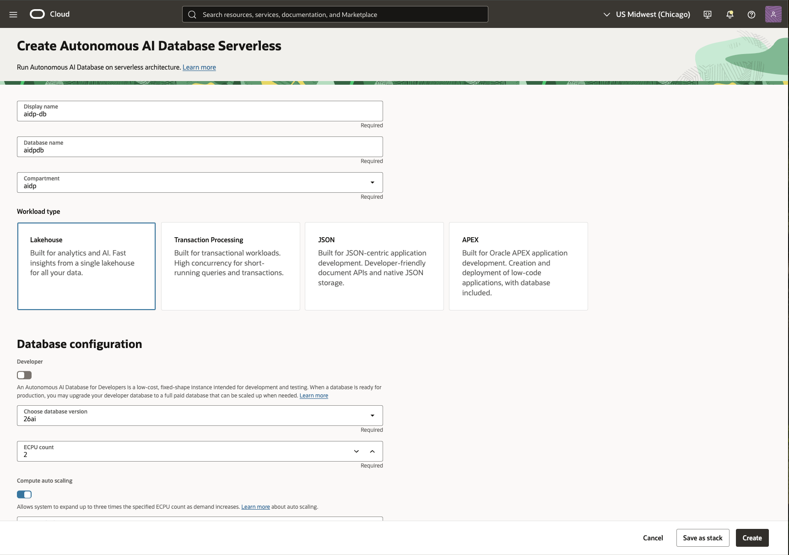
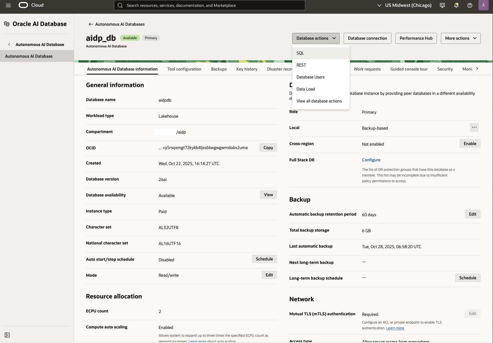
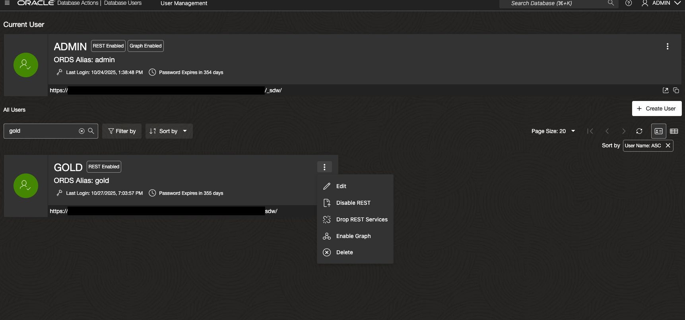
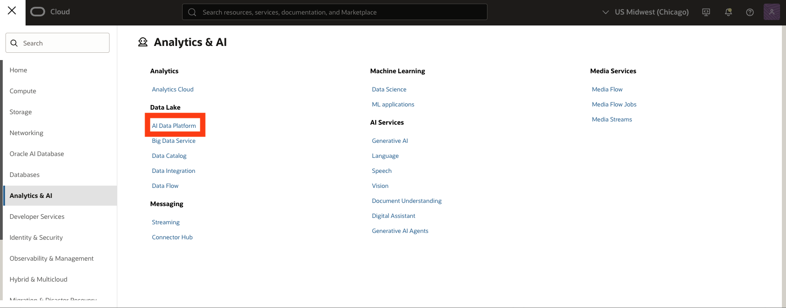
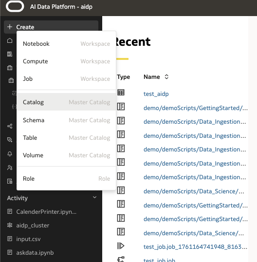

# Create a Data Lakehouse with AIDP

## Introduction

This lab will guide you through the foundational steps to build a modern data lakehouse on Oracle Cloud using the Oracle AI Data Platform (AIDP). You'll populate your lakehouse with airline sample data, land it in OCI Object Storage, and create Delta Lake tables with AIDP to establish a robust, analytics-ready foundation.

> **Estimated Time:** 1 hour

---

### About Oracle AI Data Platform (AIDP)

Oracle AI Data Platform combines the scalability of data lakes with the performance and structure of data warehouses. AIDP leverages the power of Spark, Delta Lake, and Oracle Autonomous AI Data Lakehouse to make cloud-scale data engineering, advanced analytics, and AI approachable for every user.

---

### Objectives

In this lab, you will:
* **Provision and Configure Core Data Lakehouse Services**
  - Create & Launch your Autonomous AI Data Lakehouse
* **Create Gold Schema & Sample Tables**
  - Configure sample airlines table
  - Upload sample airline dataset to your lakehouse
* **Provision AIDP for Delta Table Processing**
  - Create AIDP with associated object storage bucket

---

### Prerequisites

This lab assumes you have:
* An Oracle Cloud account (or provided lab credentials)
* Access to Oracle AI Data Platform (AIDP) and OCI Object Storage
* Basic familiarity with web-based Oracle Cloud interfaces (helpful but not required)
* No prior Spark or cloud experience is necessary—step-by-step guidance is provided

---

## Task 1: Create Autonomous AI Data Lakehouse

1. Log in to your cloud tenancy and navigate to Oracle AI Database > Autonomous AI Database


2. Select Create Autonomous AI Database 

3. Give it a name (e.g. **aidp-db**) and select workload type as Lakehouse. Select database version 26ai and leave other options as default. 



4. Provide a password and set Access Type to 'Secure access from everywhere' 


* **NOTE** If you would like to use a private database, a DB Tools Connection will need to be created to use SQL Developer web. This is outside the scope of this lab. For details, see [Create Database Tools Connection](https://docs.oracle.com/en-us/iaas/database-tools/doc/using-oracle-cloud-infrastructure-console.html).

5. Create the AI Database. The provisioning process will take a few minutes.

6. Once provisioned, navigate to Database actions > SQL. This will open SQL Developer as admin user. 




## Task 2: Create Gold Schema 

1. Create a Gold Schema (User) in Autonomous Data Lakehouse
CREATE USER gold IDENTIFIED BY "strong_password";

2. Grant Required Roles/Privileges to Gold Schema

```sql
-- Data privileges
GRANT CONNECT, RESOURCE TO gold;

-- Allow creation of tables, views, and other objects
GRANT CREATE SESSION TO gold;
GRANT CREATE TABLE TO gold;
GRANT CREATE VIEW TO gold;
GRANT CREATE SEQUENCE TO gold;
GRANT CREATE PROCEDURE TO gold;
GRANT UNLIMITED TABLESPACE TO gold;

-- Enable DBMS_CLOUD 
GRANT EXECUTE ON DBMS_CLOUD TO gold;

-- Grant access to data_pump_dir (used for saveAsTable operation in spark)
GRANT READ, WRITE ON DIRECTORY DATA_PUMP_DIR TO gold;
```

3. Log out of admin schema once gold schema is created.

## Task 3: Add REST capabilities to GOLD Schema

* **NOTE** If unable to sign in directly as gold schema, enable REST access

1. Navigate to AI DB > database actions > database users > search for 'gold' > select three dots > enable rest > log in to sql developer web as gold



## Task 4: Log in to SQL Developer as GOLD Schema 

1. Navigate back to AI DB > database actions > SQL > Once in SQL Developer select ADMIN (top right) > Sign Out

2. Provide gold as username and give password as defined in previous task. Sign in. 


3. Navigate to Development > SQL 

## Task 5: Populate ADL with Sample Airline Data 

1. Create the AIRLINE_SAMPLE table under gold schema 
```sql 
CREATE TABLE AIRLINE_SAMPLE (
  FLIGHT_ID   NUMBER,
  AIRLINE     VARCHAR2(20),
  ORIGIN      VARCHAR2(3),
  DEST        VARCHAR2(3),
  DEP_DELAY   NUMBER,
  ARR_DELAY   NUMBER,
  DISTANCE    NUMBER
);
```

2. Run the following sql for sample data 

```sql
INSERT INTO AIRLINE_SAMPLE (FLIGHT_ID, AIRLINE, ORIGIN, DEST, DEP_DELAY, ARR_DELAY, DISTANCE) VALUES (1001, 'Skynet Airways', 'JFK', 'LAX', 10, 5, 2475);
INSERT INTO AIRLINE_SAMPLE (FLIGHT_ID, AIRLINE, ORIGIN, DEST, DEP_DELAY, ARR_DELAY, DISTANCE) VALUES (1002, 'Sunwind Lines', 'ORD', 'SFO', -3, -5, 1846);
INSERT INTO AIRLINE_SAMPLE (FLIGHT_ID, AIRLINE, ORIGIN, DEST, DEP_DELAY, ARR_DELAY, DISTANCE) VALUES (1003, 'BlueJet', 'ATL', 'SEA', 0, 15, 2182);
INSERT INTO AIRLINE_SAMPLE (FLIGHT_ID, AIRLINE, ORIGIN, DEST, DEP_DELAY, ARR_DELAY, DISTANCE) VALUES (1004, 'Quantum Flyers', 'DFW', 'MIA', 5, 20, 1121);
INSERT INTO AIRLINE_SAMPLE (FLIGHT_ID, AIRLINE, ORIGIN, DEST, DEP_DELAY, ARR_DELAY, DISTANCE) VALUES (1005, 'Nebula Express', 'BOS', 'DEN', 12, 8, 1754);
INSERT INTO AIRLINE_SAMPLE (FLIGHT_ID, AIRLINE, ORIGIN, DEST, DEP_DELAY, ARR_DELAY, DISTANCE) VALUES (1006, 'Skynet Airways', 'SEA', 'ORD', -5, -2, 1721);
INSERT INTO AIRLINE_SAMPLE (FLIGHT_ID, AIRLINE, ORIGIN, DEST, DEP_DELAY, ARR_DELAY, DISTANCE) VALUES (1007, 'Sunwind Lines', 'MIA', 'ATL', 7, 4, 595);
INSERT INTO AIRLINE_SAMPLE (FLIGHT_ID, AIRLINE, ORIGIN, DEST, DEP_DELAY, ARR_DELAY, DISTANCE) VALUES (1008, 'BlueJet', 'SFO', 'BOS', 22, 18, 2704);
INSERT INTO AIRLINE_SAMPLE (FLIGHT_ID, AIRLINE, ORIGIN, DEST, DEP_DELAY, ARR_DELAY, DISTANCE) VALUES (1009, 'Quantum Flyers', 'LAX', 'JFK', -1, 0, 2475);
INSERT INTO AIRLINE_SAMPLE (FLIGHT_ID, AIRLINE, ORIGIN, DEST, DEP_DELAY, ARR_DELAY, DISTANCE) VALUES (1010, 'Nebula Express', 'DEN', 'DFW', 14, 20, 641);
INSERT INTO AIRLINE_SAMPLE (FLIGHT_ID, AIRLINE, ORIGIN, DEST, DEP_DELAY, ARR_DELAY, DISTANCE) VALUES (1011, 'Skynet Airways', 'PHX', 'SEA', 3, -2, 1107);
INSERT INTO AIRLINE_SAMPLE (FLIGHT_ID, AIRLINE, ORIGIN, DEST, DEP_DELAY, ARR_DELAY, DISTANCE) VALUES (1012, 'BlueJet', 'ORD', 'ATL', -7, -10, 606);
INSERT INTO AIRLINE_SAMPLE (FLIGHT_ID, AIRLINE, ORIGIN, DEST, DEP_DELAY, ARR_DELAY, DISTANCE) VALUES (1013, 'Quantum Flyers', 'BOS', 'JFK', 9, 11, 187);
INSERT INTO AIRLINE_SAMPLE (FLIGHT_ID, AIRLINE, ORIGIN, DEST, DEP_DELAY, ARR_DELAY, DISTANCE) VALUES (1014, 'Sunwind Lines', 'LAX', 'DFW', 13, 15, 1235);
INSERT INTO AIRLINE_SAMPLE (FLIGHT_ID, AIRLINE, ORIGIN, DEST, DEP_DELAY, ARR_DELAY, DISTANCE) VALUES (1015, 'Nebula Express', 'SFO', 'SEA', 0, 3, 679);
INSERT INTO AIRLINE_SAMPLE (FLIGHT_ID, AIRLINE, ORIGIN, DEST, DEP_DELAY, ARR_DELAY, DISTANCE) VALUES (1016, 'Skynet Airways', 'ATL', 'DEN', 6, 5, 1199);
INSERT INTO AIRLINE_SAMPLE (FLIGHT_ID, AIRLINE, ORIGIN, DEST, DEP_DELAY, ARR_DELAY, DISTANCE) VALUES (1017, 'BlueJet', 'DFW', 'PHX', -2, 1, 868);
INSERT INTO AIRLINE_SAMPLE (FLIGHT_ID, AIRLINE, ORIGIN, DEST, DEP_DELAY, ARR_DELAY, DISTANCE) VALUES (1018, 'Quantum Flyers', 'ORD', 'BOS', 8, -1, 867);
INSERT INTO AIRLINE_SAMPLE (FLIGHT_ID, AIRLINE, ORIGIN, DEST, DEP_DELAY, ARR_DELAY, DISTANCE) VALUES (1019, 'Sunwind Lines', 'JFK', 'MIA', 10, 16, 1090);
INSERT INTO AIRLINE_SAMPLE (FLIGHT_ID, AIRLINE, ORIGIN, DEST, DEP_DELAY, ARR_DELAY, DISTANCE) VALUES (1020, 'Nebula Express', 'DEN', 'ORD', -4, 0, 888);
INSERT INTO AIRLINE_SAMPLE (FLIGHT_ID, AIRLINE, ORIGIN, DEST, DEP_DELAY, ARR_DELAY, DISTANCE) VALUES (1021, 'Skynet Airways', 'SEA', 'ATL', 16, 12, 2182);
INSERT INTO AIRLINE_SAMPLE (FLIGHT_ID, AIRLINE, ORIGIN, DEST, DEP_DELAY, ARR_DELAY, DISTANCE) VALUES (1022, 'BlueJet', 'MIA', 'LAX', 5, 7, 2342);
INSERT INTO AIRLINE_SAMPLE (FLIGHT_ID, AIRLINE, ORIGIN, DEST, DEP_DELAY, ARR_DELAY, DISTANCE) VALUES (1023, 'Quantum Flyers', 'DEN', 'BOS', 2, -2, 1754);
INSERT INTO AIRLINE_SAMPLE (FLIGHT_ID, AIRLINE, ORIGIN, DEST, DEP_DELAY, ARR_DELAY, DISTANCE) VALUES (1024, 'Sunwind Lines', 'SFO', 'JFK', -6, -8, 2586);
INSERT INTO AIRLINE_SAMPLE (FLIGHT_ID, AIRLINE, ORIGIN, DEST, DEP_DELAY, ARR_DELAY, DISTANCE) VALUES (1025, 'Nebula Express', 'ORD', 'MIA', 11, 13, 1197);
```

3. Create the Gold Table for AIRLINE data. This will be the table visualized in OAC once processed in AIDP

```sql
CREATE TABLE GOLD.AIRLINE_SAMPLE_GOLD (
  FLIGHT_ID   NUMBER,
  AIRLINE     VARCHAR2(20),
  ORIGIN      VARCHAR2(3),
  DEST        VARCHAR2(3),
  DEP_DELAY   NUMBER,
  ARR_DELAY   NUMBER,
  DISTANCE    NUMBER,
  AVG_DEP_DELAY   NUMBER,
  AVG_ARR_DELAY   NUMBER,
  AVG_DISTANCE    NUMBER,
  REVIEW      VARCHAR2(4000),
  SENTIMENT VARCHAR2(200)
);
```

## Task 3: Provision AIDP Instance 

1. Log in to your cloud tenancy and navigate to Analytics & AI > AI Data Platform 



2. Provide a name for AIDP and workspace


3. Set the access level as standard and explicitly 'Add' the policies. If the policies aren't added it will fail to create. Optional policies can also be added depending on the use case. For this lab, we will need to enable object deletion - 


For more information, see [IAM Policies for AI Data Platform](https://docs.oracle.com/en/cloud/paas/ai-data-platform/aidug/iam-policies-oracle-ai-data-platform.html)

4. Create the instance. This will take a few minutes to provision.

## Task 4: Connect AIDP Catalog to Lakehouse Gold Schema

1. Once AIDP is provisioned, navigate to the service console - 


2. Select Create > Catalog 



3. Provide a catalog name (e.g. **"aidp_external_gold_catalog"**), select Catalog type as External Catalog, External source type as Oracle Autonomous Data Warehouse. For External source method select 'Choose ADW instance' and select the AI Database in your respective compartment (e.g. **aidp**). Provide the gold schema as username and give associated password. Select Create - 


* **NOTE** If you are connecting to an AI Database in a private subnet, you will need to enable private network. This is outside the scope of this livelab. For more details, see [Create an External Catalog for Private Networks](https://docs.oracle.com/en/cloud/paas/ai-data-platform/aidug/external-catalogs.html#GUID-F68CD62C-7D35-4A87-9234-9C88F6CDB60F).

## Task 5: Set Up Object Storage

This task will help you create a bucket in OCI Object Storage where your raw data files will reside.

1. Navigate to **Object Storage** in the OCI Console
2. Navigate to the compartment where your AIDP instance resides, e.g. **aidp** 
    - AIDP should automatically create buckets in this compartment. We will create a new bucket here to prevent confusion from existing buckets.
3. Click **Create Bucket** and provide a name e.g. **aidp-demo-bucket**
4. Create a folder in the bucket called 'delta'


- This is where we will store the intermediary delta tables

---

## Task 6: Launch Your AIDP Workspace

Provision and open a workspace in Oracle AI Data Platform.

1. Navigate back to AIDP service console. Click **Create Workspace** and enter name. Set the default catalog to the catalog created in previous task (e.g. **"aidp_external_gold_catalog"**)
   
3. After the workspace is active, open it and create a new folder 'demo'


4. Open the Demo Folder and select the '+' icon again. Select Notebook


5. Edit the name of the notebook to something more instructive e.g. **airlines-notebook**

6. Select Cluster at the top right and select 'Create Cluster'. Provide a name e.g. **"my_workspace_cluster"** and leave the options as default. Select create - 


7. You are now ready to **proceed to the next lab** to create a pipeline using the integrated notebook IDE.

---

## Next Steps

By completing this lab, you'll have a scalable, cloud-native lakehouse foundation. In the next labs, you’ll refine, transform, and analyze your data—and publish it for business insights.

---

## Acknowledgements

**Authors**
* **Luke Farley**, Senior Cloud Engineer, NACIE

**Contributors**
* **Luke Farley**, Senior Cloud Engineer, NACIE

**Last Updated By/Date:**
* **Luke Farley**, Senior Cloud Engineer, NACIE, October 2025