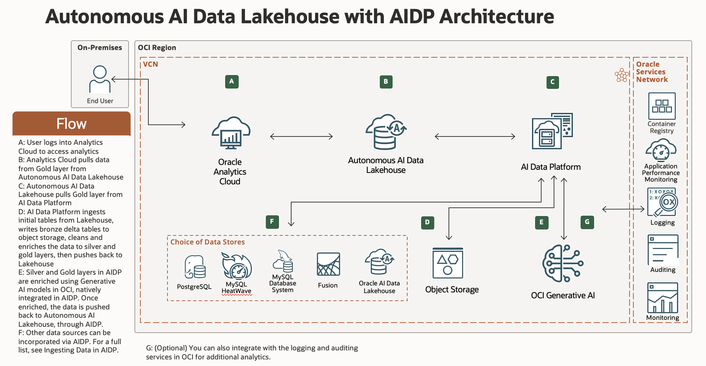

# Introduction

## About this Workshop

Welcome to **Lakehouse Analytics with AI Data Platform**!  
This hands-on workshop guides you through building a modern data analytics pipeline on Oracle Cloud using **Oracle AI Data Platform** (AIDP), **Autonomous AI Lakehouse**, and **Oracle Analytics Cloud** (OAC). You will experience the full "lakehouse" pattern: ingesting, transforming, and analyzing airline operations data step by step.

You'll learn how to:
- Load raw airline data into Oracle Object Storage
- Use AIDP and Delta Lake to clean, enrich, and prepare data for analytics
- Serve curated datasets from **Autonomous AI Lakehouse** for interactive analytics
- Visualize insights and KPIs in OAC dashboards

> **Estimated Workshop Time:** 3 hours

---

### Objectives

By completing this workshop, you will:
- Understand key lakehouse architecture principles using Oracle Cloud services
- Build ETL (Extract, Transform, Load) pipelines with Spark and Delta Lake in **AI Data Platform**
- Prepare and publish analytics-ready data to **Autonomous AI Lakehouse**
- Design data visualizations and dashboards with **Oracle Analytics Cloud** (OAC)

**Architecture Overview:**  

**Key Oracle Services Touched:**
* **AI Data Platform:** Modern data engineering, Spark/Delta-based ETL, AI/ML-ready platform
* **Autonomous AI Lakehouse:** Fast, secure, and scalable analytics/lakehouse SQL
* **Oracle Analytics Cloud:** Interactive dashboards and self-service analytics
* **Object Storage:** Landing zone for raw data files

---

### Prerequisites

This workshop assumes you have:
- An Oracle Cloud account or lab credentials
- Access to **Oracle AI Data Platform** (AIDP), **Autonomous AI Lakehouse**, **Analytics Cloud** (OAC), **Generative AI** and **Object Storage** in your tenancy/region
- Familiarity with databases and basic data/analytics concepts (helpful, but not required)
- Basic comfort with navigating web-based Oracle Cloud interfaces

---

## Learn More

* [Overview of Oracle AI Data Platform (AIDP)](https://docs.oracle.com/en/cloud/paas/ai-data-platform/aidug/introduction-oracle-ai-data-platform.html#GUID-24F65368-D399-4680-8D05-A0FD6B82F99F)
* [What is Autonomous AI Data Lakehouse?](https://docs.oracle.com/en/cloud/paas/autonomous-database/serverless/index.html)
* [What is Oracle Analytics Cloud?](https://docs.oracle.com/en/cloud/paas/analytics-cloud/)
* [Apache Spark Documentation](https://spark.apache.org/docs/latest/sql-ref-syntax.html#dml-statements)
* [Delta Lake Documentation](https://docs.delta.io/latest/delta-update.html)

---

## Acknowledgements

**Authors**
* **Luke Farley**, Senior Cloud Engineer, ONA Data Platform

**Contributors**
* **Enjing Li**, Senior Cloud Engineer, ONA Data Platform

**Last Updated By/Date:**
* **Luke Farley**, Senior Cloud Engineer, ONA Data Platform, November 2025