# Lab 3: Gather Insights with Oracle Analytics Cloud (OAC)

## Introduction

In this lab, you will use **Oracle Analytics Cloud** (OAC) to explore, visualize, and share insights from your refined airline dataset in the GOLD schema of Autonomous AI Lakehouse. Building on your work in Lab 2, you’ll connect OAC directly to your gold table and create impactful, interactive dashboards.

> **Estimated Time:** 1 hour

---

### About Oracle Analytics Cloud (OAC)

OAC provides a powerful cloud platform for business intelligence, self-service analytics, and data visualization. It seamlessly integrates with Oracle’s lakehouse ecosystem so you can connect, explore, and act on your cleansed and enriched data with ease.

---

### Objectives

In this lab, you will:
- Connect OAC to your “gold” airline dataset in Autonomous AI Lakehouse
- Create visualizations such as bar and pie charts using key fields (delays, airline, sentiment)
- Build and customize an interactive dashboard to answer analytic questions

---

### Prerequisites

This lab assumes you have:
- Completed **Lab 2: Process and Refine Data in AI Data Platform and Lakehouse**, with your gold airline data in the GOLD schema of Autonomous AI Lakehouse
- Access to Oracle Analytics Cloud (OAC)
- Basic familiarity with web-based dashboards (OAC is point-and-click, no prior BI experience needed)

---

## Task 1: Download the Wallet to Autonomous AI Lakehouse

1. Navigate to the Autonomous AI Lakehouse instance from Lab 2 in your OCI tenancy.

2. Select **Database connection** and download the wallet for the lakehouse.

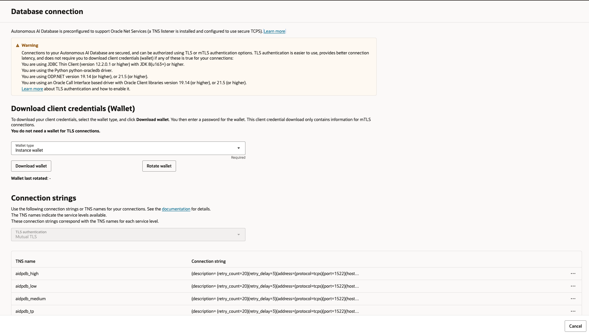

---

## Task 2: Connect OAC to Your Gold Data Table

1. Navigate to Analytics Cloud in the OCI console 

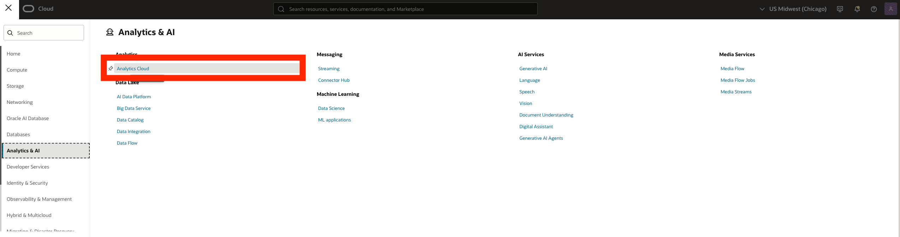

2. Create a new Analytics Cloud instance. Provide a name such as **aidpoac**. Leave the remaining options as default and create. 

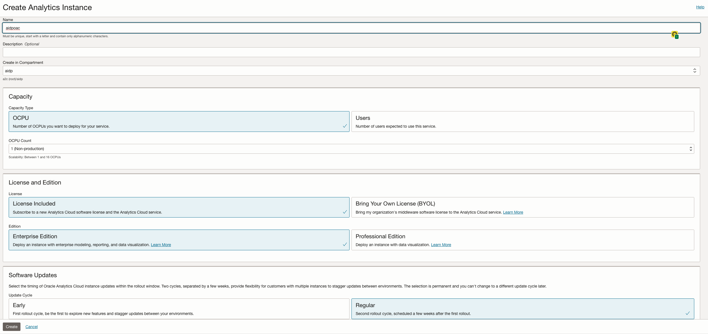

3. After a few minutes the instance will create. Navigate to the service console. 

4. Go to **Create → Connection**, then select Oracle Autonomous Warehouse (Now Autonomous AI Lakehouse) 

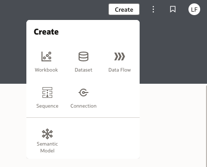

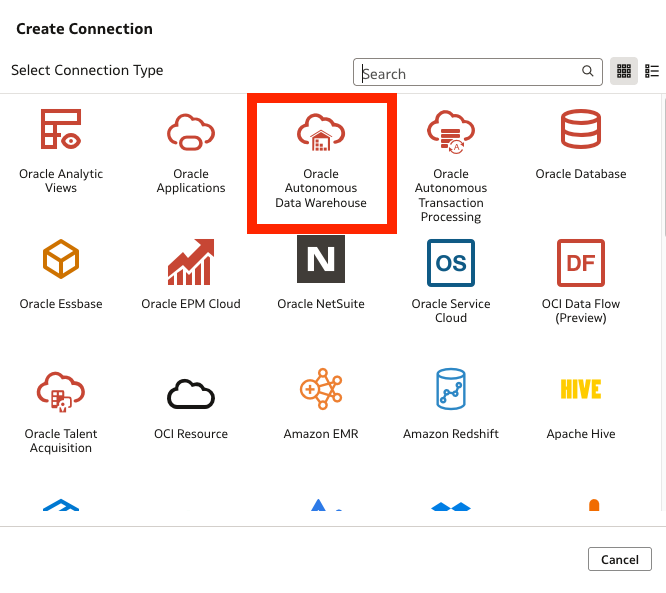

5. Provide the details for the lakehouse, and upload the wallet as client credentials from Task 1. Use GOLD schema credentials.

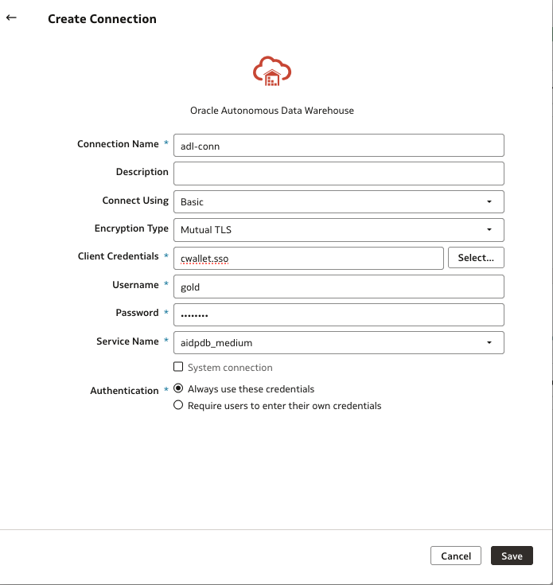

6. Select Save.

7. From the OAC home page, select Create > Dataset

8. Select the **adl-conn** just created 

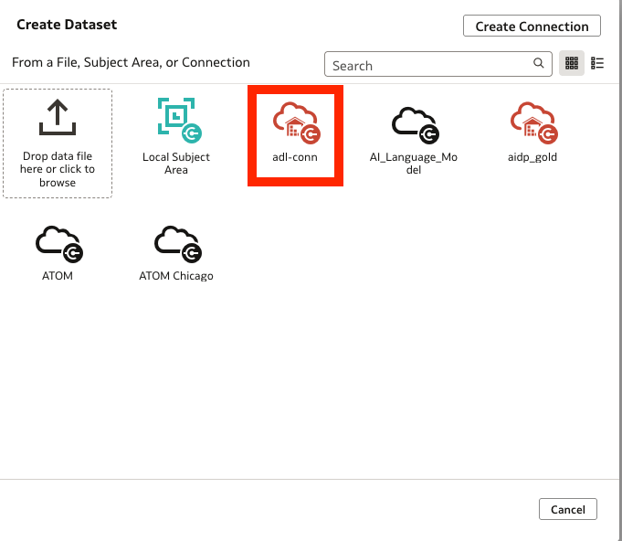

9. Expand the Schemas on the left-hand side and GOLD schema. Drag and drop the **AIRLINE_SAMPLE_GOLD** table to the white space to the right 

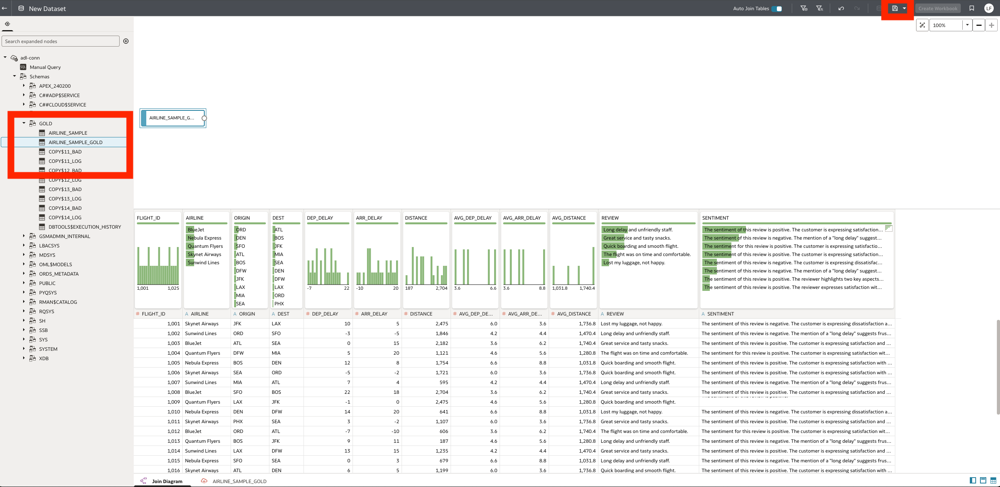

10. Select the save button at the top right to create the dataset. 

---

## Task 3: Build a Workbook with Gold data

1. From the OAC home page, select Create > Workbook

2. Select the dataset just created > Add to workbook

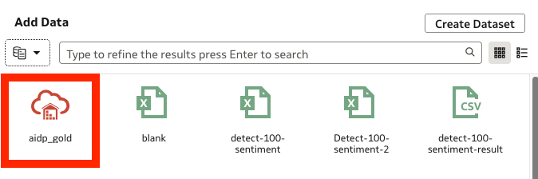

3. You can now drag and drop fields for visualization. For example, to create a pie chart of the average departure delay by airline, drag the following fields onto the canvas - 
    - AVG_DEP_DELAY
    - AIRLINE

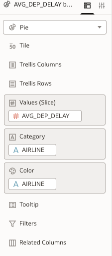

- Select Pie as the chart to see a visualization 

4. We can also create a bar chart by average departure delay. Drag and drop the field AVG_DEP_DELAY onto the canvas, outside of the existing pie chart. Map the following fields - 

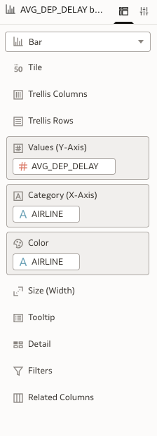

- You can now see a bar chart visualization of the average departure delay by airline - 

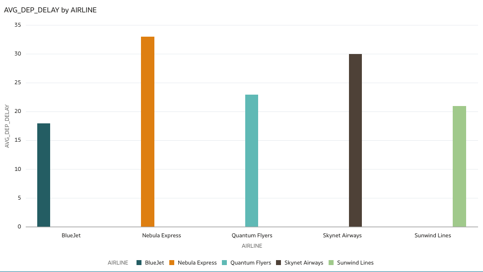

5. Finally we'll add a new table graph for the reviews and sentiments. Drag the **AIRLINE** field underneath the existing charts. Map the following fields - 

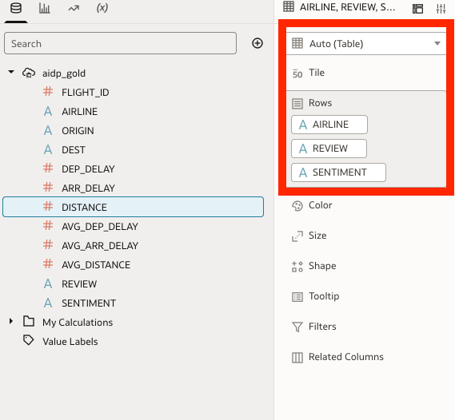

- You should now be able to see a table of sentiments - 

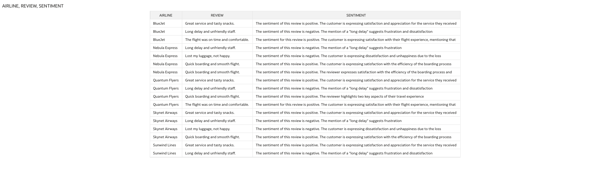

- Once all the charts are configured, the workbook will show all the analytics on one page - 

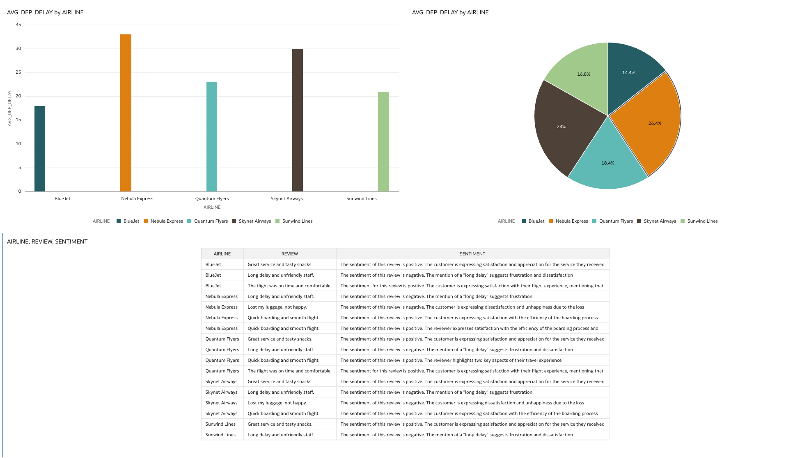

---

## Task 4 (Optional): Add More Visualizations

- **Scatter Plot:** Explore relationship between arrival and departure delays, color by airline.
- **Pie Chart:** Show distribution of sentiments across all flights.
- **Pivot Table:** Tabulate airlines, delays, and sentiment together for easy comparison.
- **Dashboard:** Drag your visuals onto a canvas to create an interactive, multi-chart dashboard.

---

## Task 5 (Optional): Customize and Share

- Edit titles, axis labels, and colors for clarity.
- Save your workbook.
- Optionally, share your dashboard with others or export visuals as images/PDF.

---

## Next Steps

**Congratulations!** You now have a fully functioning pipeline from raw data to analytic insight using **Autonomous Transaction Processing**, **AI Data Platform**, **Autonomous AI Lakehouse**, and **Analytics Cloud**. Feel free to experiment with more charts, filters, or custom calculations—and use your dashboard to present your findings.

---

## Acknowledgements

**Authors**
* **Luke Farley**, Senior Cloud Engineer, ONA Data Platform

**Contributors**
* **Enjing Li**, Senior Cloud Engineer, ONA Data Platform

**Last Updated By/Date:**
* **Luke Farley**, Senior Cloud Engineer, ONA Data Platform, November 2025
