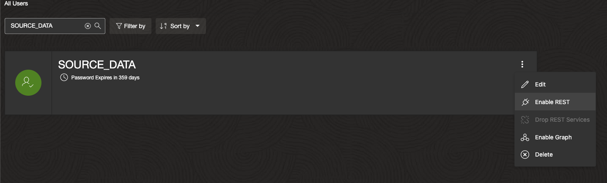
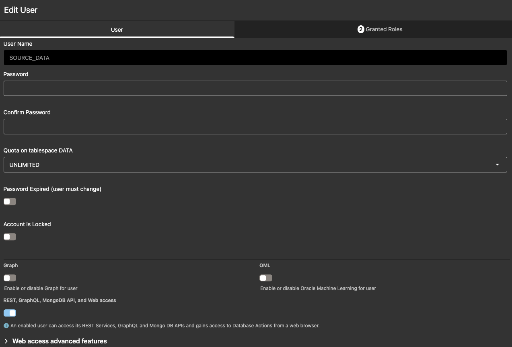
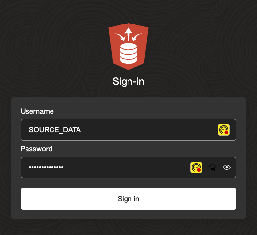
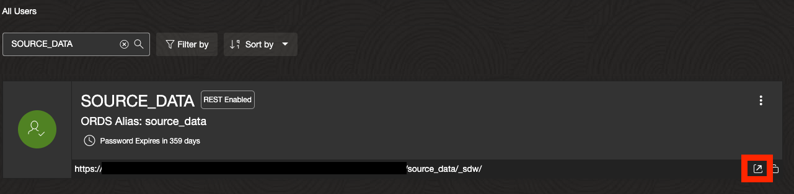

# Lab 1: Set Up Source System and Extract Transactional Data

## Introduction

This lab guides you through setting up Oracle Autonomous Transaction Processing (ATP) as the source system for transactional airline data. You'll provision ATP, create a dedicated source schema, and load sample airline data. This establishes a realistic starting point for extracting operational data into the lakehouse pipeline.

> **Estimated Time:** 45 minutes

---

### About Oracle Autonomous Transaction Processing (ATP)

ATP is an autonomous database service optimized for transaction processing (OLTP) workloads, such as storing and managing operational data like flight records. In this workshop, ATP serves as the source system, simulating a real-world transactional database from which data is extracted for analytics.

---

### Objectives

In this lab, you will:
- Provision an ATP instance
- Create a SOURCE_DATA schema
- Load sample airline transactional data into ATP

---

### Prerequisites

This lab assumes you have:
- An Oracle Cloud account (or provided lab credentials)
- Access to Oracle Autonomous Transaction Processing (ATP)
- Basic familiarity with web-based Oracle Cloud interfaces

---

## Task 1: Provision ATP Instance

1. Log in to your cloud tenancy and navigate to **Oracle AI Database > Autonomous AI Database**


2. Click **Create Autonomous Database**.

3. Provide a display name (e.g., **airline-source-atp**), database name (e.g., **AIRLINESOURCE**), and select **Transaction Processing** as the workload type.


4. Set an administrator password and configure network access as needed (e.g., secure access from everywhere for simplicity).

5. Click **Create Autonomous Database**. Provisioning takes a few minutes.

---

## Task 2: Create SOURCE_DATA Schema

1. Once provisioned, navigate to **Database Actions > SQL** in the ATP instance details.


2. Sign in as the ADMIN user.

3. Create the SOURCE_DATA schema (replace "strong\_password" with a secure password):

```sql
<copy>
-- Data privileges
GRANT CONNECT, RESOURCE TO SOURCE_DATA;

-- Allow creation of tables, views, and other objects
GRANT CREATE SESSION TO SOURCE_DATA;
GRANT CREATE TABLE TO SOURCE_DATA;
GRANT CREATE VIEW TO SOURCE_DATA;
GRANT CREATE SEQUENCE TO SOURCE_DATA;
GRANT CREATE PROCEDURE TO SOURCE_DATA;
GRANT UNLIMITED TABLESPACE TO SOURCE_DATA;

-- Enable DBMS_CLOUD 
GRANT EXECUTE ON DBMS_CLOUD TO SOURCE_DATA;

-- Grant access to data_pump_dir (used for saveAsTable operation in spark)
GRANT READ, WRITE ON DIRECTORY DATA_PUMP_DIR TO SOURCE_DATA;
</copy>
```

4. Sign out of admin and navigate back to the ATP instance in the console

---

## Task 3: Add REST capabilities to SOURCE_DATA Schema

**NOTE** If unable to sign in directly as SOURCE_DATA schema, enable REST access

1. Navigate to AI DB > database actions > database users > search for 'SOURCE_DATA' > select three dots > enable rest > log in to sql developer web as SOURCE_DATA




2. Once enabled edit the user and set Quota to Unlimited 



## Task 4: Log in to SQL Developer as SOURCE_DATA Schema 

1. Navigate back to AI DB > database actions > SQL > Once in SQL Developer select ADMIN (top right) > Sign Out

2. Provide SOURCE_DATA as username and give password as defined in previous task. Sign in. 



**NOTE** If still unable to log in, try navigating back to database user page and click the following link - 



3. Navigate to Development > SQL 

## Task 3: Load Sample Airline Data into SOURCE_DATA Schema

1. In SQL Developer Web (as SOURCE_DATA), create the AIRLINE_SAMPLE table:

```sql
<copy>
CREATE TABLE AIRLINE_SAMPLE (
  FLIGHT_ID   NUMBER,
  AIRLINE     VARCHAR2(20),
  ORIGIN      VARCHAR2(3),
  DEST        VARCHAR2(3),
  DEP_DELAY   NUMBER,
  ARR_DELAY   NUMBER,
  DISTANCE    NUMBER
);
</copy>
```

2. Insert sample data:

```sql
<copy>
INSERT INTO AIRLINE_SAMPLE (FLIGHT_ID, AIRLINE, ORIGIN, DEST, DEP_DELAY, ARR_DELAY, DISTANCE) VALUES (1001, 'Skynet Airways', 'JFK', 'LAX', 10, 5, 2475);
INSERT INTO AIRLINE_SAMPLE (FLIGHT_ID, AIRLINE, ORIGIN, DEST, DEP_DELAY, ARR_DELAY, DISTANCE) VALUES (1002, 'Sunwind Lines', 'ORD', 'SFO', -3, -5, 1846);
INSERT INTO AIRLINE_SAMPLE (FLIGHT_ID, AIRLINE, ORIGIN, DEST, DEP_DELAY, ARR_DELAY, DISTANCE) VALUES (1003, 'BlueJet', 'ATL', 'SEA', 0, 15, 2182);
INSERT INTO AIRLINE_SAMPLE (FLIGHT_ID, AIRLINE, ORIGIN, DEST, DEP_DELAY, ARR_DELAY, DISTANCE) VALUES (1004, 'Quantum Flyers', 'DFW', 'MIA', 5, 20, 1121);
INSERT INTO AIRLINE_SAMPLE (FLIGHT_ID, AIRLINE, ORIGIN, DEST, DEP_DELAY, ARR_DELAY, DISTANCE) VALUES (1005, 'Nebula Express', 'BOS', 'DEN', 12, 8, 1754);
INSERT INTO AIRLINE_SAMPLE (FLIGHT_ID, AIRLINE, ORIGIN, DEST, DEP_DELAY, ARR_DELAY, DISTANCE) VALUES (1006, 'Skynet Airways', 'SEA', 'ORD', -5, -2, 1721);
INSERT INTO AIRLINE_SAMPLE (FLIGHT_ID, AIRLINE, ORIGIN, DEST, DEP_DELAY, ARR_DELAY, DISTANCE) VALUES (1007, 'Sunwind Lines', 'MIA', 'ATL', 7, 4, 595);
INSERT INTO AIRLINE_SAMPLE (FLIGHT_ID, AIRLINE, ORIGIN, DEST, DEP_DELAY, ARR_DELAY, DISTANCE) VALUES (1008, 'BlueJet', 'SFO', 'BOS', 22, 18, 2704);
INSERT INTO AIRLINE_SAMPLE (FLIGHT_ID, AIRLINE, ORIGIN, DEST, DEP_DELAY, ARR_DELAY, DISTANCE) VALUES (1009, 'Quantum Flyers', 'LAX', 'JFK', -1, 0, 2475);
INSERT INTO AIRLINE_SAMPLE (FLIGHT_ID, AIRLINE, ORIGIN, DEST, DEP_DELAY, ARR_DELAY, DISTANCE) VALUES (1010, 'Nebula Express', 'DEN', 'DFW', 14, 20, 641);
INSERT INTO AIRLINE_SAMPLE (FLIGHT_ID, AIRLINE, ORIGIN, DEST, DEP_DELAY, ARR_DELAY, DISTANCE) VALUES (1011, 'Skynet Airways', 'PHX', 'SEA', 3, -2, 1107);
INSERT INTO AIRLINE_SAMPLE (FLIGHT_ID, AIRLINE, ORIGIN, DEST, DEP_DELAY, ARR_DELAY, DISTANCE) VALUES (1012, 'BlueJet', 'ORD', 'ATL', -7, -10, 606);
INSERT INTO AIRLINE_SAMPLE (FLIGHT_ID, AIRLINE, ORIGIN, DEST, DEP_DELAY, ARR_DELAY, DISTANCE) VALUES (1013, 'Quantum Flyers', 'BOS', 'JFK', 9, 11, 187);
INSERT INTO AIRLINE_SAMPLE (FLIGHT_ID, AIRLINE, ORIGIN, DEST, DEP_DELAY, ARR_DELAY, DISTANCE) VALUES (1014, 'Sunwind Lines', 'LAX', 'DFW', 13, 15, 1235);
INSERT INTO AIRLINE_SAMPLE (FLIGHT_ID, AIRLINE, ORIGIN, DEST, DEP_DELAY, ARR_DELAY, DISTANCE) VALUES (1015, 'Nebula Express', 'SFO', 'SEA', 0, 3, 679);
INSERT INTO AIRLINE_SAMPLE (FLIGHT_ID, AIRLINE, ORIGIN, DEST, DEP_DELAY, ARR_DELAY, DISTANCE) VALUES (1016, 'Skynet Airways', 'ATL', 'DEN', 6, 5, 1199);
INSERT INTO AIRLINE_SAMPLE (FLIGHT_ID, AIRLINE, ORIGIN, DEST, DEP_DELAY, ARR_DELAY, DISTANCE) VALUES (1017, 'BlueJet', 'DFW', 'PHX', -2, 1, 868);
INSERT INTO AIRLINE_SAMPLE (FLIGHT_ID, AIRLINE, ORIGIN, DEST, DEP_DELAY, ARR_DELAY, DISTANCE) VALUES (1018, 'Quantum Flyers', 'ORD', 'BOS', 8, -1, 867);
INSERT INTO AIRLINE_SAMPLE (FLIGHT_ID, AIRLINE, ORIGIN, DEST, DEP_DELAY, ARR_DELAY, DISTANCE) VALUES (1019, 'Sunwind Lines', 'JFK', 'MIA', 10, 16, 1090);
INSERT INTO AIRLINE_SAMPLE (FLIGHT_ID, AIRLINE, ORIGIN, DEST, DEP_DELAY, ARR_DELAY, DISTANCE) VALUES (1020, 'Nebula Express', 'DEN', 'ORD', -4, 0, 888);
INSERT INTO AIRLINE_SAMPLE (FLIGHT_ID, AIRLINE, ORIGIN, DEST, DEP_DELAY, ARR_DELAY, DISTANCE) VALUES (1021, 'Skynet Airways', 'SEA', 'ATL', 16, 12, 2182);
INSERT INTO AIRLINE_SAMPLE (FLIGHT_ID, AIRLINE, ORIGIN, DEST, DEP_DELAY, ARR_DELAY, DISTANCE) VALUES (1022, 'BlueJet', 'MIA', 'LAX', 5, 7, 2342);
INSERT INTO AIRLINE_SAMPLE (FLIGHT_ID, AIRLINE, ORIGIN, DEST, DEP_DELAY, ARR_DELAY, DISTANCE) VALUES (1023, 'Quantum Flyers', 'DEN', 'BOS', 2, -2, 1754);
INSERT INTO AIRLINE_SAMPLE (FLIGHT_ID, AIRLINE, ORIGIN, DEST, DEP_DELAY, ARR_DELAY, DISTANCE) VALUES (1024, 'Sunwind Lines', 'SFO', 'JFK', -6, -8, 2586);
INSERT INTO AIRLINE_SAMPLE (FLIGHT_ID, AIRLINE, ORIGIN, DEST, DEP_DELAY, ARR_DELAY, DISTANCE) VALUES (1025, 'Nebula Express', 'ORD', 'MIA', 11, 13, 1197);
</copy>
```

3. Verify the data:

```sql
<copy>
SELECT * FROM AIRLINE_SAMPLE;
</copy>
```

---

## Next Steps

With the source data loaded in ATP, proceed to Lab 2 to extract and process it in the AI Data Platform and Lakehouse.

---

## Acknowledgements

**Authors**
* **Luke Farley**, Senior Cloud Engineer, ONA Data Platform

**Last Updated By/Date:**
* **Luke Farley**, Senior Cloud Engineer, ONA Data Platform, November 2025
