# Lab 1: Set Up OCI Resources

## Introduction

This lab guides you through setting up Oracle Autonomous Transaction Processing (ATP) as the Source System for transactional airline data, setting up Autonomous AI Lakehouse as the Target System, AI Data Platform instance and Object Storage bucket.
This establishes a realistic starting point for extracting operational data into the lakehouse pipeline.

> **Estimated Time:** 1 hour

---

### About Oracle Autonomous Transaction Processing (ATP) and Oracle AI Data Platform (AIDP) and Autonomous AI Lakehouse

ATP is an autonomous database service optimized for transaction processing (OLTP) workloads, such as storing and managing operational data like flight records. In this workshop, ATP serves as the source system, simulating a real-world transactional database from which data is extracted for analytics.

AI Data Platform (AIDP) unifies all types of data—structured, unstructured, batch, and real-time into an open, and connected platform, laying the foundation for trusted and AI-ready data pipelines. It's an integrated environment with built-in tools and GenAI agent frameworks to build and deploy AI-powered applications faster, without the complexity of connecting separate tools.

Autonomous AI Lakehouse provides fast, secure analytics storage. Together, they form a modern lakehouse for transforming raw data into insights.

---

### Objectives

In this lab, you will:
- Provision an ATP instance
- Create a Source_XX schema in ATP
- Provision Autonomous AI Lakehouse 
- Create a Gold_XX schema in AI Lakehouse
- Provision AI Data Platform
- Provision Object Storage buckets
- Provision Analytics Cloud

---

### Important Note

If multiple instances of ATP, AI Lakehouse and Analytics Cloud instances need to be created, please ensure that the instance names are unique. The instance names can then end with _01, _02, _03 etc.

If multiple users are concurrently working on this workshop, then for different users _01, _02, _03 can be used, instead of using _XX.

For example:
- Use Source\_01, Source\_02, Source\_03 etc instead of Source\_XX
- Use Gold\_01, Gold\_02, Gold\_03 etc instead of Gold\_XX

---

### Prerequisites

This lab assumes you have:
- An Oracle Cloud account (or provided lab credentials)
- Access to Oracle Autonomous Transaction Processing (ATP)
- Access to Oracle Autonomous AI Lakehouse
- Access to Oracle AI Data Platform
- Access to Oracle Object Storage
- Access to Oracle Analytics Cloud
- Basic familiarity with web-based Oracle Cloud interfaces

---

## Task 1: Create Compartment

1. Using the Navigation Menu, navigate to "Identity & Security" -> Compartments

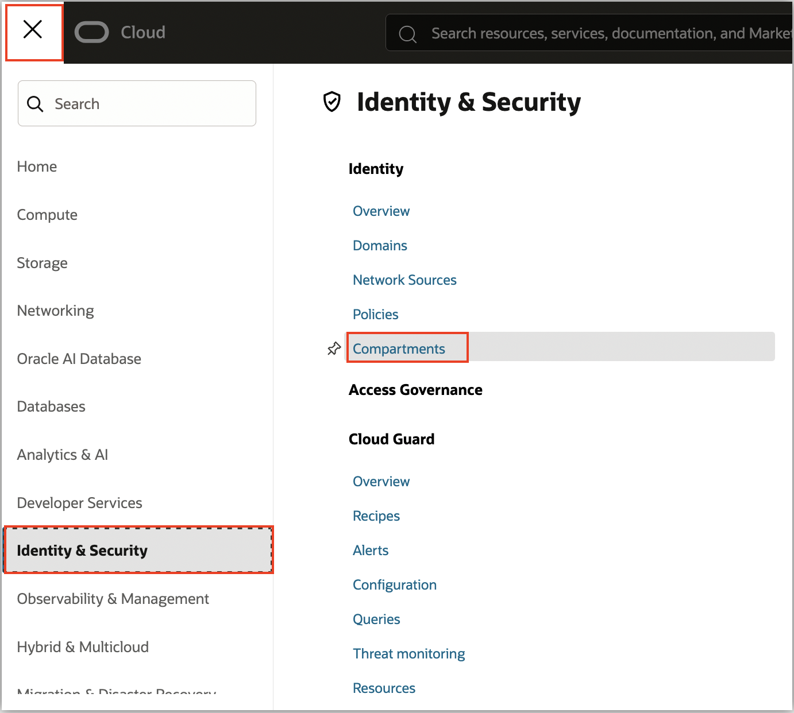

2. Click "Create compartment"

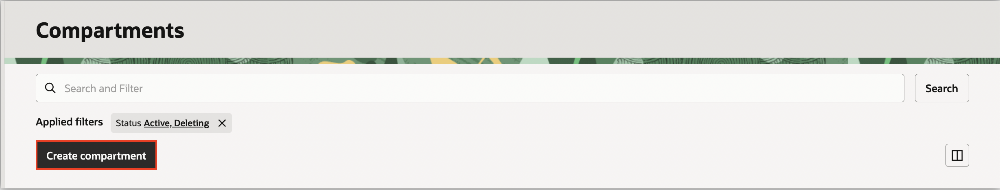

3. Create a new Compartment (Name - "aidp-lab-xx", Description - "AIDP Lab") under compartment of your choice. Click on "Create compartment"

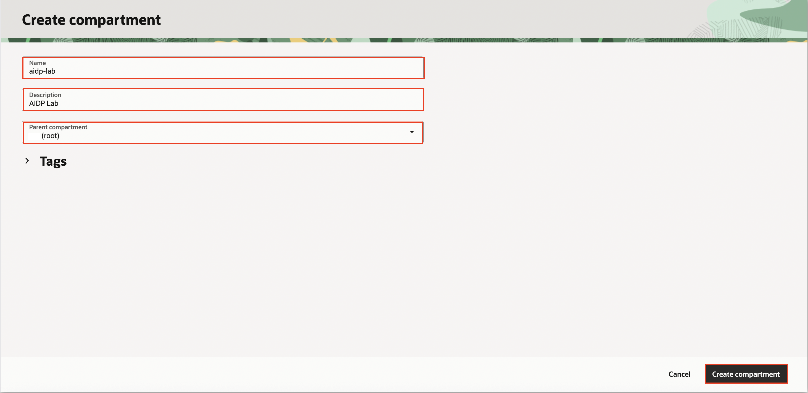

4. The "aidp-lab-xx" compartment gets created. Ensure to create all OCI resources in this "aidp-lab-xx" compartment.

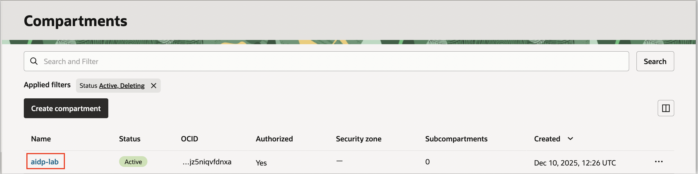

---

## Task 2: Provision ATP Instance

1. Log in to your cloud tenancy and navigate to **Oracle AI Database > Autonomous AI Database**


2. Click **Create Autonomous Database**.

3. Provide a display name (e.g., **airline-source-atp**), database name (e.g., **AIRLINESOURCEXX**), and select **Transaction Processing** as the workload type. Choose database version 26ai.

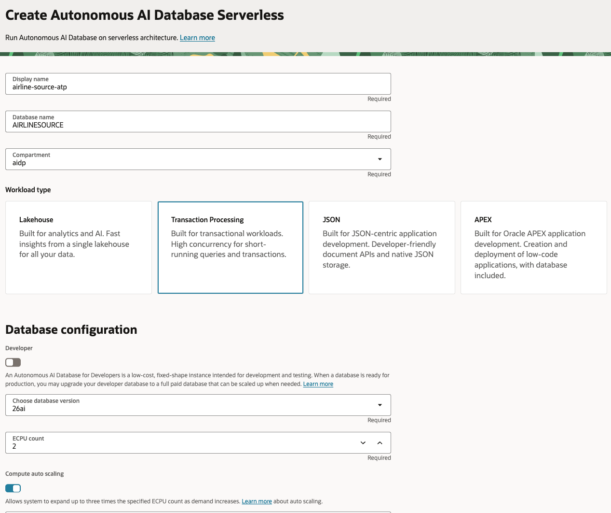

If this is a demo environment, the storage can be lowered to 20 GB to save cost & resources.

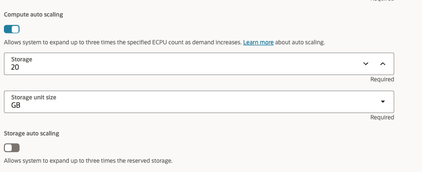

4. Set an administrator password and configure network access as needed (e.g., secure access from everywhere for simplicity).

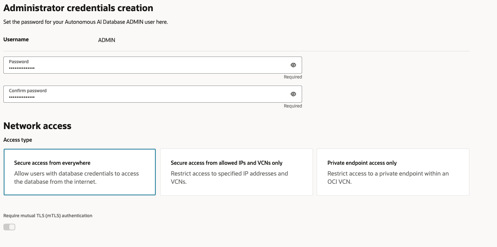

**NOTE** If you would like to use a private database, a DB Tools Connection will need to be created to use SQL Developer web. This is outside the scope of this lab. For details, see [Create Database Tools Connection](https://docs.oracle.com/en-us/iaas/database-tools/doc/using-oracle-cloud-infrastructure-console.html).

5. Click **Create Autonomous Database**. Provisioning takes a few minutes.

---

## Task 3: Create Source_XX Schema

1. Once provisioned, navigate to **Database Actions > SQL** in the ATP instance details.

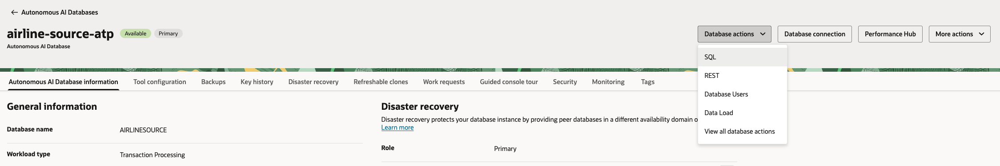


2. Create the Source_XX schema (replace "strong\_password" with a secure password):

```sql
<copy>
CREATE USER Source_XX IDENTIFIED BY "strong_password";
-- Data privileges
GRANT CONNECT, RESOURCE TO Source_XX;

-- Allow creation of tables, views, and other objects
GRANT CREATE SESSION TO Source_XX;
GRANT CREATE TABLE TO Source_XX;
GRANT CREATE VIEW TO Source_XX;
GRANT CREATE SEQUENCE TO Source_XX;
GRANT CREATE PROCEDURE TO Source_XX;
GRANT UNLIMITED TABLESPACE TO Source_XX;

-- Enable DBMS_CLOUD 
GRANT EXECUTE ON DBMS_CLOUD TO Source_XX;

-- Grant access to data_pump_dir (used for saveAsTable operation in spark)
GRANT READ, WRITE ON DIRECTORY DATA_PUMP_DIR TO Source_XX;
</copy>
```

3. Sign out of admin and navigate back to the ATP instance in the console

---

## Task 4: Add REST capabilities to Source_XX Schema

**NOTE** If unable to sign in directly as Source_XX schema, enable REST access

1. Navigate to AI DB > database actions > database users > search for Source\_XX > select three dots > Enable REST

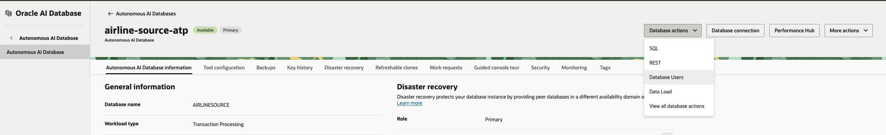

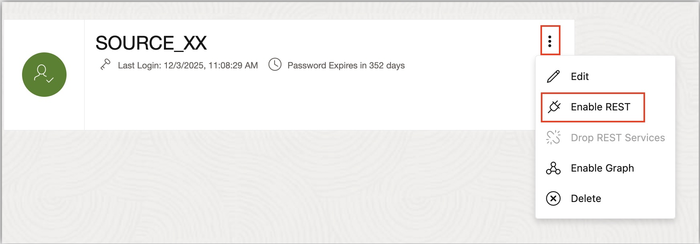

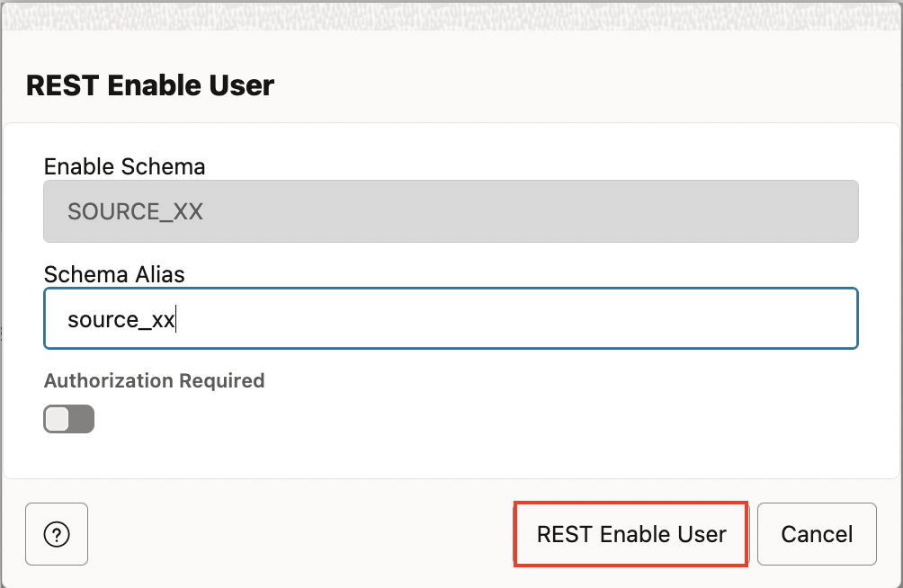

2. Once enabled edit the user and set Quota to Unlimited. Click “Apply Changes” to save.

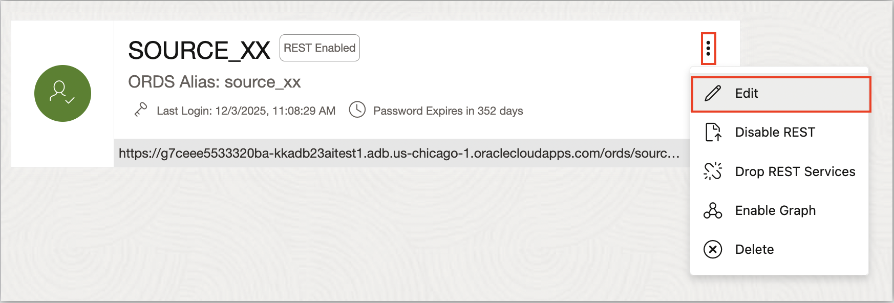

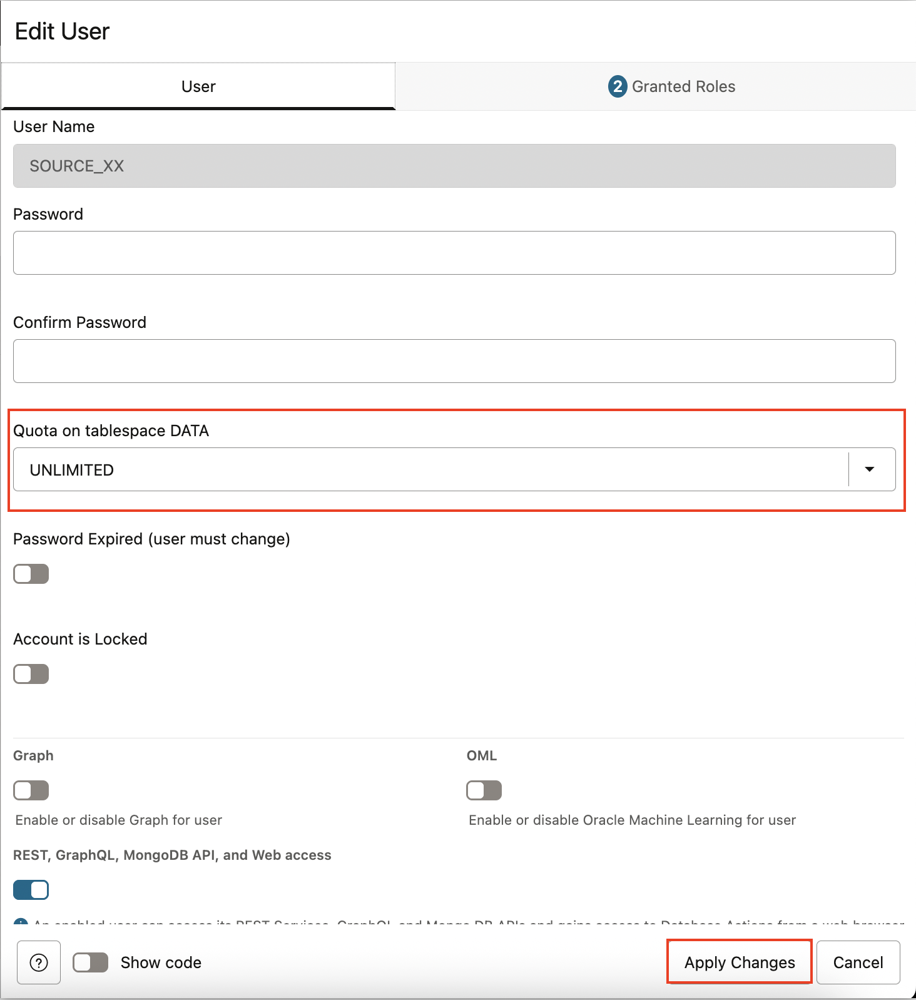

## Task 5: Log in to SQL Developer as Source_XX Schema 

In this task you'll check if you can successfully sign-in as Source_XX user.

1. Navigate back to AI DB > database actions > SQL > Once in SQL Developer select ADMIN (top right) > Sign Out

2. Provide Source_XX as username and give password as defined in previous task. Sign in. 

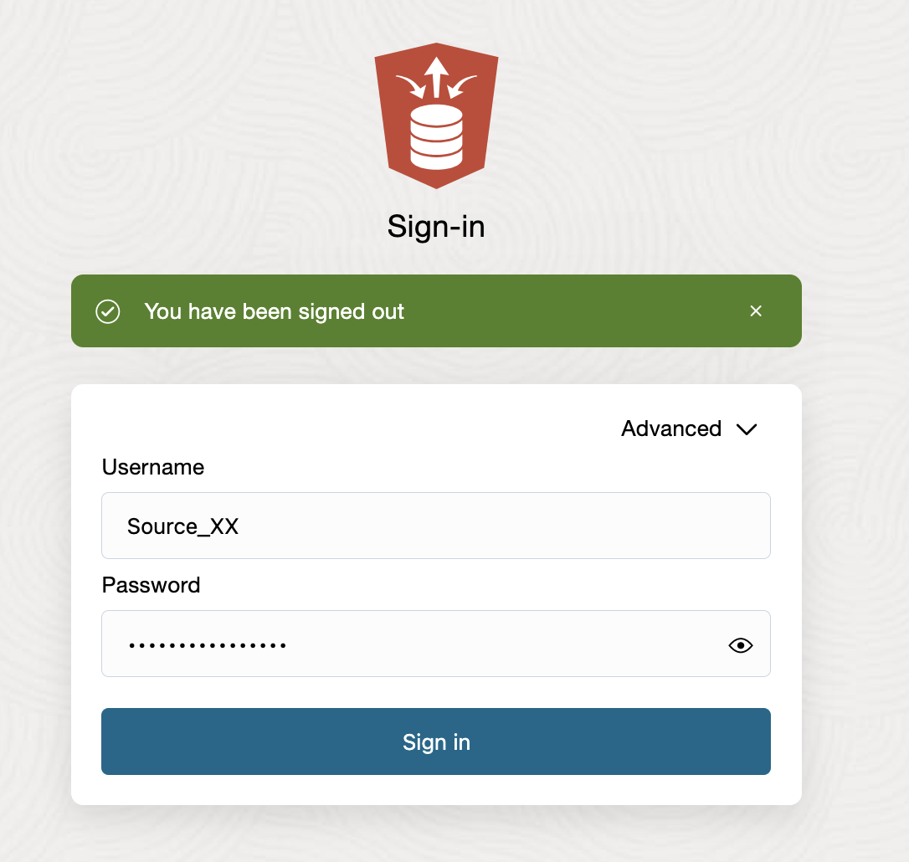

**NOTE** If still unable to log in, try navigating back to database user page and click the following link - 

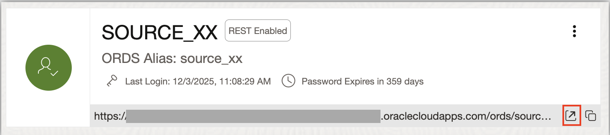

3. Navigate to Development > SQL.

Leave this open for later use once connectivity is verified.

## Task 6: Provision Autonomous AI Lakehouse

1. Log in to your cloud tenancy and navigate to Oracle AI Database > Autonomous AI Database


2. Select Create Autonomous AI Database 

3. Give it a display name (e.g. **aidp-db**), and database name (e.g. **aidpdbxx**) and select workload type as Lakehouse. Select database version 26ai and leave other options as default. 


4. Provide a password and set Access Type to 'Secure access from everywhere' 

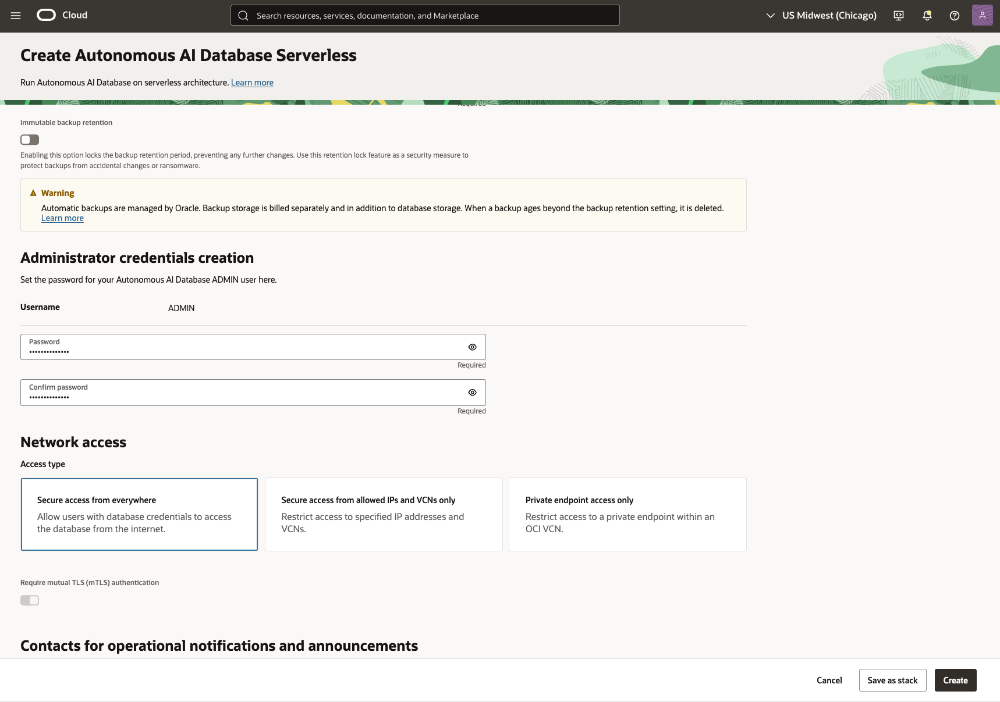

**NOTE** If you would like to use a private database, a DB Tools Connection will need to be created to use SQL Developer web. This is outside the scope of this lab. For details, see [Create Database Tools Connection](https://docs.oracle.com/en-us/iaas/database-tools/doc/using-oracle-cloud-infrastructure-console.html).

5. Create the AI Database. The provisioning process will take a few minutes.

6. Once provisioned, navigate to Database actions > SQL. This will open SQL Developer as admin user. 


---

## Task 7: Create Gold_XX Schema 

1. Create a Gold_XX Schema (User) in Autonomous Data Lakehouse. Replace "strong\_password" with your own password.

```sql
<copy>
CREATE USER gold_XX IDENTIFIED BY "strong_password";
</copy>
```

2. Grant Required Roles/Privileges to Gold_XX Schema

```sql
<copy>
-- Data privileges
GRANT CONNECT, RESOURCE TO gold_XX;

-- Allow creation of tables, views, and other objects
GRANT CREATE SESSION TO gold_XX;
GRANT CREATE TABLE TO gold_XX;
GRANT CREATE VIEW TO gold_XX;
GRANT CREATE SEQUENCE TO gold_XX;
GRANT CREATE PROCEDURE TO gold_XX;
GRANT UNLIMITED TABLESPACE TO gold_XX;

-- Enable DBMS_CLOUD 
GRANT EXECUTE ON DBMS_CLOUD TO gold_XX;

-- Grant access to data_pump_dir (used for saveAsTable operation in spark)
GRANT READ, WRITE ON DIRECTORY DATA_PUMP_DIR TO gold_XX;
</copy>
```

3. Log out of admin schema once gold_XX schema is created.

## Task 8: Add REST capabilities to GOLD_XX Schema

**NOTE** If unable to sign in directly as gold_XX schema, enable REST access

1. On your provisioned Lakehouse, navigate to Database Actions -> Database Users

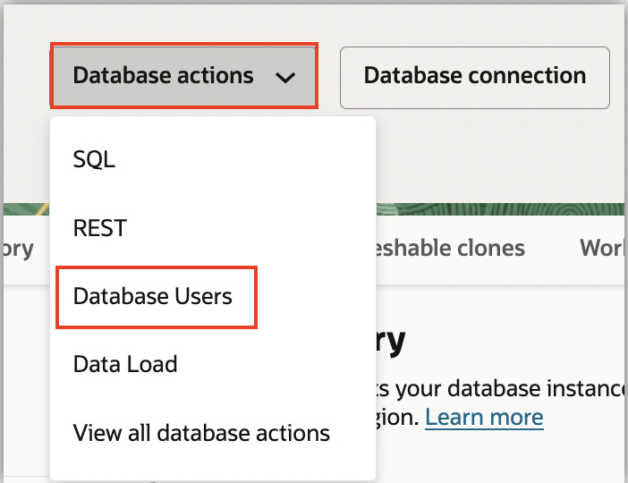

2. Search for the user GOLD\_XX and select the 3 dots, then select Enable REST

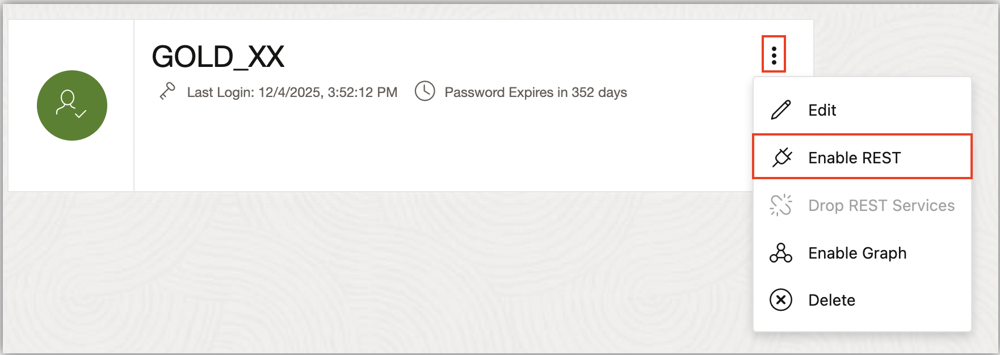

3. Click the REST Enable User button. 

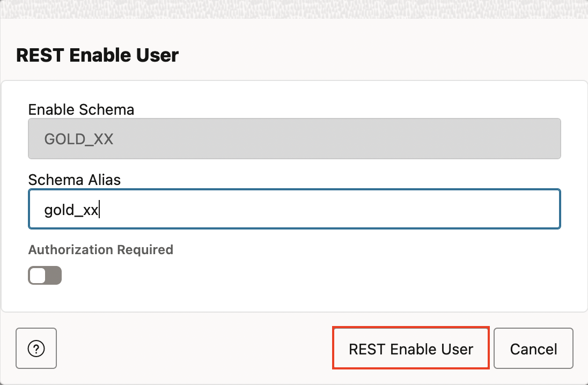

4. Once enabled edit the user Gold\_XX

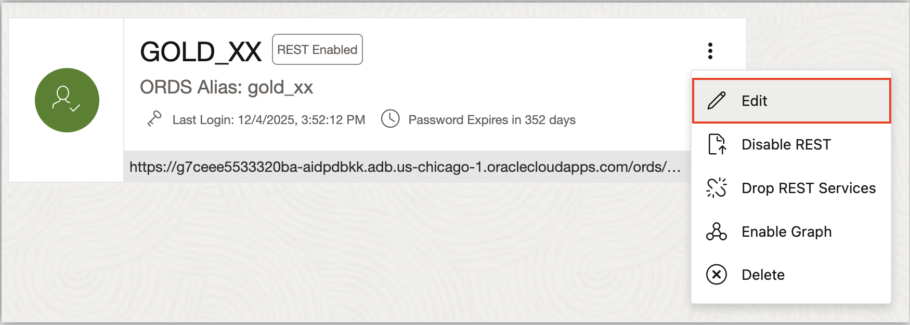

5. Set Quota to Unlimited. Click "Apply Changes" to save.

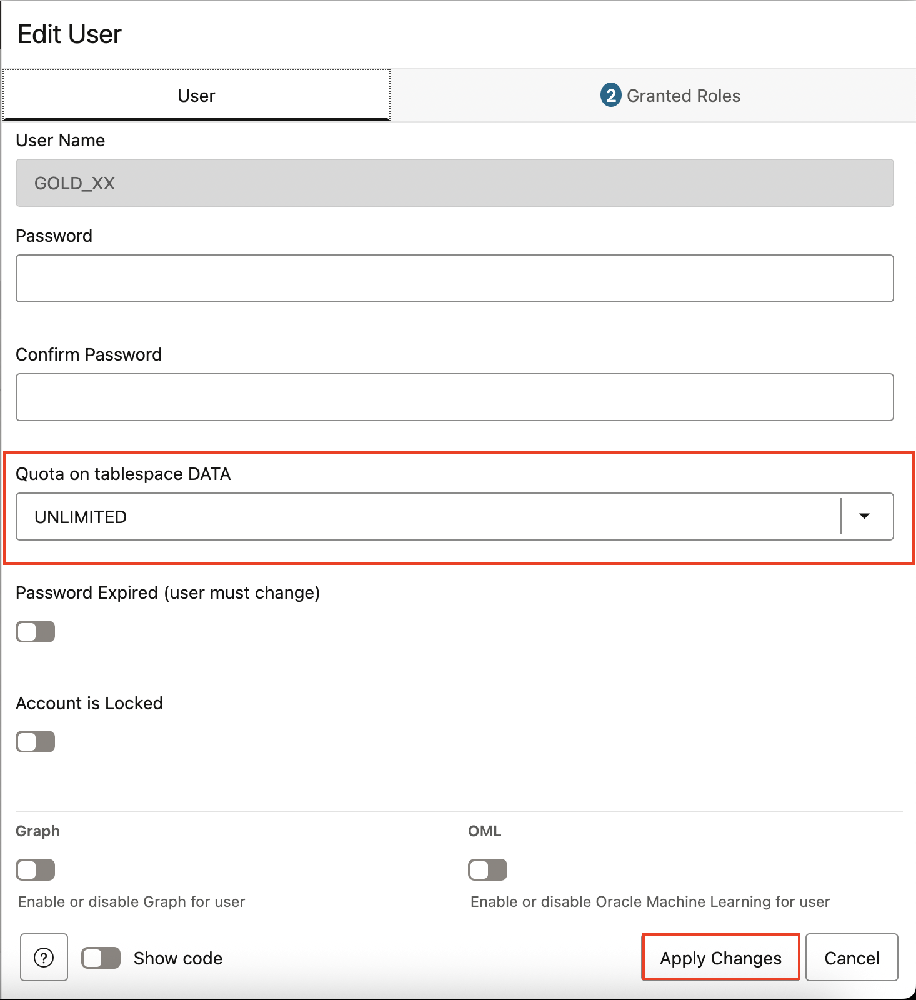

## Task 9: Log in to SQL Developer as GOLD_XX Schema 

1. Navigate back to AI DB > database actions > SQL

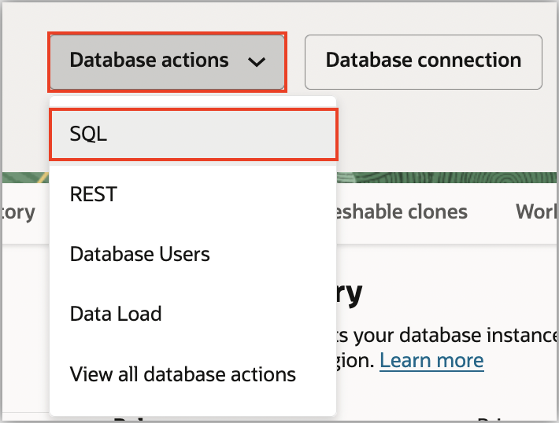

2. In SQL Developer select ADMIN (top right) > Sign Out

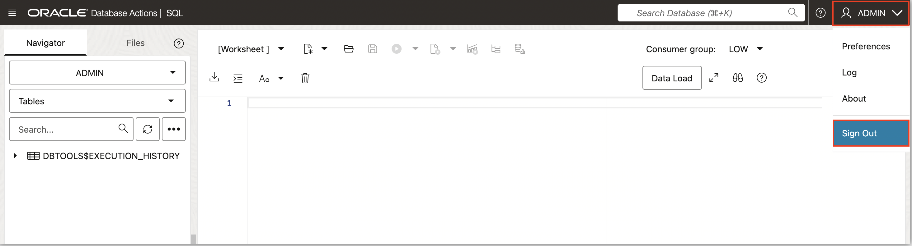

3. Provide gold_XX as username and give password as defined in previous task. Sign in. 

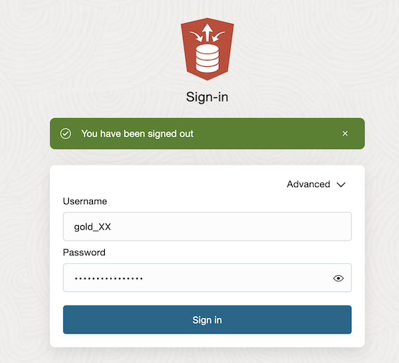

**NOTE** If still unable to log in, try navigating back to database user page and click the following link - 

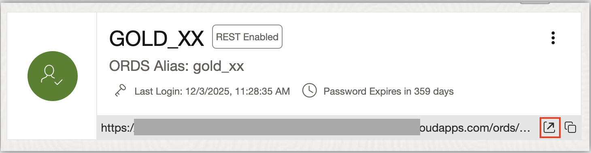

4. Navigate to Development > SQL. Once access is confirmed you can proceed to next task.

## Task 10: Provision AI Data Platform Instance

1. Navigate to Analytics & AI > Data Lake > AI Data Platform


2. Provide a name for AIDP and workspace

```
<copy>
aidp-test-xx
</copy>
```

```
<copy>
aidp-workspace
</copy>
```


3. In the "Add policies", set the access level as "Standard". If the policies aren't added it will fail to create.

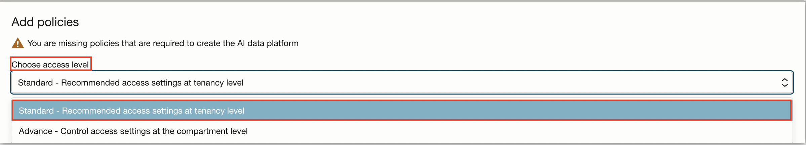

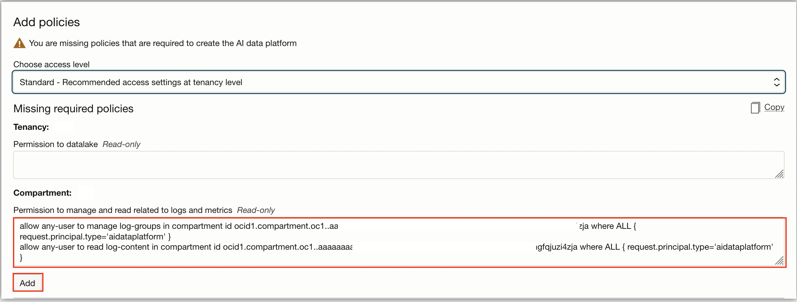

4. Once you click Add, the Standard Policies will be added

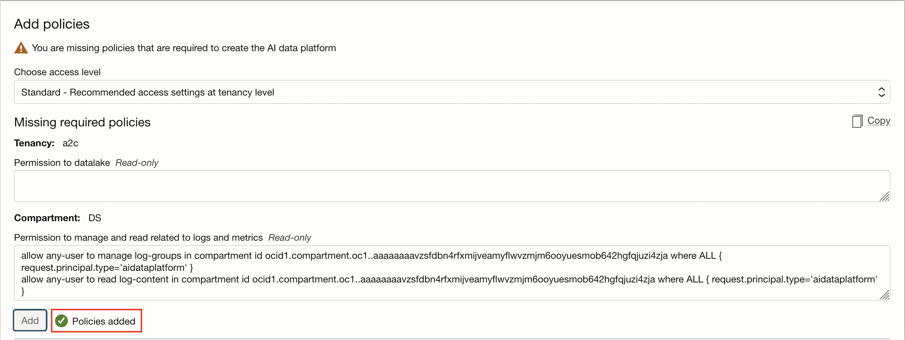

5. Optional policies can also be added depending on the use case. For this lab, we will need to enable object deletion - 

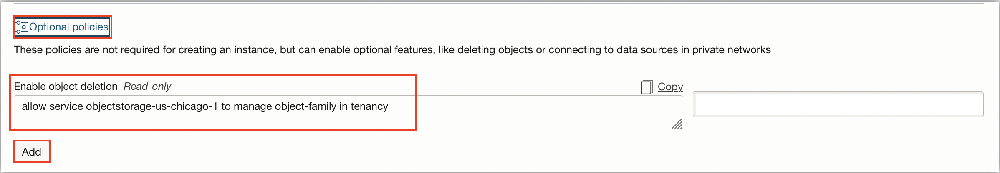

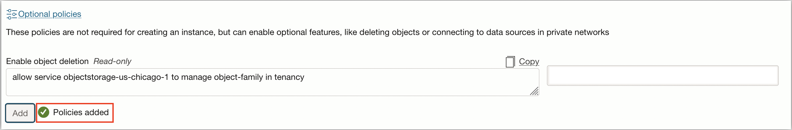

6. Create the instance. This will take a few minutes to provision.

## Task 11: Set Up Object Storage

1. In the Navigation Menu (top left), navigate to **Storage** in the OCI Console Menu, and then click on Buckets.

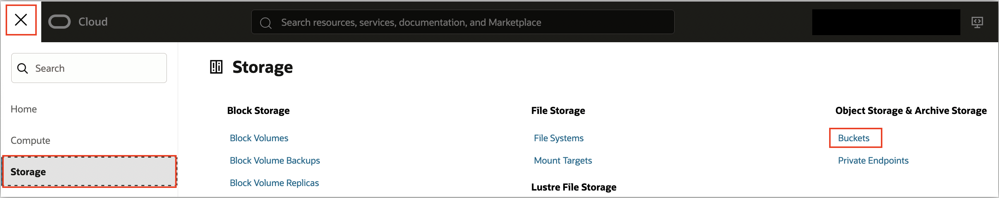

2. Click on "Create bucket" to create a bucket.

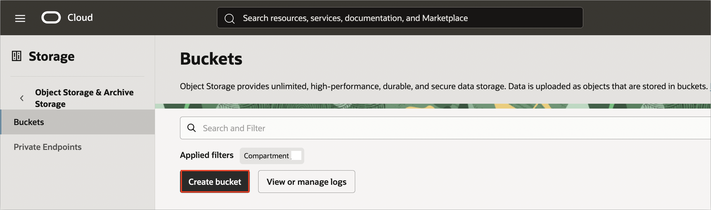

3. Name the bucket **aidp-demo-bucket_xx**. Select the default "Standard" storage tier. Click on "Create Bucket".

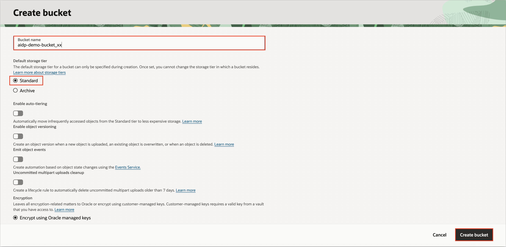

4. When the bucket is created, click into the bucket. 

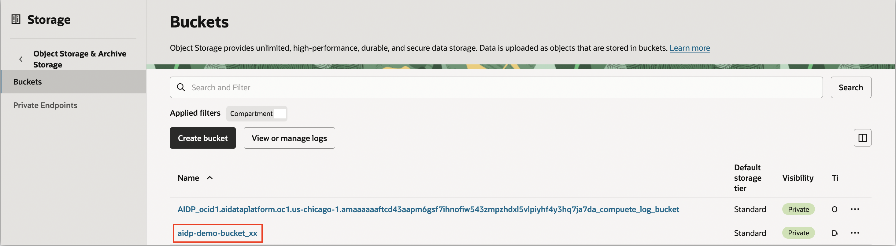

5. Note the Namespace. It would be required in next lab.

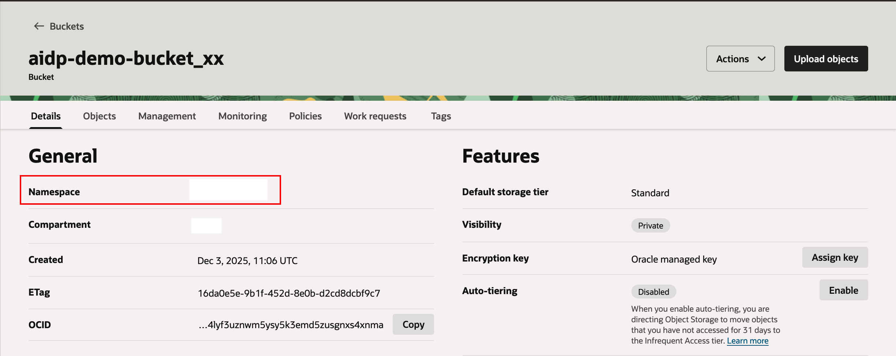

6. Click on Objects. Click on Actions -> Create New Folder

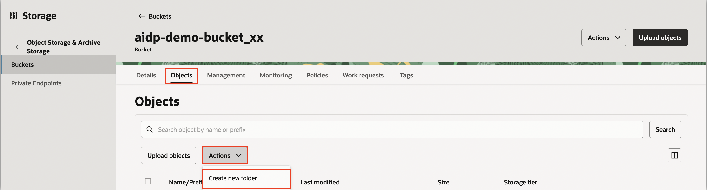

7. Create a folder 'delta' in the bucket. Click on "Create folder" to create the folder.

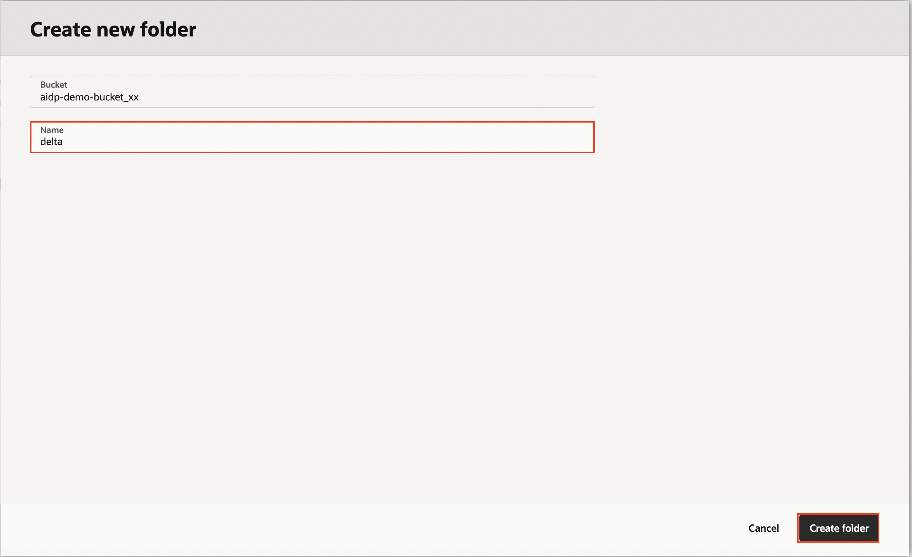

## Task 12: Provision Analytics Cloud Instance

1. Navigate to Analytics Cloud in the OCI console 


2. Create a new Analytics Cloud instance. Provide a name such as **aidpoacxx**. Leave the remaining options as default and create. 


3. After a few minutes the instance will create.

## Next Steps

With the infrastructure provisioned, proceed to Lab 2 to load the source data in ATP, extract it, and process it in the AI Data Platform and Lakehouse.

---

## Acknowledgements

**Authors**
* **Luke Farley**, Senior Cloud Engineer, ONA Data Platform
* **Kaushik Kundu**, Master Principal Cloud Architect, ONA Data Platform

**Contributors**
* **Enjing Li**, Senior Cloud Engineer, ONA Data Platform
* **JB Anderson**, Senior Cloud Engineer, ONA Data Platform

**Last Updated By/Date:**
* **Luke Farley**, Senior Cloud Engineer, ONA Data Platform, December 2025