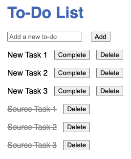

# Lab 6: Validate and Explore AJD Benefits

## Introduction

In this lab, you'll repoint your To-Do application to the migrated target collection in AJD, validate the functionality and data integrity, and explore AJD's benefits like security, scaling, monitoring, and AI features in Oracle AI Database 26ai. This confirms a successful migration with enhanced capabilities.

> **Estimated Time:** 15 minutes

**Note:** If using Cline, it can help verify code changes or analyze performance differences.

---

### Objectives

In this lab, you will:
- Repoint the app to the target collection
- Validate application functionality and data integrity
- Explore AJD benefits: security, scaling, monitoring, and AI integration in 26ai

---

### Prerequisites

This lab assumes you have:
- Completed Lab 5
- The To-Do app from Lab 3
- Migrated data in 'todos_target'

---

## Task 1: Repoint the Application to Target Collection


1. Set the environment variable to the target collection:
   
   ```bash
   <copy>
   export COLLECTION_NAME='todos_target'
   </copy>
   ```

   **Note:** For real migrations to a different AJD, you'd also update MONGO_API_URL. Here, we switch collections within the same instance.

2. Restart the server:
   ```bash
   <copy>
   node server.js
   </copy>
   ```

---

## Task 2: Validate Application Functionality

1. Open `http://localhost:3000` in your browser. You should see the migrated tasks from 'todos_source'.



2. Test CRUD operations:
   - Add new to-do items.
   - Complete and delete items.
   - Ensure the migrated data appears correctly.

3. Verify data integrity:
   - In Oracle Database Actions, run:
     ```sql
     <copy>
     SELECT * FROM todos_target;
     </copy>
     ```
   - Compare with source data in todos_source from Lab 4.

---

## Task 3: Explore AJD Benefits

1. **Security:** In the Oracle Cloud Console, review AJD's automatic encryption, ACLs, and audit logging.

2. **Scaling:** View auto-scaling options in the database details—AJD automatically handles workload spikes.

3. **Monitoring:** Check performance metrics (e.g., CPU, storage) in the console for insights.

4. **AI Features in 26ai:** Explore integrated AI capabilities like vector search for semantic queries or ML models for data insights directly in the database.

**Congratulations!** You've completed the end-to-end journey: building, migrating, and scaling on Oracle AI Database 26ai.

---

## Troubleshooting

- **Data Discrepancies:** Re-run migration if issues; verify with queries.
- **Performance:** Ensure optimal indexing; AJD manages many aspects automatically.

---

## Acknowledgements

**Authors**
* **Luke Farley**, Senior Cloud Engineer, ONA Data Platform S&E

**Contributors**
* **Cline**, AI Assistant

**Last Updated By/Date:**
* **Luke Farley**, Senior Cloud Engineer, ONA Data Platform S&E, November 2025
