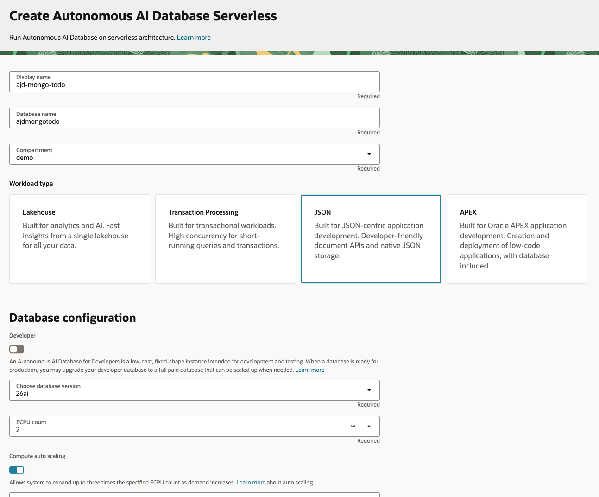
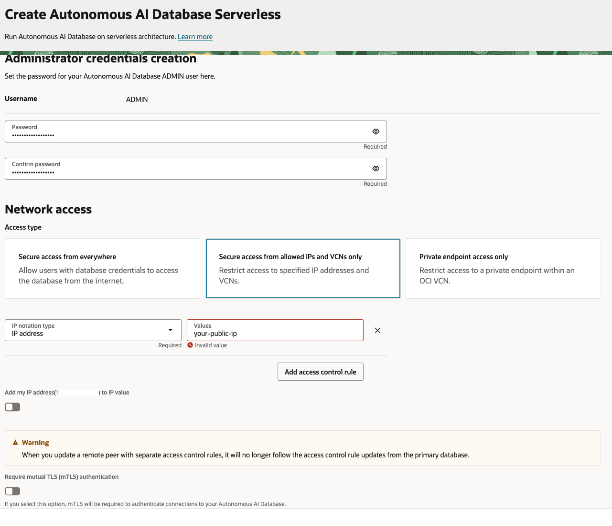
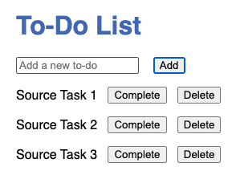

# Lab 2: Prepare Source and Discover Data

## Introduction

In this lab, you'll set up an Oracle Autonomous JSON Database (AJD) instance as your source database (simulating MongoDB), deploy a simple To-Do list application on it, insert sample data via the UI, review the schema and collections in Oracle SQL Web, and use tools to analyze and plan your migration to a target collection in the same AJD instance. This step ensures you understand your data before migrating.

> **Estimated Time:** 20-30 minutes

**Note:** If you're using Cline (from Lab 1), it can help generate code snippets or troubleshoot setup issues.

---

### Objectives

In this lab, you will:
- Set up and verify an AJD source database
- Deploy and run the To-Do app on AJD
- Review and understand the application schema and collections in Oracle SQL Web
- Use Oracle Code Assist and MongoVibeAssist_Migrator to analyze your source environment and plan the migration

---

### Prerequisites

This lab assumes you have:
- Completed Lab 1 (optional)
- Node.js and NPM installed
- An Oracle Cloud account with AJD provisioned (from Lab 1 or separately)
- Basic command-line familiarity

---

## Task 1 (Optional): Provision Source AJD Instance

**Note** If you have an existing MongoDB instance, this step can be skipped. The steps to create a source db are included here for completeness. 

1. Log in to the Oracle Cloud Console.

2. Navigate to **Oracle Database > Autonomous AI Database**.


3. Click **Create Autonomous Database**.

4. Select **JSON Database** as the workload type.



5. Provide a display name (e.g., "ToDoAJD") and database name.

6. Set admin password and configure network access. Set access type to 'Secure access from allowed IPs and VCNs only' (add your IP to the ACL for security).



**Note** To get your public ip address, you can go to whatismyipaddress.com, or run the following command

```bash
<copy>
curl -s ifconfig.me
</copy>
```

7. Click **Create**.

Wait for the instance to provision (a few minutes).

## Task 2: Enable MongoDB API

1. In the AJD details page, go to **Tool Configuration**.

2. Under **MongoDB API** set the status to Enabled.


3. Download the connection string or note it down.

The connection string format is:
```bash
<copy>
mongodb://<user>:<password>@<hostname>:27017/<user>?authMechanism=PLAIN&authSource=$external&ssl=true&retryWrites=false&loadBalanced=true
</copy>
```

When setting env variable

```bash
export MONGO_API_URL='xxx'
```

Replace placeholders with your details. URL-encode special characters in the password, e.g., '@' as %40, '#' as %23, '/' as %2F, and ':' as %3A. For example, if your password is 'pass@word#1', encode it as 'pass%40word%231'. Always use single quotes around the full string when exporting as an environment variable to avoid shell interpretation.

---

## Task 2: Deploy the Sample To-Do App on AJD

1. Create a project directory:
   ```bash
   <copy>
   mkdir todo-app
   cd todo-app
   </copy>
   ```

2. Initialize NPM:
   ```bash
   <copy>
   npm init -y
   </copy>
   ```

3. Install dependencies:
   ```bash
   <copy>
   npm install express mongodb
   </copy>
   ```

4. Create `server.js`:
   ```javascript
   <copy>
   const express = require('express');
   const { MongoClient, ObjectId } = require('mongodb');

   const app = express();
   const PORT = process.env.PORT || 3000;
   const MONGO_API_URL = process.env.MONGO_API_URL || 'your-ajd-uri'; // Update with your AJD URI
   const COLLECTION_NAME = process.env.COLLECTION_NAME || 'todos_source';

   app.use(express.json());
   app.use(express.static('public'));

   let db;

   async function connectDB() {
     const client = new MongoClient(MONGO_API_URL);
     await client.connect();
     db = client.db();
     console.log('Connected to AJD');
   }

   // CRUD endpoints using COLLECTION_NAME

   app.get('/api/todos', async (req, res) => {
     const todos = await db.collection(COLLECTION_NAME).find().toArray();
     res.json(todos);
   });

   app.post('/api/todos', async (req, res) => {
     const todo = { text: req.body.text, completed: false };
     const result = await db.collection(COLLECTION_NAME).insertOne(todo);
     res.json(result.ops ? result.ops[0] : todo);
   });

   app.put('/api/todos/:id', async (req, res) => {
     const result = await db.collection(COLLECTION_NAME).updateOne(
       { _id: new ObjectId(req.params.id) },
       { $set: { completed: true } }
     );
     res.json({ modifiedCount: result.modifiedCount });
   });

   app.delete('/api/todos/:id', async (req, res) => {
     const result = await db.collection(COLLECTION_NAME).deleteOne({ _id: new ObjectId(req.params.id) });
     res.json({ deletedCount: result.deletedCount });
   });

   app.listen(PORT, async () => {
     await connectDB();
     console.log(`Server listening on port ${PORT}`);
   });
   </copy>
   ```

   **Note:** The collection name can be configured via the COLLECTION_NAME environment variable, defaulting to 'todos\_source'.

5. Create `public/index.html` (simple frontend):

   ```html
   <copy>
   <!DOCTYPE html>
   <html lang="en">
   <head>
     <meta charset="UTF-8">
     <title>To-Do List</title>
     <style>
       body { font-family: sans-serif; max-width: 600px; margin: 2em auto; }
       h1 { color: #4267b2; }
       ul { padding-left: 0; }
       li { list-style: none; margin: 1em 0; display: flex; align-items: center; }
       .completed { text-decoration: line-through; color: #888; }
       button { margin-left: 1em; }
     </style>
   </head>
   <body>
     <h1>To-Do List</h1>
     <input id="todo-input" type="text" placeholder="Add a new to-do" />
     <button onclick="addTodo()">Add</button>
     <ul id="todo-list"></ul>

     <script>
       async function fetchTodos() {
         const res = await fetch('/api/todos');
         const todos = await res.json();
         const list = document.getElementById('todo-list');
         list.innerHTML = '';
         todos.forEach(todo => {
           const li = document.createElement('li');
           li.className = todo.completed ? 'completed' : '';
           li.textContent = todo.text;

           if (!todo.completed) {
             const completeBtn = document.createElement('button');
             completeBtn.textContent = 'Complete';
             completeBtn.onclick = () => completeTodo(todo._id);
             li.appendChild(completeBtn);
           }

           const deleteBtn = document.createElement('button');
           deleteBtn.textContent = 'Delete';
           deleteBtn.onclick = () => deleteTodo(todo._id);
           li.appendChild(deleteBtn);

           list.appendChild(li);
         });
       }

       async function addTodo() {
         const input = document.getElementById('todo-input');
         const text = input.value.trim();
         if (!text) return;
         await fetch('/api/todos', {
           method: 'POST',
           headers: { 'Content-Type': 'application/json' },
           body: JSON.stringify({ text })
         });
         input.value = '';
         fetchTodos();
       }

       async function completeTodo(id) {
         await fetch('/api/todos/' + id, { method: 'PUT' });
         fetchTodos();
       }

       async function deleteTodo(id) {
         await fetch('/api/todos/' + id, { method: 'DELETE' });
         fetchTodos();
       }

       // Fetch todos when page loads
       window.onload = fetchTodos;
     </script>
   </body>
   </html>
   </copy>
   ```

6. Run the server:

   ```bash
   <copy>
   node server.js
   </copy>
   ```

   Visit `http://localhost:3000` to test.

---

## Task 3: Insert Sample Data

1. Use the app UI to add a few to-do items (e.g., "Source Task 1", "Source Task 2"). Complete or delete one to test functionality.



---

## Task 4: Review Schema and Collections

1. In Oracle Database Actions (SQL Web from AJD console):
   - Log in as ADMIN.
   - Run: SELECT * FROM todos_source;
   - Note the schema (e.g., DATA column with JSON: _id, text, completed).

2. Explore other tables if needed.

---

## Task 5 (Optional): Analyze and Plan Migration

1. Use Cline to run anaylsis on migration.
   - Example: Run analysis on 'todos_source' to suggest mappings.

2. Plan: For this simple app, assume 1:1 migration to 'todos_target'. Identify any transformations if needed.

With your source data prepared in AJD, you're ready to migrate to a target collection in the same instance in Lab 3.

---

## Troubleshooting

- **Connection Errors:** Verify URI, ACL (add IP), and network access.
- **Data Insertion:** Ensure write permissions; check console logs.
- **UI Issues:** Refresh browser or restart server.

You are now ready for Lab 3 to migrate within AJD.

---

## Acknowledgements

**Authors**
* **Luke Farley**, Senior Cloud Engineer, ONA Data Platform S&E

**Contributors**
* **Cline**, AI Assistant

**Last Updated By/Date:**
* **Luke Farley**, Senior Cloud Engineer, ONA Data Platform S&E, November 2025
