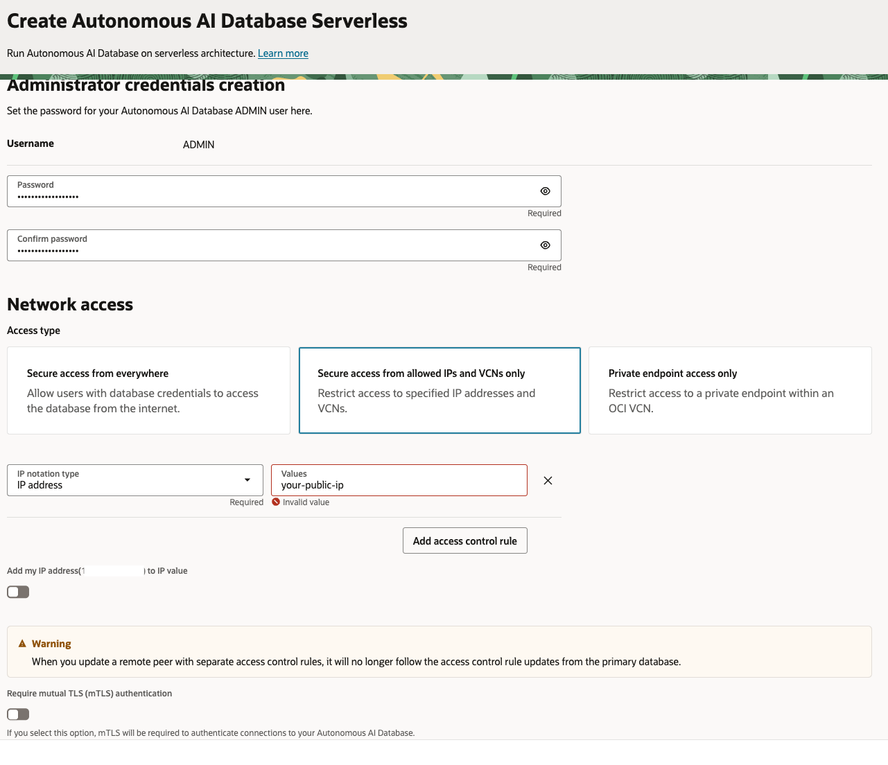
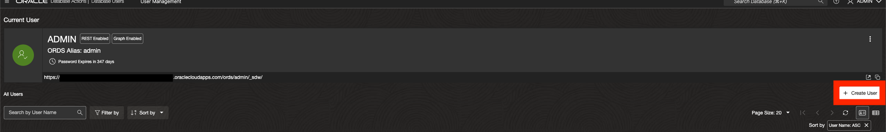
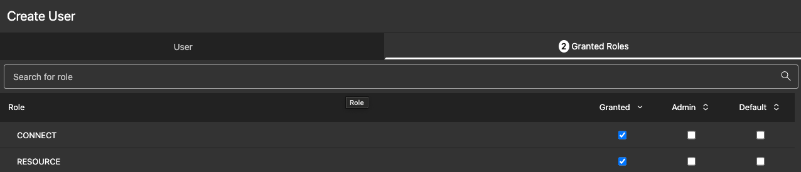
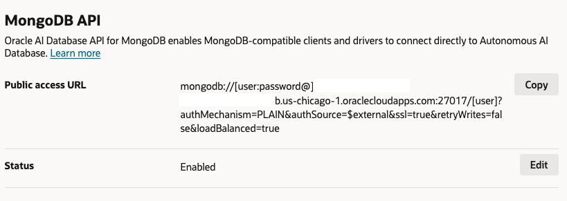

# Connect to Oracle Autonomous JSON Database (AJD)

## Introduction

In this lab, you'll provision an Oracle Autonomous JSON Database (AJD) instance and enable its MongoDB-compatible API. This allows your MongoDB applications to connect seamlessly, treating AJD as a drop-in replacement.

> **Estimated Time:** 15 minutes

**Note:** Cline can help automate provisioning scripts or troubleshoot connection issues—let me know if you need assistance!

---

### Objectives

In this lab, you will:
- Create an AJD instance in Oracle Cloud
- Enable the MongoDB API
- Obtain the connection string for your app

---

### Prerequisites

This lab assumes you have:
- Completed the Introduction lab
- An active Oracle Cloud account with permissions to create databases

---

## Task 1: Provision AJD Instance

1. Log in to the Oracle Cloud Console.

2. Navigate to **Oracle Database > Autonomous AI Database**.


3. Click **Create Autonomous Database**.

4. Select **JSON Database** as the workload type.


5. Provide a display name (e.g., "ToDoAJD") and database name.

6. Set admin password and configure network access. Set access type to 'Secure access from allowed IPs and VCNs only' (add your IP to the ACL for security).



**Note** To get your public ip address, you can go to whatismyipaddress.com, or run the following command

```bash
<copy>
curl -s ifconfig.me
</copy>
```

7. Click **Create**.

Wait for the instance to provision (a few minutes).

## Task 2: Create Mongo User 

1. Navigate to Database Users in Autonomous AI Database  


2. Select Create User 



3. Create new user e.g. **MONGO_USER** with associated password. Set Quota on tablespace to **UNLIMITED** and enable REST, GraphQL, MongoDB API, and Web access.


4. In the Granted Roles tab add the **CONNECT** and **RESOURCE** roles. 



* **Note** For more details on creating users for MongoDB, see [User Management for MongoDB](https://docs.oracle.com/en/cloud/paas/autonomous-database/serverless/adbsb/mongo-using-oracle-database-api-mongodb.html#GUID-613DD3CE-6E84-4D8E-B614-2CFC18A41784)

## Task 3: Enable MongoDB API

1. In the AJD details page, go to **Tool Configuration**.

2. Under **MongoDB API** set the status to Enabled.



3. Download the connection string or note it down.

The connection string format is:
```bash
<copy>
mongodb://<user>:<password>@<hostname>:27017/<user>?authMechanism=PLAIN&authSource=$external&ssl=true&retryWrites=false&loadBalanced=true
</copy>
```

When setting env variable

```bash
<copy>
export MONGO_API_URL='xxx'
</copy>
```

Replace placeholders with your details. URL-encode special characters in the password, e.g., '@' as %40, '#' as %23, '/' as %2F, and ':' as %3A. For example, if your password is 'pass@word#1', encode it as 'pass%40word%231'. Always use single quotes around the full string when exporting as an environment variable to avoid shell interpretation.

You are now ready to proceed to the next lab to set up the Node.js/Express backend.

## Troubleshooting

- **Connection Errors:** If you encounter errors like ECONNRESET during TLS handshake, ensure your IP is added to the ACL and you're not on a VPN that interferes with external connections. Test connectivity with `openssl s_client -connect <hostname>:27017 -quiet`.

- **Connection String:** Double-check URL-encoding (e.g., '@' as %40) and use single quotes when setting environment variables.

---

## Acknowledgements

**Authors**
* **Luke Farley**, Senior Cloud Engineer, ONA Data Platform S&E

**Last Updated By/Date:**
* **Luke Farley**, Senior Cloud Engineer, ONA Data Platform S&E, November 2025
